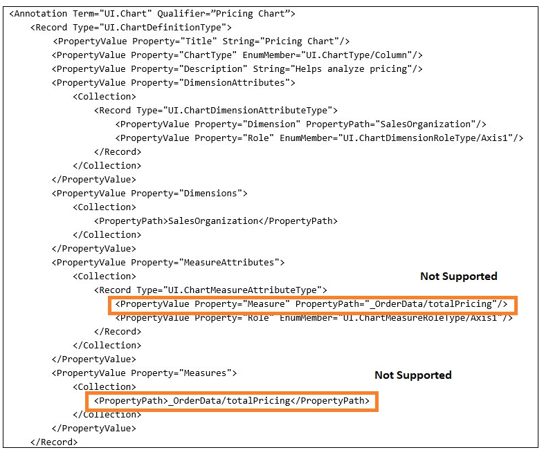
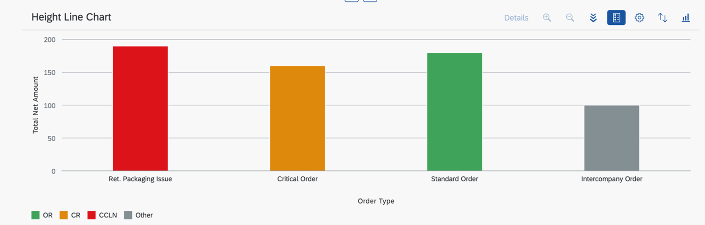

<!-- loio653ed0f4f0d743dbb33ace4f68886c4e -->

# Configuring Charts

You can add a chart facet to a content section within the list report and object page.

A chart facet is suitable to use if you wish to present data graphically for analysis.


<a name="loio653ed0f4f0d743dbb33ace4f68886c4e__section_tth_5tc_2tb"/>

## Configuring Charts in a List Report

You can configure a chart to be part of a list report that has multiple views.

For more information, see [Defining Multiple Views on a List Report Table - Multiple Table Mode](defining-multiple-views-on-a-list-report-table-multiple-table-mode-37aeed7.md) and [Defining Multiple Views on a List Report with Different Entity Sets and Table Settings](defining-multiple-views-on-a-list-report-with-different-entity-sets-and-table-settings-b6b59e4.md).


<a name="loio653ed0f4f0d743dbb33ace4f68886c4e__section_fnc_ptc_2tb"/>

## Configuring Charts in an Object Page

For more information, see [Adding a Chart Facet](adding-a-chart-facet-6495eab.md).


## Code Samples

The following code samples show how to create your annotations for the chart facet:


### UI.ReferenceFacet

> ### Sample Code:  
> XML Annotation
> 
> ```xml
> <Annotations Target="STTA_PROD_MAN.STTA_C_MP_ProductType">
>    <Annotation Term="UI.Facets">
>       <Record Type="UI.ReferenceFacet">
>          <PropertyValue Property="Label" String="{@i18n>@SalesData}"/>
>          <PropertyValue Property="Target" AnnotationPath="to_ProductSalesData/@UI.Chart"/>
>       </Record>
>    </Annotation>
> </Annotations>
> 
> ```

> ### Sample Code:  
> ABAP CDS Annotation
> 
> ```
> 
> @UI.facet: [
>  {
>   label: '{@i18n>@SalesData}',
>   type: #CHART_REFERENCE,
>   purpose: #STANDARD,
>   targetElement: '_productSalesData'
>  }
> ]  
> ```

> ### Sample Code:  
> CAP CDS Annotation
> 
> ```
> 
> annotate STTA_PROD_MAN.STTA_C_MP_ProductType @(
>   UI.Facets : {
>     $Type : 'UI.ReferenceFacet',
>     Label : '{@i18n>@SalesData}',
>     Target : 'to_ProductSalesData/@UI.Chart'
>   }
> );
> 
> ```


### `UI.Chart`

> ### Sample Code:  
> XML Annotation
> 
> ```xml
> <Annotations Target="STTA_PROD_MAN.STTA_C_MP_ProductSalesDataType">
>    <Annotation Term="UI.Chart">
>       <Record>
>          <PropertyValue Property="Title" String="Test Chart"/>
>          <PropertyValue Property="ChartType" EnumMember="UI.ChartType/Column"/>
>          <PropertyValue Property="Dimensions">
>             <Collection>
>                <PropertyPath>DeliveryMonth</PropertyPath>
>             </Collection>
>          </PropertyValue> 
>          <PropertyValue Property="Measures">
>             <Collection>
>                <PropertyPath>Revenue</PropertyPath>
>             </Collection>
>          </PropertyValue>
>       </Record>
>    </Annotation>
> </Annotations>
> 
> ```

> ### Sample Code:  
> ABAP CDS Annotation
> 
> ```
> 
> @UI.Chart: [
>   {
>     title: 'Test Chart',
>     chartType: #COLUMN,
>     dimensions: [
>       'DELIVERYMONTH'
>     ],
>     measures: [
>       'REVENUE'
>     ]
>   }
> ]
> annotate view STTA_C_MP_PRODUCTSALESDATA with {
> 
> }
> ```

> ### Sample Code:  
> CAP CDS Annotation
> 
> ```
> 
> annotate STTA_PROD_MAN.STTA_C_MP_ProductSalesDataType @(
>   UI.Chart : {
>     Title : 'Test Chart',
>     ChartType : #Column,
>     Dimensions : [
>         DeliveryMonth
>     ],
>     Measures : [
>         Revenue
>     ]
>   }
> );
> ```

The chart definition contains measures on which the aggregations calculations are done, and dimensions, which categorize these measures. In the chart, these measures are displayed as labels on the x and on the y axis.

> ### Note:  
> The use of navigation properties within the `UI.Chart` term isn’t supported.
> 
>   
>   
> **Navigation Property**
> 
>  
> 
> 


## Additional Features in SAP Fiori Elements for OData V2

> ### Restriction:  
> Charts are only supported for entities or services that are **not** draft enabled or for read-only entities or services.


<a name="loio653ed0f4f0d743dbb33ace4f68886c4e__section_ymw_bdc_4nb"/>

## Additional Features in SAP Fiori Elements for OData V4


### Enabling the Chart from a Draft-Enabled Entity

You can define a chart against a draft-enabled entity. In this case, only active data is used for the chart display.


### Enabling the Chart Facet in a List Report

You can configure a chart to be part of the content area via the `manifest.json`. For more information, see the section *Enabling the ALP in SAP Fiori Elements for OData V4* in [Descriptor Configuration for the Analytical List Page](descriptor-configuration-for-the-analytical-list-page-2a9df06.md).


### Support for Criticality Coloring

SAP Fiori elements supports the criticality based on `UI.CriticalityType`. Wrap this annotation with the `UI.ValueCriticality`, as shown in the following sample code:

> ### Sample Code:  
> XML Annotation
> 
> ```
> <Annotations Target="com.c_salesordermanage_sd_aggregate.SalesOrderManage/SalesOrderType">
>     <Annotation Term="UI.ValueCriticality">
>         <Collection>
>             <Record Type="UI.ValueCriticalityType">
>                 <PropertyValue Property="Value" String="CCLN"/>
>                 <PropertyValue Property="Criticality" EnumMember="UI.CriticalityType/Negative"/>
>             </Record>
>             <Record Type="UI.ValueCriticalityType">
>                 <PropertyValue Property="Value" String="CR"/>
>                 <PropertyValue Property="Criticality" EnumMember="UI.CriticalityType/Critical"/>
>             </Record>
>             <Record Type="UI.ValueCriticalityType">
>                 <PropertyValue Property="Value" String="OR"/>
>                 <PropertyValue Property="Criticality" EnumMember="UI.CriticalityType/Positive"/>
>             </Record>
>         </Collection>
>     </Annotation>
> </Annotations>
> ```

> ### Sample Code:  
> ABAP CDS Annotation
> 
> ```
> annotate view C_SALESORDERMANAGE_SD_AGGREGATE.SALESORDERMANAGE with {
> 
> @UI.ValueCriticality: [
>   {
>     value: 'CCLN',
>     criticality: #NEGATIVE
>   },
>   {
>     value: 'CR',
>     criticality: #CRITICAL
>   },
>   {
>     value: 'OR',
>     criticality: #POSITIVE
>   }
> ]
> 
> salesordertype;
> }
> 
> 
> 
> ```

> ### Sample Code:  
> CAP CDS Annotation
> 
> ```
> SalesOrderType         @(
>         UI.ValueCriticality   : [
>         {
>             Value       : 'CCLN’,
>             Criticality : #Negative
>         },
>         {
>             Value       : 'CR',
>             Criticality : #Critical
>         },
>        {
>             Value       : 'OR',
>             Criticality : #Positive
>         }
>         ]
>     );
> 
> 
> 
> ```

> ### Note:  
> No color is applied to the chart dimension when a neutral value is returned.

You can see the result in the following chart:

  


### Enabling Aggregation in the Back End

For charts to work, the entity set must support aggregation. SAP Fiori elements supports transformation aggregation \(both standard aggregation methods and custom aggregation methods are supported\).

-   Specifying Chart Dimensions and Measures

    You specify a dimension or a measure using the `"GroupableProperties"` and the `"AggregatableProperties"` at the entity set level. \(In the past, you did this by using the `"Aggregation.Groupable"` and `"Aggregation.Aggregatable"` annotation at the property level.\) You can find the corresponding annotations in the following sample code:

    > ### Sample Code:  
    > XML Annotation
    > 
    > ```xml
    > <Annotations Target="sap.fe.managepartners.ManagePartnersService.EntityContainer/BusinessPartners">
    >     <Annotation Term="Aggregation.ApplySupported">
    >         <Record Type="Aggregation.ApplySupportedType">
    >             <PropertyValue Property="AggregatableProperties">
    >                 <Collection>
    >                     <Record Type="Aggregation.AggregatablePropertyType">
    >                         <PropertyValue Property="Property">
    >                             <PropertyPath>SalesAmount</PropertyPath>
    >                         </PropertyValue>
    >                     </Record>
    >                     <Record Type="Aggregation.AggregatablePropertyType">
    >                         <PropertyValue Property="Property">
    >                             <PropertyPath>SalesAmountLocalCurrency</PropertyPath>
    >                         </PropertyValue>
    >                     </Record>
    >                     ....
    >                     ....
    >                 </Collection>
    >             </PropertyValue>
    >             <PropertyValue Property="GroupableProperties">
    >                 <Collection>
    >                     <PropertyPath>AccountResponsible</PropertyPath>
    >                     <PropertyPath>Country</PropertyPath>
    >                     ....
    >                     ....
    >                 </Collection>
    >             </PropertyValue>
    >         </Record>
    >     </Annotation>
    > </Annotations>
    > ```

    > ### Sample Code:  
    > ABAP CDS Annotation
    > 
    > No ABAP CDS annotation sample is available. Please use the local XML annotation.

    > ### Sample Code:  
    > CAP CDS Annotation
    > 
    > ```
    > @Aggregation.ApplySupported : {
    >      GroupableProperties : [AccountResponsible, Country, .......],
    >      AggregatableProperties: [{
    >           Property: SalesAmount
    >           },{
    >           Property: SalesAmountLocalCurrency
    >           },
    >           ....
    >           ....
    >      ]
    > }
    > ```

-   Transformation Aggregation that Uses Standard Aggregation Methods

    In the metadata, such entity sets have the `Aggregation.ApplySupported` set. The collection of `Analytics.AggregatedProperty` must then list all the aggregatable measures/aggregation methods that are used.

    > ### Sample Code:  
    > XML Annotation
    > 
    > ```
    > <Annotations Target="com.c_salesordermanage_sd_aggregate.SalesOrderManage">
    >     <Annotation Term="Aggregation.ApplySupported">
    >         <Annotation Term="Analytics.AggregatedProperty">
    >             <Record Type="Analytics.AggregatedPropertyType">
    >                 <PropertyValue Property="Name" String="minPrice"/>
    >                 <PropertyValue Property="AggregationMethod" String="min"/>
    >                 <PropertyValue Property="AggregatableProperty" PropertyPath="NetPricing"/>
    >                 <Annotation Term="Common.Label" String="Minimum Net Price"/>
    >             </Record>
    >         </Annotation>
    >         <Annotation Term="Analytics.AggregatedProperty" Qualifier="max">
    >             <Record Type="Analytics.AggregatedPropertyType">
    >                 <PropertyValue Property="Name" String="maximumPrice"/>
    >                 <PropertyValue Property="AggregationMethod" String="max"/>
    >                 <PropertyValue Property="AggregatableProperty" PropertyPath="NetPricing"/>
    >                 <Annotation Term="Common.Label" String="Maximum Net Price"/>
    >             </Record>
    >         </Annotation>
    >     </Annotation>
    > </Annotations>
    > ```

    > ### Sample Code:  
    > ABAP CDS Annotation
    > 
    > No ABAP CDS annotation sample is available. Please use the local XML annotation.

    > ### Sample Code:  
    > CAP CDS Annotation
    > 
    > ```
    > annotate com.c_salesordermanage_sd_aggregate.SalesOrderManage with @(
    >   Aggregation.ApplySupported        : {
    >     AggregatableProperties   : [{Property : NetPricing}],
    >     CustomAggregationMethods : ['Custom.concat']
    >   },
    >   Analytics.AggregatedProperty      : {
    >     Name                 : 'minPrice',
    >     AggregationMethod    : 'min',
    >     AggregatableProperty : 'NetPricing',
    >     ![@Common.Label]     : 'Minimum Net Price'
    >   }
    > });
    > ```

    In the example above, `"NetPricing"` is the property in the entity on which the standard aggregation methods `"min"` and `"max"` are defined. The call to the back end asks for the min/max aggregation to be applied on `NetPricing` and to be returned as `"minPrice"`/`"maximumPrice"` for the client-side binding of the aggregated value.

    For more information, see [Transformation Aggregation](http://docs.oasis-open.org/odata/odata-data-aggregation-ext/v4.0/cs01/odata-data-aggregation-ext-v4.0-cs01.html#_Toc378326290).

    – Using Transformation Aggregate-Based Measures in the Definition of a Chart –

    If you need to define transformation aggregate-based measures as part of the chart annotation, define them as `DynamicMeasures` and not `Measures` \(`Measures` must only have those measure properties that are directly part of the entity set, that is, only custom aggregate-based measures\).

    > ### Sample Code:  
    > XML Annotation for a Chart Using a `DynamicMeasure`
    > 
    > ```
    > <Annotation Term="UI.Chart">
    >     <Record Type="UI.ChartDefinitionType">
    >         <PropertyValue Property="Title" String="Sales Chart"/>
    >         <PropertyValue Property="ChartType" EnumMember="UI.ChartType/Column"/>
    >         <PropertyValue Property="Measures">
    >             <Collection>
    >                 <PropertyPath>avgPricing</PropertyPath>
    >             </Collection>
    >         </PropertyValue>
    >         <PropertyValue Property="DynamicMeasures">
    >             <Collection>
    >                 <AnnotationPath>@Analytics.AggregatedProperty#sum</AnnotationPath>
    >             </Collection>
    >         </PropertyValue>
    >         <PropertyValue Property="Dimensions">
    >             <Collection>
    >                 <PropertyPath>SalesOrganization</PropertyPath>
    >             </Collection>
    >         </PropertyValue>
    >         <PropertyValue Property="MeasureAttributes">
    >             <Collection>
    >                 <Record Type="UI.ChartMeasureAttributeType">
    >                     <PropertyValue Property="Measure" PropertyPath="avgPricing"/>
    >                     <PropertyValue Property="Role" EnumMember="UI.ChartMeasureRoleType/Axis1"/>
    >                 </Record>
    >                 <Record Type="UI.ChartMeasureAttributeType">
    >                     <PropertyValue Property="DynamicMeasure" AnnotationPath="@Analytics.AggregatedProperty#sum"/>
    >                     <PropertyValue Property="Role" EnumMember="UI.ChartMeasureRoleType/Axis1"/>
    >                 </Record>
    >             </Collection>
    >         </PropertyValue>
    >         <PropertyValue Property="DimensionAttributes">
    >             <Collection>
    >                 <Record Type="UI.ChartDimensionAttributeType">
    >                     <PropertyValue Property="Dimension" PropertyPath="SalesOrganization"/>
    >                     <PropertyValue Property="Role" EnumMember="UI.ChartDimensionRoleType/Category"/>
    >                 </Record>
    >             </Collection>
    >         </PropertyValue>
    >     </Record>
    > </Annotation>
    > ```

    > ### Sample Code:  
    > ABAP CDS Annotation
    > 
    > No ABAP CDS annotation sample is available. Please use the local XML annotation.

    > ### Sample Code:  
    > CAP CDS Annotation
    > 
    > ```
    > Chart                                                    : {
    >       $Type               : 'UI.ChartDefinitionType',
    >       Title               : 'Sales Chart',
    >       ChartType           : #Column,
    >       Measures            : [avgPricing],
    >       DynamicMeasures     : ['@Analytics.AggregatedProperty#sum'],
    >       Dimensions          : [SalesOrganization],
    >       MeasureAttributes   : [
    >         {
    >           $Type   : 'UI.ChartMeasureAttributeType',
    >           Measure : avgPricing,
    >           Role    : #Axis1
    >         },
    >         {
    >           $Type          : 'UI.ChartMeasureAttributeType',
    >           DynamicMeasure : '@Analytics.AggregatedProperty#sum',
    >           Role           : #Axis1
    >         }
    >       ],
    >       DimensionAttributes : [{
    >         $Type     : 'UI.ChartDimensionAttributeType',
    >         Dimension : SalesOrganization,
    >         Role      : #Category
    >       }]
    >     }
    > ```

-   Transformation Aggregate that Uses Custom Aggregation Methods

    To use custom aggregation in the back end, application developers must ensure that the metadata has `Aggregation.ApplySupported` set and that the following annotations are enabled at entity set level:

    > ### Sample Code:  
    > XML Annotation
    > 
    > ```
    > <Annotations Target="sap.fe.managepartners.ManagePartnersService.EntityContainer/BusinessPartners">
    >      <Annotation Term="Aggregation.CustomAggregate" Qualifier="RequestedQuantity">
    >         <String>Edm.Decimal</String>
    >      </Annotation>
    >      <Annotation Term="Aggregation.CustomAggregate" Qualifier="RequestedQuantityLocalUnit">
    >         <String>Edm.Decimal</String>
    >      </Annotation>
    > </Annotations>
    >  
    > <Annotations Target="sap.fe.managepartners.ManagePartnersService.BusinessPartners/Name">
    >      <Annotation Term="Aggregation.Groupable">
    >         <Bool>true</Bool>
    >      </Annotation>
    >      <Annotation Term="Common.Label">
    >         <String>Partner Name</String>
    >      </Annotation>
    > </Annotations>
    > ```

    > ### Sample Code:  
    > CAP CDS Annotation
    > 
    > ```
    > @Aggregation.CustomAggregate #RequestedQuantity          : 'Edm.Decimal'
    > @Aggregation.CustomAggregate #RequestedQuantityLocalUnit : 'Edm.Decimal'
    > 
    > entity BusinessPartners {
    >                Name   : String @Common : { Label: 'Partner Name' }
    >                @Aggregation.Groupable: true;
    > }
    > 
    > ```

    In this example, the properties `"RequestedQuantity"` and `"RequestedQuantityLocalUnit"` are measures and use custom aggregation, while the property `"Name"` is a dimension that is marked with `Groupable: true` and can be used to plot the chart.

    > ### Note:  
    > With a custom aggregation method \(unlike the standard aggregation method, which allows the use of a virtual property\), you can't mark the same property as both a dimension \(groupable\) and a measure \(aggregatable\). If a chart is configured with such a property, then the chart returns an error.

    For more information, see [Custom Aggregation](http://docs.oasis-open.org/odata/odata-data-aggregation-ext/v4.0/cs01/odata-data-aggregation-ext-v4.0-cs01.html#_Toc378326320).


> ### Note:  
> For the chart facet, the following applies:
> 
> -   Applications can't control whether the chart selection can be configured to allow no selection or single selection. SAP Fiori elements always enables multi-selection for the chart control.
> 
> -   If a table refresh occurs \(because a user changes the table personalization, for example\), the chart is also refreshed to keep the chart and table data synchronized. Chart selections are **not** maintained, however, since they aren't stored in the `iAppState`.
> 
> -   SAP Fiori elements for OData V4 assumes that the back end supports transformation filters for aggregate controls, such as charts or visual filter charts. For more information about transformation filters, see [OData Extension for Data Aggregation Version 4.0](http://docs.oasis-open.org/odata/odata-data-aggregation-ext/v4.0/cs01/odata-data-aggregation-ext-v4.0-cs01.html).
> 
>     You must ensure the following:
> 
>     -   The back end supports transformation filters.
> 
>     -   The annotations must be added for the aggregate entities. For more information about annotation samples, see the section *How to Set Transformation Filters on Aggregate Controls* in [Setting the Table Type](setting-the-table-type-7f844f1.md).

> ### Restriction:  
> The following restrictions apply regarding the support of the chart control:
> 
> -   Charts currently don't support parameterized entities.
> 
> -   Properties such as measures, dimensions, and text associations that come from associated entity sets are currently not supported.
> 
> -   Chart personalization settings or selections aren't part of the variant changes and aren't saved in the `iAppState`.
> 
> -   The criticality via the `UI.CriticalityCalculation` annotation is currently not supported.
> 
> -   For CAP CDS versions 3 or lower, the chart doesn't load properly if the parent entity set is non-aggregate based.
> 
> -   When you use draft-enabled entities or charts, sorting on virtual properties and measures causes issues if you use CAP NodeJs. This is because of a CAP limitation that is fixed as of @sap/cds 6.0.0.
> 
> -   Aggregations on draft-enabled entities are currently **not** supported in ABAP CDS, since currently `$apply` with or without a filter on draft or transactional entities isn't supported by SADL.

