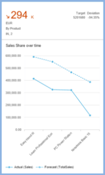
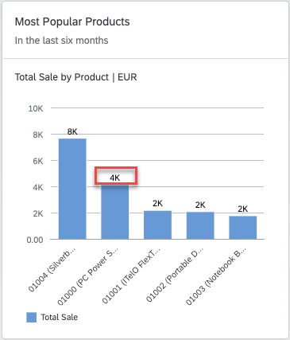

<!-- loioc7c5a828fe69411da7d63e2e63086b59 -->

# Configuring Charts

Developers configure the measures and dimensions displayed in charts by setting the role property to the desired value per chart type. Additional definitions apply to all chart types.


You can use the same annotation file with different qualifiers to present charts with different chart views. You do this by specifying different qualifiers in the annotation file for each card. The following sections of the annotation file apply to all chart types:


<table>
<tr>
<th valign="top">

Annotation


</th>
<th valign="top">

What it Does


</th>
</tr>
<tr>
<td valign="top">

`UI.Identification`


</td>
<td valign="top">

Specify the navigation targets activated when the user clicks the card and list the parameters to pass to the target application. This definition is mandatory. For more information, see [Configuring Card Navigation](configuring-card-navigation-530f9e6.md).


</td>
</tr>
<tr>
<td valign="top">

`UI.SelectionVariant.SelectOptions`


</td>
<td valign="top">

Specify the filter values that are applied to the card, which are applied when retrieving the card data.


</td>
</tr>
<tr>
<td valign="top">

`UI.PresentationVariant.SortOrder`


</td>
<td valign="top">

Specify the sort order to be used.


</td>
</tr>
<tr>
<td valign="top">

`UI.PresentationVariant.MaxItems`


</td>
<td valign="top">

Limit the maximum number of records to be fetched from the backend. If this variant isn't used, then all records from the backend will be displayed in the chart.

> ### Tip:  
> Don't use this for charts that rely on complete data sets, for example, the donut chart card, otherwise the results won't be meaningful.


</td>
</tr>
<tr>
<td valign="top">

`UI.Chart`


</td>
<td valign="top">

Specify the dimensions and measures that make up the chart, the chart type, and the way that the measures/dimensions are used for the chart. This definition is mandatory.


</td>
</tr>
<tr>
<td valign="top">

`UI.Chart.MeasureAttributes.Measure`


</td>
<td valign="top">

Defines the measures used in the chart.


</td>
</tr>
<tr>
<td valign="top">

`UI.Chart.MeasureAttributes.Role`


</td>
<td valign="top">

The manner in which a measure is used within the chart. This is configured differently for each chart type, as described below.


</td>
</tr>
<tr>
<td valign="top">

`UI.Chart.DimensionAttributes.Dimension`


</td>
<td valign="top">

These are the dimensions used in the chart.


</td>
</tr>
<tr>
<td valign="top">

`UI.Chart.DimensionAttributes.Role`


</td>
<td valign="top">

The manner in which a dimension is used within the chart. This is configured differently for each chart type, as described below.


</td>
</tr>
</table>


## Formatting Numeric Values in Charts

Within overview pages, analytical chart cards can have format measure values based on the `NumberOfFractionalDigits` property of the `DataPoint` term in the annotation file.

Here is an example annotation that shows how it's used:

> ### Sample Code:  
> XML Annotation
> 
> ```xml
> <Annotation Term="UI.DataPoint" Qualifier=" Eval_by_Currency_TotalSales ">
> <Record Type="UI.DataPointType">
>           <PropertyValue Property="Value" Path="Sales"/> 
> 		<PropertyValue Property="ValueFormat">
>                    <Record>
>                             <PropertyValue Property="ScaleFactor" Decimal="1000" />
>                             <PropertyValue Property="NumberOfFractionalDigits" Int="3" />
>                    </Record>
>            </PropertyValue>
>   </Record>
> </Annotation>
> <Annotation Term="UI.Chart" Qualifier="Eval_by_Currency">
>   <Record Type="UI.ChartDefinitionType">
>            <PropertyValue Property="Title" String="View1" />
>            <PropertyValue Property="ChartType" EnumMember="UI.ChartType/Bubble"/>
>            <PropertyValue Property="MeasureAttributes">
>                    <Collection>
>                             …
>                             <Record Type="UI.ChartMeasureAttributeType">
>                                      <PropertyValue Property="Measure" PropertyPath="TotalSales" />
>                                      <PropertyValue Property="Role" EnumMember="UI.ChartMeasureRoleType/Axis2" />
>                                      <PropertyValue Property="DataPoint" AnnotationPath="@UI.DataPoint#Eval_by_Currency-TotalSales"/>
>                             </Record>
>                             …
>                    </Collection>
>            </PropertyValue>
>            …
>   </Record>
> </Annotation>
> ```

> ### Sample Code:  
> ABAP CDS Annotation
> 
> ```
> 
> @UI.dataPoint: {
> 	 valueFormat: { 
> 	   scaleFactor: 1000, 
> 	   numberOfFractionalDigits: 3 
> 	 }
> }
> property_name;
> 
> @UI.Chart: [
>   {
>     title: 'View1',
>     chartType: #BUBBLE,
>     measureAttributes: [
>       {
>         measure: 'TotalSales',
>         role: #AXIS_2,
> 		asDataPoint: true
>       }
>     ],
>     qualifier: 'Eval_by_Currency'
>   }
> ]
> annotate view VIEWNAME with { }
> 
> ```

> ### Sample Code:  
> CAP CDS Annotation
> 
> ```
> 
> UI.DataPoint # Eval_by_Currency-TotalSales  : {
>     $Type : 'UI.DataPointType',
>     ValueFormat : {
>         ScaleFactor : 1000,
>         NumberOfFractionalDigits : 3
>     }
> },
> UI.Chart #Eval_by_Currency : {
>     $Type : 'UI.ChartDefinitionType',
>     Title : 'View1',
>     ChartType : #Bubble,
>     MeasureAttributes : [
>         {
>             $Type : 'UI.ChartMeasureAttributeType',
>             Measure : TotalSales,
>             Role : #Axis2,
>             DataPoint : '@UI.DataPoint#Eval_by_Currency-TotalSales'
>         }
>     ]
> }
> 
> ```


### Semantic Pattern

With the semantic pattern feature, overview page analytical cards can enable users to compare between actual and forecast values. The line, column, and vertical bullet chart cards support this feature. The forecast value comes from the datapoint annotation that is associated with the measure used in the selected analytical card. To enable the semantic pattern feature:

-   Datapoint annotation should contain the `ForecastValue` property with value as a measure.
-   Chart annotation should consist of:
    -   1 dimension and 1 measure for line and column chart cards
    -   1 dimension and 1-2 measures for vertical bullet chart cards


If the above conditions are not met, the chart will not inherit the semantic pattern feature. The actual measure will appear in a solid color and the forecast measure will appear as a dashed pattern for column and vertical bullet chart cards or as a dotted pattern for line charts. The following graphic is an example of what it could look like:



Here's an example annotation that shows how it's used:

> ### Sample Code:  
> XML Annotation
> 
> ```xml
> <Annotation Term="UI.DataPoint" Qualifier="Column_Forecast">
>     <Record Type="UI.DataPointType">
>         <PropertyValue Property="Title" String="Sales Performance"/>
>         <PropertyValue Property="Value" Path="Sales"/>
>         <PropertyValue Property="ValueFormat">
>             <Record>
>                 <PropertyValue Property="ScaleFactor" Decimal="0"/>
>                 <PropertyValue Property="NumberOfFractionalDigits" Int="3"/>
>             </Record>
>         </PropertyValue>
>         <PropertyValue Property="ForecastValue" Path="SalesShare"/>
>     </Record>
> </Annotation>
> 
> <Annotation Term="UI.Chart" Qualifier="Eval_by_Currency_Column">
>     <Record Type="UI.ChartDefinitionType">
>         <PropertyValue Property="Title" String="Column chart for shape" />
>         <PropertyValue Property="ChartType" EnumMember="UI.ChartType/Column" />
>         <PropertyValue Property="MeasureAttributes">
>             <Collection>
>                 <Record Type="UI.ChartMeasureAttributeType">
>                     <PropertyValue Property="Measure" PropertyPath="Sales" />
>                     <PropertyValue Property="DataPoint">
>                         <AnnotationPath>@UI.DataPoint#Column_Forecast</AnnotationPath>
>                     </PropertyValue>
>                     <PropertyValue Property="Role" EnumMember="UI.ChartMeasureRoleType/Axis1" />
>                 </Record>
>             </Collection>
>         </PropertyValue>
>         <PropertyValue Property="DimensionAttributes">
>             <Collection>
>                 <Record Type="UI.ChartDimensionAttributeType">
>                     <PropertyValue Property="Dimension" PropertyPath="SupplierCompany" />
>                     <PropertyValue Property="Role" EnumMember="UI.ChartDimensionRoleType/Category" />
>                 </Record>
>             </Collection>
>         </PropertyValue>
>     </Record>
> </Annotation>
> ```

> ### Sample Code:  
> ABAP CDS Annotation
> 
> ```
> 
> @UI.dataPoint: {
>   title: 'Sales Performance',
>   forecastValue: 'SalesShare',
>   valueFormat: { scaleFactor: 0, numberOfFractionalDigits: 3 }
> }
> Sales;
> 
> @UI.Chart: [
>   {
>     title: 'Column chart for shape',
>     chartType: #COLUMN,
>     measureAttributes: [
>       {
>         measure: 'Sales',
>         role: #AXIS_1,
> 		asDataPoint: true
>       }
>     ],
>     dimensionAttributes: [
>       {
>         dimension: 'SupplierCompany',
>         role: #CATEGORY
>       }
>     ],
>     qualifier: 'Eval_by_Currency_Column'
>   }
> ]
> annotate view VIEWNAME with { }
> 
> ```

> ### Sample Code:  
> CAP CDS Annotation
> 
> ```
> 
> UI.DataPoint #Column_Forecast : {
>     $Type : 'UI.DataPointType',
>     Title : 'Sales Performance',
>     Value : Sales,
>     NumberFormat : {
>         ScaleFactor : 0,
>         NumberOfFractionalDigits : 3
>     },
>     ForecastValue : SalesShare
> },
> UI.Chart #Eval_by_Currency_Column : {
>     $Type : 'UI.ChartDefinitionType',
>     Title : 'Column chart for shape',
>     ChartType : #Column,
>     MeasureAttributes : [
>         {
>             $Type : 'UI.ChartMeasureAttributeType',
>             Measure : Sales,
>             DataPoint : '@UI.DataPoint#Column_Forecast',
>             Role : #Axis1
>         }
>     ],
>     DimensionAttributes : [
>         {
>             $Type : 'UI.ChartDimensionAttributeType',
>             Dimension : SupplierCompany,
>             Role : #Category
>         }
>     ]
> },
> 
> ```


## Chart Types

Overview pages can use line, donut, bubble, column, stacked column, vertical bullet, combination, and scatter analytic chart cards.

The value assigned to the role property for dimensions and measures in the annotation file determines the visualization of the chart. For dimensions, you can set the role to **category** or **series**. If no value is specified, the default is **category**.

For measures, you can set the role to the values: **axis1**, **axis2**, or **axis3**. If no value is specified, the default is **axis1**. The actual interpretation of the role value specified in the annotation file varies according to the chart type used.


### Time Series Charts

Time series chart cards are cards with regular charts, but use time as the category axis instead of the categorical axis. The advantage in using a time-series axis is that the representation of the time-based dimension is much cleaner and more responsive to the change in card size. The display level and format in the time axis would be offered in the default format by the visual chart \(for example day/month/year displayed as 10/Jan/2016\).

Analytic cards will automatically use the time axis only if the following conditions are met:

-   The chart type is either line, bubble, column, or combination
-   The chart is configured with only one dimension
-   The data type of the dimension is either `edm.datetime` or `edm.string`. If the data type is `edm.string`, then it must have the additional OData metadata annotation `sap:semantics` of `yearmonthday`. If it's a bubble chart, there must be exactly two measures
-   If it's a combination chart card, then there must be at least two measures.

> ### Note:  
> Only line, bubble, column, and combination chart cards support the time axis.


<a name="loioc7c5a828fe69411da7d63e2e63086b59__section_oh1_smk_sfb"/>

## Color Palette

A few chart types \(line, bubble, combination, and stacked column\) support color palette for semantic coloring. To enable this feature, configure the required chart type and define the `colorPalette` property in the app descriptor. The `colorPalette` property is a map of four objects. Each object indicates the semantic representations:

-   First object: criticality state 0

-   Second object: criticality state 1

-   Third object: criticality state 2

-   Fourth object: criticality state 3


> ### Sample Code:  
> ```
> 
> "colorPalette" : {
> "0": {
> "color": "sapUiChartPaletteSemanticNeutral",
> "legendText" : "{{OTHERS}}"
> },
> "1": {
> "color": "sapUiChartPaletteSemanticBadDark1",
> "legendText" : "{{BAD}}"
> },
> "2": {
> "color": "sapUiChartPaletteSemanticCriticalDark2",
> "legendText" : "{{CRITICAL}}"
> },
> "3" : {
> "color": "sapUiChartPaletteSemanticCritical",
> "legendText" : "{{GOOD}}"
> }
> }
> ```

Every object in the `colorPalette` map has two properties `color` \(a color value for a particular state\) and `legendText` \(the corresponding legend text\).

> ### Note:  
> -   Use only the colors listed in the semantic palette that are defined by SAP Fiori guidelines for customizing the column stack card.
> 
> -   All four objects in the color `colorPalette` map are mandatory.

**Stable Coloring with Dimension Values \(Column Stack Chart\)**

You can configure an analytical card with column stack chart to map the dimension values to specific colors. You can use the configuration mentioned below:

1.  In the card manifest setting, set `bEnableStableColoring` to true.

2.  Define the color palette for the dimension. Follow the structure mentioned below:

    > ### Sample Code:  
    > ```
    > "colorPalette": {
    >         "dimensionSettings": {
    >             "StatusCriticality": {
    >                 "rule1": {
    >                     "color": "<colorValue1>",
    >                     "dimensionValue": "<dimensionValue1>"
    >                 },
    >                 "rule2": {
    >                     "color": "<colorValue2>",
    >                     "dimensionValue": "<dimensionValue2>"
    >                 }
    >             }
    >         }
    >     }
    > 
    > ```


You must define the `dimensionSettings` configuration under `colorPalette`. To color each dimension value, you must customize the color and `dimensionValue` to be colored, as per the defined rule, under the dimension property path configuration. \(You can define any name for the object property key. In the above mentioned example they are mentioned as rule1 and rule2\)

Additionally, you can add an index card with the rules configuration. The legends get positioned in the order of the maintained index property. The index value is 0-index based. This configuration is placed under card settings. The card setting should look similar to the following:

> ### Sample Code:  
> ```
> "sap.ovp": {
>     ...
>     "cards": {
>         ...
>         "<card_id>": {
>             "model": "<model_name>",
>             "template": "sap.ovp.cards.charts.analytical",
>             "settings": {
>                 "title": "<Card title>",
>                 "entitySet": "<entitySet>",
>                 "chartAnnotationPath": "com.sap.vocabularies.UI.v1.Chart#Eval_by_Currency_ColumnStacked",
>                 "bEnableStableColors": true,
>                 "colorPalette": {
>                     "dimensionSettings": {
>                         "StatusCriticality": {
>                             "rule1": {
>                                 "color": "sapUiChartPaletteSemanticGood",
>                                 "dimensionValue": "0",
>                                 "index": 0
>                             },
>                             "rule2": {
>                                 "color": "sapUiChartPaletteSemanticNeutral",
>                                 "dimensionValue": "1",
>                                 "index": 1
>                             },
>                             "rule3": {
>                                 "color": "sapUiChartPaletteSemanticCriticalDark2",
>                                 "dimensionValue": "2",
>                                 "index": 2
>                             },
>                             "rule4": {
>                                 "color": "sapUiChartPaletteSemanticBad",
>                                 "dimensionValue": "3",
>                                 "index": 3
>                             }
>                         }
>                     }
>                     }
>                 }
>             }
>         }
>     }
> }
> 
> ```

You can order the legends as per the dimension configuration.

> ### Note:  
> If the `dimensionValue` and index is defined under `dimensionSettings` and not the color, then only the legends get ordered and default colors are rendered. To order just the legends, do not define color property for any of the `dimensionSettings` value.


<a name="loioc7c5a828fe69411da7d63e2e63086b59__section_jwl_cb3_hmb"/>

## Data Label in Analytical Chart

You can make data labels visible in analytical cards.

To do this, set the `showDataLabel` property to `True` in `sap.ovp` of the manifest file. The default value is `False`.

> ### Sample Code:  
> ```
> 
> "sap.ovp": {
>       "globalFilterModel": "salesOrder",
>       "globalFilterEntityType": "GlobalFilters",
>       "chartSettings": {
>         "showDataLabel":true
>       },
> ```




## More Information

For more information about the type of charts used in overview pages, see [Chart Cards Used in Overview Pages](chart-cards-used-in-overview-pages-68e62ad.md).

