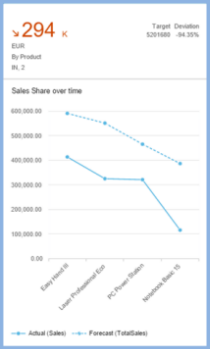
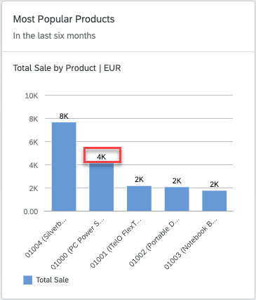

<!-- loioc7c5a828fe69411da7d63e2e63086b59 -->

# Configuring Charts on the Overview Page

You can configure the measures and dimensions displayed in charts by setting the `role` property to the required value for a chart type. Additional configurations apply to all chart types.


## Chart Annotations

You can use the same annotation file with different qualifiers to display different chart views for different cards. The following sections of the annotation file apply to all chart types:


<table>
<tr>
<th valign="top">

Annotation

</th>
<th valign="top">

What it Does

</th>
</tr>
<tr>
<td valign="top">

`UI.Identification`

</td>
<td valign="top">

Specifies the navigation targets that are activated when the user clicks the card, and list the parameters to pass to the target application. This definition is mandatory. For more information, see [Configuring Card Navigation](configuring-card-navigation-530f9e6.md).

</td>
</tr>
<tr>
<td valign="top">

`UI.SelectionVariant.SelectOptions`

</td>
<td valign="top">

Specify the filter values applied to the card when retrieving its data.

</td>
</tr>
<tr>
<td valign="top">

`UI.PresentationVariant.SortOrder`

</td>
<td valign="top">

Specifies the sort order.

</td>
</tr>
<tr>
<td valign="top">

`UI.PresentationVariant.MaxItems`

</td>
<td valign="top">

Limits the maximum number of records fetched from the back end. If this option isn't used, then all records from the back end are displayed in the chart.

> ### Tip:  
> Don't use this for charts that rely on complete datasets, for example, the donut chart card, otherwise the results won't be meaningful.


</td>
</tr>
<tr>
<td valign="top">

`UI.Chart`

</td>
<td valign="top">

Specifies the dimensions, measures, chart type, and the how these measures or dimensions are used. This definition is mandatory.

</td>
</tr>
<tr>
<td valign="top">

`UI.Chart.MeasureAttributes.Measure`

</td>
<td valign="top">

Defines the measures used in the chart.

</td>
</tr>
<tr>
<td valign="top">

`UI.Chart.MeasureAttributes.Role`

</td>
<td valign="top">

Specifies how a measure is used in the chart. The configuration varies depending on the chart type, as described below.

</td>
</tr>
<tr>
<td valign="top">

`UI.Chart.DimensionAttributes.Dimension`

</td>
<td valign="top">

Defines the dimensions used in the chart.

</td>
</tr>
<tr>
<td valign="top">

`UI.Chart.DimensionAttributes.Role`

</td>
<td valign="top">

Specifies how a dimension is used in the chart. The configuration varies depending on the chart type.

</td>
</tr>
</table>


## Chart Types

Overview pages support analytical chart cards such as line, donut, bubble, column, stacked column, vertical bullet, combination, bar, waterfall, dual combination, and scatter.

The value assigned to the `role` property in the annotation determines the visualization of the chart.

The actual interpretation of the `role` value depends on the chart type.

For dimensions, you can set the `role` to `category` or `series`. If no value is specified, the default is `category`.

For measures, you can set the `role` to the values: `axis1`, `axis2` , or `axis3`. If no value is specified, the default is `axis1`. The actual interpretation of the value specified for `role` in the annotation file varies according to the chart type used.


### Time Series Charts

Time series chart cards use time as the category axis instead of a categorical axis. A time-based axis provides a clean representation of time-based dimension and adapts more responsively to changes in card size. The time axis displays values in the visual chart’s default format, for example, day/month/year as 10/Jan/2026.

Analytic cards automatically use the time axis only if the following conditions are met:

-   The chart type is line, bubble, column, or combination.

-   The chart has only one dimension.

-   The data type of the dimension is either `edm.datetime` or `edm.string`.

    If the data type is `edm.string`, then it must have the additional OData metadata annotation `sap:semantics` of `yearmonthday`.

-   For a bubble chart, there must be exactly two measures.

-   For a combination chart card, then there must be at least two measures.


## Formatting Numeric Values in Charts

You can format measure values in analytical chart cards by setting the `NumberOfFractionalDigits` property of the `DataPoint` annotation, as shown in the following sample code:

> ### Sample Code:  
> XML Annotation
> 
> ```xml
> <Annotation Term="UI.DataPoint" Qualifier=" Eval_by_Currency_TotalSales ">
> <Record Type="UI.DataPointType">
>           <PropertyValue Property="Value" Path="Sales"/> 
> 		<PropertyValue Property="ValueFormat">
>                    <Record>
>                             <PropertyValue Property="ScaleFactor" Decimal="1000" />
>                             <PropertyValue Property="NumberOfFractionalDigits" Int="3" />
>                    </Record>
>            </PropertyValue>
>   </Record>
> </Annotation>
> <Annotation Term="UI.Chart" Qualifier="Eval_by_Currency">
>   <Record Type="UI.ChartDefinitionType">
>            <PropertyValue Property="Title" String="View1" />
>            <PropertyValue Property="ChartType" EnumMember="UI.ChartType/Bubble"/>
>            <PropertyValue Property="MeasureAttributes">
>                    <Collection>
>                             …
>                             <Record Type="UI.ChartMeasureAttributeType">
>                                      <PropertyValue Property="Measure" PropertyPath="TotalSales" />
>                                      <PropertyValue Property="Role" EnumMember="UI.ChartMeasureRoleType/Axis2" />
>                                      <PropertyValue Property="DataPoint" AnnotationPath="@UI.DataPoint#Eval_by_Currency-TotalSales"/>
>                             </Record>
>                             …
>                    </Collection>
>            </PropertyValue>
>            …
>   </Record>
> </Annotation>
> ```

> ### Sample Code:  
> ABAP CDS Annotation
> 
> ```
> 
> @UI.dataPoint: {
> 	 valueFormat: { 
> 	   scaleFactor: 1000, 
> 	   numberOfFractionalDigits: 3 
> 	 }
> }
> property_name;
> 
> @UI.Chart: [
>   {
>     title: 'View1',
>     chartType: #BUBBLE,
>     measureAttributes: [
>       {
>         measure: 'TotalSales',
>         role: #AXIS_2,
> 		asDataPoint: true
>       }
>     ],
>     qualifier: 'Eval_by_Currency'
>   }
> ]
> annotate view VIEWNAME with { }
> 
> ```

> ### Sample Code:  
> CAP CDS Annotation
> 
> ```
> 
> UI.DataPoint # Eval_by_Currency-TotalSales  : {
>     $Type : 'UI.DataPointType',
>     ValueFormat : {
>         ScaleFactor : 1000,
>         NumberOfFractionalDigits : 3
>     }
> },
> UI.Chart #Eval_by_Currency : {
>     $Type : 'UI.ChartDefinitionType',
>     Title : 'View1',
>     ChartType : #Bubble,
>     MeasureAttributes : [
>         {
>             $Type : 'UI.ChartMeasureAttributeType',
>             Measure : TotalSales,
>             Role : #Axis2,
>             DataPoint : '@UI.DataPoint#Eval_by_Currency-TotalSales'
>         }
>     ]
> }
> 
> ```


### Semantic Pattern

The semantic pattern feature lets users compare actual and forecast values in line, column, and vertical bullet chart cards. The forecast value comes from the `DataPoint` annotation associated with the chart's measure.

To enable the semantic pattern feature, the following conditions must be satisfied:

-   The `DataPoint` annotation must contain the `ForecastValue` property, with the value set to a measure.
-   The chart annotation must satisfy the following criteria:
    -   For line and column chart cards: 1 dimension and 1 measure.

    -   For vertical bullet chart cards: 1 dimension and 1-2 measures.


If the above conditions aren't met, the chart doesn't render the semantic pattern feature. In such cases:

-   The actual measure is displayed in a solid color.

-   The forecast measure is displayed as a dashed pattern for column and vertical bullet charts, or as a dotted pattern for line charts.


The following image illustrates this behavior:



The following sample code shows how it's used:

> ### Sample Code:  
> XML Annotation
> 
> ```xml
> <Annotation Term="UI.DataPoint" Qualifier="Column_Forecast">
>     <Record Type="UI.DataPointType">
>         <PropertyValue Property="Title" String="Sales Performance"/>
>         <PropertyValue Property="Value" Path="Sales"/>
>         <PropertyValue Property="ValueFormat">
>             <Record>
>                 <PropertyValue Property="ScaleFactor" Decimal="0"/>
>                 <PropertyValue Property="NumberOfFractionalDigits" Int="3"/>
>             </Record>
>         </PropertyValue>
>         <PropertyValue Property="ForecastValue" Path="SalesShare"/>
>     </Record>
> </Annotation>
> 
> <Annotation Term="UI.Chart" Qualifier="Eval_by_Currency_Column">
>     <Record Type="UI.ChartDefinitionType">
>         <PropertyValue Property="Title" String="Column chart for shape" />
>         <PropertyValue Property="ChartType" EnumMember="UI.ChartType/Column" />
>         <PropertyValue Property="MeasureAttributes">
>             <Collection>
>                 <Record Type="UI.ChartMeasureAttributeType">
>                     <PropertyValue Property="Measure" PropertyPath="Sales" />
>                     <PropertyValue Property="DataPoint">
>                         <AnnotationPath>@UI.DataPoint#Column_Forecast</AnnotationPath>
>                     </PropertyValue>
>                     <PropertyValue Property="Role" EnumMember="UI.ChartMeasureRoleType/Axis1" />
>                 </Record>
>             </Collection>
>         </PropertyValue>
>         <PropertyValue Property="DimensionAttributes">
>             <Collection>
>                 <Record Type="UI.ChartDimensionAttributeType">
>                     <PropertyValue Property="Dimension" PropertyPath="SupplierCompany" />
>                     <PropertyValue Property="Role" EnumMember="UI.ChartDimensionRoleType/Category" />
>                 </Record>
>             </Collection>
>         </PropertyValue>
>     </Record>
> </Annotation>
> ```

> ### Sample Code:  
> ABAP CDS Annotation
> 
> ```
> 
> @UI.dataPoint: {
>   title: 'Sales Performance',
>   forecastValue: 'SalesShare',
>   valueFormat: { scaleFactor: 0, numberOfFractionalDigits: 3 }
> }
> Sales;
> 
> @UI.Chart: [
>   {
>     title: 'Column chart for shape',
>     chartType: #COLUMN,
>     measureAttributes: [
>       {
>         measure: 'Sales',
>         role: #AXIS_1,
> 		asDataPoint: true
>       }
>     ],
>     dimensionAttributes: [
>       {
>         dimension: 'SupplierCompany',
>         role: #CATEGORY
>       }
>     ],
>     qualifier: 'Eval_by_Currency_Column'
>   }
> ]
> annotate view VIEWNAME with { }
> 
> ```

> ### Sample Code:  
> CAP CDS Annotation
> 
> ```
> 
> UI.DataPoint #Column_Forecast : {
>     $Type : 'UI.DataPointType',
>     Title : 'Sales Performance',
>     Value : Sales,
>     NumberFormat : {
>         ScaleFactor : 0,
>         NumberOfFractionalDigits : 3
>     },
>     ForecastValue : SalesShare
> },
> UI.Chart #Eval_by_Currency_Column : {
>     $Type : 'UI.ChartDefinitionType',
>     Title : 'Column chart for shape',
>     ChartType : #Column,
>     MeasureAttributes : [
>         {
>             $Type : 'UI.ChartMeasureAttributeType',
>             Measure : Sales,
>             DataPoint : '@UI.DataPoint#Column_Forecast',
>             Role : #Axis1
>         }
>     ],
>     DimensionAttributes : [
>         {
>             $Type : 'UI.ChartDimensionAttributeType',
>             Dimension : SupplierCompany,
>             Role : #Category
>         }
>     ]
> },
> 
> ```


<a name="loioc7c5a828fe69411da7d63e2e63086b59__section_oh1_smk_sfb"/>

## Applying Semantic Coloring with a Color Palette

Line, bubble, combination, and stacked column charts support a color palette for semantic coloring. To enable this feature, define the `colorPalette` property in `manifest.json` for the relevant card. The `colorPalette` property is a map of four objects. Each object indicates the semantic representations:

-   First object: criticality state 0

-   Second object: criticality state 1

-   Third object: criticality state 2

-   Fourth object: criticality state 3


Each object has the following two properties:

**Criticality State Properties**


<table>
<tr>
<th valign="top">

Property

</th>
<th valign="top">

Description

</th>
</tr>
<tr>
<td valign="top">

`color` 

</td>
<td valign="top">

Color used for the criticality state. Use only colors from the semantic palette defined by SAP Fiori guidelines.

</td>
</tr>
<tr>
<td valign="top">

`legendText` 

</td>
<td valign="top">

Legend text shown for the criticality state.

</td>
</tr>
</table>

> ### Sample Code:  
> `manifest.json`
> 
> ```
> 
> "colorPalette": {
>   "0": {
>     "color": "sapUiChartPaletteSemanticNeutral",
>     "legendText": "{{OTHERS}}"
>   },
>   "1": {
>     "color": "sapUiChartPaletteSemanticBadDark1",
>     "legendText": "{{BAD}}"
>   },
>   "2": {
>     "color": "sapUiChartPaletteSemanticCriticalDark2",
>     "legendText": "{{CRITICAL}}"
>   },
>   "3": {
>     "color": "sapUiChartPaletteSemanticCritical",
>     "legendText": "{{GOOD}}"
>   }
> }
> 
> ```

> ### Note:  
> -   Use only the colors listed in the semantic palette that are defined by SAP Fiori guidelines for configuring the column stack card.
> 
> -   All four objects in the `colorPalette` map are mandatory.


### Stable Coloring with Dimension Values

You can map specific dimension values to specific colors in a column stack chart. To enable stable coloring, configure the following settings:

1.  In the `manifest.json` file, set `bEnableStableColors` to `true`.

2.  Define a `dimensionSettings` configuration under `colorPalette`.


The following sample code shows how to color each dimension value:

> ### Sample Code:  
> `manifest.json`
> 
> ```
> "colorPalette": {
>         "dimensionSettings": {
>             "StatusCriticality": {
>                 "rule1": {
>                     "color": "<colorValue1>",
>                     "dimensionValue": "<dimensionValue1>"
>                 },
>                 "rule2": {
>                     "color": "<colorValue2>",
>                     "dimensionValue": "<dimensionValue2>"
>                 }
>             }
>         }
>     }
> 
> ```

For each value, configure `color` and `dimensionValue` under the dimension property path.

You can order the legends as per the dimension configuration.

> ### Note:  
> If the `dimensionValue` and `index` are defined under `dimensionSettings` but `color` isn't, then only the legends get ordered and default colors are rendered. To order just the legends without overriding the colors, don't define `color` property for any of the `dimensionSettings` value.

Additionally, you can add an index card with the rules configuration. The legends are positioned in the order of the index property. The index value is 0-index based. This configuration is placed under card settings. The following code sample shows the card setting:

> ### Sample Code:  
> `manifest.json`
> 
> ```
> "sap.ovp": {
>   ...
>   "cards": {
>     ...
>     "<card_id>": {
>       "model": "<model_name>",
>       "template": "sap.ovp.cards.v4.charts.analytical",
>       "settings": {
>         "title": "<Card title>",
>         "entitySet": "<entitySet>",
>         "chartAnnotationPath": "com.sap.vocabularies.UI.v1.Chart#Eval_by_Currency_ColumnStacked",
>         "bEnableStableColors": true,
>         "colorPalette": {
>           "dimensionSettings": {
>             "<dimensionAttribute>": {
>               "<dimensionValue1>": {
>                 "color": "sapUiChartPaletteSemanticGood",
>                 "dimensionValue": "<dimensionValue1>",
>                 "index": 0
>               },
>               "<dimensionValue2>": {
>                 "color": "sapUiChartPaletteSemanticNeutral",
>                 "dimensionValue": "<dimensionValue2>",
>                 "index": 1
>               },
>               "<dimensionValue3>": {
>                 "color": "sapUiChartPaletteSemanticCriticalDark2",
>                 "dimensionValue": "<dimensionValue3>",
>                 "index": 2
>               }
>             }
>           }
>         }
>       }
>     }
>   }
> }
> 
> ```

> ### Note:  
> The template setting in the `manifest.json` file depends on your OData version. Use `sap.ovp.cards.v4.<cardType>` for SAP Fiori elements for OData V4 and `sap.ovp.cards.<cardType>` for SAP Fiori elements for OData V2.


<a name="loioc7c5a828fe69411da7d63e2e63086b59__section_jwl_cb3_hmb"/>

## Showing Data Label in Analytical Charts

You can show data labels visible in analytical cards by setting the `"showDataLabel": true` in `sap.ovp` of the `manifest.json` file. The default value is `false`.

> ### Sample Code:  
> `manifest.json`
> 
> ```
> 
> "sap.ovp": {
>       "globalFilterModel": "salesOrder",
>       "globalFilterEntitySet": "GlobalFilters",
>       "chartSettings": {
>         "showDataLabel":true
>       },
> ```

> ### Note:  
> The type of filter bar is determined by the service \(entity\) bound to the filter configuration of the overview page application. If the service is an OData V4 service, a `FilterBar` building block is rendered; for OData V2, a smart filter bar is rendered.



**Related Information**  


[Chart Cards Used in Overview Pages](chart-cards-used-in-overview-pages-68e62ad.md "This section describes the analytical chart cards you can use in overview pages.")

[Analytical Cards](analytical-cards-d7b0b42.md "You can use the analytical cards to view data in a variety of chart formats.")

