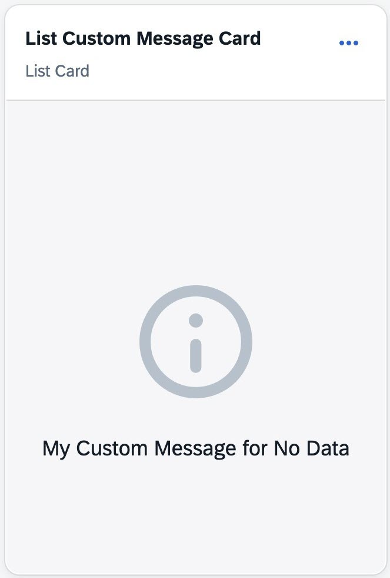
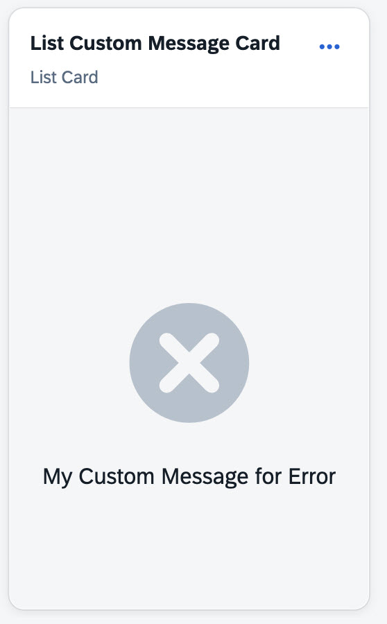
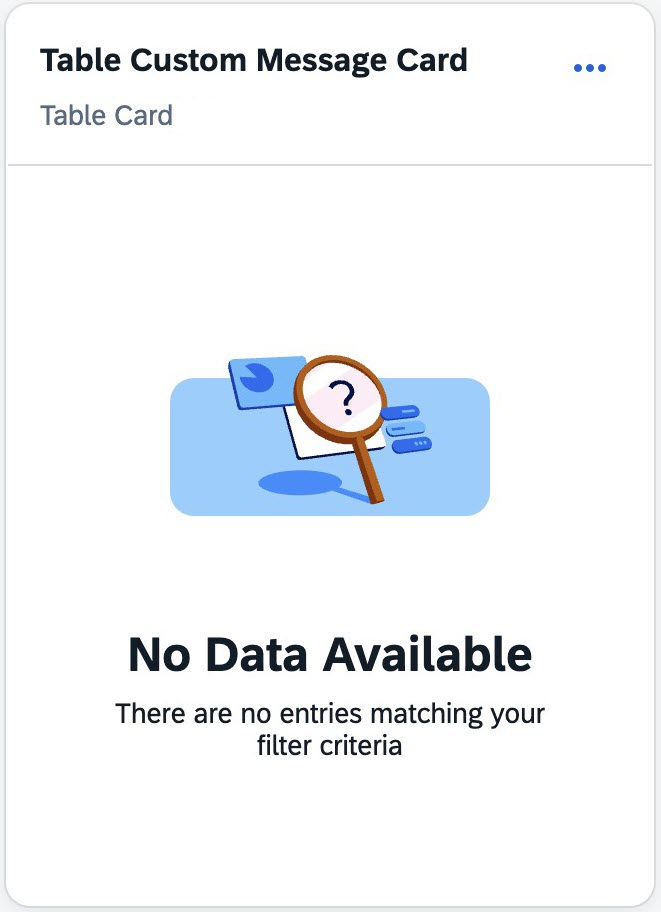
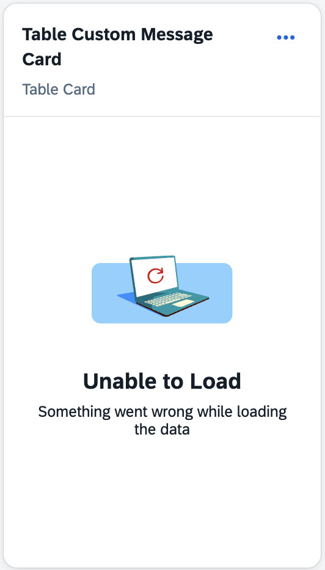

<!-- loiob75910f6d7eb48a58d83267be2c71385 -->

# Configuring Custom Messages on the Overview Page

You can configure the messages displayed on the overview page for success, success with no data, and error scenarios. Additionally, you can add an icon for success scenarios. For error scenarios, a default icon is displayed.


To configure custom messages, define `getCustomMessage` function in your controller extension file. The function receives the following parameters:

-   `oResponse` – The response object from the data request.

-   `sCardId` – The unique identifier of the card.


In message-based approach, you can display a short text message along with an optional icon. In illustration-based approach, you can display a descriptive message that combines a title, a detailed description, and an illustration.


<table>
<tr>
<th valign="top">

Approach

</th>
<th valign="top">

Property

</th>
<th valign="top">

Description

</th>
</tr>
<tr>
<td valign="top">

Message

</td>
<td valign="top">

`sMessage`

</td>
<td valign="top">

Custom message text displayed on the card.

</td>
</tr>
<tr>
<td valign="top">

Message

</td>
<td valign="top">

`sIcon`

</td>
<td valign="top">

SAP icon URI displayed along with the message.

</td>
</tr>
<tr>
<td valign="top">

Illustration

</td>
<td valign="top">

`sTitle`

</td>
<td valign="top">

Title displayed in the message area.

</td>
</tr>
<tr>
<td valign="top">

Illustration

</td>
<td valign="top">

`sDescription`

</td>
<td valign="top">

Detailed description text.

</td>
</tr>
<tr>
<td valign="top">

Illustration

</td>
<td valign="top">

`sIllustration`

</td>
<td valign="top">

SAP illustration displayed for the state.

</td>
</tr>
</table>

The `getCustomMessage` function supports both message-based and illustration-based approach for configuring custom messages.

The following code sample shows how to configure custom messages for two different cards; one uses a message-based approach and the other uses an illustration-based approach:

> ### Sample Code:  
> ```
> getCustomMessage: function (oResponse, sCardId) {
>     var oParams = oResponse && oResponse.getParameters && oResponse.getParameters();
> 
>     if (sCardId === "card_noData_custom") {
>         if (oParams && oParams.success) {
>             return {
>                 sMessage: "My Custom Message for No Data",
>                 sIcon: "sap-icon://message-information"
>             };
>         } else {
>             return {
>                 sMessage: "My Custom Message for Error",
>                 sIcon: "sap-icon://error"
>             };
>         }
>     }
> 
>     if (sCardId === "card_noData_custom_table") {
>         if (oParams && oParams.success) {
>             return {
>                 sTitle: "No Data Available",
>                 sDescription: "There are no entries matching your filter criteria",
>                 sIllustration: "sapIllus-NoEntries"
>             };
>         } else {
>             return {
>                 sTitle: "Unable to Load",
>                 sDescription: "Something went wrong while loading the data",
>                 sIllustration: "sapIllus-UnableToLoad"
>             };
>         }
>     }
> }
> ```

The following screenshots show examples of the custom messages rendered on the overview page based on the preceding code sample:

****


<table>
<tr>
<td valign="top" colspan="2">

Message - Based Custom Message

</td>
</tr>
<tr>
<td valign="top">



</td>
<td valign="top">



</td>
</tr>
<tr>
<td valign="top" colspan="2">

Illustration - Based Custom Message

</td>
</tr>
<tr>
<td valign="top">



</td>
<td valign="top">



</td>
</tr>
</table>

