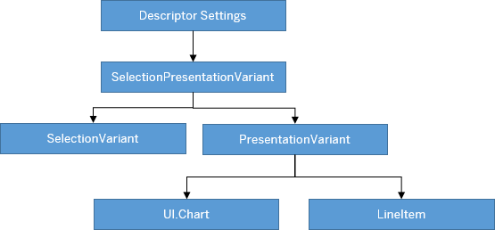

<!-- loio22e32b7241e843c1a84fee142e9d8ef0 -->

# Configuring Default Settings \(Visualizations, Sort Order, Filter Values\)

You can configure several settings of the main content area, such as sort order or filter values, with `UI.SelectionPresentationVariant`.

> ### Note:  
> For information about SAP Fiori elements for OData V4, see [Configuring Default Settings \(Visualizations, Sort Order, Filter Values\)](configuring-default-settings-visualizations-sort-order-filter-values-49a6ba5.md).

You can use the `UI.SelectionPresentationVariant` to configure the default visualizations, grouping, and filter values of the main content area when an application is launched using the *Standard* variant. The `UI.SelectionPresentationVariant` must contain references to the `UI.SelectionVariant` and the `UI.PresentationVariant`. You use the `UI.SelectionVariant` to define default filter values, and the `UI.PresentationVariant` can contain the configurations for tables and charts, including, for example, the sort order or grouping.

SAP Fiori elements uses the `UI.LineItem` annotation and the `UI.Chart` annotation to bring up tables and charts.





### Descriptor Settings

Make the following setting in the `manifest.json` to specify the `SelectionPresentationVariant`, the `PresentationVariant` or, the `SelectionVariant`:

> ### Sample Code:  
> ```
> "component": {
>      "name": "sap.suite.ui.generic.template.ListReport",
>      "list": true,
>      "settings": {
>           "annotationPath": "com.sap.vocabularies.UI.v1.SelectionPresentationVariant#DefaultSPV" // This can also point to PresentationVariant/SelectionVariant instead of SelectionPresentationVariant
>      }
> }
> 
> ```

**Using the `annotationPath` Pointing to the `PresentationVariant` or `SelectionVariant`**

The following behavior applies:

-   If the `"annotationPath"` has a reference to the `"PresentationVariant"`, the `SelectionVariant` has no default filter values. The specified `PresentationVariant` is handled in the same way as when the `SelectionPresentationVariant` is specified.

-   If the `"annotationPath"` has a reference to the `"SelectionVariant"`, only the default filter values are applied. The visualization is defined in the default `PresentationVariant` \(unqualified\). The fallback option is defined in the `UI.LineItem` and `UI.Chart` annotations. This is described in the handling of the `UI.SelectionPresentationVariant`.


### Annotation: `SelectionPresentationVariant` with `Qualifier="DefaultVariant"`

**Configuration Sample:**

> ### Sample Code:  
> XML Annotation
> 
> ```xml
> <Annotations Target="self.BookingType">
>     ...
>     <Annotation Term="UI.SelectionPresentationVariant" Qualifier="BookingSPV">
>         <Record>
>             <PropertyValue Property="Text" String="Default"/>
>             <PropertyValue Property="SelectionVariant" Path="@UI.SelectionVariant#BookingSV"/>
>             <PropertyValue Property="PresentationVariant" Path="@UI.PresentationVariant#BookingPV"/>
>         </Record>
>     </Annotation>
>     ...
> </Annotations>
> 
> ```

> ### Sample Code:  
> ABAP CDS Annotation
> 
> ```
> //@Scope: [ENTITY] ("Booking")
> @UI: {
>     selectionPresentationVariant: [ {
>         qualifier: 'BookingSPV',
>         selectionVariantQualifier: 'BookingSV',
>         presentationVariantQualifier: 'BookingPV'
>     } ],
>     ...
> }
> 
> ```

> ### Sample Code:  
> CAP CDS Annotation
> 
> ```
> annotate TravelService.Travel with @UI: {
>     SelectionPresentationVariant #BookingSPV : {
>         SelectionVariant : ![@UI.SelectionVariant#BookingSV],
>         PresentationVariant : ![@UI.PresentationVariant#BookingPV]
>     }
>     ...
> }
> 
> ```


### Annotation: `SelectionVariant`

> ### Sample Code:  
> XML Annotation
> 
> ```xml
> <Annotations Target="self.BookingType">
>     ...
>     <Annotation Term="UI.SelectionVariant" Qualifier="BookingSV">
>         <Record>
>             <PropertyValue Property="SelectOptions">
>                 <Collection>
>                     <Record Type="UI.SelectOptionType">
>                         <PropertyValue Property="PropertyName" PropertyPath="BookingStatus"/>
>                         <PropertyValue Property="Ranges">
>                             <Collection>
>                                 <Record Type="UI.SelectionRangeType">
>                                     <PropertyValue Property="Sign" EnumMember="UI.SelectionRangeSignType/I"/>
>                                     <PropertyValue Property="Option" EnumMember="UI.SelectionRangeOptionType/EQ"/>
>                                     <PropertyValue Property="Low" String="N"/>
>                                 </Record>
>                             </Collection>
>                         </PropertyValue>
>                     </Record>
>                 </Collection>
>             </PropertyValue>
>         </Record>
>     </Annotation>
>     ...
> </Annotations>
> 
> ```

> ### Sample Code:  
> ABAP CDS Annotation
> 
> ```
> //@Scope: [ENTITY] (e.g. "Booking")
> @UI: {
>     selectionVariant: [ { 
>         qualifier: 'BookingSV',
>         filter: 'BookingStatus EQ "N"'
>     } ]
> }
> 
> ```

> ### Sample Code:  
> CAP CDS Annotation
> 
> ```
> annotate TravelService.Travel with @UI: {
>     SelectionVariant #BookingSV: {
>         SelectOptions: [ {
>             $Type       : 'UI.SelectOptionType',
>             PropertyName: BookingStatus,
>             Ranges      : [ {
>                 $Type : 'UI.SelectionRangeType',
>                 Sign  : #I,
>                 Option: #EQ,
>                 Low   : 'N'
>             } ]
>         } ]
>     },
>     ...
> }
> 
> ```


### Annotation: `PresentationVariant`

> ### Sample Code:  
> XML Annotation
> 
> ```xml
> "component": {
>      "name": "sap.suite.ui.generic.template.ListReport",
>      "list": true,
>      "settings": {
>           "annotationPath": "com.sap.vocabularies.UI.v1.SelectionPresentationVariant#DefaultSPV" // This can also point to PresentationVariant/SelectionVariant instead of SelectionPresentationVariant
>      }
> }
> 
> ```

> ### Sample Code:  
> ABAP CDS Annotation
> 
> ```
> //@Scope: [ENTITY] ("Booking")
> @UI: {
>     presentationVariant: [ { 
>         qualifier: 'BookingPV',
>         sortOrder: [ {
>             by: 'BookingID',
>             direction: #DESC
>         } ],
>         visualizations: [ {
>             type: #AS_LINEITEM
>         } ]
>    } ]
> }
> 
> ```

> ### Sample Code:  
> CAP CDS Annotation
> 
> ```
> annotate TravelService.Travel with @UI: {
>     PresentationVariant #BookingPV: {
>         SortOrder : [
>             {
>                 $Type : 'Common.SortOrderType',
>                 Property : BookingID,
>                 Descending : true
>             }
>         ],
>         Visualizations : [
>             '@UI.LineItem'
>         ]
>     },
>     ...
>     ...
> }
> 
> ```


### Annotation: `UI.Chart` 

> ### Sample Code:  
> XML Annotation
> 
> ```xml
> <Annotations Target="STTA_PROD_MAN.STTA_C_MP_ProductSalesDataType">
>    <Annotation Term="UI.Chart">
>       <Record>
>          <PropertyValue Property="Title" String="Test Chart"/>
>          <PropertyValue Property="ChartType" EnumMember="UI.ChartType/Column"/>
>          <PropertyValue Property="Dimensions">
>             <Collection>
>                <PropertyPath>DeliveryMonth</PropertyPath>
>             </Collection>
>          </PropertyValue> 
>          <PropertyValue Property="Measures">
>             <Collection>
>                <PropertyPath>Revenue</PropertyPath>
>             </Collection>
>          </PropertyValue>
>       </Record>
>    </Annotation>
> </Annotations>
> ```

> ### Sample Code:  
> ABAP CDS Annotation
> 
> ```
> @UI.Chart: [
>   {
>     title: 'Test Chart',
>     chartType: #COLUMN,
>     dimensions: [
>       'DELIVERYMONTH'
>     ],
>     measures: [
>       'REVENUE'
>     ]
>   }
> ]
> annotate view STTA_C_MP_PRODUCTSALESDATA with {
> 
> }
> ```

> ### Sample Code:  
> CAP CDS Annotation
> 
> ```
> annotate STTA_PROD_MAN.STTA_C_MP_ProductSalesDataType @(
>   UI.Chart : {
>     Title : 'Test Chart',
>     ChartType : #Column,
>     Dimensions : [
>         DeliveryMonth
>     ],
>     Measures : [
>         Revenue
>     ]
>   }
> );
> ```


### Annotation: `LineItem` 

> ### Sample Code:  
> XML Annotation
> 
> ```xml
> 
> <Annotations Target="self.Container/Booking">
> 
>     <Annotation Term="UI.LineItem">
>         <Collection>
>             <Record Type="UI.DataField">
>                 <PropertyValue Property="Value" Path="TravelID"/>
>                 <Annotation Term="UI.Importance" EnumMember="UI.ImportanceType/High"/>
>             </Record>
>             <Record Type="UI.DataField">
>                 <PropertyValue Property="Value" Path="BookingID"/>
>                 <Annotation Term="UI.Importance" EnumMember="UI.ImportanceType/High"/>
>             </Record>
>             <Record Type="UI.DataField">
>                 <PropertyValue Property="Value" Path="BookingDate"/>
>                 <Annotation Term="UI.Importance" EnumMember="UI.ImportanceType/High"/>
>             </Record>
>             <Record Type="UI.DataField">
>                 <PropertyValue Property="Value" Path="CustomerID"/>
>                 <Annotation Term="UI.Importance" EnumMember="UI.ImportanceType/High"/>
>             </Record>
>             <Record Type="UI.DataField">
>                 <PropertyValue Property="Value" Path="CarrierID"/>
>                 <Annotation Term="UI.Importance" EnumMember="UI.ImportanceType/High"/>
>             </Record>
>             <Record Type="UI.DataField">
>                 <PropertyValue Property="Value" Path="ConnectionID"/>
>                 <Annotation Term="UI.Importance" EnumMember="UI.ImportanceType/High"/>
>             </Record>
>             <Record Type="UI.DataField">
>                 <PropertyValue Property="Value" Path="FlightDate"/>
>                 <Annotation Term="UI.Importance" EnumMember="UI.ImportanceType/High"/>
>             </Record>
>             <Record Type="UI.DataField">
>                 <PropertyValue Property="Value" Path="FlightPrice"/>
>                 <Annotation Term="UI.Importance" EnumMember="UI.ImportanceType/High"/>
>             </Record>
>             <Record Type="UI.DataField">
>                 <PropertyValue Property="Criticality" Path="BookingStatusIndicator"/>
>                 <PropertyValue Property="Value" Path="BookingStatus"/>
>                 <Annotation Term="UI.Importance" EnumMember="UI.ImportanceType/High"/>
>             </Record>
>         </Collection>
>     </Annotation>
>     ...
> </Annotations>
> 
> ```

> ### Sample Code:  
> ABAP CDS Annotation
> 
> ```
> //@Scope: [VIEW] ("BOOKING")
> annotate view VIEWNAME with {
>     @UI.lineItem: [ {
>         position: 10 ,
>         importance: #HIGH
>     } ]
>     TravelID;
>     
>     @UI.lineItem: [ {
>         position: 20 ,
>         importance: #HIGH
>     } ]
>     BookingID;
>     
>     @UI.lineItem: [ {
>         position: 30 ,
>         importance: #HIGH
>     } ]
>     BookingDate;
>     
>     @UI.lineItem: [ {
>         position: 40 ,
>         importance: #HIGH
>     } ]
>     @UI.textArrangement: #TEXT_FIRST
>     CustomerID;
>     
>     @UI.lineItem: [ {
>         position: 50 ,
>         importance: #HIGH
>     } ]
>     CarrierID;
>     
>     @UI.lineItem: [ {
>         position: 60 ,
>         importance: #HIGH
>     } ]
>     ConnectionID;
>     
>     @UI.lineItem: [ {
>         position: 70 ,
>         importance: #HIGH
>     } ]
>     FlightDate;
>     
>     @UI.lineItem: [ {
>         position: 80 ,
>         importance: #HIGH
>     } ]
>     FlightPrice;
>     
>     @UI.lineItem:       [ {
>         position: 90,
>         criticality: 'BookingStatusIndicator',
>         importance: #HIGH
>     } ]
>     BookingStatus;
> }
> 
> ```

> ### Sample Code:  
> CAP CDS Annotation
> 
> ```
> UI.LineItem : [
>     {
>         $Type : 'UI.DataField',
>         Value : TravelID,
>         ![@UI.Importance] : #High
>     },
>     {
>         $Type : 'UI.DataField',
>         Value : BookingID,
>         ![@UI.Importance] : #High
>     },
>     {
>         $Type : 'UI.DataField',
>         Value : BookingDate,
>         ![@UI.Importance] : #High
>     },
>     {
>         $Type : 'UI.DataField',
>         Value : CustomerID,
>         ![@UI.Importance] : #High
>     },
>     {
>         $Type : 'UI.DataField',
>         Value : CarrierID,
>         ![@UI.Importance] : #High
>     },
>     {
>         $Type : 'UI.DataField',
>         Value : ConnectionID,
>         ![@UI.Importance] : #High
>     },
>     {
>         $Type : 'UI.DataField',
>         Value : FlightDate,
>         ![@UI.Importance] : #High
>     },
>     {
>         $Type : 'UI.DataField',
>         Value : FlightPrice,
>         ![@UI.Importance] : #High
>     },
>     {
>         $Type       : 'UI.DataField',
>         Value       : BookingStatus,
>         Criticality : BookingStatusIndicator,
>         ![@UI.Importance] : #High
>     }
> ]
> 
> ```

The `UI.Chart` annotation is applicable for the following:

-   The main chart in the analytical list page \(ALP\).

-   Usage within multiple views for the list report page tables. For more information, see [Defining Multiple Views in a List Report Page Table - Multiple Table Mode](defining-multiple-views-in-a-list-report-page-table-multiple-table-mode-97dfeea.md) and [Defining Multiple Views on a List Report Page with Different Entity Sets and Table Settings](defining-multiple-views-on-a-list-report-page-with-different-entity-sets-and-table-settin-6698b80.md).


<a name="loio22e32b7241e843c1a84fee142e9d8ef0__section_mzt_mcw_sqb"/>

## Configuring the Default Visualization

> ### Note:  
> -   The information provided in the section isn't applicable to object pages.
> 
> -   When defining a `PresentationVariant`, the `Visualizations` annotation should be provided and point to a valid visualization.
> 
> -   In a multiple view scenario, the following logic is used to fetch the `UI.PresentationVariant` annotation only if it is undefined. For more information about the multiple view configuration, see [Defining Multiple Views in a List Report Page Table - Multiple Table Mode](defining-multiple-views-in-a-list-report-page-table-multiple-table-mode-97dfeea.md) and [Defining Multiple Views on a List Report Page with Different Entity Sets and Table Settings](defining-multiple-views-on-a-list-report-page-with-different-entity-sets-and-table-settin-6698b80.md).

You can control the default visualization by using a setting in the `manifest.json` file. This setting allows you to define `UI.SelectionPresentationVariant` \(with a qualifier\). When `UI.SelectionPresentationVariant` is defined, you must use the associated annotations such as `UI.SelectionVariant` \(for filter bar defaults\) and `UI.PresentationVariant` \(for default visualization\).

Defining the manifest setting is optional. If the setting isn't defined, SAP Fiori elements uses the fallback mechanism in the following order:

-   SAP Fiori elements first checks for a default \(unqualified\) `UI.SelectionPresentationVariant` and, if found, uses the associated selection/presentation variants.

-   If a default `UI.SelectionPresentationVariant` \(or its associated selection or presentation variant\) is **not** found, SAP Fiori elements checks for a default \(unqualified\) `UI.SelectionVariant` and default \(unqualified\) `UI.PresentationVariant`.

-   If `UI.PresentationVariant` **not** is found, SAP Fiori elements checks for a default `UI.LineItem` or `UI.Chart` for the visualization.

-   Finally, if neither `UI.PresentationVariant` nor the default `UI.LineItem` or `UI.Chart` is found, the SAP Fiori elements renders an empty table or chart. However, users can still use the personalization of the control to render the required table or chart.


> ### Note:  
> -   In all the preceding cases, if a `UI.SelectionPresentationVariant` is found but the associated `UI.PresentationVariant` is **not** found, SAP Fiori elements raises an error and stops loading the application. SAP Fiori elements behaves in the same manner when you define a `UI.SelectionPresentationVariant` correctly, but you miss to define a \(correct\) association to `UI.PresentationVariant`. Hence, you must always ensure to define the correct path for the default selection presentation variant in the manifest and the correct association to `UI.PresentationVariant`.
> 
> -   If a`UI.PresentationVariant` is found but the visualization isn't defined, then we fallback to default \(unqualified\) `UI.LineItem` \(or default `UI.Chart`\) annotation. If these annotations are not found, SAP Fiori elements renders an empty table \(or chart\), and users can still use the personalization of the control to configure the required table \(or chart\).


### Specifying the `SelectionVariant`/`PresentationVariant` Inline

Application developers can also specify the `SelectionVariant` or `PresentationVariant` inline within the `SelectionPresentationVariant`. The sample below is configured with an inline `SelectionVariant`. The `UI.SelectionPresentationVariant` can be provided with or without the qualifier:

> ### Sample Code:  
> XML Annotation
> 
> ```
> <Annotation Term="UI.SelectionPresentationVariant" Qualifier="OpenSPVWithPVPath">
>    <Record>
>     <PropertyValue Property="Text" String="Open">
>     </PropertyValue>
>     <PropertyValue Property="SelectionVariant">
>         <Record Type="UI.SelectionVariantType">
>             <PropertyValue Property="Text" String="Open">
>             </PropertyValue>
>             <PropertyValue Property="SelectOptions">
>                 <Collection>
>                     <Record Type="UI.SelectOptionType">
>                         <PropertyValue Property="PropertyName" PropertyPath="OverallSDProcessStatus" />
>                         <PropertyValue Property="Ranges">
>                             <Collection>
>                                <Record Type="UI.SelectionRangeType">
>                                    <PropertyValue Property="Sign" EnumMember="UI.SelectionRangeSignType/I" />
>                                    <PropertyValue Property="Option" EnumMember="UI.SelectionRangeOptionType/EQ" />
>                                    <PropertyValue Property="Low" String="A" />
>                                 </Record>
>                             </Collection>
>                         </PropertyValue>
>                      </Record>
>                 </Collection>
>             </PropertyValue>
>         </Record>
>      </PropertyValue>
>      <PropertyValue Property="PresentationVariant" Path="@UI.PresentationVariant" />
>    </Record>
> </Annotation>
> 
>  
> 
> <Annotation Term="UI.PresentationVariant">
>     <Record>
>         <PropertyValue Property="MaxItems" Int="2" />
>         <PropertyValue Property="SortOrder">
>             <Collection>
>                 <Record Type="Common.SortOrderType">
>                   <PropertyValue Property="Property" PropertyPath="ID" />
>                 </Record>
>             </Collection>
>         </PropertyValue>
>         <PropertyValue Property="Visualizations">
>             <Collection>
>                 <AnnotationPath>@UI.LineItem</AnnotationPath>
>             </Collection>
>         </PropertyValue>
>     </Record>
> </Annotation>
> ```

> ### Sample Code:  
> ABAP CDS Annotation
> 
> ABAP CDS annotation does not have an inline syntax. Please use the local XML annotation.

> ### Sample Code:  
> CAP CDS Annotation
> 
> ```
> UI.SelectionPresentationVariant #OpenSPVWithPVPath           : {
>         Text                : 'Open',
>         SelectionVariant    : {
>             Text          : 'Open',
>             SelectOptions : [{
>                 PropertyName : OverallSDProcessStatus,
>                 Ranges       : [{
>                       Sign : #I,
>                     Option : #EQ,
>                    Low    : 'A'
>                 }]
>             }]
>         },
>         PresentationVariant : ![@UI.PresentationVariant]
>     },
> 
> UI.PresentationVariant                             : {
>         MaxItems       : 2,
>         SortOrder      : [{Property : ID}],
>         Visualizations : ['@UI.LineItem']
>     }
> ```


<a name="loio22e32b7241e843c1a84fee142e9d8ef0__section_tnc_ld2_qbc"/>

## Requesting Additional Properties

You can request additional properties for tables and charts even if these properties are not displayed by using the `com.sap.vocabularies.UI.v1.PresentationVariant` annotation term and the `RequestAtLeast` property.

> ### Sample Code:  
> XML Annotation
> 
> ```
> <Annotations xmlns=http://docs.oasis-open.org/odata/ns/edm Target="ZFAR_CUSTOMER_LINE_ITEMS2_SRV.Item">
>     <Annotation Term="com.sap.vocabularies.UI.v1.PresentationVariant">
>         <Record>
>             <PropertyValue Property="Visualizations">
>                 <Collection>
>                     <AnnotationPath>@UI.LineItem</AnnotationPath>
>                 </Collection>
>             </PropertyValue>
>             <PropertyValue Property="RequestAtLeast">
>                 <Collection>
>                     <PropertyPath>Customer</PropertyPath>
>                     <PropertyPath>CompanyCode</PropertyPath>
>                </Collection>
>             </PropertyValue>
>         </Record>
>     </Annotation>
> </Annotations>
> ```

> ### Sample Code:  
> ABAP CDS Annotation
> 
> ```
> @UI.PresentationVariant: [
>   {
>     requestAtLeast: [
>       'CUSTOMER',
>       'COMPANYCODE'
>     ],
>     visualizations: [{type: #AS_LINEITEM }]
>   }
> ]
> annotate view ITEM with {
>  
> }
> ```

> ### Sample Code:  
> CAP CDS Annotation
> 
> ```
> annotate ZFAR_CUSTOMER_LINE_ITEMS2_SRV.Item @(
>   com.sap.vocabularies.UI.v1.PresentationVariant : {
>     Visualizations : [
>         '@UI.LineItem'
>     ],
>     RequestAtLeast : [
>         Customer,
>         CompanyCode
>     ]
>   }
> );
> ```

> ### Note:  
> The `RequestAtLeast` property is also supported for tables on the object page.


<a name="loio22e32b7241e843c1a84fee142e9d8ef0__section_jvb_hvt_hvb"/>

## Configuring the Default Sort Order

You can define whether the default sort order for tables and charts is ascending or descending by using the `com.sap.vocabularies.UI.v1.PresentationVariant` annotation term and the `SortOrder` property.

> ### Sample Code:  
> XML Annotation
> 
> ```
> <Annotations xmlns="http://docs.oasis-open.org/odata/ns/edm" Target="ZFAR_CUSTOMER_LINE_ITEMS2_SRV.Item">
>     <Annotation Term="com.sap.vocabularies.UI.v1.PresentationVariant">
>         <Record>
>             <PropertyValue Property="Visualizations">
>                 <Collection>
>                     <AnnotationPath>@UI.LineItem</AnnotationPath>
>                 </Collection>
>             </PropertyValue>
>             <PropertyValue Property="SortOrder">
>                 <Collection>
>                     <Record>
>                         <PropertyValue Property="Property" PropertyPath="CompanyCode"/>
>                         <PropertyValue Property="Descending" Bool="true"/>
>                     </Record>
>                     <Record>
>                         <PropertyValue Property="Property" PropertyPath="Customer"/>
>                     </Record>
>                 </Collection>
>             </PropertyValue>
>         </Record>
>     </Annotation>
> </Annotations>
> ```

> ### Sample Code:  
> ABAP CDS Annotation
> 
> ```
> @UI.PresentationVariant: [
>   {
>     
>     sortOrder: [
>       {
>         by: 'COMPANYCODE',
>         direction: #DESC
>       },
>       {
>         by: 'CUSTOMER'
>       }
>     ],
>     visualizations: [{type: #AS_LINEITEM }]
>   }
> ]
> annotate view ITEM with {
> 
> }
> 
> ```

> ### Sample Code:  
> CAP CDS Annotation
> 
> ```
> annotate ZFAR_CUSTOMER_LINE_ITEMS2_SRV.Item @(
>   com.sap.vocabularies.UI.v1.PresentationVariant : {
>     Visualizations : [
>         '@UI.LineItem'
>     ],
>     
>     SortOrder : [
>         {
>             Property : CompanyCode,
>             Descending : true
>         },
>         {
>             Property : Customer
>         }
>     ]
>   }
> );
> ```

> ### Note:  
> When sorting a column that contains an amount with a currency or a unit of measure, the sort is applied on the currency or the unit of measure first and then to the amount field. This sorting mechanism ensures a consistent display of the amount when different currencies or units of measure are used.


<a name="loio22e32b7241e843c1a84fee142e9d8ef0__section_ock_pgh_1cc"/>

## Configuring the Number of Rows Loaded

You can define the number of table rows to be loaded initially by using the `com.sap.vocabularies.UI.v1.PresentationVariant` annotation term and the `MaxItems` property.

> ### Sample Code:  
> XML Annotation
> 
> ```
> <Annotations xmlns=http://docs.oasis-open.org/odata/ns/edm Target="ZFAR_CUSTOMER_LINE_ITEMS2_SRV.Item">
>     <Annotation Term="com.sap.vocabularies.UI.v1.PresentationVariant">
>         <Record>
>             <PropertyValue Property="Visualizations">
>                 <Collection>
>                     <AnnotationPath>@UI.LineItem</AnnotationPath>
>                 </Collection>
>             </PropertyValue>
>             <PropertyValue Property="MaxItems" Int="50" />
>         </Record>
>     </Annotation>
> </Annotations>
> ```

> ### Sample Code:  
> ABAP CDS Annotation
> 
> ```
> @UI.PresentationVariant: [
>   {
>     maxItems : 50,
>     visualizations: [{type: #AS_LINEITEM }]
>   }
> ]
> annotate view ITEM with {
> 
> }
> ```

> ### Sample Code:  
> CAP CDS Annotation
> 
> ```
> annotate ZFAR_CUSTOMER_LINE_ITEMS2_SRV.Item @(
>   com.sap.vocabularies.UI.v1.PresentationVariant : {
>     Visualizations : [
>         '@UI.LineItem'
>     ],
>     MaxItems : 50
>   }
> );
> ```


<a name="loio22e32b7241e843c1a84fee142e9d8ef0__section_gfr_mvc_jsb"/>

## Configuring Default Filter Values

For more information, see [Configuring Default Filter Values](configuring-default-filter-values-b221ce0.md).

**Related Information**  


[Configuring Tables](configuring-tables-3695931.md "You can use the annotations and entries in manifest.json to control various aspects of tables.")

[Configuring Charts](configuring-charts-8f64eb1.md "You can configure the measures and dimensions displayed in charts by setting the role property to the required value for a chart type. Additional definitions apply to all chart types.")

[Loading Behavior of Data on Initial Launch of the Application](loading-behavior-of-data-on-initial-launch-of-the-application-b736ab6.md "You can configure the loading behavior of SAP Fiori apps.")

[Initial Expansion Level for Tables on List Report Pages & Analytical List Pages](initial-expansion-level-for-tables-on-list-report-pages-analytical-list-pages-bc05d35.md "You can set the number of expanded levels for tables on list report pages and analytical list report pages using the initialExpansionLevel property of the PresentationVariant annotation.")

