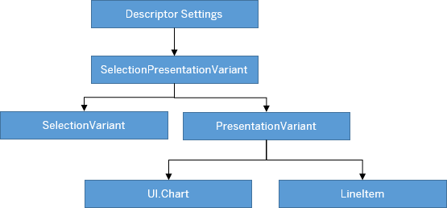

<!-- loio49a6ba5b8d6946208322a9f7e16837c2 -->

# Configuring Default Settings \(Visualizations, Sort Order, Filter Values\)

SAP Fiori elements allows you to specify a `UI.SelectionPresentationVariant`.

You use the `UI.SelectionPresentationVariant` to configure the default visualizations and default filter values of the main content area when an application is launched using the *Standard* variant. The `UI.SelectionPresentationVariant` can contain references to the `UI.SelectionVariant` and the `UI.PresentationVariant`. You use the `UI.SelectionVariant` to define default filter values, and the `UI.PresentationVariant` can contain the configurations for tables and charts, including, for example, the sort order.

SAP Fiori elements uses the `UI.LineItem` annotation and the `UI.Chart` annotation to bring up tables and charts.





### Descriptor Settings

**Configuration Sample**

> ### Sample Code:  
> ```
> "targets": {
>     "SalesOrderManageList": {
>         "type": "Component",
>         "id": "SalesOrderManageList",
>         "name": "sap.fe.templates.ListReport",
>         "options": {
>             "settings": {
>                 "entitySet": "SalesOrderManage",
>                 "variantManagement": "Page",
>                 "defaultTemplateAnnotationPath": "com.sap.vocabularies.UI.v1.SelectionPresentationVariant#SPVPath", // This is where app developer provides fe the right SPV to be used
>                 "initialLoad": true,
>                  .....
>                  .....
>             }
>         }
>     }
> }
> ```


### Annotation: SelectionPresentationVariant with Qualifier="DefaultVariant"

**Configuration Sample:**

> ### Sample Code:  
> XML Annotation
> 
> ```xml
> <Annotation Term="UI.SelectionPresentationVariant" Qualifier="DefaultVariant">
>   <Record>
>     <PropertyValue Property="Text" String="Product Financial Analysis"/>
>     <PropertyValue Property="SelectionVariant" Path="@UI.SelectionVariant#DefaultSelectionVariant"/>
>     <PropertyValue Property="PresentationVariant" Path="@UI.PresentationVariant#DefaultPresentationVariant"/>
>   </Record>
> </Annotation>
> ```

> ### Sample Code:  
> ABAP CDS Annotation
> 
> ```
> @UI.SelectionPresentationVariant: [
>   {
>     text: 'Product Financial Analysis',
>     selectionvariantqualifier: 'DefaultSelectionVariant',
>     presentationvariantqualifier: 'DefaultPresentationVariant',
>     qualifier: 'DefaultVariant'
>   }
> ]
> annotate view VIEWNAME with {
> 
> }
> ```

> ### Sample Code:  
> CAP CDS Annotation
> 
> ```
> UI.SelectionPresentationVariant #DefaultVariant : {
>     Text : 'Product Financial Analysis',
>     SelectionVariant : ![@UI.SelectionVariant#DefaultSelectionVariant],
>     PresentationVariant : ![@UI.PresentationVariant#DefaultPresentationVariant]
> }
> ```


### Annotation: SelectionVariant

> ### Sample Code:  
> XML Annotation
> 
> ```xml
> <PropertyValue Property="SelectionVariant" Qualifier="DefaultSelectionVariant”>
>     <Record Type="UI.SelectionVariantType">
>         <PropertyValue Property="Text" String="Open"></PropertyValue>
>         <PropertyValue Property="SelectOptions">
>             <Collection>
>                 <Record Type="UI.SelectOptionType">
>                     <PropertyValue Property="PropertyName" PropertyPath="OverallSDProcessStatus" />
>                     <PropertyValue Property="Ranges">
>                         <Collection>
>                             <Record Type="UI.SelectionRangeType">
>                                 <PropertyValue Property="Option" EnumMember="UI.SelectionRangeOptionType/EQ" />
>                                 <PropertyValue Property="Low" String="A" />
>                             </Record>
>                         </Collection>
>                     </PropertyValue>
>                 </Record>
>             </Collection>
>         </PropertyValue>
>     </Record>
> </PropertyValue>
> 
> ```

> ### Sample Code:  
> ABAP CDS Annotation
> 
> No ABAP CDS annotation sample is available. Please use the local XML annotation.

> ### Sample Code:  
> CAP CDS Annotation
> 
> ```
> SelectionVariant #DefaultSelectionVariant : {
> Text: 'Open',
> SelectOptions: [
>     { $Type : 'UI.SelectOptionType',
>       PropertyName : OverallSDProcessStatus,
>       Ranges: [
>       {
>         $Type: 'UI.SelectionRangeType',
>         Option: #EQ,
>         Low: 'A'
>       }
>     ]
>    }
> ]
> }
> 
> ```


### Annotation: PresentationVariant

> ### Sample Code:  
> XML Annotation for SAP Fiori elements for OData V2
> 
> ```xml
> "component": {
>      "name": "sap.suite.ui.generic.template.ListReport",
>      "list": true,
>      "settings": {
>           "annotationPath": "com.sap.vocabularies.UI.v1.SelectionPresentationVariant#DefaultSPV" // This can also point to PresentationVariant/SelectionVariant instead of SelectionPresentationVariant
>      }
> }
> 
> ```

> ### Sample Code:  
> XML Annotation for SAP Fiori elements for OData V4
> 
> ```xml
> <Annotation Term="UI.PresentationVariant" Qualifier="DefaultPresentationVariant">
>   <Record>
>     <PropertyValue Property="Text" String="Default"/>
>     <PropertyValue Property="SortOrder">
>       <Collection>
>         <Record Type="Common.SortOrderType">
>           <PropertyValue Property="Property" PropertyPath="NetAmount"/>
>           <PropertyValue Property="Descending" Bool="true"/>
>         </Record>
>       </Collection>
>     </PropertyValue>
>     <PropertyValue Property="Visualizations">
>       <Collection>
>          <AnnotationPath>@UI.LineItem#Default</AnnotationPath>
>       </Collection>
>    </PropertyValue>
>   </Record>
> </Annotation>
> ```

> ### Sample Code:  
> ABAP CDS Annotation
> 
> ```
> @UI.PresentationVariant: [
>   {
>     text: 'Default',
>     sortOrder: [
>       {
>         by: 'NETAMOUNT',
>         direction: #DESC
>       }
>     ],
>     visualizations: [
>       {
>         type: #AS_LINEITEM,
>         qualifier: 'Default'
>       }
>     ],
>     qualifier: 'DefaultPresentationVariant'
>   }
> ]
> annotate view VIEWNAME with {
> 
> }
> 
> ```

> ### Sample Code:  
> CAP CDS Annotation
> 
> ```
> UI.PresentationVariant #DefaultPresentationVariant : {
>     Text : 'Default',
>     SortOrder : [
>         {
>             $Type : 'Common.SortOrderType',
>             Property : NetAmount,
>             Descending : true
>         }
>     ],
>     Visualizations : [
>         '@UI.LineItem#Default'
>     ]
> }
> 
> ```


### Annotation: UI.Chart

> ### Sample Code:  
> XML Annotation
> 
> ```xml
> <Annotations Target="STTA_PROD_MAN.STTA_C_MP_ProductSalesDataType">
>    <Annotation Term="UI.Chart">
>       <Record>
>          <PropertyValue Property="Title" String="Test Chart"/>
>          <PropertyValue Property="ChartType" EnumMember="UI.ChartType/Column"/>
>          <PropertyValue Property="Dimensions">
>             <Collection>
>                <PropertyPath>DeliveryMonth</PropertyPath>
>             </Collection>
>          </PropertyValue> 
>          <PropertyValue Property="Measures">
>             <Collection>
>                <PropertyPath>Revenue</PropertyPath>
>             </Collection>
>          </PropertyValue>
>       </Record>
>    </Annotation>
> </Annotations>
> ```

> ### Sample Code:  
> ABAP CDS Annotation
> 
> ```
> @UI.Chart: [
>   {
>     title: 'Test Chart',
>     chartType: #COLUMN,
>     dimensions: [
>       'DELIVERYMONTH'
>     ],
>     measures: [
>       'REVENUE'
>     ]
>   }
> ]
> annotate view STTA_C_MP_PRODUCTSALESDATA with {
> 
> }
> ```

> ### Sample Code:  
> CAP CDS Annotation
> 
> ```
> annotate STTA_PROD_MAN.STTA_C_MP_ProductSalesDataType @(
>   UI.Chart : {
>     Title : 'Test Chart',
>     ChartType : #Column,
>     Dimensions : [
>         DeliveryMonth
>     ],
>     Measures : [
>         Revenue
>     ]
>   }
> );
> ```


### Annotation: LineItem

> ### Sample Code:  
> XML Annotation
> 
> ```xml
> <Annotation Term="UI.LineItem" Qualifier="Default">
>   <Collection>
>     <Record Type="UI.DataField">
>       <PropertyValue Property="Value" Path="DeliveryCalendarYear"/>
>         <Annotation Term="UI.Importance" EnumMember="UI.ImportanceType/High"/>
>     </Record>
>     <Record Type="UI.DataField">
>       <PropertyValue Property="Value" Path="DeliveryCalendarMonth"/>
>         <Annotation Term="UI.Importance" EnumMember="UI.ImportanceType/High"/>
>     </Record>
>     <Record Type="UI.DataField">
>       <PropertyValue Property="Value" Path="SalesOrder"/>
>         <Annotation Term="UI.Importance" EnumMember="UI.ImportanceType/High"/>
>     </Record>
>     <Record Type="UI.DataFieldForIntentBasedNavigation">
>       <PropertyValue Property="Label" String="Manage Sales Order"/>
>       <PropertyValue Property="SemanticObject" String="EPMSalesOrder"/>
>       <PropertyValue Property="Action" String="manage_st"/>
>       <PropertyValue Property="RequiresContext" Bool="false"/>
>         <Annotation Term="UI.Importance" EnumMember="UI.ImportanceType/High"/>
>     </Record>
>     <Record Type="UI.DataFieldWithIntentBasedNavigation">
>       <PropertyValue Property="SemanticObject" String="EPMSalesOrder"/>
>       <PropertyValue Property="Action" String="manage_st"/>
>       <PropertyValue Property="Value" Path="SalesOrder"/>
>       <Annotation Term="UI.Importance" EnumMember="UI.ImportanceType/High"/>
>     </Record>
>     <Record Type="UI.DataField">
>       <PropertyValue Property="Label" String="Item"/>
>       <PropertyValue Property="Value" Path="SalesOrderItem"/>
>       <Annotation Term="UI.Importance" EnumMember="UI.ImportanceType/High"/>
>     </Record>
>     <Record Type="UI.DataField">
>       <PropertyValue Property="Value" Path="Product"/>
>       <Annotation Term="UI.Importance" EnumMember="UI.ImportanceType/High"/>
>     </Record>
>     <Record Type="UI.DataFieldWithIntentBasedNavigation">
>       <PropertyValue Property="SemanticObject" String="EPMProduct"/>
>       <PropertyValue Property="Action" String="manage_st"/>
>       <PropertyValue Property="Value" Path="Product"/>
>       <Annotation Term="UI.Importance" EnumMember="UI.ImportanceType/High"/>
>     </Record>
>     <Record Type="UI.DataField">
>       <PropertyValue Property="Value" Path="ProductName"/>
>       <Annotation Term="UI.Importance" EnumMember="UI.ImportanceType/High"/>
>     </Record>
>     <Record Type="UI.DataField">
>       <PropertyValue Property="Value" Path="MainProductCategory"/>
>       <Annotation Term="UI.Importance" EnumMember="UI.ImportanceType/High"/>
>     </Record>
>     <Record Type="UI.DataField">
>       <PropertyValue Property="Label" String="Customer"/>
>       <PropertyValue Property="Value" Path="SoldToPartyCompanyName"/>
>       <Annotation Term="UI.Importance" EnumMember="UI.ImportanceType/High"/>
>     </Record>
>     <Record Type="UI.DataField">
>       <PropertyValue Property="Value" Path="Quantity"/>
>       <Annotation Term="UI.Importance" EnumMember="UI.ImportanceType/High"/>
>     </Record>
>     <Record Type="UI.DataField">
>       <PropertyValue Property="Value" Path="NetAmount"/>
>       <Annotation Term="UI.Importance" EnumMember="UI.ImportanceType/High"/>
>     </Record>
> </Collection>
> </Annotation>
> ```

> ### Sample Code:  
> ABAP CDS Annotation
> 
> ```
> @Consumption.semanticObject: 'EPMSalesOrder'
> annotate view VIEWNAME with {
> 
> @UI.lineItem: [
>   {
>     importance: #HIGH,
>     position: 10 ,
>     qualifier: 'Default'
>   }
> ]
> DELIVERYCALENDARYEAR;
> 
> @UI.lineItem: [
>   {
>     importance: #HIGH,
>     position: 20 ,
>     qualifier: 'Default'
>   }
> ]
> DELIVERYCALENDARMONTH;
> 
> @UI.lineItem: [
>   {
>     importance: #HIGH,
>     position: 30 ,
>     qualifier: 'Default'
>   },
>   {
>     importance: #HIGH,
>     semanticObjectAction: 'manage_st',
>     type: #WITH_INTENT_BASED_NAVIGATION,
>     position: 50 ,
>     qualifier: 'Default'
>   },
>   {
>     importance: #HIGH,
>     label: 'Manage Sales Order',
>     semanticObjectAction: 'manage_st',
>     type: #FOR_INTENT_BASED_NAVIGATION,
>     position: 40 ,
>     qualifier: 'Default'
>   }
> ]
> SALESORDER;
> 
> @UI.lineItem: [
>   {
>     importance: #HIGH,
>     label: 'Item',
>     position: 60 ,
>     qualifier: 'Default'
>   }
> ]
> SALESORDERITEM;
> 
> @UI.lineItem: [
>   {
>     importance: #HIGH,
>     position: 70 ,
>     qualifier: 'Default'
>   },
>   {
>     importance: #HIGH,
>     semanticObjectAction: 'manage_st',
>     type: #WITH_INTENT_BASED_NAVIGATION,
>     position: 80 ,
>     qualifier: 'Default'
>   }
> ]
> PRODUCT;
> 
> @UI.lineItem: [
>   {
>     importance: #HIGH,
>     position: 90 ,
>     qualifier: 'Default'
>   }
> ]
> PRODUCTNAME;
> 
> @UI.lineItem: [
>   {
>     importance: #HIGH,
>     position: 100 ,
>     qualifier: 'Default'
>   }
> ]
> MAINPRODUCTCATEGORY;
> 
> @UI.lineItem: [
>   {
>     importance: #HIGH,
>     label: 'Customer',
>     position: 110 ,
>     qualifier: 'Default'
>   }
> ]
> SOLDTOPARTYCOMPANYNAME;
> 
> @UI.lineItem: [
>   {
>     importance: #HIGH,
>     position: 120 ,
>     qualifier: 'Default'
>   }
> ]
> QUANTITY;
> 
> @UI.lineItem: [
>   {
>     importance: #HIGH,
>     position: 130 ,
>     qualifier: 'Default'
>   }
> ]
> NETAMOUNT;
> 
> @Consumption.semanticObject: 'EPMSalesOrder'
> SALESORDER;
> 
> @Consumption.semanticObject: 'EPMProduct'
> PRODUCT;
> 
> }
> 
> ```

> ### Sample Code:  
> CAP CDS Annotation
> 
> ```
> UI.LineItem #Default : [
>     {
>         $Type : 'UI.DataField',
>         Value : DeliveryCalendarYear,
>         ![@UI.Importance] : #High
>     },
>     {
>         $Type : 'UI.DataField',
>         Value : DeliveryCalendarMonth,
>         ![@UI.Importance] : #High
>     },
>     {
>         $Type : 'UI.DataField',
>         Value : SalesOrder,
>         ![@UI.Importance] : #High
>     },
>     {
>         $Type : 'UI.DataFieldForIntentBasedNavigation',
>         Label : 'Manage Sales Order',
>         SemanticObject : 'EPMSalesOrder',
>         Action : 'manage_st',
>         RequiresContext : false,
>         ![@UI.Importance] : #High
>     },
>     {
>         $Type : 'UI.DataFieldWithIntentBasedNavigation',
>         SemanticObject : 'EPMSalesOrder',
>         Action : 'manage_st',
>         Value : SalesOrder,
>         ![@UI.Importance] : #High
>     },
>     {
>         $Type : 'UI.DataField',
>         Label : 'Item',
>         Value : SalesOrderItem,
>         ![@UI.Importance] : #High
>     },
>     {
>         $Type : 'UI.DataField',
>         Value : Product,
>         ![@UI.Importance] : #High
>     },
>     {
>         $Type : 'UI.DataFieldWithIntentBasedNavigation',
>         SemanticObject : 'EPMProduct',
>         Action : 'manage_st',
>         Value : Product,
>         ![@UI.Importance] : #High
>     },
>     {
>         $Type : 'UI.DataField',
>         Value : ProductName,
>         ![@UI.Importance] : #High
>     },
>     {
>         $Type : 'UI.DataField',
>         Value : MainProductCategory,
>         ![@UI.Importance] : #High
>     },
>     {
>         $Type : 'UI.DataField',
>         Label : 'Customer',
>         Value : SoldToPartyCompanyName,
>         ![@UI.Importance] : #High
>     },
>     {
>         $Type : 'UI.DataField',
>         Value : Quantity,
>         ![@UI.Importance] : #High
>     },
>     {
>         $Type : 'UI.DataField',
>         Value : NetAmount,
>         ![@UI.Importance] : #High
>     }
> ]
> 
> ```

-   In SAP Fiori elements for OData V2, for the list report, the `UI.Chart` annotation is applicable when you use it within a multiple view scenario.


-   For the analytical list page, the `UI.Chart` is only supported for the chart in the main content area. You can't use it within a multiple view scenario.


For more information about the usage within a multiple view scenario, see [Defining Multiple Views on a List Report Table - Multiple Table Mode](defining-multiple-views-on-a-list-report-table-multiple-table-mode-37aeed7.md) and [Defining Multiple Views on a List Report with Different Entity Sets and Table Settings](defining-multiple-views-on-a-list-report-with-different-entity-sets-and-table-settings-b6b59e4.md).


<a name="loio49a6ba5b8d6946208322a9f7e16837c2__section_mzt_mcw_sqb"/>

## Configuring the Default Visualization

> ### Restriction:  
> -   In SAP Fiori elements for OData V2, the information provided in the section isn't applicable to the object page.
> 
> -   In SAP Fiori elements for OData V4, the information provided in the section isn't applicable to the object page, analytical list page \(ALP\), and charts in the list report.

To configure the default visualization, the `UI.SelectionPresentationVariant` must be defined against the main entity set.

Application developers can provide the path to the `UI.SelectionPresentationVariant` via the manifest.

SAP Fiori elements then checks in the annotation for the `UI.SelectionPresentationVariant` specified in the manifest, such as `SPVPath`. This can lead to the following situations:

-   If a `UI.SelectionPresentationVariant` is found, SAP Fiori elements looks for the presentation variant associated with it.

    -   If a presentation variant is found, SAP Fiori elements uses the `LineItem`, or, in case of an analytical list page, the `Chart` that is associated with the presentation variant. If the presentation variant does not have a `LineItem` or `Chart` associated with it, SAP Fiori elements looks for the default `LineItem` or `Chart` \(`UI.LineItem` or `UI.Chart` without a qualifier\) and renders the table accordingly. If no `LineItem` or `Chart` is found, SAP Fiori elements renders a blank table or a blank chart, and users can still use the personalization of the control to render the required table or chart.

    -   If a presentation variant is **not** found, SAP Fiori elements raises an error and stops loading the application so that the application developer can ensure the correct annotations.


-   If a `UI.SelectionPresentationVariant` is **not** found, SAP Fiori elements raises an error and stops loading the application so that the application developer can ensure the correct annotations.


If the application developer hasn't explicitly specified the `UI.SelectionPresentationVariant` to be used via the manifest entry, SAP Fiori elements looks for the default \(unqualified\) `UI.SelectionPresentationVariant` in the annotation. This can lead to the following situations:

-   If a default `UI.SelectionPresentationVariant` is found, SAP Fiori elements uses the associated presentation variant to determine the default visualization for the table or chart. If no presentation variant is found, SAP Fiori elements raises an error and stops loading the application so that the application developer can ensure the correct annotations.

-   If a default `UI.SelectionPresentationVariant` is **not** found, SAP Fiori elements checks for the default presentation variant \(unqualified presentation variant\) and default selection variant \(unqualified selection variant\).

    -   If a default presentation variant is found, SAP Fiori elements uses the associated `LineItem` or `Chart` annotation. If no `LineItem` or `Chart` is found, SAP Fiori elements renders a blank table, and users can still use the personalization of the control to render the required table.

    -   If a default presentation variant is **not** found, SAP Fiori elements looks for the default `LineItem` \(unqualified `LineItem`\) or default `Chart` \(unqualified `Chart`\) annotation.

        -   If a default `LineItem` or `Chart` annotation is found, SAP Fiori elements renders the table or chart accordingly.

        -   If a default `LineItem` or `Chart` annotation is **not** found, SAP Fiori elements renders a blank table or chart, and users can still use the personalization of the control to render the required table or chart.


> ### Note:  
> In the multiple view layout for tables, the `UI.SelectionPresentationVariant` in the manifest has no effect if it has already been configured for the multiple view scenario. If no `UI.SelectionPresentationVariant` is configured, that is, if only a selection variant is configured, as is the case for the single table mode, or also for a tab within the multiple view layout for tables, then the presentation variant is calculated based on the logic described.
> 
> For more information, see [Multiple Views on List Report Tables](multiple-views-on-list-report-tables-a37df40.md).


### Specifying the `SelectionVariant`/`PresentationVariant` Inline

Application developers can also specify the `SelectionVariant` or `PresentationVariant` inline within the `SelectionPresentationVariant`. The sample below is configured with an inline `SelectionVariant`. The `UI.SelectionPresentationVariant` can be provided with or without the qualifier:

> ### Sample Code:  
> XML Annotation
> 
> ```
> <Annotation Term="UI.SelectionPresentationVariant" Qualifier="OpenSPVWithPVPath">
>    <Record>
>     <PropertyValue Property="Text" String="Open">
>     </PropertyValue>
>     <PropertyValue Property="SelectionVariant">
>         <Record Type="UI.SelectionVariantType">
>             <PropertyValue Property="Text" String="Open">
>             </PropertyValue>
>             <PropertyValue Property="SelectOptions">
>                 <Collection>
>                     <Record Type="UI.SelectOptionType">
>                         <PropertyValue Property="PropertyName" PropertyPath="OverallSDProcessStatus" />
>                         <PropertyValue Property="Ranges">
>                             <Collection>
>                                <Record Type="UI.SelectionRangeType">
>                                    <PropertyValue Property="Option" EnumMember="UI.SelectionRangeOptionType/EQ" />
>                                    <PropertyValue Property="Low" String="A" />
>                                 </Record>
>                             </Collection>
>                         </PropertyValue>
>                      </Record>
>                 </Collection>
>             </PropertyValue>
>         </Record>
>      </PropertyValue>
>      <PropertyValue Property="PresentationVariant" Path="@UI.PresentationVariant" />
>    </Record>
> </Annotation>
> 
> <Annotation Term="UI.PresentationVariant">
>     <Record>
>         <PropertyValue Property="MaxItems" Int="2" />
>         <PropertyValue Property="SortOrder">
>             <Collection>
>                 <Record Type="Common.SortOrderType">
>                   <PropertyValue Property="Property" PropertyPath="ID" />
>                 </Record>
>             </Collection>
>         </PropertyValue>
>         <PropertyValue Property="Visualizations">
>             <Collection>
>                 <AnnotationPath>@UI.LineItem</AnnotationPath>
>             </Collection>
>         </PropertyValue>
>     </Record>
> </Annotation>
> 
> ```

> ### Sample Code:  
> ABAP CDS Annotation
> 
> No ABAP CDS annotation sample is available. Please use the local XML annotation.

> ### Sample Code:  
> CAP CDS Annotation
> 
> ```
> UI.SelectionPresentationVariant #OpenSPVWithPVPath           : {
>         Text                : 'Open',
>         SelectionVariant    : {
>             Text          : 'Open',
>             SelectOptions : [{
>                 PropertyName : OverallSDProcessStatus,
>                 Ranges       : [{
>                     Option : #EQ,
>                     Low    : 'A'
>                 }]
>             }]
>         },
>         PresentationVariant : ![@UI.PresentationVariant]
>     },
> 
> UI.PresentationVariant                             : {
>         MaxItems       : 2,
>         SortOrder      : [{Property : ID}],
>         Visualizations : ['@UI.LineItem']
>     }
> 
> ```

For more information about the `UI.SelectionPresentationVariant`, see the version-specific sections in this topic.


<a name="loio49a6ba5b8d6946208322a9f7e16837c2__section_jvb_hvt_hvb"/>

## Configuring the Default Sort Order

You can define whether the default sort order for tables and charts is ascending or descending by using the `com.sap.vocabularies.UI.v1.PresentationVariant` annotation term and the `SortOrder` property.

> ### Sample Code:  
> XML Annotation
> 
> ```
> <Annotations xmlns="http://docs.oasis-open.org/odata/ns/edm" Target="ZFAR_CUSTOMER_LINE_ITEMS2_SRV.Item">
>     <Annotation Term="com.sap.vocabularies.UI.v1.PresentationVariant">
>         <Record>
>             <PropertyValue Property="Visualizations">
>                 <Collection>
>                     <AnnotationPath>@UI.LineItem</AnnotationPath>
>                 </Collection>
>             </PropertyValue>
>             <PropertyValue Property="SortOrder">
>                 <Collection>
>                     <Record>
>                         <PropertyValue Property="Property" PropertyPath="CompanyCode"/>
>                         <PropertyValue Property="Descending" Bool="true"/>
>                     </Record>
>                     <Record>
>                         <PropertyValue Property="Property" PropertyPath="Customer"/>
>                     </Record>
>                 </Collection>
>             </PropertyValue>
>         </Record>
>     </Annotation>
> </Annotations>
> ```

> ### Sample Code:  
> ABAP CDS Annotation
> 
> ```
> @UI.PresentationVariant: [
>   {
>     requestAtLeast: [
>       'CUSTOMER',
>       'COMPANYCODE'
>     ],
>     sortOrder: [
>       {
>         by: 'COMPANYCODE',
>         direction: #DESC
>       },
>       {
>         by: 'CUSTOMER'
>       }
>     ],
>     visualizations: [{type: #AS_LINEITEM }]
>   }
> ]
> annotate view ITEM with {
> 
> }
> 
> ```

> ### Sample Code:  
> CAP CDS Annotation
> 
> ```
> annotate ZFAR_CUSTOMER_LINE_ITEMS2_SRV.Item @(
>   com.sap.vocabularies.UI.v1.PresentationVariant : {
>     Visualizations : [
>         '@UI.LineItem'
>     ],
>     RequestAtLeast : [
>         Customer,
>         CompanyCode
>     ],
>     SortOrder : [
>         {
>             Property : CompanyCode,
>             Descending : true
>         },
>         {
>             Property : Customer
>         }
>     ]
>   }
> );
> ```


<a name="loio49a6ba5b8d6946208322a9f7e16837c2__section_gfr_mvc_jsb"/>

## Configuring Default Filter Values

For more information, see [Configuring Default Filter Values](configuring-default-filter-values-f27ad7b.md).


<a name="loio49a6ba5b8d6946208322a9f7e16837c2__section_nyl_ts1_bqb"/>

## Additional Features in SAP Fiori Elements for OData V2

Make the following setting in the `manifest.json` to specify the `SelectionPresentationVariant`, the `PresentationVariant` or, the `SelectionVariant`:

> ### Sample Code:  
> ```
> "component": {
>      "name": "sap.suite.ui.generic.template.ListReport",
>      "list": true,
>      "settings": {
>           "annotationPath": "com.sap.vocabularies.UI.v1.SelectionPresentationVariant#DefaultSPV" // This can also point to PresentationVariant/SelectionVariant instead of SelectionPresentationVariant
>      }
> }
> 
> ```


### Using the `annotationPath` Pointing to the `PresentationVariant` or `SelectionVariant`

The following behavior applies:

-   If the `"annotationPath"` has a reference to the `"PresentationVariant"`, the `SelectionVariant` has no default filter values. The specified `PresentationVariant` is handled in the same way as when the `SelectionPresentationVariant` is specified.

-   If the `"annotationPath"` has a reference to the `"SelectionVariant"`, only the default filter values are applied. The visualization is defined in the default `PresentationVariant` \(unqualified\). The fallback option is defined in the `UI.LineItem` and `UI.Chart` annotations. This is described in the handling of the `UI.SelectionPresentationVariant`.


<a name="loio49a6ba5b8d6946208322a9f7e16837c2__section_nyc_3qd_jsb"/>

## Additional Features in SAP Fiori Elements for OData V4

Make the following settings in the `manifest.json` to specify the `SelectionPresentationVariant`:

> ### Sample Code:  
> ```
> "targets": {
>     "SalesOrderManageList": {
>         "type": "Component",
>         "id": "SalesOrderManageList",
>         "name": "sap.fe.templates.ListReport",
>         "options": {
>             "settings": {
>                 "entitySet": "SalesOrderManage",
>                 "defaultTemplateAnnotationPath": "com.sap.vocabularies.UI.v1.SelectionPresentationVariant#SPVPath", 
>                  .....
>                  .....
>             }
>         }
>     }
> }
> 
> ```

> ### Note:  
> In this case, the `"defaultTemplateAnnotationPath"` must be a reference to the `SelectionPresentationVariant` and **not** to the `PresentationVariant` or `SelectionVariant`.

**Related Information**  


[Configuring Tables](configuring-tables-f4eb70f.md "You can use the annotations and entries in the manifest.json to control various aspects of tables.")

[Configuring Charts](configuring-charts-653ed0f.md "You can add a chart facet to a content section within the list report and object page.")

[Loading Behavior Based on the Chosen Variant](loading-behavior-based-on-the-chosen-variant-9f4e119.md "Several factors affect the loading behavior of the content area based on the chosen variant.")

[Initial Expansion Level for Tables in List Reports & Analytical List Pages](initial-expansion-level-for-tables-in-list-reports-analytical-list-pages-bc05d35.md "You can set the number of expanded levels for tables in List Reports and Analytical List Pages using the initialExpansionLevel property of the PresentationVariant annotation.")

