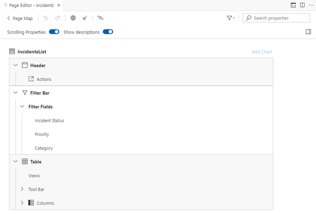
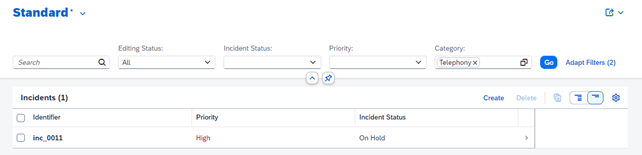

<!-- loio4bd7590569c74c61a0124c6e370030f6 -->

<link rel="stylesheet" type="text/css" href="../css/sap-icons.css"/>

# Configuring Filter Bars

You can configure filter bars in list report applications and in the analytical list page.

Only the fields that are part of `UI.SelectionFields`, together with all mandatory filter fields, are shown by default, in the filter bar.

The filter bar is only available if the service configured for the application supports filtering using the following annotations:

SAP Fiori elements for OData V2: `sap-filterable=true`

SAP Fiori elements for OData V4: `Capabilities.Filterable=true`


<a name="loio4bd7590569c74c61a0124c6e370030f6__section_rym_zkz_jqb"/>

## Annotation for `UI.SelectionFields`

> ### Sample Code:  
> XML Annotation
> 
> ```xml
> 
> <Annotation Term="UI.SelectionFields">
>    <Collection>
>      <PropertyPath>SalesOrder</PropertyPath>
>      <PropertyPath>SoldToParty</PropertyPath>
>      <PropertyPath>OverallSDProcessStatus</PropertyPath>
>      <PropertyPath>SalesOrderDate</PropertyPath>
>      <PropertyPath>_Item/Material</PropertyPath>
>    </Collection>
> </Annotation>
> ```

> ### Sample Code:  
> ABAP CDS Annotation
> 
> ```
> 
> 
> @UI.SelectionField: [{ position: 10 }]
> SALESORDER;
> 
> @UI.SelectionField: [{ position: 20 }]
> SOLDTOPARTY;
>  
> @UI.SelectionField: [{ position: 30 }]
> OVERALLSDPROCESSSTATUS;
>  
> @UI.SelectionField: [{ position: 40 }]
> SALESORDERDATE;
> 
> @UI.SelectionField: [{ position: 50, element: '_Item.Material' }]
> _Item;
> ```

> ### Sample Code:  
> CAP CDS Annotation
> 
> ```
> 
> annotate service.SalesOrderManage with @(
>   UI.SelectionFields  : [
>      SalesOrder,
>      SoldToParty,
>      OverallSDProcessStatus,
>      SalesOrderDate,
>      Item.Material
> ]
> );
> ```


<a name="loio4bd7590569c74c61a0124c6e370030f6__section_jl2_54v_wsb"/>

## Additional Features in SAP Fiori Elements for OData V2


### `entitySet` with Input Parameters

If the `entitySet` has any input parameters, then it is shown in the filter bar automatically without the `UI.SelectionFields` annotation.

> ### Sample Code:  
> ```
> 
> <EntityType Name="SalesShareParametersType" sap:semantics="parameters">
>     <Key>          
>         <PropertyRef Name="P_Currency"/>
>         <PropertyRef Name="P_Country"/>
>         <PropertyRef Name="P_Optional"/>
>     </Key>
>     <Property Name="P_Currency" Type="Edm.String" Nullable="false" MaxLength="5" sap:label="Currency" sap:parameter="mandatory"/>
>     <Property Name="P_Country" Type="Edm.String" Nullable="false" DefaultValue="3" MaxLength="20" sap:label="CountryCode" sap:parameter="mandatory"/>
>     <Property Name="P_Optional" Type="Edm.String" Nullable="false" MaxLength="5" sap:label="Optional" sap:parameter="optional"/>
>     <NavigationProperty Name="Results" Relationship="sap.smartbusinessdemo.services.SalesShareParameters_SalesShareType" FromRole="SalesShareParametersPrincipal" ToRole="SalesShareDependent"/>
> </EntityType>
> 
> ```

In this example, `P_Currency` and `P_Country` are mandatory and they must be filled with a valid input value to trigger the filter query. However, `P_Optional` is an optional input parameter. If there is no parameter value defined, by default an empty string value is used.

> ### Note:  
> Current support for optional parameters only includes the `Edm.String` type.


<a name="loio4bd7590569c74c61a0124c6e370030f6__section_dyt_hc2_wpb"/>

## Additional Features in SAP Fiori Elements for OData V4


### Adding Filter Fields Using SAP Fiori Tools

1.  Launch the *Page Map*. You can launch the *Page Map* in several ways, for example by right-clicking the project folder and selecting*Show Page Map*. For more information, see [Define Application Structure](https://help.sap.com/docs/SAP_FIORI_tools/17d50220bcd848aa854c9c182d65b699/bae38e6216754a76896b926a3d6ac3a9.html).

2.  Launch the *Page Editor* for your list report page. Click the :pencil2: \(*Edit*\) icon next to *List Report*.
3.  Expand the *Filter Fields* node in the outline tree. Click the <span class="SAP-icons-V5"></span> \(*Arrow*\) icon next to *Filter Fields*.

    The following screenshot shows the outline of the application with the *Filter Fields* node expanded:

    

4.  Click the :heavy_plus_sign: \(*Add*\) icon next to *Filter Fields*.
5.  Click *Add Filter Fields*.
6.  Select the fields you wish to add from the dropdown.
7.  Click *Add*.

    For more information about configuring filter fields using SAP Fiori tools, see [Filter Fields](https://help.sap.com/docs/SAP_FIORI_tools/17d50220bcd848aa854c9c182d65b699/0b8428645243486680ffa22c0b541039.html).

8.  To preview your new filter field, see [Previewing an Application](https://help.sap.com/docs/SAP_FIORI_tools/17d50220bcd848aa854c9c182d65b699/b962685bdf9246f6bced1d1cc1d9ba1c.html).

The following screenshot shows the filter fields in a previewed application:



> ### Tip:  
> You can reorder your filter fields by using drag and drop in the *Page Editor*.

The following screen recording shows how to add a new filter field:


### Hiding the Filter Bar

You can configure your app to disable the filter bar on a list report by making the corresponding settings in the `manifest.json`.

You can choose to actively disable the filter bar, even if the entity set contains filterable fields. Your app then loads with the following behavior:

-   The content area is always loaded, irrespective of the `initialLoad` setting in the `manifest.json`.

-   The *Search* field is provided in the table toolbar.


You can disable the filter bar by setting `hideFilterBar` to `true` in the `manifest.json` file, as shown in the following sample code:

> ### Sample Code:  
> `manifest.json`
> 
> ```
> {
>      "sap.ui5": {
>           "routing": {
>                "targets": {
>                     "SalesOrderManageList": {
>                          "options": {
>                               "settings": {
>                                    "hideFilterBar": true
>                               }
>                          }
>                     }
>                }
>           }
>      }
> }
> ```

> ### Note:  
> If the filter bar contains mandatory filter fields or parameter fields without a default value, then this setting is ignored and the filter bar is displayed.


### *Go* Button Mode

The *Go* button is always enabled in the filter bar and can't be switched off.


### Configuring Mandatory Filter Fields

Applications can configure the filter fields as mandatory using the `Capabilities.RequiredProperties` annotation. Such properties need a value before the filter fields can be triggered.

> ### Sample Code:  
> XML Annotation
> 
> ```
> <Annotations Target="SAP__self.Container/SalesOrder">
>    <Annotation Term="SAP__capabilities.FilterRestrictions">
>       <Record>
>          <PropertyValue Property="RequiredProperties">
>             <Collection>
>                <PropertyPath>OrderType</PropertyPath>
>             </Collection>
>          </PropertyValue>
>       </Record>
>    </Annotation>
> </Annotations>
> ```

> ### Sample Code:  
> ABAP CDS Annotation
> 
> ```
> @Consumption.filter.mandatory: true
> OrderType;
> ```

> ### Sample Code:  
> CAP CDS Annotation
> 
> ```
> annotate service.SalesOrder with @Capabilities : {
>     FilterRestrictions : {
>         $Type : 'Capabilities.FilterRestrictionsType',
>         RequiredProperties : [
>             OrderType
>         ],
>     },
> };
> ```

> ### Note:  
> Properties annotated with `UI.Hidden` or `UI.HiddenFilter` are not displayed in either the filter bar or the *Adapt Filters* dialog.


### Configuring Fields to Remain Hidden in the Filter Bar and the *Adapt Filters* Dialog

Applications must ensure that a field within the entity to which the filter bar is bound remains hidden in both the filter bar and the *Adapt Filters* dialog. You can use the `Capabilities.NonFilterableProperties` annotation to achieve this behavior.

> ### Sample Code:  
> XML Annotation
> 
> ```
> <Annotations Target="SAP__self.Container/SalesOrder">
>    <Annotation Term="SAP__capabilities.FilterRestrictions">
>       <Record>
>          <PropertyValue Property="NonFilterableProperties">
>             <Collection>
>                <PropertyPath>DeliveryChannel</PropertyPath>
>             </Collection>
>          </PropertyValue>
>       </Record>
>    </Annotation>
> </Annotations>
> ```

> ### Sample Code:  
> ABAP CDS Annotation
> 
> ```
> @ObjectModel.filter.enabled: false
> DeliveryChannel;
> ```

> ### Sample Code:  
> CAP CDS Annotation
> 
> ```
> annotate service.SalesOrder with @Capabilities : {
>     FilterRestrictions : {
>         $Type : 'Capabilities.FilterRestrictionsType',
>         NonFilterableProperties : [
>             DeliveryChannel
>         ],
>     },
> };
> ```


### Supporting Parameterized Entities

To access the data of parameterized services, the parameter fields need to be supplied with parameter values when making the data call. These parameter values are then used to load the data for the view \(including the data in the object page or subobject page\). Furthermore, the invocation of any action that needs context to be passed, is also passed using these parameter values.

For example, the `"CustomerType"` in the following sample code represents the main entity set from which further data needs to be fetched. This has a `"Parameters"` navigation entity set defined as well:

> ### Sample Code:  
> Metadata of parameterized main entity type
> 
> ```
> <EntityType Name="CustomerType">
>     <Key>
>         <PropertyRef Name="Customer"/>
>         <PropertyRef Name="CompanyCode"/>
>         ……
>         ……
>     </Key>
>     <Property Name="Customer" Type="Edm.String" Nullable="false" MaxLength="10"/>
>     <Property Name="CompanyCode" Type="Edm.String" Nullable="false" MaxLength="4"/>
>     <Property Name="SalesOrganization" Type="Edm.String" Nullable="false" MaxLength="4"/>
>     ……
>     ……
>     ……
>     <NavigationProperty Name="Parameters" Type="com.sap.gateway.srvd.zrc_arcustomer_definition.v0001.CustomerParameters" Nullable="false"/>
>     ......
>     ......
> </EntityType>
> ```

Furthermore, the `"CustomerParameters"` entity type is annotated with the `"ResultContext"` annotation, indicating that the parent entity set \(in our example `"CustomerType"`\) is a parameterized entity set:

> ### Sample Code:  
> `"ResultContext"` annotation
> 
> ```
> <Annotations Target="SAP__self.CustomerParameters">
>     <Annotation Term="SAP__common.ResultContext"/>
>     ......
>     ......
> </Annotations>
> ```

In the `"CustomerParameters"` entity type, you can now find the parameters that need to be supplied with values to access the data from the main parameterized entity set:

> ### Sample Code:  
> Parameter entity type
> 
> ```
> <EntityType Name="CustomerParameters">
>     <Key>
>         <PropertyRef Name="P_CompanyCode"/>
>     </Key>
>     <Property Name="P_CompanyCode" Type="Edm.String" Nullable="false" MaxLength="4"/>
>     <NavigationProperty Name="Set" Type="Collection(com.sap.gateway.srvd.zrc_arcustomer_definition.v0001.CustomerType)" Partner="Parameters" ContainsTarget="true"/>
> </EntityType>
> ```

Note that the `"Partner"` term points to `"Parameters"` here, which was also the navigation entity set pointing to this `"CustomerParameter"` in the main entity type.

To access the data residing in the main entity set, that is, the entity set corresponding to the `"CustomerType"` entity type, we need to access it through the entity set corresponding to the navigation entity set, which is marked with the `"ResultContext"` annotation – so in this case through the entity set corresponding to the `"CustomerParameters"` entity type. `"Customer"` is the entity set that corresponds to the `"CustomerParameters"` entity type:

> ### Sample Code:  
> Entity set corresponding to `CustomerParameters`
> 
> ```
> <EntityContainer Name="Container">
>     <EntitySet Name="Customer" EntityType="com.sap.gateway.srvd.zrc_arcustomer_definition.v0001.CustomerParameters">
>         <NavigationPropertyBinding Path="Set/Parameters" Target="Customer"/>
>         .......
>         .......
>     </EntitySet>
>     ......
>     ......
> </EntityContainer>
> ```

Here's an example of how the call to fetch results from the main entity set in the above sample would look: `http://<path>/Customer(P_CompanyCode='0001')/Set?$count=true`

The call has to go through the `"Customer"` entity set by passing the values of all parameters to it. Then we have to call the entity set that holds the results \(in this case the `"Set"` entity set\).


### Specifying Filter Restrictions for the Main Entity Set \(Parameterized Entities Only\)

You can use one of the following two approaches:

-   Filter Restrictions at Main Entity with `PropertyPath` Pointing to the Filter Field of the Main Entity

    The restrictions can be defined at the main entity set with the property path pointing to the filter field or the main entity type \(containment\) \(for example, `SalesOrganization` from a previous example\) via the containment navigation \(`Set` in a previous example\)

    > ### Sample Code:  
    > XML Annotation: Filter restrictions with `PropertyPath` pointing to the filter field of the main entity set
    > 
    > ```xml
    > <Annotations Target="SAP__self.Container/Customer">
    >    <Record Type="SAP__capabilities.FilterRestrictionsType">
    >       <PropertyValue Property="FilterExpressionRestrictions">
    >          <Collection>
    >             <Record Type="Capabilities.FilterExpressionRestrictionType">
    >                <PropertyValue Property="Property" PropertyPath="Set/SalesOrganization" />
    >                <PropertyValue Property="AllowedExpressions" String="MultiValue" />
    >             </Record>
    >          </Collection>
    >       </PropertyValue>
    >    </Record>
    > </Annotations>
    > ```

    > ### Sample Code:  
    > ABAP CDS Annotation
    > 
    > No ABAP CDS annotation sample is available. Please use the local XML annotation.

    > ### Sample Code:  
    > CAP CDS Annotation
    > 
    > ```
    > entity Customer   @(
    >     Capabilities : {
    >         FilterRestrictions:{
    >             $Type: 'Capabilities.FilterRestrictionsType',
    >             FilterExpressionRestrictions: [{
    >                 Property: 'Set/SalesOrganization',
    >                 AllowedExpressions: 'MultiValue'
    >             }]
    >     }
    > }
    > ```

-   Navigation Restrictions at Main Entity

    The filter restrictions can be defined in the parameterized entity set \(in the previous example, via the ***"Customer"*** entity set\) through navigation restrictions with a path pointing to the target entity type, which is the containment navigation \(in our case ***"Set"***, which points to ***"CustomerType"***\).

    > ### Sample Code:  
    > XML Annotation: Filter Restrictions Using Navigation Restrictions
    > 
    > ```xml
    > <Annotations Target="SAP__self.Container/Customer">
    >    <Annotation Term="SAP__capabilities.NavigationRestrictions">
    >       <Record>
    >          <PropertyValue Property="RestrictedProperties">
    >             <Collection>
    >                <Record>
    >                   <PropertyValue Property="NavigationProperty" NavigationPropertyPath="Set" />
    >                      <PropertyValue Property="FilterRestrictions">
    >                         <Record>
    >                            ....
    >                            ....
    >                            <PropertyValue Property="FilterExpressionRestrictions">
    >                               <Collection>
    >                                  <Record>
    >                                     <PropertyValue Property="Property" PropertyPath="SalesOrganization" />
    >                                     <PropertyValue Property="AllowedExpressions" String="MultiValue" />
    >                                  </Record>
    >                               </Collection>
    >                            </PropertyValue>
    >                         </Record>
    >                      </PropertyValue>
    >                   </PropertyValue>
    >                </Record>
    >             </Collection>
    >          </PropertyValue>
    >       </Record>
    >    </Annotation>
    > </Annotations>
    > ```

    > ### Sample Code:  
    > ABAP CDS Annotation
    > 
    > No ABAP CDS annotation sample is available. Please use the local XML annotation.

    > ### Sample Code:  
    > CAP CDS Annotation
    > 
    > ```
    > service MyService {
    >     @Capabilities.NavigationRestrictions.RestrictedProperties : [{
    >         $Type              : 'Capabilities.NavigationPropertyRestriction',
    >         NavigationProperty : 'Set',
    >         FilterRestrictions : {
    >             $Type                        : 'Capabilities.FilterRestrictionsType',
    >             FilterExpressionRestrictions : [{
    >                 $Type              : 'Capabilities.FilterExpressionRestrictionType',
    >                 Property           : 'Set.SalesOrganization',
    >                 AllowedExpressions : 'MultiValue'
    >             }]
    >         }
    >     }]
    > }
    > ```


> ### Note:  
> If the filter restrictions are provided using `NavigationRestriction`, then this restriction is prioritized over other restrictions applied directly to the main entity.

> ### Restriction:  
> -   Parameter support is currently only available for read-only services. For editable services, parameter support is currently unavailable because of back-end restrictions.
> 
> -   Parameter values aren't passed when an external navigation is triggered.
> 
> -   Parameters aren't supported if multiple view mode is used – unless single-table mode is used, where the data from all views comes from the same table that is part of the main entity set.
> 
> -   None of the navigation entity sets associated with the main entity set can be parameterized.
> 
> -   Sort restrictions aren't supported for first-level navigation entity sets when used within parameterized scenarios \(meaning when a root node is a parameterized entity\).
> 
> -   We don't support filtering on properties defined as measures.


<a name="loio4bd7590569c74c61a0124c6e370030f6__section_dqs_ppb_psb"/>

## More Information

For more information about how to configure filter bars, see [Adapting the Filter Bar](adapting-the-filter-bar-609c39a.md).

For information about the initial loading of data, see [Loading Behavior of Data on Initial Launch of the Application](loading-behavior-of-data-on-initial-launch-of-the-application-9f4e119.md).

