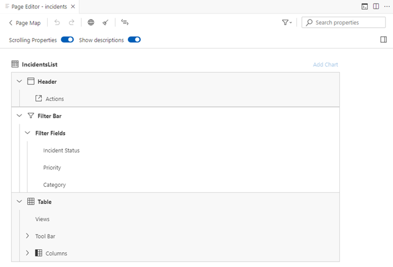
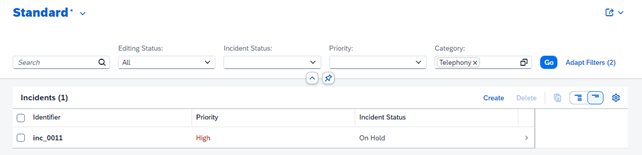

<!-- loio4bd7590569c74c61a0124c6e370030f6 -->

<link rel="stylesheet" type="text/css" href="../css/sap-icons.css"/>

# Configuring Filter Bars

You can configure the filter bar on the list report page and the analytical list page in SAP Fiori elements for OData V4.

By default, only the fields included in `UI.SelectionFields`, along with all mandatory filter fields, are displayed in the filter bar. The *Editing Status* filter is added automatically if you have a draft service.

The filter bar is available only if the service configured for the application supports filtering using `Capabilities.Filterable=true`.

The following sample codes show the annotation for `UI.SelectionFields`:

> ### Sample Code:  
> XML Annotation
> 
> ```xml
> 
> <Annotation Term="UI.SelectionFields">
>     <Collection>
>         <PropertyPath>SalesOrder</PropertyPath>
>         <PropertyPath>SoldToParty</PropertyPath>
>         <PropertyPath>OverallSDProcessStatus</PropertyPath>
>         <PropertyPath>SalesOrderDate</PropertyPath>
>         <PropertyPath>_Item/Material</PropertyPath>
>     </Collection>
> </Annotation>
> ```

> ### Sample Code:  
> ABAP CDS Annotation
> 
> ```
> @UI.SelectionField: [{ position: 10 }]
> SALESORDER;
> 
> @UI.SelectionField: [{ position: 20 }]
> SOLDTOPARTY;
>  
> @UI.SelectionField: [{ position: 30 }]
> OVERALLSDPROCESSSTATUS;
>  
> @UI.SelectionField: [{ position: 40 }]
> SALESORDERDATE;
> 
> @UI.SelectionField: [{ position: 50, element: '_Item.Material' }]
> _Item;
> ```

> ### Sample Code:  
> CAP CDS Annotation
> 
> ```
> 
> annotate service.SalesOrderManage with @(
>     UI.SelectionFields  : [
>         SalesOrder,
>         SoldToParty,
>         OverallSDProcessStatus,
>         SalesOrderDate,
>         Item.Material
>     ]
> );
> ```


<a name="loio4bd7590569c74c61a0124c6e370030f6__section_z2j_m4c_pdc"/>

## Configuring Search Behavior in Filter Bars


### *Go* Button Mode

In Go button mode, the search isn't invoked and the content area does not refresh when a user modifies the filter fields unless they explicitly click *Go*. By default, the *Go* button is displayed on the filter bar. You can modify the default content loading behavior during the initial load of the application by configuring the `manifest.json` file. For more information, see [Loading Behavior of Data on Initial Launch of the Application](loading-behavior-of-data-on-initial-launch-of-the-application-9f4e119.md).


### Live Mode

In live mode, any changes made by a user to the filter fields automatically invokes a search and refreshes the content area. In this mode, if the variant management feature is enabled, the application does not display the *Apply Automatically* checkbox, as selecting a variant automatically invokes the filter search.

This mode is ideal for applications with a small amount of data that have no performance issues from the underlying database layer, such as those requiring complex joins to execute actions.

For more information about enabling the live mode, see the [Enabling Live Mode](configuring-filter-bars-4bd7590.md#loio4bd7590569c74c61a0124c6e370030f6__live_mode_v4) section in this topic.

> ### Caution:  
> Impact on performance
> 
> When live mode is enabled, the content area loads automatically during the initial load of the application, regardless of the initial load settings in the `manifest.json` file. Additionally, the content area refreshes each time a filter field value changes. This behavior can negatively impact the performance, especially when dealing with large datasets or complex database constraints, such as compiling complex join queries whenever there is a change in the filter field values. You must perform thorough testing to ensure acceptable end-to-end performance before enabling live mode.


<a name="loio4bd7590569c74c61a0124c6e370030f6__section_dyt_hc2_wpb"/>

## Adding Filter Fields Using SAP Fiori Tools

1.  Launch the *Page Map*. You can launch the *Page Map* in several ways, for example by right-clicking the project folder and selecting*Show Page Map*. For more information, see [Define Application Structure](https://help.sap.com/docs/SAP_FIORI_tools/17d50220bcd848aa854c9c182d65b699/bae38e6216754a76896b926a3d6ac3a9.html).

2.  Launch the *Page Editor* for your list report page. Click the :pencil2: \(*Edit*\) icon next to *List Report*.
3.  Expand the *Filter Fields* node in the outline tree. Click the <span class="SAP-icons-V5"></span> \(*Arrow*\) icon next to *Filter Fields*.

    The following screenshot shows the outline of the application with the *Filter Fields* node expanded:

    

4.  Click the :heavy_plus_sign: \(*Add*\) icon next to *Filter Fields*.
5.  Click *Add Filter Fields*.
6.  Select the fields you wish to add from the dropdown.
7.  Click *Add*.

    For more information about configuring filter fields using SAP Fiori tools, see [Filter Fields](https://help.sap.com/docs/SAP_FIORI_tools/17d50220bcd848aa854c9c182d65b699/0b8428645243486680ffa22c0b541039.html).

8.  To preview your new filter field, see [Previewing an Application](https://help.sap.com/docs/SAP_FIORI_tools/17d50220bcd848aa854c9c182d65b699/b962685bdf9246f6bced1d1cc1d9ba1c.html).

The following screenshot shows the filter fields in a previewed application:



> ### Tip:  
> You can reorder your filter fields by using drag and drop in the *Page Editor*.

The following screen recording shows how to add a new filter field:


## Hiding the Filter Bar

You can configure your application to hide the filter bar on a list report page by making the corresponding settings in the `manifest.json` file.

You can choose to actively hide the filter bar, even if the entity set contains filterable fields. Your application then loads with the following behavior:

-   The content area is always loaded, irrespective of the `initialLoad` setting in the `manifest.json`.

-   The *Search* field is provided in the table toolbar.


The following sample code shows how to hide the filter bar by setting `hideFilterBar` to `true` in the `manifest.json` file:

> ### Sample Code:  
> `manifest.json`
> 
> ```
> 
> {
>      "sap.ui5": {
>           "routing": {
>                "targets": {
>                     "SalesOrderManageList": {
>                          "options": {
>                               "settings": {
>                                    "hideFilterBar": true
>                               }
>                          }
>                     }
>                }
>           }
>      }
> }
> ```

> ### Note:  
> If the filter bar contains mandatory filter fields or parameter fields without a default value, then this setting is ignored and the filter bar is displayed.


<a name="loio4bd7590569c74c61a0124c6e370030f6__live_mode_v4"/>

## Enabling Live Mode

You can enable live mode by setting the `liveMode` to `true` in the `manifest.json` file, as shown in the following sample code:

> ### Sample Code:  
> `manifest.json`
> 
> ```
> 
> "routing": {
> 	"targets": {
> 	    "MyEntitiesList": {
>             "type": "Component",
>             "name": "sap.fe.templates.ListReport",
>             "id": "MyEntitiesList",
>             "options": {
>                 "settings": {
>                 "liveMode": true,
>                 ...
>                 }
>             }
>         }
>     }
> }
> ```

Enabling live mode may have some impact on performance. For more information, see the Note in the [Live Mode](configuring-filter-bars-4bd7590.md#loio4bd7590569c74c61a0124c6e370030f6__live_mode) subsection of this topic.


## Configuring Mandatory Filter Fields

You can configure the filter fields as mandatory using the `Capabilities.RequiredProperties` annotation. Such properties need a value before the filter fields can be triggered.

> ### Sample Code:  
> XML Annotation
> 
> ```
> <Annotations Target="SAP__self.Container/SalesOrder">
>    <Annotation Term="SAP__capabilities.FilterRestrictions">
>       <Record>
>          <PropertyValue Property="RequiredProperties">
>             <Collection>
>                <PropertyPath>OrderType</PropertyPath>
>             </Collection>
>          </PropertyValue>
>       </Record>
>    </Annotation>
> </Annotations>
> ```

> ### Sample Code:  
> ABAP CDS Annotation
> 
> ```
> @Consumption.filter.mandatory: true
> OrderType;
> ```

> ### Sample Code:  
> CAP CDS Annotation
> 
> ```
> annotate service.SalesOrder with @Capabilities : {
>     FilterRestrictions : {
>         $Type : 'Capabilities.FilterRestrictionsType',
>         RequiredProperties : [
>             OrderType
>         ],
>     },
> };
> ```


## Combining Two Date-Based Filter Fields into a Single Date-Range Filter Field

You can filter on two individual date-based filter fields contained in an entity using a single, date-based range filter field. Filtering using this date-based range field shows all records where the existing dates between the individual date-based fields overlap with the date range defined in the combined date-based range filter field.

For example, you want to define a single date-range filter called *Work Period*. A user can then use the *Work Period* filter to identify those users who have taken at least one leave day during the specified time period.

1.  Assume the following records exist in the table before the user applies any filters:

    **Date-Range Filter Field: Employee Entries**


    <table>
    <tr>
    <th valign="top">

    Employee
    
    </th>
    <th valign="top">

    Vacation Start Date
    
    </th>
    <th valign="top">

    Vacation End Date
    
    </th>
    </tr>
    <tr>
    <td valign="top">
    
    Emp\_1
    
    </td>
    <td valign="top">
    
    2026-06-10
    
    </td>
    <td valign="top">
    
    2026-06-14
    
    </td>
    </tr>
    <tr>
    <td valign="top">
    
    Emp\_2
    
    </td>
    <td valign="top">
    
    2026-06-18
    
    </td>
    <td valign="top">
    
    2026-06-23
    
    </td>
    </tr>
    <tr>
    <td valign="top">
    
    Emp\_3
    
    </td>
    <td valign="top">
    
    2026-07-09
    
    </td>
    <td valign="top">
    
    2026-07-16
    
    </td>
    </tr>
    <tr>
    <td valign="top">
    
    Emp\_4
    
    </td>
    <td valign="top">
    
    2026-06-22
    
    </td>
    <td valign="top">
    
    2026-07-16
    
    </td>
    </tr>
    <tr>
    <td valign="top">
    
    Emp\_5
    
    </td>
    <td valign="top">
    
    2026-07-28
    
    </td>
    <td valign="top">
    
    2026-08-02
    
    </td>
    </tr>
    </table>
    
2.  A user enters *2026-6-16* to *2026-7-24* values in the *Work Period* filter field.

3.  These values are automatically mapped, and the following filter query is applied: \(2026-6-16 <= *Vacation End Date*\) AND \(2026-7-24 \>= *Vacation Start Date*\) AND < Rest of filters from the filter bar\>.

4.  Every table record that fits this filter query is filtered:

5.  **Date-Range Filter Field: Filtered Entries**


<table>
<tr>
<th valign="top">

Employee

</th>
<th valign="top">

Vacation Start Date

</th>
<th valign="top">

Vacation End Date

</th>
<th valign="top">

Filtered?

</th>
</tr>
<tr>
<td valign="top">

Emp\_1

</td>
<td valign="top">

2026-06-10

</td>
<td valign="top">

2026-06-14

</td>
<td valign="top">

No \(None of the vacation days fall within the work period\)

</td>
</tr>
<tr>
<td valign="top">

Emp\_2

</td>
<td valign="top">

2026-06-18

</td>
<td valign="top">

2026-06-23

</td>
<td valign="top">

Yes

</td>
</tr>
<tr>
<td valign="top">

Emp\_3

</td>
<td valign="top">

2026-07-09

</td>
<td valign="top">

2026-07-16

</td>
<td valign="top">

Yes

</td>
</tr>
<tr>
<td valign="top">

Emp\_4

</td>
<td valign="top">

2026-06-22

</td>
<td valign="top">

2026-07-16

</td>
<td valign="top">

Yes

</td>
</tr>
<tr>
<td valign="top">

Emp\_5

</td>
<td valign="top">

2026-07-28

</td>
<td valign="top">

2026-08-02

</td>
<td valign="top">

No \(None of the vacation days fall within the work period\)

</td>
</tr>
</table>


To configure such a date-range filter field, create an interval annotation that creates a “virtual” filter field and defines a mapping of its values to the individual filter fields as shown in the following sample codes:

> ### Sample Code:  
> XML Annotation
> 
> ```
> 
> <Annotations Target="IntervalFiltersService.Bookings">
>     <Annotation Term="Common.Interval">
>         <Record Type="Common.IntervalType">
>             <PropertyValue Property="LowerBoundary" PropertyPath="VacationStartDate"/>
>             <PropertyValue Property="UpperBoundary" PropertyPath="VacationEndDate"/>
>             <PropertyValue Property="Label" String="Work period"/>
>             <PropertyValue Property="LowerBoundaryIncluded" Bool="true"/>
>             <PropertyValue Property="UpperBoundaryIncluded" Bool="true"/>
>         </Record>
>     </Annotation>
> </Annotations>
> ```

> ### Sample Code:  
> ABAP CDS Annotation
> 
> No ABAP CDS annotation sample is available. Please use the local XML annotation.

> ### Sample Code:  
> CAP CDS Annotation
> 
> ```
> 
> annotate IntervalFiltersService.Bookings with @Common.Interval: {
>     $Type                    : 'Common.IntervalType',
>     LowerBoundary            : VacationStartDate,
>     UpperBoundary            : VacationEndDate,
>     Label                    : 'Work Period',
>     LowerBoundaryIncluded    : true,
>     UpperBoundaryIncluded    : true
> };
> ```

> ### Note:  
> Ensure that the individual filter fields, `VacationStartDate` and `VacationEndDate` in the example above, are annotated with `MultiRange` capabilities. For more information, see [Configuring Filter Fields](configuring-filter-fields-f5dcb29.md).

You can also configure a date-range filter fields in the `manifest.json` file. The following sample code shows the configuration when using a custom page:

> ### Sample Code:  
> `manifest.json`
> 
> ```
> 
> "targets": {
>     "sample": {
>         "type": "Component",
>         "id": "Default",
>         "name": "sap.fe.core.fpm",
>         "viewLevel": 1,
>         "options": {
>             "settings": {
>                 "viewName": "sap.fe.core.fpmExplorer.filterBarInterval.FilterBarIntervalManifest",
>                 "contextPath": "/VacationRequestsManifest",
>                 "controlConfiguration": {
>                     "@com.sap.vocabularies.UI.v1.SelectionFields": {
>                         "filterFields": {
>                             "WorkPeriod": {
>                                 "label": "Work Period",
>                                 "availability": "Default",
>                                 "intervalFilterField": {
>                                     "lowerBoundary": "VacationStartDate",
>                                     "upperBoundary": "VacationEndDate",
>                                     "lowerBoundaryIncluded": true,
>                                     "upperBoundaryIncluded": true
>                                 }
>                             }
>                         }
>                     }
>                 }
>             }
>         }
>     }
> }
> ```


## Adding Tooltips to Filter Fields

To add a tooltip to a filter field, use the `@Common.QuickInfo` annotation as shown in the following sample code:

> ### Sample Code:  
> XML Annotation
> 
> ```
> <Annotations Target="SAP__self.Container/SalesOrder/OrderNumber>
>    <Annotation Term="Common.QuickInfo" String="Unique identifier for the sales order"/>
> </Annotations>
> ```

> ### Sample Code:  
> ABAP CDS Annotation
> 
> ```
> @Common.QuickInfo: 'Unique identifier for the sales order'
> OrderNumber;
> ```

> ### Sample Code:  
> CAP CDS Annotation
> 
> ```
> entity SalesOrder {
>    key ID : UUID;
>    OrderNumber : String(20) @Common.QuickInfo: 'Unique identifier for the sales order';
>    ... 
> }
> ```


## Handling of Non-Filterable Properties

Properties that are annotated as non-filterable using `FilterRestrictions` aren't displayed in the filter bar or in the *Adapt Filters* dialog.

> ### Sample Code:  
> XML Annotation
> 
> ```
> 
> <Annotations Target="SAP__self.Container/SalesOrder">
>    <Annotation Term="SAP__capabilities.FilterRestrictions">
>       <Record>
>          <PropertyValue Property="NonFilterableProperties">
>             <Collection>
>                <PropertyPath>DeliveryChannel</PropertyPath>
>             </Collection>
>          </PropertyValue>
>       </Record>
>    </Annotation>
> </Annotations>
> ```

> ### Sample Code:  
> ABAP CDS Annotation
> 
> ```
> @ObjectModel.filter.enabled: false
> DeliveryChannel;
> ```

> ### Sample Code:  
> CAP CDS Annotation
> 
> ```
> 
> annotate service.SalesOrder with @Capabilities : {
>     FilterRestrictions : {
>         $Type : 'Capabilities.FilterRestrictionsType',
>         NonFilterableProperties : [
>             DeliveryChannel
>         ],
>     },
> };
> ```


<a name="loio4bd7590569c74c61a0124c6e370030f6__section_qmm_vjx_1kc"/>

## Hiding of Filterable Properties

You can use `UI.HiddenFilter` to ensure that a filterable property can't be seen or used as a filter by users. Parameters from a parameterized entity can also be annotated in this manner to the same effect.

`UI.HiddenFilter` ensures that the property isn't seen in the filter context, such as in the filter bar and in the *Adapt Filters* dialog, but can still be seen in other UI elements like forms, tables or charts and can participate in a filter query if associated with a value.

The following sample codes show the use of `UI.HiddenFilter`:

> ### Sample Code:  
> XML Annotation
> 
> ```
> 
> <Annotations Target="MyService.Projects/ProjectOrgUnit">
>     <Annotation Term="UI.HiddenFilter" Bool="true"/>
> </Annotations>
> ```

> ### Sample Code:  
> ABAP CDS Annotation
> 
> ```
> 
> @Consumption.filter.hidden: true
> ProjectOrgUnit;
> ```

> ### Sample Code:  
> CAP CDS Annotaiton
> 
> ```
> annotate MyService.Project with {
>     ProjectOrgUnit @(
>         UI.HiddenFilter : true
>     );
> };
> ```


<a name="loio4bd7590569c74c61a0124c6e370030f6__suppprting_parameterized_entities_subsection"/>

## Supporting Parameterized Entities

When linked to a parameterized entity, the filter bar automatically includes fields for all required parameters. To access the data of a parameterized service, the parameter fields need to be supplied with parameter values when making the data call. These parameter values are then used to load the data for the view \(including the data in the object page or subobject page\). Furthermore, the invocation of any action that needs context to be passed, is also passed using these parameter values.

For example, the `CustomerType` in the following sample code represents the main entity set from which further data needs to be fetched. This has a `Parameters` navigation entity set defined as well:

> ### Sample Code:  
> XML Annotation: Metadata of parameterized main entity type
> 
> ```
> 
> <EntityType Name="CustomerType">
>     <Key>
>         <PropertyRef Name="Customer"/>
>         <PropertyRef Name="CompanyCode"/>
>         ...
>     </Key>
>     <Property Name="Customer" Type="Edm.String" Nullable="false" MaxLength="10"/>
>     <Property Name="CompanyCode" Type="Edm.String" Nullable="false" MaxLength="4"/>
>     <Property Name="SalesOrganization" Type="Edm.String" Nullable="false" MaxLength="4"/>
>     ...
>     <NavigationProperty Name="Parameters" Type="com.sap.gateway.srvd.zrc_arcustomer_definition.v0001.CustomerParameters" Nullable="false"/>
>     ...
> </EntityType>
> ```

> ### Sample Code:  
> ABAP CDS Annotation
> 
> ```
> define view entity Z_I_Customer
>   as select from some_source
> 
>   association [1..1] to Z_I_CustomerParameters as _Parameters
>     on $projection.Customer    = _Parameters.Customer
>    and $projection.CompanyCode = _Parameters.CompanyCode
> 
> {
>   //---------------------------------------------------------------
>   // Key fields
>   //---------------------------------------------------------------
>   key Customer          : abap.char(10),
>   key CompanyCode       : abap.char(4),
> 
>   //---------------------------------------------------------------
>   // Other properties
>   //---------------------------------------------------------------
>   SalesOrganization     : abap.char(4),
>   // ... additional fields
> 
>   //---------------------------------------------------------------
>   // Navigation (association exposure)
>   //---------------------------------------------------------------
>   _Parameters
> }
> 
> ```

> ### Sample Code:  
> CAP CDS Annotation
> 
> ```
> entity CustomerType {
>   key Customer          : String(10);
>   key CompanyCode       : String(4);
> 
>   SalesOrganization     : String(4);
>   // ... additional properties
> 
>   Parameters            : Association to one CustomerParameters;
> }
> 
> ```

Furthermore, the `"CustomerParameters"` entity type is annotated with the `"ResultContext"` annotation, indicating that the parent entity set \(in our example `"CustomerType"`\) is a parameterized entity set:

> ### Sample Code:  
> XML Annotation:`"ResultContext"` 
> 
> ```
> <Annotations Target="SAP__self.CustomerParameters">
>     <Annotation Term="SAP__common.ResultContext"/>
>     ...
> </Annotations>
> ```

> ### Sample Code:  
> ABAP annotation
> 
> The ABAP CDS annotation defined for the `CustomerType` parameter entity type automatically generate the correct metadata.

> ### Sample Code:  
> CAP annotation
> 
> The CAP CDS annotation defined for the `CustomerType` parameter entity type automatically generate the correct metadata.

In the `"CustomerParameters"` entity type, you can now find the parameters that need to be supplied with values to access the data from the main parameterized entity set:

> ### Sample Code:  
> XML Annotation: Parameter entity type
> 
> ```
> <EntityType Name="CustomerParameters">
>     <Key>
>         <PropertyRef Name="P_DisplayCurrency"/>
>     </Key>
>     <Property Name="P_DisplayCurrency" Type="Edm.String" Nullable="false" MaxLength="3"/>
>     <NavigationProperty Name="Set" Type="Collection(com.sap.gateway.srvd.zrc_arcustomer_definition.v0001.CustomerType)" Partner="Parameters" ContainsTarget="true"/>
> </EntityType>
> ```

> ### Sample Code:  
> ABAP CDS Annotation
> 
> ```
> define view entity Z_I_CustomerParameters
>   as select from some_source
> 
>   composition [1..*] of Z_I_Customer as _Set
>     on $projection.P_DisplayCurrency = _Set.P_DisplayCurrency
> 
> {
>   key P_DisplayCurrency : abap.char(3),
> 
>   //---------------------------------------------------------------
>   // Composition (containment)
>   //---------------------------------------------------------------
>   _Set
> }
> 
> ```

> ### Sample Code:  
> CAP CDS Annotation
> 
> ```
> @Common.ResultContext #$parameters
> entity CustomerParameters {
>   key P_DisplayCurrency : String(3);
> 
>   Set : Composition of many CustomerType
>           on Set.Parameters = $self;
> }
> 
> ```

Note that the `"Partner"` term points to `"Parameters"` here, which was also the navigation entity set pointing to this `"CustomerParameter"` in the main entity type.

Ensure that you add the `/Set` suffix to the `contextPath` in the `manifest.json` file as shown in the following sample code:

> ### Sample Code:  
> `manifest.json`
> 
> ```
> 
> "targets": {
>     "CustomerList": {
>         "type": "Component",
>         "id": "CustomerList",
>         "name": "sap.fe.templates.ListReport",
>         "options": {
>             "settings": {
>                 "contextPath": "/Customer/Set",
>             }
>         }
>     }
> },
> ```

To access the data residing in the main entity set, that is, the entity set corresponding to the `"CustomerType"` entity type, we need to access it through the entity set corresponding to the navigation entity set, which is marked with the `"ResultContext"` annotation – so in this case through the entity set corresponding to the `"CustomerParameters"` entity type. `"Customer"` is the entity set that corresponds to the `"CustomerParameters"` entity type:

> ### Sample Code:  
> XML Annotation: Entity set corresponding to `CustomerParameters`
> 
> ```
> 
> <EntityContainer Name="Container">
>     <EntitySet Name="Customer" EntityType="com.sap.gateway.srvd.zrc_arcustomer_definition.v0001.CustomerParameters">
>         <NavigationPropertyBinding Path="Set/Parameters" Target="Customer"/>
>         ...
>     </EntitySet>
>     ...
> </EntityContainer>
> ```

> ### Sample Code:  
> ABAP CDS Annotation
> 
> The ABAP CDS annotation defined for the `CustomerParameters` parameter entity type automatically generate the correct metadata.

> ### Sample Code:  
> CAP CDS Annotation
> 
> The CAP CDS annotation defined for the `CustomerParameters` parameter entity type automatically generate the correct metadata.

Here's an example of how the call to fetch results from the main entity set in the above sample would look:

`http://<path>/Customer(P_DisplayCurrency='JPY')/Set?$count=true`

The call has to go through the `"Customer"` entity set by passing the values of all parameters to it. Then we have to call the entity set that holds the results \(in this case the `"Set"` entity set\).

Ensure you have added the `@Common.ResultContext#$parameters` annotation to the parameterized entity:

> ### Sample Code:  
> CAP CDS Annotation
> 
> ```
> 
> @Common.ResultContext #$parameters
>   entity RootElement(P_CurrencyUnit : String not null @(---));
> ```


## Specifying Filter Restrictions for the Main Entity Set \(Parameterized Entities Only\)

You can use one of the following two approaches:

-   Filter Restrictions at Main Entity with `PropertyPath` Pointing to the Filter Field of the Main Entity

    The restrictions can be defined at the main entity set with the property path pointing to the filter field or the main entity type \(containment\) \(for example, `SalesOrganization` from a previous example\) through the containment navigation \(`Set` in a previous example\)

    > ### Sample Code:  
    > XML Annotation: Filter restrictions with `PropertyPath` pointing to the filter field of the main entity set
    > 
    > ```xml
    > 
    > <Annotation Term="SAP__capabilities.FilterRestrictions">
    >     <Record>
    >         <PropertyValue Property="FilterExpressionRestrictions">
    >             <Collection>
    >                 <Record>
    >                     <PropertyValue Property="Property" PropertyPath="Set/SalesOrganization" />
    >                     <PropertyValue Property="AllowedExpressions" String="MultiValue" />
    >                 </Record>
    >             </Collection>
    >         </PropertyValue>
    >     </Record>
    > </Annotation>
    > ```

    > ### Sample Code:  
    > ABAP CDS Annotation
    > 
    > ```
    > @Consumption.filter.multipleSelections: true
    > SalesOrganization
    > ```

    > ### Sample Code:  
    > CAP CDS Annotation
    > 
    > ```
    > 
    > entity Customer   @(
    >     Capabilities : {
    >         FilterRestrictions:{
    >             $Type: 'Capabilities.FilterRestrictionsType',
    >             FilterExpressionRestrictions: [{
    >                 Property: 'Set/SalesOrganization',
    >                 AllowedExpressions: 'MultiValue'
    >             }]
    >     }
    > }
    > ```

-   Navigation Restrictions at Main Entity

    The filter restrictions can be defined in the parameterized entity set \(in the previous example, using the ***"Customer"*** entity set\) through navigation restrictions with a path pointing to the target entity type, which is the containment navigation \(in our case ***"Set"***, which points to ***"CustomerType"***\).

    > ### Sample Code:  
    > XML Annotation: Filter Restrictions Using Navigation Restrictions
    > 
    > ```xml
    > 
    > <Annotations Target="SAP__self.Container/Customer">
    >    <Annotation Term="SAP__capabilities.NavigationRestrictions">
    >       <Record>
    >          <PropertyValue Property="RestrictedProperties">
    >             <Collection>
    >                <Record>
    >                   <PropertyValue Property="NavigationProperty" NavigationPropertyPath="Set" />
    >                      <PropertyValue Property="FilterRestrictions">
    >                         <Record>
    >                            ....
    >                            ....
    >                            <PropertyValue Property="FilterExpressionRestrictions">
    >                               <Collection>
    >                                  <Record>
    >                                     <PropertyValue Property="Property" PropertyPath="SalesOrganization" />
    >                                     <PropertyValue Property="AllowedExpressions" String="MultiValue" />
    >                                  </Record>
    >                               </Collection>
    >                            </PropertyValue>
    >                         </Record>
    >                      </PropertyValue>
    >                   </PropertyValue>
    >                </Record>
    >             </Collection>
    >          </PropertyValue>
    >       </Record>
    >    </Annotation>
    > </Annotations>
    > ```

    > ### Sample Code:  
    > ABAP CDS Annotation
    > 
    > No ABAP CDS annotation sample is available. Please use the local XML annotation.

    > ### Sample Code:  
    > CAP CDS Annotation
    > 
    > ```
    > 
    > service MyService {
    >     @Capabilities.NavigationRestrictions.RestrictedProperties : [{
    >         $Type              : 'Capabilities.NavigationPropertyRestriction',
    >         NavigationProperty : 'Set',
    >         FilterRestrictions : {
    >             $Type                        : 'Capabilities.FilterRestrictionsType',
    >             FilterExpressionRestrictions : [{
    >                 $Type              : 'Capabilities.FilterExpressionRestrictionType',
    >                 Property           : 'Set.SalesOrganization',
    >                 AllowedExpressions : 'MultiValue'
    >             }]
    >         }
    >     }]
    > }
    > ```


> ### Note:  
> If the filter restrictions are provided using `NavigationRestriction`, then this restriction is prioritized over other restrictions applied directly to the main entity.

> ### Restriction:  
> -   Parameter support is only available for read-only services. For editable services, parameter support is unavailable because of back-end restrictions.
> 
> -   None of the navigation entity sets associated with the main entity set can be parameterized.
> 
> -   Sort restrictions aren't supported for first-level navigation entity sets when used within parameterized scenarios \(meaning when a root node is a parameterized entity\).
> 
> -   Filtering on properties defined as measures is not supported.


<a name="loio4bd7590569c74c61a0124c6e370030f6__section_dqs_ppb_psb"/>

## More Information

For more information about how to configure filter bars, see [Adapting the Filter Bar](adapting-the-filter-bar-609c39a.md).

For information about the initial loading of data, see [Loading Behavior of Data on Initial Launch of the Application](loading-behavior-of-data-on-initial-launch-of-the-application-9f4e119.md).

For more information about using extension APIs for custom filter fields, see [Adding Custom Fields to the Filter Bar](adding-custom-fields-to-the-filter-bar-5fb9f57.md).


> ### Note:  
> For information about SAP Fiori elements for OData V2, see [Configuring Filter Bars](configuring-filter-bars-76066e5.md).

