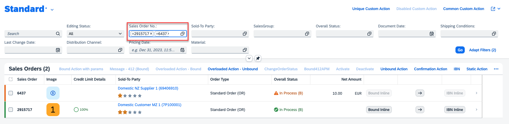

<!-- loio1388d9c39185459fb02ff695c15e63b5 -->

# Configuring Filter Fields

You can configure filter fields to ensure they only accept either a single value, multiple values, or a range of values. You can achieve this by configuring the filter restriction annotation as described in the specific sections.


<a name="loio1388d9c39185459fb02ff695c15e63b5__section_nld_r3y_zxb"/>

## Copying and Pasting Multiple Values in the Filter Bar

End users can copy and paste multiple values in the filter bar in the following use cases:

-   From one filter field to another filter field of the same data type.

-   From one filter field to the value help dialog of another field of the same data type.

-   From a spreadsheet to a filter field of the same data type.


For example, you can copy the values from the *Sales Order No.:* field and paste them either to another filter field or a value help of the same data type. In the value help dialog, paste them into the *equal to* field.



> ### Restriction:  
> -   Copying and pasting a large number of values into the filter fields can cause performance issues.
> 
> -   For apps with custom filters, the application developers must define the copy event and paste event for the custom filters.


<a name="loio1388d9c39185459fb02ff695c15e63b5__section_amq_ynw_xmb"/>

## Filter Restrictions

You can control the filter field configuration using the `sap:filter-restriction` annotation as shown in the following sample code:

> ### Sample Code:  
> `sap:filter-restriction`
> 
> ```
> <Property Name="StartDate" Type="Edm.DateTime" sap:display-format="Date" 
> sap:aggregation-role="dimension" sap:label="Date" sap:filter-restriction="single-value"/>
> 
> <Property Name="StartDate" Type="Edm.String" sap:semantics="yearmonthday" 
> sap:aggregation-role="dimension" sap:label="Date" sap:filter-restriction="single-value"/>
> ```

> ### Remember:  
> If no filter-restriction is provided, the filter field is treated as a multi-valued field.


<a name="loio1388d9c39185459fb02ff695c15e63b5__section_ocr_wbt_zgc"/>

## Support for Visual Filters

In addition to filter bar, you can also configure the visual filter bar to select filter values based on measure values. For more information, see [Configuring the Visual Filter Bar](configuring-the-visual-filter-bar-b44fe77.md).

