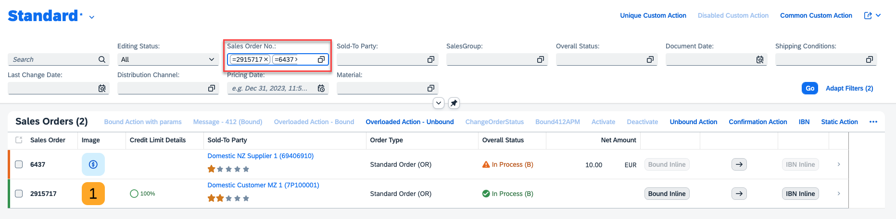

<!-- loiof5dcb29da3bf4e0091eba3e7ccef4580 -->

# Configuring Filter Fields

You can configure filter fields to ensure they only accept either a single value, multiple values, or a range of values. You can achieve this by configuring the filter restriction annotation as described in the specific sections.


<a name="loiof5dcb29da3bf4e0091eba3e7ccef4580__section_nld_r3y_zxb"/>

## Copying and Pasting Multiple Values in the Filter Bar

End users can copy and paste multiple values in the filter bar in the following use cases:

-   From one filter field to another filter field of the same data type.

-   From one filter field to the value help dialog of another field of the same data type.

-   From a spreadsheet to a filter field of the same data type.


For example, you can copy the values from the *Sales Order No.:* field and paste them either to another filter field or a value help of the same data type. In the value help dialog, paste them into the *equal to* field.



> ### Restriction:  
> -   Copying and pasting a large number of values into the filter fields can cause performance issues.
> 
> -   For apps with custom filters, the application developers must define the copy event and paste event for the custom filters.


<a name="loiof5dcb29da3bf4e0091eba3e7ccef4580__section_amq_ynw_xmb"/>

## Additional Features in SAP Fiori Elements for OData V2


### Filter Restrictions

You can control the filter field configuration using the `sap:filter-restriction` annotation as shown in the following sample code:

> ### Sample Code:  
> `sap:filter-restriction`
> 
> ```
> <Property Name="StartDate" Type="Edm.DateTime" sap:display-format="Date" 
> sap:aggregation-role="dimension" sap:label="Date" sap:filter-restriction="single-value"/>
> 
> <Property Name="StartDate" Type="Edm.String" sap:semantics="yearmonthday" 
> sap:aggregation-role="dimension" sap:label="Date" sap:filter-restriction="single-value"/>
> ```

> ### Remember:  
> If no filter-restriction is provided, the filter field is treated as a multi-valued field.


<a name="loiof5dcb29da3bf4e0091eba3e7ccef4580__section_htd_5y1_y5b"/>

## Additional Features in SAP Fiori Elements for OData V4


### Filter Restrictions

You can control the filter field configuration using the `FilterRestrictions` as shown in the following sample code:

> ### Sample Code:  
> XML Annotation
> 
> ```xml
> <AnnotationsTarget="com.c_salesordermanage_sd.EntityContainer/SalesOrderManage">
>     <AnnotationTerm="Capabilities.FilterRestrictions">
>         <RecordType="Capabilities.FilterRestrictionsType">
>             <PropertyValueProperty="FilterExpressionRestrictions">
>                 <Collection>
>                     <RecordType="Capabilities.FilterExpressionRestrictionType">
>                         <PropertyValueProperty="Property" PropertyPath="SoldToParty"/>
>                         <PropertyValueProperty="AllowedExpressions" String="SingleValue"/>
>                     </Record>
>                     <RecordType="Capabilities.FilterExpressionRestrictionType">
>                         <PropertyValueProperty="Property" PropertyPath="SalesOrderDate"/>
>                         <PropertyValueProperty="AllowedExpressions" String="SingleRange"/>
>                     </Record>
>                 </Collection>
>             </PropertyValue>
>         </Record>
>     </Annotation>
>     ….
>     ….
> </Annotations>
> ```

> ### Sample Code:  
> ABAP CDS Annotation: Equivalent to Different Values of `AllowedExpressions` for XML `FilterExpressionRestrictions`
> 
> You can use `@Consumption.filter.multipleSelections` to define whether multiple values are allowed. Similarly, you can use `@Consumption.filter.selectionType` to define whether the filter element is a single-valued field, a multi-valued field, or an interval-based field.
> 
> ```
> FilterExpressionRestriction.AllowedExpressions = "SingleValue"
>        @Consumption.filter.multipleSelections: false 
>        @Consumption.filter.selectionType: #SINGLE
>  
> FilterExpressionRestriction.AllowedExpressions = "MultiValue"
>        @Consumption.filter.multipleSelections: true 
>        @Consumption.filter.selectionType: #SINGLE
> 
> FilterExpressionRestriction.AllowedExpressions = "SingleRange"
>        @Consumption.filter.multipleSelections: false 
>        @Consumption.filter.selectionType: #INTERVAL
> 
> FilterExpressionRestriction.AllowedExpressions = "MultiRange"
>        @Consumption.filter.multipleSelections: true 
>        @Consumption.filter.selectionType: #INTERVAL
> ```

> ### Sample Code:  
> CAP CDS Annotation
> 
> ```
> entity SalesOrderManage @(
>     title        : 'Manage Sales Order',
>     Capabilities : {
>         FilterRestrictions     : {FilterExpressionRestrictions : [
>         {
>             Property           : 'SoldToParty',
>             AllowedExpressions : 'SingleValue'
>         },
>         {
>             Property           : 'SalesOrderDate',
>             AllowedExpressions : 'SingleRange'
>         }
>         ]}
>     },
> 
> ```

> ### Remember:  
> If no filter-restriction is provided, the filter field is treated as a multi-valued field.

If you want to make a filter field required, proceed as shown in the following sample code:

> ### Sample Code:  
> CAP CDS Annotation
> 
> ```
> entity SalesOrderManage @(
>     title        : 'Manage Sales Order',
>     Capabilities : {
>       FilterRestrictions         : {
>               $Type              : 'Capabilities.FilterRestrictionsType',
>               RequiredProperties : [
>                   SalesOrderDate,
>               ],
>       }
>     },
> 
> ```


### Filter Restrictions for Filter Field in Navigation Entity

You can annotate the `FilterRestriction` for a filter field in a navigation entity using either of the following approaches:

-   Filter Restrictions at Association Entity

    You can annotate filter restrictions with the association entity as the target, as shown in the following sample code:

    > ### Sample Code:  
    > XML Annotation \(non-containment scenario\): /SalesOrderManage/\_Material
    > 
    > ```xml
    > <Annotations Target="com.c_salesordermanage_sd.SalesOrderManage/_Material">
    >     <Annotation Term="Capabilities.FilterRestrictions">
    >         <Record Type="Capabilities.FilterRestrictionsType">
    >             <PropertyValue Property="FilterExpressionRestrictions">
    >                 <Collection>
    >                     <Record Type="Capabilities.FilterExpressionRestrictionType">
    >                         <PropertyValue Property="Property" PropertyPath="Material"/>
    >                         <PropertyValue Property="AllowedExpressions" String="SingleValue"/>
    >                     </Record>
    >                 </Collection>
    >             </PropertyValue>
    >         </Record>
    > </Annotation>
    > ```

    > ### Sample Code:  
    > ABAP CDS Annotation
    > 
    > The ABAP CDS sample code is available at the end of this subsection.

    > ### Sample Code:  
    > CAP CDS Annotation \(non-containment scenario\)
    > 
    > ```
    > entity SalesOrderManage    @( // add annotations
    >     ...
    >     SemanticKey : [ID],
    >     ...
    > ) {
    >     SalesOrder :      SalesOrderId not null; // Add properties
    >     ...
    >     // Add restrictions where navigation property is defined
    >     _Material  :      Association to Material on _Material.Material = Material;
    >                       @(Capabilities: { 
    >                           FilterRestrictions: {
    >                               FilterExpressionRestrictions: [
    >                                   {
    >                                       Property   : 'Material',
    >                                       AllowedExpressions: 'SingleRange'
    >                                   }
    >                               ]
    >                           }
    >                       });
    > }
    > 
    > ```

    > ### Sample Code:  
    > XML Annotation \(containment scenario\): /SalesOrderManage/\_ItemPartners
    > 
    > ```xml
    > <Annotations Target="sap.fe.test.MyService.MainEntityType/_ItemPartners">
    >    <Annotation Term="SAP__capabilities.FilterRestrictions">
    >       <Record>
    >          ....
    >          ....
    >          <PropertyValue Property="FilterExpressionRestrictions">
    >             <Collection>
    >                <Record>
    >                   <PropertyValue Property="Property" PropertyPath="CityName" />
    >                   <PropertyValue Property="AllowedExpressions" String="MultiValue" />
    >                </Record>
    >             </Collection>
    >          </PropertyValue>
    >       </Record>
    >    </Annotation>
    > </Annotations>
    > ```

    > ### Sample Code:  
    > ABAP CDS Annotation
    > 
    > The ABAP CDS sample code is available at the end of this subsection.

    > ### Sample Code:  
    > CAP CDS Annotation \(containment scenario\)
    > 
    > ```
    > entity CustomerType {
    >     key ID            : UUID;
    >         @Capabilities.FilterRestrictions : {
    >           FilterExpressionRestrictions : [{
    >             $Type              : 'Capabilities.FilterExpressionRestrictionType',
    >             Property           : FullName,
    >             AllowedExpressions : 'MultiValue'
    >           }]
    >         }
    >         _PartnerItems : Composition of many PartnerType;
    >   };
    > ```

-   Navigation Restrictions at Parent Entity

    You can annotate filter restrictions with the navigation restrictions at the parent entity, as shown in the following sample code:

    > ### Sample Code:  
    > XML Annotation \(non-containment scenario\): /SalesOrderManage/\_Material
    > 
    > ```xml
    > <Annotations Target="com.c_salesordermanage_sd.EntityContainer/SalesOrderManage">
    >   <Annotation Term="Capabilities.NavigationRestrictions">
    >     <Record>
    >         <PropertyValue Property="RestrictedProperties">
    >           <Collection>
    >             <Record>
    >                <PropertyValue Property="NavigationProperty" NavigationPropertyPath="_Material"/>
    >                <PropertyValue Property="FilterRestrictions">
    >                   <Record>
    >                      .....
    >                      .....
    >                      <PropertyValue Property="FilterExpressionRestrictions">
    >                         <Collection>
    >                            <Record>
    >                               <PropertyValue Property="Property" PropertyPath="Material" />
    >                               <PropertyValue Property="AllowedExpressions" String="SingleValue" />
    >                            </Record>
    >                         </Collection>
    >                      </PropertyValue>
    >                   </Record>
    >                </PropertyValue>
    >            </Record>
    >           </Collection>
    >         </PropertyValue>
    >     </Record>
    >   </Annotation>
    > </Annotations>
    > ```

    > ### Sample Code:  
    > ABAP CDS Annotation
    > 
    > The ABAP CDS sample code is available at the end of this subsection.

    > ### Sample Code:  
    > CAP CDS Annotation \(non-containment scenario\)
    > 
    > ```
    > entity SalesOrderManage  @(
    >    title: 'Manage Sales Order',
    >    Capabilities: {
    >       NavigationRestrictions: {
    >          RestrictedProperties: [{
    >             NavigationProperty: _Material,
    >             FilterRestrictions: {
    >                FilterExpressionRestrictions: [{
    >                   Property: 'Material',
    >                   AllowedExpressions : 'SingleValue'
    >                }]
    >             }
    >          }]
    >       }
    >    }
    > )
    > ```

    > ### Sample Code:  
    > XML Annotation \(containment scenario\): /Customer/Set/\_PartnerItems
    > 
    > ```xml
    > <Annotations Target="sap.fe.test.MyService.EntityContainer/Customer">
    >    <Annotation Term="Capabilities.NavigationRestrictions">
    >       <Record>
    >          <PropertyValue Property="RestrictedProperties">
    >             <Collection>
    >                <Record>
    >                   <PropertyValue Property="NavigationProperty" NavigationPropertyPath="Set/_PartnerItems" />
    >                      <PropertyValue Property="FilterRestrictions">
    >                         <Record>
    >                            .....
    >                            .....
    >                            <PropertyValue Property="FilterExpressionRestrictions">
    >                               <Collection>
    >                                  <Record>
    >                                     <PropertyValue Property="Property" PropertyPath="CityName" />
    >                                     <PropertyValue Property="AllowedExpressions" String="MultiValue" />
    >                                  </Record>
    >                               </Collection>
    >                            </PropertyValue>
    >                         </Record>
    >                      </PropertyValue>
    >                   </PropertyValue>
    >             .....
    >             .....
    >    </Annotation>
    > </Annotations>
    > ```

    > ### Sample Code:  
    > ABAP CDS Annotation
    > 
    > The ABAP CDS sample code is available at the end of this subsection.

    > ### Sample Code:  
    > CAP CDS Annotation \(containment scenario\)
    > 
    > ```
    > entity Customer   @(
    >     Capabilities: {
    >         NavigationRestrictions: {
    >             RestrictedProperties : [{
    >                 NavigationProperty: Set/_PartnerItems,
    >                 FilterRestrictions: {
    >                     FilterExpressionRestrictions: [{
    >                         Property: 'CityName',
    >                         AllowedExpressions: 'MultiValue'
    >                     }]
    >                 }
    >             }]
    >     }
    > }
    > ```

-   Filter Restrictions at Parent Entity with `PropertyPath` Pointing to Child Entity

    You can annotate filter restrictions at the parent entity, but with the `PropertyPath` pointing to the field in the child entity, as shown in the following sample code:

    > ### Sample Code:  
    > XML Annotation \(non-containment scenario\): /SalesOrderManage/\_Material
    > 
    > ```xml
    > <Annotations Target="com.c_salesordermanage_sd.EntityContainer/SalesOrderManage">
    >     <Annotation Term="Capabilities.FilterRestrictions">
    >         <Record Type="Capabilities.FilterRestrictionsType">
    >             <PropertyValue Property="FilterExpressionRestrictions">
    >                 <Collection>
    >                     <Record Type="Capabilities.FilterExpressionRestrictionType">
    >                         <PropertyValue Property="Property" PropertyPath="_Material/Material"/>
    >                         <PropertyValue Property="AllowedExpressions" String="SingleValue"/>
    >                     </Record>
    >                 </Collection>
    >             </PropertyValue>
    >         </Record>
    > </Annotation>
    > ```

    > ### Sample Code:  
    > ABAP CDS Annotation
    > 
    > The ABAP CDS sample code is available at the end of this subsection.

    > ### Sample Code:  
    > CAP CDS Annotation \(non-containment scenario\)
    > 
    > ```
    > entity SalesOrderManage   @(  
    >     Capabilities: {    
    >         FilterRestrictions    : {FilterExpressionRestrictions: [     
    >         {      
    >             Property           : _Material.Material,      
    >             AllowedExpressions : 'SingleValue'      
    >         }    
    >         ]}  
    >     }
    > )
    > ```

    > ### Tip:  
    > This approach isn't supported for containment scenarios.

-   Filter Restrictions Directly at Child Entity

    You can annotate filter restrictions directly on the child entity, as shown in the following sample code:

    > ### Sample Code:  
    > XML Annotation \(non-containment scenario\): /SalesOrderManage/\_Material
    > 
    > ```xml
    > <Annotations Target="com.c_salesordermanage_sd.SalesOrderManage/MaterialEntity">
    >     <Annotation Term="Capabilities.FilterRestrictions">
    >         <Record Type="Capabilities.FilterRestrictionsType">
    >             <PropertyValue Property="FilterExpressionRestrictions">
    >                 <Collection>
    >                     <Record Type="Capabilities.FilterExpressionRestrictionType">
    >                         <PropertyValue Property="Property" PropertyPath="Material"/>
    >                         <PropertyValue Property="AllowedExpressions" String="SingleValue"/>
    >                     </Record>
    >                 </Collection>
    >             </PropertyValue>
    >         </Record>
    > </Annotation>
    > ```

    > ### Sample Code:  
    > ABAP CDS Annotation
    > 
    > The ABAP CDS sample code is available at the end of this subsection.

    > ### Sample Code:  
    > CAP CDS Annotation \(non-containment scenario\)
    > 
    > ```
    > entity MaterialEntity @(
    >    title: 'Material',
    >    Capabilities: {
    >       FilterRestrictions: {
    >          FilterExpressionRestrictions: [{
    >             Property: 'Material',
    >             AllowedExpressions: 'SingleValue'
    >          }]
    >       }
    >   }
    > )
    > ```

    > ### Sample Code:  
    > XML Annotation \(containment scenario\): /Customer/Set/\_PartnerItems
    > 
    > ```xml
    > <Annotations Target="SAP__self.Container/ItemPartner">
    >    <Annotation Term="SAP__capabilities.FilterRestrictions">
    >       <Record>
    >          ....
    >          ....
    >          <PropertyValue Property="FilterExpressionRestrictions">
    >             <Collection>
    >                <Record>
    >                   <PropertyValue Property="Property" PropertyPath="CityName" />
    >                   <PropertyValue Property="AllowedExpressions" String="MultiValue" />
    >                </Record>
    >             </Collection>
    >          </PropertyValue>
    >       </Record>
    >    </Annotation>
    > </Annotations>
    > ```

    > ### Sample Code:  
    > ABAP CDS Annotation
    > 
    > The ABAP CDS sample code is available at the end of this subsection.

    > ### Sample Code:  
    > CAP CDS Annotation \(containment scenario\)
    > 
    > ```
    > entity _ItemPartner  @(
    >     Capabilities: {
    >         FilterRestrictions: {
    >             FilterExpressionRestrictions: [{
    >                 Property: 'CityName',
    >                 AllowedExpressions: 'MultiValue'
    >             }]
    >     }
    > }
    > ```


> ### Sample Code:  
> ABAP CDS Annotation: Equivalent to Different Values of `AllowedExpressions` for XML `FilterExpressionRestrictions`
> 
> You can use `@Consumption.filter.multipleSelections` to define whether multiple values are allowed. Similarly, you can use `@Consumption.filter.selectionType` to define whether the filter element is a single-valued field, a multi-valued field, or an interval-based field.
> 
> ```
> FilterExpressionRestriction.AllowedExpressions = "SingleValue"
>        @Consumption.filter.multipleSelections: false 
>        @Consumption.filter.selectionType: #SINGLE
>  
> FilterExpressionRestriction.AllowedExpressions = "MultiValue"
>        @Consumption.filter.multipleSelections: true 
>        @Consumption.filter.selectionType: #SINGLE
> 
> FilterExpressionRestriction.AllowedExpressions = "SingleRange"
>        @Consumption.filter.multipleSelections: false 
>        @Consumption.filter.selectionType: #INTERVAL
> 
> FilterExpressionRestriction.AllowedExpressions = "MultiRange"
>        @Consumption.filter.multipleSelections: true 
>        @Consumption.filter.selectionType: #INTERVAL
> ```

**Prioritization**

If the annotation holds more than one of these approaches, the filter restrictions are merged from different approaches for each field. If there's an annotation with a higher priority, it overrides the annotation with a lower priority for the same field. The prioritization is as follows:

1.  Filter Restrictions at Association Entity

    The filter restriction defined here wins over any filter restriction defined for the same field using the other approaches.

2.  Navigation Restrictions at Parent Entity

3.  Filter Restrictions at Parent Entity with `PropertyPath` Pointing to Child Entity

    This doesn't apply to containment scenarios \(for example, parameterized services/entities\)

4.  Filter Restrictions Directly at Child Entity


> ### Example:  
> In approach 4, the field "`CityName`" from the child entity "`Partner`" is annotated directly at child entity as a "`SingleValue`" field. Assume that another field "`PartnerAddress`" is annotated at the same level but as a "`MultiValue`" field. Further assume that another filter restriction is defined for this "`CityName`" field using an approach with a higher priority, such as using a `NavigationRestriction` or using an annotation at association level \(that is, with a target like "`com.c_salesordermanage_sd.SalesOrderManage/_Partner`"\). The annotation using an approach with a higher priority wins. If the annotation defines "`CityName`" as a "`MultiValue`", we get the following result:
> 
> -   CityName - MultiValue field since higher priority annotation wins
> 
> -   PartnerAddress - MultiValue field. Since this wasn't defined as a higher priority approach, the lower priority approach persists.


### Strict Filtering of Unit of Measure Fields

Strict filtering requires users to enter a single value in the unit of measure fields when filtering for measure field values, such as *Amount* or *Quantity*. Strict filtering is enabled by default. You can use the `disableStrictUomFiltering` annotation to disable strict filtering as shown in the following sample code:

> ### Sample Code:  
> `manifest.json`
> 
> ```
> 
> "sap.fe": {
>     "app": {
>         "disableStrictUomFiltering": true
>     }
> }
> 
> ```


<a name="loiof5dcb29da3bf4e0091eba3e7ccef4580__section_ocr_wbt_zgc"/>

## Support for Visual Filters

In addition to filter bar, you can also configure the visual filter bar to select filter values based on measure values. For more information, see [Configuring the Visual Filter Bar](configuring-the-visual-filter-bar-33f3d80.md).


<a name="loiof5dcb29da3bf4e0091eba3e7ccef4580__section_bwq_hg4_kqb"/>

## More Information

For information about configuring field help for the filter fields, see [Field Help](field-help-a5608ea.md).

