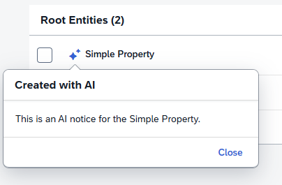

<!-- loio82856ceb55584e22b0a3994d81fa963d -->

# Configuring the AI Notice in a Column Header

You must use the AI notice to show that the content in the table column contains content generated by AI.

The AI notice allows users to make an informed decision regarding the handling of AI-generated data.

> ### Note:  
> You must also provide documentation to users that explains your AI features and the process behind them to ensure transparency.

The AI notice is displayed as an icon in the column header. Clicking the icon opens a popover with configurable content. If no custom content is provided, the following default message is displayed: This content was partially or fully generated by artificial intelligence \(AI\) technologies. The AI-generated content may contain inaccuracies due to using multiple information sources. Verify results before use.

You configure the AI notice on a column header in the following ways:

-   As plain text in the `manifest.json` file
-   As rich text using a custom fragment in the `manifest.json` file
-   As the default message or custom content in the `Table` building block using a column override

  
  
**AI Notice in a Column Header Using Custom Plain Text**



To configure custom plain text, add the `aiNotice` property under your column in the `manifest.json` file and specify your `contentText`, as shown in the following sample code:

> ### Sample Code:  
> `manifest.json`
> 
> ```
> "sap.ui5": {
>     "routing": {
>         "targets": {
>             "ListReportA": {
>                 "options": {
>                     "settings": {
>                         "controlConfiguration": {
>                             "@com.sap.vocabularies.UI.v1.LineItem": {
>                                 "columns": {
>                                     "DataField::PropertyA": {
>                                         "aiNotice": {
>                                             "contentText": "This column contains AI-generated content."
>                                         }
>                                     }
>                                 }
>                             }
>                         }
>                     }
>                 }
>             }
>         }
>     }
> }
> ```

To configure custom plain text for custom columns, add the `aiNotice` property under your custom column in the `manifest.json` file and specify your `contentText`, as shown in the following sample code:

> ### Sample Code:  
> ```
> "customColumn": {
>     "header": "Custom Column Header",
>     "template": "AppA.fragments.CustomColumnTemplate",
>     "aiNotice": {
>         "contentText": "This column contains AI-generated recommendations."
>     }
> }
> ```

To configure rich text, add the `aiNotice` property under your column in the `manifest.json` file and specify your custom fragment as the `contentFragmentName`, as shown in the following sample code:

> ### Sample Code:  
> manifest.json
> 
> ```
> "DataField::PropertyA": {
>     "aiNotice": {
>         "contentFragmentName": "appA.fragments.AiNoticeContentA"
>     }
> }
> ```

To configure the default message in the `Table` building block, use a column override with the `aiNotice` property as shown in the following sample code:

> ### Sample Code:  
> Default AI Notice Message in the `Table` Building Block
> 
> ```
> <macrosTable:ColumnOverride key="DataField::PropertyA" header="Table Property">
>     <macrosTable:aiNotice/>
> </macrosTable:ColumnOverride>
> ```

To configure custom content in the `Table` building block, use a column override with the `ColumnAiNotice` aggregation as shown in the following sample code:

> ### Sample Code:  
> Custom AI Notice Content in the `Table` Building Block
> 
> ```
> <macrosTable:ColumnOverride key="DataField::PropertyA">
>     <macrosTable:aiNotice>
>         <macrosTable:ColumnAINotice>
>             <Text xmlns="sap.m" text="This data was generated by AI. Please verify." />
>         </macrosTable:ColumnAINotice>
>     </macrosTable:aiNotice>
> </macrosTable:ColumnOverride>
> ```

> ### Note:  
> If you provide both the `contentText` and `contentFragmentName` properties, the `contentFragmentName` property is used.

**Related Information**  


[AI Notice](ai-notice-10a6cda.md "You must use the AI notice to show that the page contains content generated by AI.")

[Adding the AI Icon to Action Buttons](adding-the-ai-icon-to-action-buttons-3ad0452.md "You can add an icon to indicate that a button is related to an AI action.")

[The AINotice Building Block](the-ainotice-building-block-8c6e98b.md "You must use the AINotice building block to display information related to AI features.")

