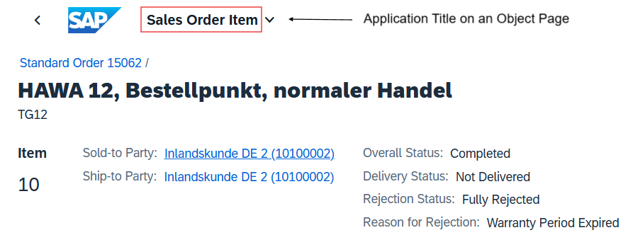

<!-- loioac70343fdf16499e8b39d42cec7593be -->

# Configuring the Application Title

You can configure the application title that is generated from SAP Fiori launchpad, if required.

The following screenshots show the application title displayed in the shell bar of a list report page and an object page:

  
  
**Application Title on a List Report Page**

  
  
**Application Title on an Object Page**

To configure the application title, change the `@UI.headerInfo.typeName` annotation.

For more information, see the [Sample Code](setting-up-the-object-page-header-cce93e6.md#loiocce93e6f067a4133a8430c4f5d7b8fc7__sample_code) section in [Setting Up the Object Page Header](setting-up-the-object-page-header-cce93e6.md).

<a name="loioac70343fdf16499e8b39d42cec7593be__section_vfr_y1x_cnb"/>

## Additional Features in SAP Fiori Elements for OData V2

Additionally, you can also configure the application title of the overview page and the analytical list page.

<a name="loioac70343fdf16499e8b39d42cec7593be__section_ph5_31q_1cb"/>

## Related Links

-   For information about adapting the table header on a list report page, see [Setting the Table Header](setting-the-table-header-f996207.md).

-   For information about adapting object page titles and subtitles, see [Configuring the Object Page Header Title and Description](configuring-the-object-page-header-title-and-description-333f850.md).

