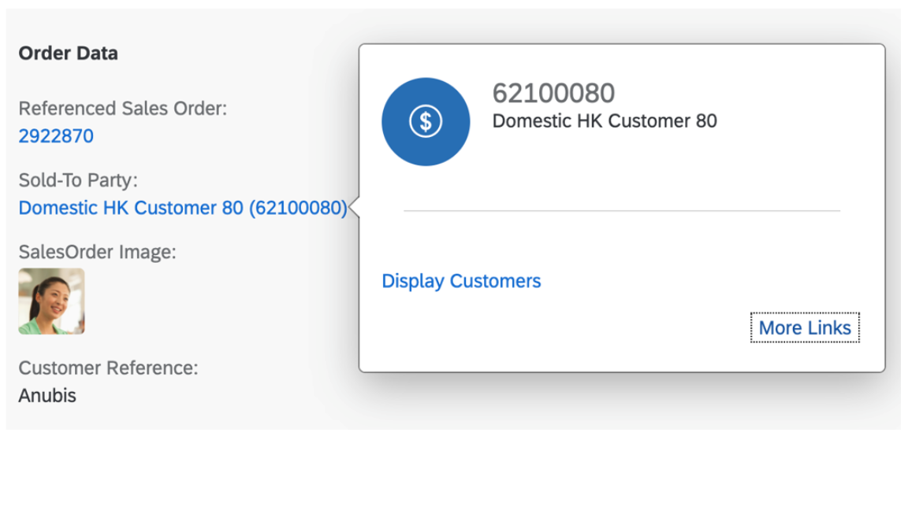
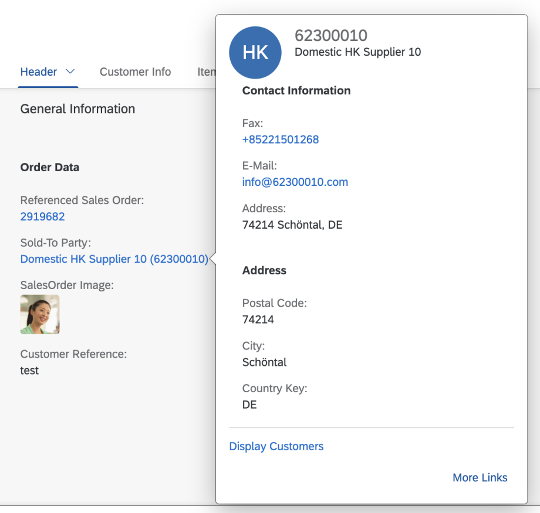
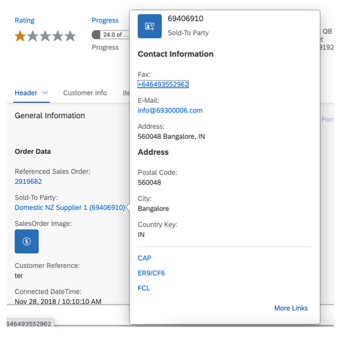
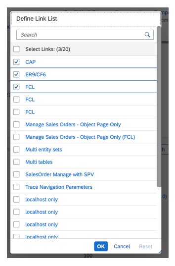
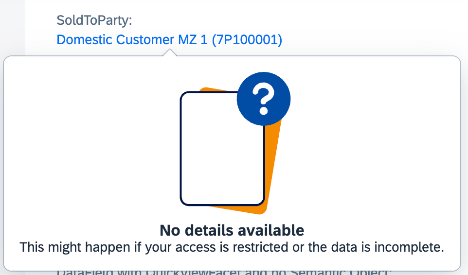

<!-- loioc245ad757dc64694842e00c40e677cd8 -->

# Configuring the Content of Quick Views

You can configure the content area of the quick views to display specific data.

The content area, consisting of a title and additional information, for example, a field group, has a default behavior and can be adapted to your needs.


<a name="loioc245ad757dc64694842e00c40e677cd8__section_spl_mz2_3mb"/>

## Title Area


### Images

To display an image, provide at least one of the following annotations:

-   `HeaderInfo.ImageUrl`

-   `HeaderInfo.TypeImageUrl`

-   `HeaderInfo.Initials` \(to display initials as an image\)


Add an image to the quick view card in the same way you add an image to the object page header. For more information, see [Setting Up the Object Page Header](setting-up-the-object-page-header-cce93e6.md).

If none of the above annotations are provided, no image is displayed.


### Title

The title is taken from `HeaderInfo.Title`.

If a main navigation has been defined using the `sap-tag` parameter `primaryAction`, the title is displayed as a link. For more information about how to define a primary action, see [Primary actions](https://help.sap.com/docs/ABAP_PLATFORM_NEW/a7b390faab1140c087b8926571e942b7/ea131c68c5de4978a936d2286025ed0f.html?version=202310.001#primary-actions).

In the following example, see the <code><i>Asia High tech</i></code> link:


> ### Restriction:  
> Navigation from the title link using the browser option *Open link in new tab* is not possible. Instead, the navigation links to SAP Fiori launchpad.


### Description

The description is taken from the `HeaderInfo.Description` annotation of the target entity.

If `HeaderInfo.Description` is not maintained in the annotation, the subtitle displays the label of the source property instead.


## Content Area

The content area can contain field groups, contacts, and `DataPoints`.


### Field Groups

You can include any number of field groups or none at all. The following example shows a quick view without a reference facet, but with a header image:



A field group can have a label. It's taken from within the `Record Type="UI.ReferenceFacet"`.

For fields, the path including navigation properties is evaluated.

Fields support annotations such as `IsEmailAddress`, `IsUrl`, and `IsPhoneNumber`. Note that any links that create a popover on the quick view are ignored by the system.


### Contacts

You can display any number of contact facets or none at all. See the following example:



The following applies:

-   You can place contact facets anywhere. The position is specified by the position of the reference facet in the collection of the `UI.QuickViewFacets` annotation.

-   The reference facet for each contact facet must point to a `com.sap.vocabularies.Communication.v1.Contact` annotation.

-   If the picture, title, and description belonging to a contact \(contact title area\) correspond with the content of the title area, the contact title area is not displayed.


### Data Points

You can place `DataPoint` facets anywhere. The position is specified by the position of the reference facet in the collection of the `UI.QuickViewFacets` annotation.

The reference facet for each `DataPoint` must point to a `UI.DataPoint` annotation.

Each `DataPoint` can have a label. It's taken from the `"UI.ReferenceFacet"`.


See the following sample codes for a quick view facet containing a field group, a contact and a `DataPoint`:

> ### Sample Code:  
> XML Annotation
> 
> ```xml
> 
> <Annotations Target="STTA_PROD_MAN.STTA_C_MP_SupplierType">
>     <Annotation Term="UI.QuickViewFacets">
>         <Collection>
>             <Record Type="UI.ReferenceFacet">
>                 <PropertyValue Property="Target" AnnotationPath="@UI.FieldGroup#SupplierQuickViewPOC_FieldGroup_1" />
>             </Record>
>             <Record Type="UI.ReferenceFacet">
>                 <PropertyValue Property="Label" String="Main Contact Person" />
>                 <PropertyValue Property="Target" AnnotationPath="@Communication.Contact#KeyAccount"/>
>             </Record>
>             <Record Type="UI.ReferenceFacet">
>                 <PropertyValue Property="Label" String="DataPoint in QV"/>
>                 <PropertyValue Property="Target" AnnotationPath="@UI.DataPoint#Product"/>
>             </Record>
>         </Collection>
>     </Annotation>
> </Annotations>
> 
> ```

> ### Sample Code:  
> ABAP CDS Annotation
> 
> ```
> Annotate view STTA_C_MP_SUPPLIER with
> {
>     @UI.Facet: [
>         {
>             targetQualifier: 'SupplierQuickViewPOC_FieldGroup_1',
>             type: #FIELDGROUP_REFERENCE,
>             purpose: #QUICK_VIEW
>         },
>         {
>             label: 'Main Contact Person',
>             targetQualifier: 'KeyAccount',
>             type: #CONTACT_REFERENCE,
>             purpose: #QUICK_VIEW
>         },
>         {
>             label: 'DataPoint in QV',
>             targetQualifier: 'Product',
>             type: #DATAPOINT_REFERENCE,
>             purpose: #QUICK_VIEW
>         }
>     ]
>     supplier;
> }
> 
> ```

> ### Sample Code:  
> CAP CDS Annotation
> 
> ```
> Annotate STTA_PROD_MAN.STTA_C_MP_SupplierType with 
> @(
>     UI.QuickViewFacets : [
>         {
>             $Type : 'UI.ReferenceFacet',
>             Target : '@UI.FieldGroup#SupplierQuickViewPOC_FieldGroup_1'
>         },
>         {
>             $Type : 'UI.ReferenceFacet',
>             Label : 'Main Contact Person',
>             Target : '@Communication.Contact#KeyAccount'
>         },
>         {
>             $Type : 'UI.ReferenceFacet',
>             Label : 'DataPoint in QV',
>             Target : '@UI.DataPoint#Product'
>         }
>     ]
> );
> 
> ```


## Footer Section

To enable navigation from a quick view facet, define a `SemanticObject` for the source property, if a `ReferentialConstraint` exists, or for the navigation property, if the target property is defined using an association.

The following image shows a quick view popover displaying the most important links in the footer:



The following image shows a *More Links* popover. Users can select actions to be displayed in the quick view footer:



-   The footer section gathers the most important navigation targets. Users can see the full list of available actions by choosing the *More Links* button.

-   Important navigation targets are defined using the `sap-tag` parameter `superiorAction`. All actions with this definition are displayed by default in the quick view footer.

-   If no action was defined using the `sap-tag` parameter `superiorAction`, the first three actions in the list of actions are shown by default.

-   Users can personalize the actions shown in the footer by selecting actions in the *More Links* popover.


> ### Restriction:  
> When the application is running within an i-frame, using the browser's *Open link in new tab* option to navigate from action links isn't supported. Additionally, any processing defined in the `IntentBasedNavigation` extension point isn't executed in this scenario. For more information about the `IntentBasedNavigation` API, see the [API Reference](https://ui5.sap.com/#/api/sap.fe.core.controllerextensions.IntentBasedNavigation%23methods/Summary).

> ### Note:  
> When no `QuickView` annotations are defined and no target is resolved at runtime \(for example, the user does not have access to the target applications\), the field still appears as a link and a message is displayed when the user clicks the link.
> 
> 


> ### Note:  
> For information about SAP Fiori elements for OData V2, see [Configuring the Content of Quick Views](configuring-the-content-of-quick-views-e598e59.md).

