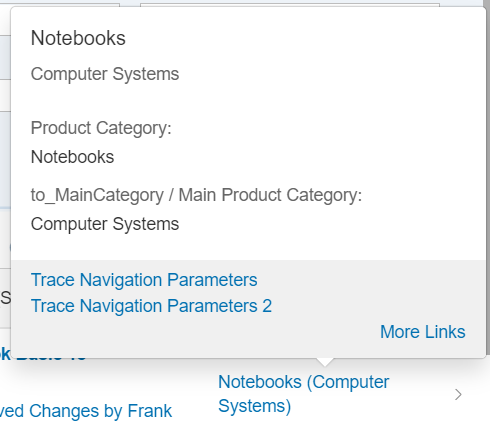
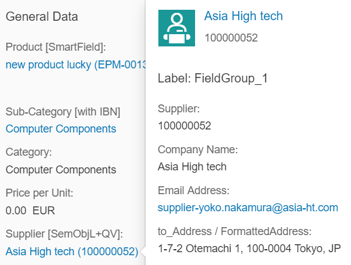
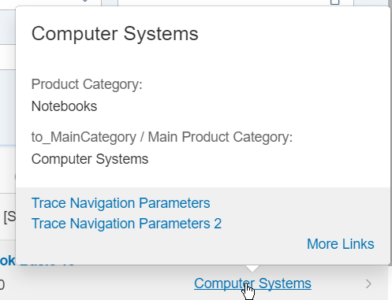
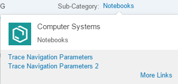
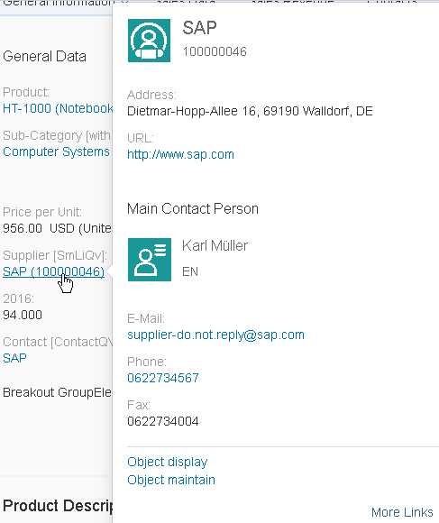
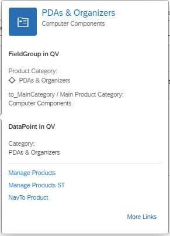

<!-- loioe598e59b3a0c40ebb7de30147aa88fee -->

# Configuring the Content of Quick Views

You can configure the content area of the quick views to display specific data.

> ### Note:  
> For information about SAP Fiori elements for OData V4, see [Configuring the Content of Quick Views](configuring-the-content-of-quick-views-c245ad7.md).

The content area, consisting of a title and additional information, for example, a field group, has a default behavior and can be adapted to your needs.


<a name="loioe598e59b3a0c40ebb7de30147aa88fee__section_vp4_j1j_tgc"/>

## Title Area

-   Images

    -   To display an image, provide at least one of the following annotations:

        -   `HeaderInfo.ImageUrl`

        -   `HeaderInfo.TypeImageUrl`


        If none of the above annotations are provided, no image is displayed.

    -   If you annotate `HeaderInfo.ImageUrl` and `HeaderInfo.TypeImageUrl`, `HeaderInfo.ImageUrl` is evaluated first, and `HeaderInfo.TypeImageUrl` second. The `ImageUrl/TypeImageUrl` string and path including navigation properties are evaluated.

    -   Add an image to the quick view card in the same way you add an image to the object page header. For more information, see [Setting Up the Object Page Header](setting-up-the-object-page-header-c4e45a3.md).


-   Title

    -   Enter the title according to the `TextArrangement` annotation. See the figure below: `TextArrangementType/TextLast`. Note that *Computer Systems* is declared as `TextLast` here.

        

    -   If a main navigation has been defined, the title is displayed as a link. In the example below, see the <code><i>Asia High tech</i></code> link:

        


-   Description
    -   The description is always displayed beneath the title and must be filled according to the `TextArrangement` annotation.

    -   If the description is not filled, the title size is increased automatically and the description field remains empty, as shown below \(`TextArrangementType/TextOnly`\).

        


<a name="loioe598e59b3a0c40ebb7de30147aa88fee__section_jvn_l1j_tgc"/>

## Content Area

The content area can contain field groups, contacts, and data points.


<a name="loioe598e59b3a0c40ebb7de30147aa88fee__section_nzz_41j_tgc"/>

## Field Groups

-   You can include any number of field groups or none at all. The example below shows a quick view with no reference facet, however, a header image included:

    

-   A field group can have a label. It is taken from within the `<Record Type="UI.ReferenceFacet">`.

-   For fields, the path including navigation properties is evaluated.

-   Fields support annotations such as `IsEmailAddress`, `IsUrl`, and `IsPhoneNumber`. Note that any links that would create a popover on the quick view are ignored by the system.

-   There are different types of content for field groups:

    -   Interpreted by `SmartField`: `DataField` including criticality, `DataFieldWithUrl`

    -   Interpreted by SAP Fiori elements: `DataFieldWithIntentBasedNavigation`


<a name="loioe598e59b3a0c40ebb7de30147aa88fee__section_nlm_t1j_tgc"/>

## Contacts

You can display any number of contacts or none at all. See the example below:



The following applies:

-   You can place the contact anywhere. It is specified by the position of the reference facet in the collection.

-   If the picture, title, and description belonging to a contact \(contact title area\) correspond with the content of the title area , the contact title area is not displayed.

-   The reference facet must point to a `com.sap.vocabularies.Communication.v1.Contact`.


<a name="loioe598e59b3a0c40ebb7de30147aa88fee__section_y3q_x1j_tgc"/>

## Data Points

-   You can place an existing data point in your annotation.

-   You can place the data point anywhere. It is specified by the position of the reference facet in the collection.

-   A data point can have a label. It is taken from within the `<Record Type="UI.ReferenceFacet">`.




The sample codes show a quick view facet containing field group, contact and data point:

> ### Sample Code:  
> XML Annotation
> 
> ```xml
> <Annotations Target="STTA_PROD_MAN.STTA_C_MP_SupplierType">
>     <Annotation Term="UI.QuickViewFacets">
>         <Collection>
>             <Record Type="UI.ReferenceFacet">
>                 <PropertyValue Property="Target"
>                     AnnotationPath="@UI.FieldGroup#SupplierQuickViewPOC_FieldGroup_1" 
>                 />
>             </Record>
>             <Record Type="UI.ReferenceFacet">
>                 <PropertyValue Property="Label"
>                     String="Main Contact Person" 
>                 />
>                 <PropertyValue Property="Target"
>                     AnnotationPath="@Communication.Contact#KeyAccount"
>                 />
>             </Record>
>             <Record Type="UI.ReferenceFacet">
>                 <PropertyValue Property="Label"
>                     String="DataPoint in QV"
>                 />
>                 <PropertyValue Property="Target"
>                     AnnotationPath="@UI.DataPoint#Product"
>                 />
>             </Record>
>         </Collection>
>     </Annotation>
> </Annotations>
> ```

> ### Sample Code:  
> ABAP CDS Annotation
> 
> ```
> annotate view STTA_C_MP_SUPPLIER with {@UI.Facet: [  {    targetQualifier: 'SupplierQuickViewPOC_FieldGroup_1',    type: #FIELDGROUP_REFERENCE,    purpose: #QUICK_VIEW  },  {    label: 'Main Contact Person',    targetQualifier: 'KeyAccount',    type: #CONTACT_REFERENCE,    purpose: #QUICK_VIEW  },  {    label: 'DataPoint in QV',    targetQualifier: 'Product',    type: #DATAPOINT_REFERENCE,    purpose: #QUICK_VIEW  }]supplier;}
> ```

