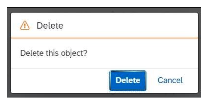
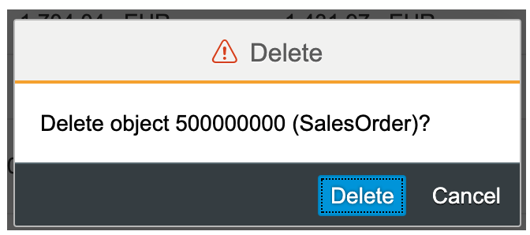
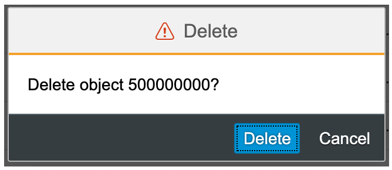

<!-- loio84e4f8967bf643c9b81d4d84cefdf367 -->

# Configuring the Delete Dialog

You can adapt the text in the delete dialog to match your requirements when deleting an object or item from the tables in the list report or object page.


<a name="loio84e4f8967bf643c9b81d4d84cefdf367__section_jls_dyr_cnb"/>

## Additional Features in SAP Fiori Elements for OData V2

The delete dialog derives its text from the `Title` and `Description` properties of the `UI.HeaderInfo` annotation, which is defined in the entity set bound to the table. The table can be in the list report, object page, and subobject page.

-   In fullscreen mode, the delete option is available in the list report, object page header, and subobject page header.

    When a user deletes an item from the table, the delete confirmation message appears in three different formats, based on the properties defined in the `UI.HeaderInfo` annotation.

    -   Both the `Title` and `Description` properties are defined:

        The delete confirmation message includes only the title, even though the description is defined, as shown in the following screenshot:

        

        The following sample code shows the `UI.HeaderInfo` annotation in which `Title` and `Description` are defined:

        > ### Sample Code:  
        > XML Annotation
        > 
        > ```xml
        > <Annotation Term="UI.HeaderInfo"> 
        >   <Record> 
        >     <PropertyValue Property="TypeName" String="Sales Order" /> 
        >     <PropertyValue Property="TypeNamePlural" String="Sales Orders" /> 
        >     <PropertyValue Property="Title"> 
        >       <Record Type="UI.DataField"> 
        >         <PropertyValue Property="Value" Path="so_id" /> 
        >        </Record> 
        >     </PropertyValue> 
        >     <PropertyValue Property="Description"> 
        >       <Record Type="UI.DataField"> 
        >         <PropertyValue Property="Value" String="Sales Order" /> 
        >       </Record>   
        >     </PropertyValue> 
        >   </Record> 
        > </Annotation>
        > 
        > ```

        > ### Sample Code:  
        > ABAP CDS Annotation
        > 
        > ```
        > 
        > @UI.headerInfo: {
        >   typeName: 'Sales Order',
        >   typeNamePlural: 'Sales Orders',
        >   title: {
        >     value: 'SO_ID',
        >     type: #STANDARD
        >   },
        >   description: {
        >     type: #STANDARD
        >   }
        > }
        > annotate view SALESORDERMANAGE with {
        > 
        > }
        > 
        > ```

    -   Both the `Title` and `Description` properties aren't defined:

        The following generic delete confirmation message is displayed:

        


-   In flexible column layout mode, the delete option is available in the list report, object page table, and subobject page table.

    When a user deletes an item from the table, the delete confirmation message appears in three different formats, based on the properties defined in the `UI.HeaderInfo` annotation.

    -   Both the `Title` and `Description` properties are defined:

        The delete confirmation message includes both the title and description, as shown in the following screenshot:

        

    -   Only `Title` is defined:

        The delete confirmation message includes only the title, as shown in the following screenshot:

        

    -   Both the `Title` and `Description` properties aren't defined:

        The following generic delete confirmation message is displayed:

        


For more information about the i18n keys to override the default texts, see [Localization of UI Texts](localization-of-ui-texts-b8cb649.md).


<a name="loio84e4f8967bf643c9b81d4d84cefdf367__section_uql_5yr_cnb"/>

## Additional Features in SAP Fiori Elements for OData V4

The delete message for the main object \(list report\) does not consider the `UI.HeaderInfo` annotation. This also applies to deletions from any table.

-   Delete from list report:

    

    Use the i18n key `C_TRANSACTION_HELPER_CONFIRM_DELETE_WITH_OBJECTTITLE_SINGULAR`.

-   Delete from object page \(or subobject page\) header:

    

    In this case, the application considers both the `UI.HeaderInfo.Title` \(for example, 2915717\) and the `UI.HeaderInfo.Description` \(for example, Standard Order\).

    Use the i18n key `C_TRANSACTION_HELPER_CONFIRM_DELETE_WITH_OBJECTINFO`.

-   Delete from tables in the object page or subobject page:

    Use the i18n key `C_TRANSACTION_HELPER_CONFIRM_DELETE_WITH_OBJECTTITLE_SINGULAR`.


For more information about the i18n keys, see [Localization of UI Texts](localization-of-ui-texts-b8cb649.md).

> ### Note:  
> Applications that override the delete message for a single entry from the table must review the configuration of the `UI.HeaderInfo` annotation and adapt the texts accordingly.

