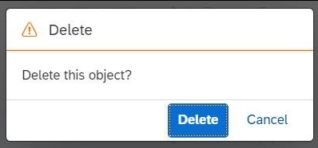
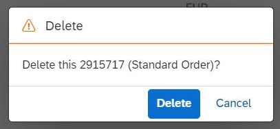

<!-- loio84e4f8967bf643c9b81d4d84cefdf367 -->

# Configuring the Delete Dialog

You can adapt the text of the delete dialog to match your requirements.

The delete dialog appears when users are deleting an object or item from tables on the list report page or the object page.

The delete message for the main object \(list report page\) does not consider the `UI.HeaderInfo` annotation. This also applies to deletions from any table.

-   Delete from list report page:

    

    Use the i18n key `C_TRANSACTION_HELPER_CONFIRM_DELETE_WITH_OBJECTTITLE_SINGULAR`.

-   Delete from object page \(or subobject page\) header:

    

    In this case, the application considers both the `UI.HeaderInfo.Title` \(for example, 2915717\) and the `UI.HeaderInfo.Description` \(for example, Standard Order\).

    Use the i18n key `C_TRANSACTION_HELPER_CONFIRM_DELETE_WITH_OBJECTINFO`.

-   Delete from tables in the object page or subobject page:

    Use the i18n key `C_TRANSACTION_HELPER_CONFIRM_DELETE_WITH_OBJECTTITLE_SINGULAR`.

For more information about the i18n keys, see [Localization of UI Texts](localization-of-ui-texts-b8cb649.md).

> ### Note:  
> Applications that override the delete message for a single entry from the table must review the configuration of the `UI.HeaderInfo` annotation and adapt the texts accordingly.

> ### Note:  
> For information about SAP Fiori elements for OData V2, see [Configuring the Delete Dialog](configuring-the-delete-dialog-50e60d2.md).

