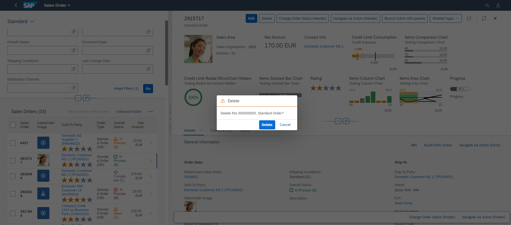

<!-- loio15b7740845b44b419a56eb63d34b8ab3 -->

# Configuring the Delete Dialog Box

You can adapt the text in the Delete dialog box to match your requirements.


<a name="loio15b7740845b44b419a56eb63d34b8ab3__section_lc5_jds_cnb"/>

## Additional Features in SAP Fiori Elements for OData V2

When a user deletes a record from the list report, the text in the dialog box "Delete Object 500000000?" is displayed in the delete confirmation, informing the user that object 500000000 is being deleted.

  

The corresponding i18n key for the text used by the SAP Fiori elements framework in the delete confirmation dialog is `ST_GENERIC_DELETE_SELECTED`. You can adapt it by maintaining a text for this key in the app’s i18n file.

The context displayed in the Delete dialog box is taken from the `Title` property of the `HeaderInfo` annotation. In the example below, the value mapped to the `"so_id"` property is shown in the dialog text.

> ### Sample Code:  
> XML Annotation
> 
> ```xml
> <Annotation Term="UI.HeaderInfo">
> <Record>
>   <PropertyValue Property="TypeName" String="Sales Order"/>
>      <PropertyValue Property="TypeNamePlural" String="Sales Orders"/>
>      <PropertyValue Property="Title">
>        <Record Type="UI.DataField">
>          <PropertyValue Property="Value" Path="so_id"/>
>        </Record>
>      </PropertyValue>
>    </Record>
>  </Annotation>
> 
> ```

> ### Sample Code:  
> ABAP CDS Annotation
> 
> ```
> 
> @UI.headerInfo: {
>   typeName: 'Sales Order',
>   typeNamePlural: 'Sales Orders',
>   title: {
>     value: 'SO_ID',
>     type: #STANDARD
>   }
> }
> annotate view STTA_C_MP_PRODUCT with {
> 
> }
> 
> ```


<a name="loio15b7740845b44b419a56eb63d34b8ab3__section_yfk_4ds_cnb"/>

## Additional Features in SAP Fiori Elements for OData V4

Only the keys given below are allowed to be overridden in the custom i18n file for deleting lines in a table:


<table>
<tr>
<td valign="top">

C\_TRANSACTION\_HELPER\_OBJECT\_PAGE\_CONFIRM\_DELETE\_WITH\_OBJECTINFO=Delete this \{0\} \(\{1\}\)?


</td>
</tr>
<tr>
<td valign="top">

C\_TRANSACTION\_HELPER\_OBJECT\_PAGE\_CONFIRM\_DELETE\_WITH\_OBJECTTITLE\_SINGULAR=Delete this object?


</td>
</tr>
<tr>
<td valign="top">

C\_TRANSACTION\_HELPER\_OBJECT\_PAGE\_CONFIRM\_DELETE\_WITH\_UNSAVED\_CHANGES=Another user edited this object without saving the changes: \{0\}. Delete anyway?


</td>
</tr>
<tr>
<td valign="top">

C\_TRANSACTION\_HELPER\_OBJECT\_PAGE\_CONFIRM\_DELETE\_WITH\_UNSAVED\_CHANGES\_MULTIPLE\_OBJECTS=Other users have edited the selected objects without saving the changes. Delete anyway?


</td>
</tr>
<tr>
<td valign="top">

C\_TRANSACTION\_HELPER\_OBJECT\_PAGE\_CONFIRM\_DELETE\_WITH\_OBJECTTITLE\_PLURAL=Delete the selected objects?


</td>
</tr>
<tr>
<td valign="top">

C\_TRANSACTION\_HELPER\_OBJECT\_PAGE\_CONFIRM\_DELETE\_WITH\_OBJECTINFO\_AND\_FEW\_OBJECTS\_NON\_DELETABLE=\{0\} of \{1\} objects cannot be deleted.


</td>
</tr>
<tr>
<td valign="top">

C\_TRANSACTION\_HELPER\_OBJECT\_PAGE\_CONFIRM\_DELETE\_WITH\_OBJECTINFO\_AND\_FEW\_OBJECTS\_LOCKED=\{0\} of \{1\} objects are currently locked.


</td>
</tr>
<tr>
<td valign="top">

C\_TRANSACTION\_HELPER\_OBJECT\_PAGE\_CONFIRM\_DELETE\_WITH\_UNSAVED\_AND\_FEW\_OBJECTS\_LOCKED\_SINGULAR=The remaining object has unsaved changes. Do you still want to delete it?


</td>
</tr>
<tr>
<td valign="top">

C\_TRANSACTION\_HELPER\_OBJECT\_PAGE\_CONFIRM\_DELETE\_WITH\_UNSAVED\_AND\_FEW\_OBJECTS\_LOCKED\_PLURAL=The remaining objects have unsaved changes. Do you still want to delete them?


</td>
</tr>
<tr>
<td valign="top">

C\_TRANSACTION\_HELPER\_OBJECT\_PAGE\_CONFIRM\_DELETE\_WITH\_OBJECTINFO\_AND\_FEW\_OBJECTS\_UNSAVED\_SINGULAR=Also delete object with unsaved changes?


</td>
</tr>
<tr>
<td valign="top">

C\_TRANSACTION\_HELPER\_OBJECT\_PAGE\_CONFIRM\_DELETE\_WITH\_OBJECTINFO\_AND\_FEW\_OBJECTS\_UNSAVED\_PLURAL=Also delete objects with unsaved changes?


</td>
</tr>
<tr>
<td valign="top">

C\_TRANSACTION\_HELPER\_OBJECT\_PAGE\_CONFIRM\_DELETE\_WITH\_OBJECTINFO\_AND\_FEW\_OBJECTS\_LOCKED\_AND\_NON\_DELETABLE=\{0\} out of \{2\} objects cannot be deleted. \{1\} of \{2\} objects are currently locked.


</td>
</tr>
<tr>
<td valign="top">

C\_TRANSACTION\_HELPER\_OBJECT\_PAGE\_DELETE\_TOAST\_SINGULAR=Object was deleted


</td>
</tr>
<tr>
<td valign="top">

C\_TRANSACTION\_HELPER\_OBJECT\_PAGE\_DELETE\_TOAST\_PLURAL=Objects were deleted


</td>
</tr>
</table>


### Manifest Changes

Changes must be made in the manifest file of the application. Add `enhanceI18n` to the `settings`  of the corresponding section as shown below:

> ### Sample Code:  
> ```
> targets":{
>    "SalesOrderManageList":{
>       "type": "Component",
>       "id": "SalesOrderManageList",
>       "name": "sap.fe.templates.ListReport",
>       "options":{
>          "settings":{
>          "entitySet": "SalesOrderManage",
>          "enhanceI18n": "i18n/customSalesOrderLR.properties", // This is the line to be added - it provides Fiori Elements with the name of the custom resource bundle
>          .
>          .
>          .
>          }
>       }
>    }
> }
> ```

Provide the new custom texts in this custom resource bundle with the same key as the one used by SAP Fiori elements \(from the allowed list in the first section of this document\).

> ### Example:  
> **SAP Fiori elements default values \(in the resource bundle of SAP Fiori elements\):**
> 
> `C_TRANSACTION_HELPER_OBJECT_PAGE_CONFIRM_DELETE_WITH_OBJECTTITLE_PLURAL=Delete the selected objects?`
> 
> `C_TRANSACTION_HELPER_OBJECT_PAGE_CONFIRM_DELETE_WITH_OBJECTTITLE_SINGULAR=Delete this object?`
> 
> **Text values from** `i18n/customSalesOrderLR.properties` **\(custom resource bundle of the application\):**
> 
> `C_TRANSACTION_HELPER_OBJECT_PAGE_CONFIRM_DELETE_WITH_OBJECTTITLE_PLURAL|SalesOrderManage=Do you want to delete the selected Sales Orders?`
> 
> `C_TRANSACTION_HELPER_OBJECT_PAGE_CONFIRM_DELETE_WITH_OBJECTTITLE_SINGULAR|SalesOrderManage=Do you want to delete this Sales Order?`


### Format of Custom Keys

For resources which are shared across multiple entity sets, append the `entitySet` name. \(for example, you want different delete messages based on the entity being deleted.\)

> ### Example:  
> `C_TRANSACTION_HELPER_OBJECT_PAGE_CONFIRM_DELETE_WITH_OBJECTTITLE_SINGULAR=Delete this object?` \(resource bundle of SAP Fiori elements\)
> 
> `C_TRANSACTION_HELPER_OBJECT_PAGE_CONFIRM_DELETE_WITH_OBJECTTITLE_SINGULAR|_Items=Do you want to delete this Sales Order Item?` 

> ### Note:  
> If the entity name is not appended, then the same text would be shown irrespective of the entity being actually deleted so the custom text can then be only a generic message.

**Related Information**  


[Adapting Texts in the Delete Dialog Box Using Extensions \(List Report\)](adapting-texts-in-the-delete-dialog-box-using-extensions-list-report-25885b6.md "You can adapt the text of the Delete dialog box that is displayed when you delete list report items.")

[Adapting Texts for Confirmation Dialog Box When Deleting Lines in a Table](adapting-texts-for-confirmation-dialog-box-when-deleting-lines-in-a-table-0d1fbf4.md "When a user deletes a line in a table on the object page, a confirmation dialog box is displayed. You can adapt the displayed default texts for every table.")

[Configuring the Delete Confirmation Dialog Box](configuring-the-delete-confirmation-dialog-box-84e4f89.md "You can adapt the text in the Delete dialog box to match your requirements while deleting an object or an item from the list report and object page tables.")

