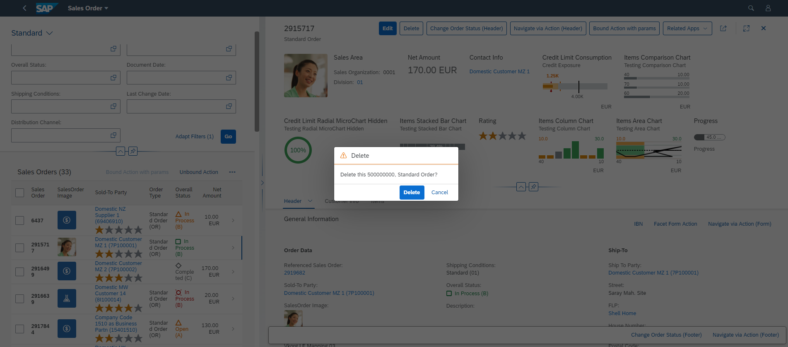

<!-- loio15b7740845b44b419a56eb63d34b8ab3 -->

# Configuring the *Delete* Dialog on the List Report Page

You can adapt the text of the *Delete* dialog on the list report page to match your requirements.

> ### Note:  
> For information about SAP Fiori elements for OData V4, see [Configuring the Delete Dialog](configuring-the-delete-dialog-84e4f89.md).

When a user deletes a record from the list report page, the delete dialog displays the text *"Delete Object 500000000?"* to indicate that object 500000000 is being deleted.



You can use the i18n key `ST_GENERIC_DELETE_SELECTED` to modify the default text in the delete dialog.

The context displayed in the *Delete* dialog is taken from the `Title` property of the `HeaderInfo` annotation. In the following sample code, the value mapped to the `"so_id"` property is shown in the dialog text.

> ### Sample Code:  
> XML Annotation
> 
> ```xml
> <Annotation Term="UI.HeaderInfo">
> <Record>
>   <PropertyValue Property="TypeName" String="Sales Order"/>
>      <PropertyValue Property="TypeNamePlural" String="Sales Orders"/>
>      <PropertyValue Property="Title">
>        <Record Type="UI.DataField">
>          <PropertyValue Property="Value" Path="so_id"/>
>        </Record>
>      </PropertyValue>
>    </Record>
>  </Annotation>
> 
> ```

> ### Sample Code:  
> ABAP CDS Annotation
> 
> ```
> 
> @UI.headerInfo: {
>   typeName: 'Sales Order',
>   typeNamePlural: 'Sales Orders',
>   title: {
>     value: 'SO_ID',
>     type: #STANDARD
>   }
> }
> annotate view STTA_C_MP_PRODUCT with {
> 
> }
> 
> ```

**Related Information**  


[Adapting Texts in the Delete Dialog Using Extensions \(List Report Page\)](adapting-texts-in-the-delete-dialog-using-extensions-list-report-page-25885b6.md "You can adapt the text of the Delete dialog that appears when users delete items from the list report page.")

[Adapting Texts for Confirmation Dialog Box When Deleting Lines in a Table](adapting-texts-for-confirmation-dialog-box-when-deleting-lines-in-a-table-5b6538c.md "You can adapt the default texts of the confirmation dialog that appears when users delete a table line.")

[Configuring the Delete Dialog](configuring-the-delete-dialog-50e60d2.md "You can adapt the text in the delete dialog to match your requirements when deleting an object or item from the tables on the list report page or the object page.")

