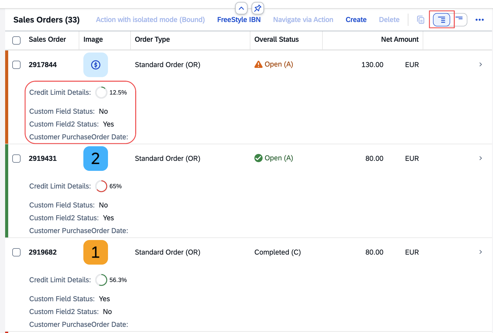

<!-- loioe6edddaf112944b5b707d68836ec3c33 -->

# Configuring the Popin Layout for Responsive Tables

Popin layout configuration for responsive tables determines how columns are displayed when space is limited in SAP Fiori elements for OData V4. Use this to optimize table data presentation on smaller screens by choosing between block or grid layouts.

When using a responsive table and there is not enough space to show all the columns, columns can be shown within popins using the *Show More per Row* option in the table toolbar.



The following popin layouts are supported:

-   `Block` \(default\): Sets a block layout for rendering the table popins. The columns inside the popin container are rendered one below the other.
-   `GridLarge`: Sets a grid layout for rendering the table popins. The width of the grid for each table popin is larger than `GridSmall`, so this layout renders less content in a single popin row.
-   `GridSmall`: Sets a grid layout for rendering the table popins. The width of the grid for each table popin is small, so this layout allows more content to be rendered in a single popin row.

For more information about the size of the popin layouts, see the [SAP Design System guidelines](https://www.sap.com/design-system/fiori-design-web/ui-elements/responsive-table/#responsiveness).

You can configure the popin layout for each responsive table using the `popinLayout` parameter in the `tableSettings` section. In the example below, the popin layout is set to `GridSmall`.

> ### Sample Code:  
> `manifest.json`
> 
> ```
> "controlConfiguration": {
>     "@com.sap.vocabularies.UI.v1.LineItem": {
>         "tableSettings": {
>             "type": "ResponsiveTable",
>             "popinLayout": "GridSmall"
>         }
>     },
>     ...
> }
> ```

You can also define a default popin layout at the application level. A popin layout defined at the table level takes precedence over a popin layout defined at the application level. In the example below, the default popin layout is `GridLarge`.

> ### Sample Code:  
> `manifest.json`
> 
> ```
> "sap.fe": {
>     "macros": {
>         "table":{
>             "defaultPopinLayout": "GridLarge"
>         }
>     }
> }
> 
> ```

