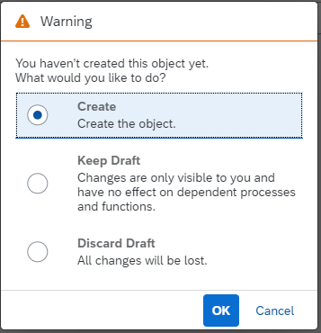
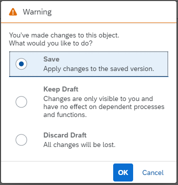
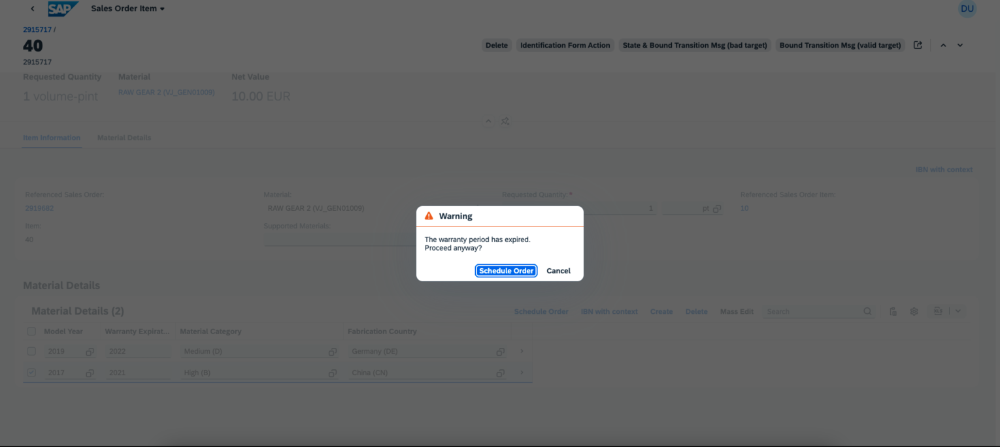

<!-- loio9a536627a6a94de084b0605eb164d2c8 -->

# Confirmation Popups

You can configure confirmation popups for various use cases on the list report page and the object page.


<a name="loio9a536627a6a94de084b0605eb164d2c8__section_vsd_ckr_vsb"/>

## Confirmation Popup for Critical Actions

You can configure actions as critical, and when these actions are triggered, a confirmation popup is displayed for end users before the action is executed. For more information, see [Adding Confirmation Popovers for Actions](adding-confirmation-popovers-for-actions-87130de.md).


<a name="loio9a536627a6a94de084b0605eb164d2c8__section_yms_cz4_wpb"/>

## Confirmation Popup for Activating a Draft

When end users create or edit an object page in a draft-enabled application and choose to leave the page without saving, the following popup is displayed:

  
  
**Create Mode**



  
  
**Edit Mode**



> ### Tip:  
> The popup is enabled by default. You can disable it for external navigation by configuring specific settings in the `manifest.json` file.


<a name="loio9a536627a6a94de084b0605eb164d2c8__section_nky_zzn_vsb"/>

## Turn Off *Draft Activation* Confirmation Popup for External Navigation

You can turn off the confirmation popup for draft activation in the case of external navigation by configuring the `silentlyKeepDraftOnForwardNavigation` setting in the `manifest.json` file as shown in the following sample code:

> ### Sample Code:  
> `manifest.json`
> 
> ```
> "sap.fe": {
>      "app": {
>           "silentlyKeepDraftOnForwardNavigation": true
>      }
> }
> 
> ```


<a name="loio9a536627a6a94de084b0605eb164d2c8__section_n3z_htm_vsb"/>

## Confirmation Popup for Actions that Fail with 412 Warnings

You can configure a confirmation popup for the following actions by sending an HTTP 412 response from the back end:

-   Standard SAP Fiori elements actions, such as *Save*, *Activate*, and *Create*.

-   Application-specific actions


The flow is as follows:

-   When an action is triggered, the application sends a request with the header `Prefer:handling=strict`.

-   Depending on the back-end settings, there are two options:

    -   If the preference is unknown, it's ignored and the action is executed as usual.

    -   If the preference is known, you can configure the back end to send a 412 message \("Precondition Failed" message\).


-   For SAP Fiori elements, the 412 message indicates that there are warnings that block the processing of the action, but end users can still trigger the action if they choose to ignore the warnings and continue.

-   The application displays a confirmation popup containing the message from the back end.

-   If end users choose *Confirm*, the application sends the request again, this time **without** `Prefer:handling=strict` in the header.

-   The back end executes the action and responds with either a success or a failure message. If it sends the same message again, it is suppressed and not shown on the UI.

-   If end users choose *Cancel*, the operation is terminated.


The following image shows an example of such a popup:



Once the 412 warnings are confirmed, any repeated messages from the back end are suppressed and not displayed in the UI. This suppression is applied only if the subsequent messages match the original in all of the following message attributes:

-   `code`

-   `message`

-   `numericSeverity`

-   `longtextUrl`: The messages are considered equal if both are `null` or absent. Note that this URL can contain variables that not present in the message string.

-   `target` and `additionalTargets`: The targets are considered equal if they resolve to the same model element.

-   `transition` flag : If this flag is absent, it is considered as `true`.


## Handling of 412 Messages

> ### Note:  
> You must configure 412 messages from the back end as `transition` messages, not as `state` messages.

> ### Restriction:  
> -   For back ends based on CAP, the handling of 412 "Precondition Failed" messages don't work correctly if the action is executed by setting the `InvocationGrouping` annotation property to `UI.OperationGroupingType/Isolated`. Here, the action invoked for the selected contexts are triggered within the same change set. So, either the action is executed successfully or not executed for any of the selected context.
> 
> -   The handling of 412 messages \("Precondition Failed" messages\) is not applied when a record is deleted.


## Turn Off 412 Confirmation Popups

To turn off 412 confirmation popups, you need to disable strict handling. You can disable strict handling for a specific action or the entire application by specifying the `disableStrictHandling` setting in the `manifest.json` file.

To disable strict handling at the application level, set the `disableStrictHandling` setting to `true` under the `sap.fe` section of the `manifest.json` file, as shown in the following sample code:

> ### Sample Code:  
> `manifest.json`
> 
> ```
> "sap.fe": {
>     "app": {
>        "disableStrictHandling": true
>     }
> }
> ```

To disable strict handling at the action level, set the `disableStrictHandling` setting to `true` under the specific action in the `manifest.json` file. You can disable strict handling for a specific action in a table, as shown in the following sample code:

> ### Sample Code:  
> `manifest.json`
> 
> ```
> "@com.sap.vocabularies.UI.v1.LineItem": {
>      "actions": {
>         "DataFieldForAction::YourActionWith412Handling": {
>            "disableStrictHandling": true
>         }
>      }
> }
> ```

You can disable strict handling for a specific header action on an object page, as shown in the following sample code:

> ### Sample Code:  
> `manifest.json`
> 
> ```
> "content": {
>     "header": {
>         "actions": {
>             "DataFieldForAction::YourActionWith412Handling": {
>                 "disableStrictHandling": true,
>             }
>         }
>     }
> }
> ```

You can also disable strict handling at the action level using the `invokeAction` API, as shown in the following sample code:

> ### Sample Code:  
> JavaScript
> 
> ```
> this.base.editFlow.invokeAction("com.c_salesordermanage_sd.EntityContainer/message412", {
>      contexts: context,
>      model: this.base.getView().getModel(),
>      disableStrictHandling: true
> });
> ```

You can disable strict handling for actions defined in the `Table` building block using `ActionOverride`. The `key` must match the action defined in the `UI.LineItem` annotation. To disable strict handling for actions defined in the `Table` building block, use `ActionOverride`, as shown in the following sample code:

> ### Sample Code:  
> XML Fragment
> 
> ```
> <core:FragmentDefinition  
>     xmlns:core="sap.ui.core"  
>     xmlns="sap.m"  
>     xmlns:macros="sap.fe.macros"  
>     xmlns:macrosTable="sap.fe.macros.table"> 
>     <macros:Table id="testing123" metaPath="@com.sap.vocabularies.UI.v1.LineItem"> 
>         <macros:actions> 
>             <macrosTable:ActionOverride 
>                 key="DataFieldForAction:: <service.namespace>.<ActionName> " 
>                 disableStrictHandling="true" 
>                 enabled="true" 
>             /> 
>         </macros:actions> 
>     </macros:Table> 
> </core:FragmentDefinition>
> ```


> ### Note:  
> For information about SAP Fiori elements for OData V2, see [Confirmation Popups](confirmation-popups-062078f.md).

