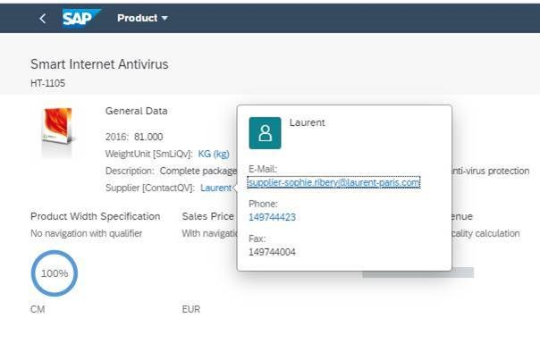

<!-- loio214dc25fb47f42c6a0091dfe71e87950 -->

# Contact Facet

Using the `@Communication.Contact` annotation, you can enable a quick view contact within the header form facet, as shown in the sections below.


<a name="loio214dc25fb47f42c6a0091dfe71e87950__section_ewf_xf5_dnb"/>

## Additional Features in SAP Fiori Elements for OData V2

  

In the example, the `UI.DataFieldForAnnotation` points to a contact annotation on a different entity, which has a 1:1 relation to the root entity, and so one contact is displayed in the header. The label, for example *Supplier*, is taken from `UI.DataFieldForAnnotation`, and the value, for example *Laurent*, is the `fn` property of the contact annotation.


### Contact link

> ### Sample Code:  
> XML Annotation
> 
> ```
> 
> <Record Type="UI.DataFieldForAnnotation">
>        <PropertyValue Property="Label" String="Supplier [ContactQV]"/>
>        <PropertyValue Property="Target" AnnotationPath="to_Supplier/@Communication.Contact"/>
>        <Annotation Term="UI.Importance" EnumMember="UI.ImportanceType/High"/>
> </Record>
> ```

> ### Sample Code:  
> ABAP CDS Annotation
> 
> ```
> 
> @UI.fieldGroup: [
>   {
>     importance: #LOW,
>     value: '_STOCKAVAILABILITY.QUANTITY',
>     position: 10 ,
>     qualifier: 'GeneralInformationForHeader',
>     groupLabel: '{@i18n>@GeneralInfoFieldGroupLabel}'
>   }
> ]
> _STOCKAVAILABILITY;
> 
> @UI.fieldGroup: [
>   {
>     importance: #HIGH,
>     position: 20 ,
>     qualifier: 'GeneralInformationForHeader'
>   }
> ]
> WEIGHT;
> 
> @UI.fieldGroup: [
>   {
>     importance: #HIGH,
>     label: 'WeightUnit [SmLiQv]',
>     position: 30 ,
>     qualifier: 'GeneralInformationForHeader'
>   }
> ]
> WEIGHTUNIT;
> 
> @UI.fieldGroup: [
>   {
>     importance: #HIGH,
>     label: 'Supplier [ContactQV]',
>     value: '_SUPPLIER',
>     type: #AS_CONTACT,
>     position: 40 ,
>     qualifier: 'GeneralInformationForHeader'
>   }
> ]
> MANAGER;
> 
> ```


### Popover

> ### Sample Code:  
> XML Annotation
> 
> ```
> <Annotation Term="Communication.Contact">
>                           <Record>
>                                <PropertyValue Property="fn" Path="CompanyName"/>
>                                <PropertyValue Property="email">
>                                     <Collection>
>                                           <Record>
>                                                <PropertyValue Property="type" EnumMember="Communication.ContactInformationType/work"/>
>                                                <PropertyValue Property="address" Path="EmailAddress"/>
>                                           </Record>
>                                     </Collection>
>                                </PropertyValue>
>                                <PropertyValue Property="tel">
>                                     <Collection>
>                                           <Record>
>                                                <PropertyValue Property="type" EnumMember="Communication.PhoneType/preferred Communication.PhoneType/work"/>
>                                                <PropertyValue Property="uri" Path="PhoneNumber"/>
>                                           </Record>
>                                           <Record>
>                                                <PropertyValue Property="type" EnumMember="Communication.PhoneType/fax"/>
>                                                <PropertyValue Property="uri" Path="FaxNumber"/>
>                                           </Record>
>                                     </Collection>
>                                </PropertyValue>
>                           </Record>
>                      </Annotation>
> 
> ```

> ### Sample Code:  
> ABAP CDS Annotation
> 
> ```
> 
> define view VIEWNAME
> {
> 
>  @Semantics.name.fullName: true
>   CompanyName,
> 
>   
>   @Semantics.eMail.address: true
>   @Semantics.eMail.type:  [#WORK]
>   EmailAddress,
>    
>   @Semantics.telephone.type:  [ #CELL ] 
>   PhoneNumber,
>  
>   @Semantics.telephone.type: [ #FAX ]
>   FaxNumber,
> }
> 
> ```


<a name="loio214dc25fb47f42c6a0091dfe71e87950__section_wtx_hg5_dnb"/>

## Additional Features in SAP Fiori Elements for OData V4

  
  
**Contact Facet**

 

In the example, the `UI.DataFieldForAnnotation` points to a contact annotation on a different entity, which has a 1:1 relation to the root entity, and so one contact is displayed in the header. The label, for example *Sold-To-Party*, is taken from `UI.DataFieldForAnnotation`, and the value, for example *Domestic HK Customer 1*, is the `fn` property of the contact annotation.


### Contact Link

> ### Sample Code:  
> XML Annotation
> 
> ```
> 
> <Annotation Term="UI.FieldGroup" Qualifier="OrderData">
>     <Record Type="UI.FieldGroupType">
>         <PropertyValue Property="Data">
>             <Collection>
>                 <Record Type="UI.DataFieldWithNavigationPath">
>                     <PropertyValue Property="Label" String="Referenced Sales Order"/>
>                     <PropertyValue Property="Value" Path="_ReferencedSalesOrder/SalesOrder"/>
>                     <PropertyValue Property="Target" NavigationPropertyPath="SalesOrderManage"/>
>                 </Record>
>                 <Record Type="UI.DataFieldForAnnotation">
>                     <PropertyValue Property="Target" AnnotationPath="_SoldToParty/@Communication.Contact"/>
>                     <PropertyValue Property="Label" String="Sold-To-Party"/>
>                 </Record>
>                 <Record Type="UI.DataField">
>                     <PropertyValue Property="Value" Path="PurchaseOrderByCustomer"/>
>                     <Annotation Term="UI.Importance" EnumMember="UI.ImportanceType/High"/>
>                 </Record>
>                 <Record Type="UI.DataField">
>                     <PropertyValue Property="Value" Path="SalesOrderDate"/>
>                     <Annotation Term="UI.Importance" EnumMember="UI.ImportanceType/High"/>
>                     <Annotation Term="UI.Hidden" Path="Delivered"/>
>                 </Record>
>                 <Record Type="UI.DataField">
>                     <PropertyValue Property="Value" Path="ShippingCondition"/>
>                     <Annotation Term="UI.Importance" EnumMember="UI.ImportanceType/High"/>
>                 </Record>
>                 <Record Type="UI.DataField">
>                     <PropertyValue Property="Value" Path="OverallSDProcessStatus"/>
>                     <Annotation Term="UI.Importance" EnumMember="UI.ImportanceType/High"/>
>                     <PropertyValue Property="Criticality" Path="StatusCriticality"/>
>                 </Record>
>                 <Record Type="UI.DataField">
>                     <PropertyValue Property="Value" Path="DescriptionFieldForOPACleanup"/>
>                     <Annotation Term="UI.Importance" EnumMember="UI.ImportanceType/High"/>
>                 </Record>
>             </Collection>
>         </PropertyValue>
>     </Record>
> </Annotation>
> 
> ```

> ### Sample Code:  
> ABAP CDS Annotation
> 
> ```
> 
> @UI.fieldGroup: [
>   {
>     targetelement: 'SALESORDERMANAGE',
>     label: 'Referenced Sales Order',
>     value: '_REFERENCEDSALESORDER.SALESORDER',
>     type: #WITH_NAVIGATION_PATH,
>     position: 10,
>     qualifier: 'OrderData'
>   }
> ]
> _REFERENCEDSALESORDER;
> 
> @UI.fieldGroup: [
>   {
>     value: '_SOLDTOPARTY',
>     label: 'Sold-To-Party',
>     type: #AS_CONTACT,
>     position: 20 ,
>     qualifier: 'OrderData'
>   }
> ]
> _SOLDTOPARTY;
> 
> @UI.fieldGroup: [
>   {
>     importance: #HIGH,
>     position: 30 ,
>     qualifier: 'OrderData'
>   }
> ]
> PURCHASEORDERBYCUSTOMER;
> 
> @UI.fieldGroup: [
>   {
>     importance: #HIGH,
>     hidden: true,
>     position: 40 ,
>     qualifier: 'OrderData'
>   }
> ]
> SALESORDERDATE;
> 
> @UI.fieldGroup: [
>   {
>     importance: #HIGH,
>     position: 50 ,
>     qualifier: 'OrderData'
>   }
> ]
> SHIPPINGCONDITION;
> 
> @UI.fieldGroup: [
>   {
>     importance: #HIGH,
>     criticality: 'STATUSCRITICALITY',
>     position: 60 ,
>     qualifier: 'OrderData'
>   }
> ]
> OVERALLSDPROCESSSTATUS;
> 
> @UI.fieldGroup: [
>   {
>     importance: #HIGH,
>     position: 70 ,
>     qualifier: 'OrderData'
>   }
> ]
> DESCRIPTIONFIELDFOROPACLEANUP;
> 
> ```

> ### Sample Code:  
> CAP CDS Annotation
> 
> ```
> 
> UI.FieldGroup #OrderData : {
>     $Type : 'UI.FieldGroupType',
>     Data : [
>         {
>             $Type : 'UI.DataFieldWithNavigationPath',
>             Label : 'Referenced Sales Order',
>             Value : _ReferencedSalesOrder.SalesOrder,
>             Target : SalesOrderManage
>         },
>         {
>             $Type : 'UI.DataFieldForAnnotation',
>             Target : '_SoldToParty/@Communication.Contact',
>             Label : 'Sold-To-Party'
>         },
>         {
>             $Type : 'UI.DataField',
>             Value : PurchaseOrderByCustomer,
>             ![@UI.Importance] : #High
>         },
>         {
>             $Type : 'UI.DataField',
>             Value : SalesOrderDate,
>             ![@UI.Importance] : #High,
>             ![@UI.Hidden] : Delivered
>         },
>         {
>             $Type : 'UI.DataField',
>             Value : ShippingCondition,
>             ![@UI.Importance] : #High
>         },
>         {
>             $Type : 'UI.DataField',
>             Value : OverallSDProcessStatus,
>             Criticality : StatusCriticality,
>             ![@UI.Importance] : #High
>         },
>         {
>             $Type : 'UI.DataField',
>             Value : DescriptionFieldForOPACleanup,
>             ![@UI.Importance] : #High
>         }
>     ]
> }
> 
> ```


### Popover

> ### Sample Code:  
> XML Annotation
> 
> ```
> 
> <Annotation Term="Communication.Contact">
>     <Record Type="Communication.ContactType">
>         <PropertyValue Property="adr">
>             <Collection>
>                 <Record Type="Communication.AddressType">
>                     <PropertyValue Property="type" EnumMember="Communication.ContactInformationType/work"/>
>                     <PropertyValue Property="uri" Path="InternationalPhoneNumber"/>
>                     <PropertyValue Property="code" Path="PostalCode"/>
>                     <PropertyValue Property="country" Path="Country"/>
>                     <PropertyValue Property="locality" Path="CityName"/>
>                 </Record>
>             </Collection>
>         </PropertyValue>
>         <PropertyValue Property="email">
>             <Collection>
>                 <Record Type="Communication.EmailAddressType">
>                     <PropertyValue Property="type" EnumMember="Communication.ContactInformationType/work"/>
>                     <PropertyValue Property="address" Path="EmailAddress"/>
>                 </Record>
>             </Collection>
>         </PropertyValue>
>         <PropertyValue Property="fn" Path="CustomerName"/>
>         <PropertyValue Property="tel">
>             <Collection>
>                 <Record Type="Communication.PhoneNumberType">
>                     <PropertyValue Property="type" EnumMember="Communication.PhoneType/fax"/>
>                     <PropertyValue Property="uri" Path="InternationalPhoneNumber"/>
>                 </Record>
>             </Collection>
>         </PropertyValue>
>         <PropertyValue Property="photo" Path="CustomerImg"/>
>     </Record>
> </Annotation>
> 
> ```

> ### Sample Code:  
> ABAP CDS Annotation
> 
> ```
> 
> define view VIEWNAME
> {
>   @Semantics.name.fullName: true
>   CustomerName,
> 
>   @Semantics.eMail.address: true
>   @Semantics.eMail.type:  [#WORK]
>   EmailAddress,
>    
>   @Semantics.telephone.type:  [ #FAX ] 
>   InternationalPhoneNumber,
> 
>   @Semantics.address : { zipCode: true } 
>   PostalCode,
> 
>   @Semantics.address : { country: true } 
>   Country,
> 
>   @Semantics.address : { city: true }  
>   CityName,
> 
>   @Semantics.contact.photo: true
>   CustomerImg
> }
> 
> ```

> ### Sample Code:  
> CAP CDS Annotation
> 
> ```
> 
> Communication.Contact : {
>     $Type : 'Communication.ContactType',
>     adr : [
>         {
>             $Type : 'Communication.AddressType',
>             type : #work,
>             uri : InternationalPhoneNumber,
>             code : PostalCode,
>             country : Country,
>             locality : CityName
>         }
>     ],
>     email : [
>         {
>             $Type : 'Communication.EmailAddressType',
>             type : #work,
>             address : EmailAddress
>         }
>     ],
>     fn : CustomerName,
>     tel : [
>         {
>             $Type : 'Communication.PhoneNumberType',
>             type : #fax,
>             uri : InternationalPhoneNumber
>         }
>     ],
>     photo : CustomerImg
> },
> 
> ```


## More Information

For more information about the `Communication.Contact` annotation, see [Adding a Contact Facet](adding-a-contact-facet-a6a8c0c.md).

