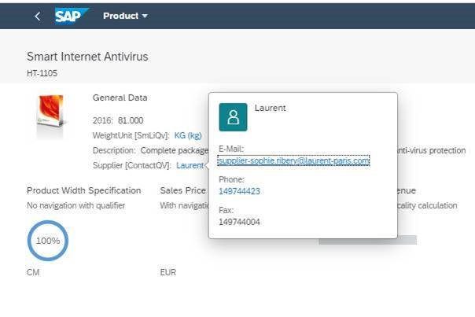

<!-- loio214dc25fb47f42c6a0091dfe71e87950 -->

# Contact Facet

You can use the `@Communication.Contact` annotation to enable a quick view contact in the header form facet.



In the example, the `UI.DataFieldForAnnotation` points to a contact annotation on a different entity, which has a 1:1 relation to the root entity, and so one contact is displayed in the header. The label, for example *Supplier*, is taken from `UI.DataFieldForAnnotation`, and the value, for example *Laurent*, is the `fn` property of the contact annotation.


<a name="loio214dc25fb47f42c6a0091dfe71e87950__section_mbj_t4m_ghc"/>

## Contact Link

> ### Sample Code:  
> XML Annotation
> 
> ```
> 
> <Record Type="UI.DataFieldForAnnotation">
>        <PropertyValue Property="Label" String="Supplier [ContactQV]"/>
>        <PropertyValue Property="Target" AnnotationPath="to_Supplier/@Communication.Contact"/>
>        <Annotation Term="UI.Importance" EnumMember="UI.ImportanceType/High"/>
> </Record>
> ```

> ### Sample Code:  
> ABAP CDS Annotation
> 
> ```
> 
> @UI.fieldGroup: [
>   {
>     importance: #LOW,
>     value: '_STOCKAVAILABILITY.QUANTITY',
>     position: 10 ,
>     qualifier: 'GeneralInformationForHeader',
>     groupLabel: '{@i18n>@GeneralInfoFieldGroupLabel}'
>   }
> ]
> _STOCKAVAILABILITY;
> 
> @UI.fieldGroup: [
>   {
>     importance: #HIGH,
>     position: 20 ,
>     qualifier: 'GeneralInformationForHeader'
>   }
> ]
> WEIGHT;
> 
> @UI.fieldGroup: [
>   {
>     importance: #HIGH,
>     label: 'WeightUnit [SmLiQv]',
>     position: 30 ,
>     qualifier: 'GeneralInformationForHeader'
>   }
> ]
> WEIGHTUNIT;
> 
> @UI.fieldGroup: [
>   {
>     importance: #HIGH,
>     label: 'Supplier [ContactQV]',
>     value: '_SUPPLIER',
>     type: #AS_CONTACT,
>     position: 40 ,
>     qualifier: 'GeneralInformationForHeader'
>   }
> ]
> MANAGER;
> 
> ```


<a name="loio214dc25fb47f42c6a0091dfe71e87950__section_qsv_x4m_ghc"/>

## Popover

> ### Sample Code:  
> XML Annotation
> 
> ```
> <Annotation Term="Communication.Contact">
>                           <Record>
>                                <PropertyValue Property="fn" Path="CompanyName"/>
>                                <PropertyValue Property="email">
>                                     <Collection>
>                                           <Record>
>                                                <PropertyValue Property="type" EnumMember="Communication.ContactInformationType/work"/>
>                                                <PropertyValue Property="address" Path="EmailAddress"/>
>                                           </Record>
>                                     </Collection>
>                                </PropertyValue>
>                                <PropertyValue Property="tel">
>                                     <Collection>
>                                           <Record>
>                                                <PropertyValue Property="type" EnumMember="Communication.PhoneType/preferred Communication.PhoneType/work"/>
>                                                <PropertyValue Property="uri" Path="PhoneNumber"/>
>                                           </Record>
>                                           <Record>
>                                                <PropertyValue Property="type" EnumMember="Communication.PhoneType/fax"/>
>                                                <PropertyValue Property="uri" Path="FaxNumber"/>
>                                           </Record>
>                                     </Collection>
>                                </PropertyValue>
>                           </Record>
>                      </Annotation>
> 
> ```

> ### Sample Code:  
> ABAP CDS Annotation
> 
> ```
> 
> define view VIEWNAME
> {
> 
>  @Semantics.name.fullName: true
>   CompanyName,
> 
>   
>   @Semantics.eMail.address: true
>   @Semantics.eMail.type:  [#WORK]
>   EmailAddress,
>    
>   @Semantics.telephone.type:  [ #CELL ] 
>   PhoneNumber,
>  
>   @Semantics.telephone.type: [ #FAX ]
>   FaxNumber,
> }
> 
> ```


<a name="loio214dc25fb47f42c6a0091dfe71e87950__section_ar2_l4m_ghc"/>

## Related Links

For more information about the `Communication.Contact` annotation, see [Adding a Contact Facet](adding-a-contact-facet-9375d6a.md).

