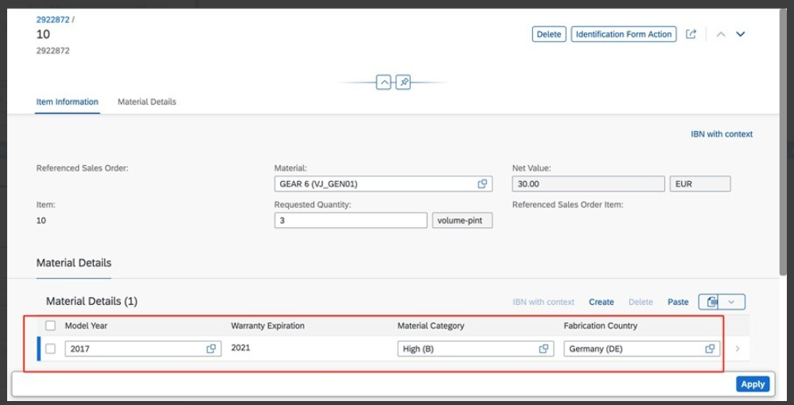
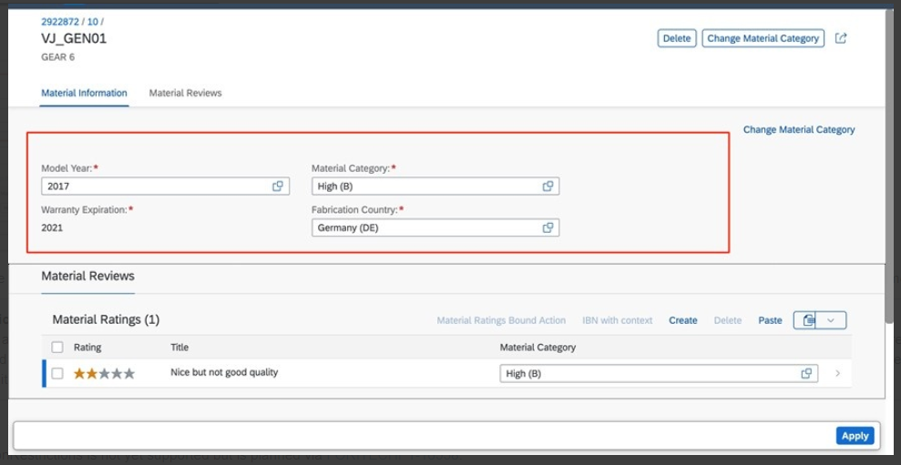

<!-- loio5c8763f0fb1f4cc7aaab6cc19d5ee45c -->

# Controlling the Editability of Sections

You can control the editability of the fields of a child entity.

> ### Note:  
> Please note that this topic is currently only applicable to SAP Fiori elements for OData V4.


Application developers can control the editability of all fields in one go using `UpdateRestrictions`.

> ### Sample Code:  
> XML Annotation
> 
> ```xml
> <Annotations Target="com.c_salesordermanage_sd.MaterialCategory">
>      <Annotation Term="Capabilities.UpdateRestrictions">
>           <Record Type="Capabilities.UpdateRestrictionsType">
>                <PropertyValue Property="Updatable" Bool="true"/>
>           </Record>
>      </Annotation>
> </Annotations>
> 
> 
> ```

> ### Sample Code:  
> ABAP CDS Annotation
> 
> No ABAP CDS annotation sample is available. Please use the local XML annotation.

> ### Sample Code:  
> CAP CDS Annotation
> 
> ```
> annotate c_salesordermanage_sd.MaterialCategory with @Capabilities : {
> UpdateRestrictions : {Updatable : true}
> };
> 
> ```

`UpdateRestrictions` is ignored for the main entity set due to `EditAction`. You can, however, edit the fields originating from another entity in the tables and forms in object pages and subobject pages, provided that the list report entity set can be updated. If the list report entity set can be updated, the editability of a field further depends on the *edit* state of the UI and the field control of the property. If the entity cannot be updated, you cannot edit the field, regardless of the state of the UI and the field control of the property.

For more information about the field control, see [Further Features of the Field](further-features-of-the-field-f49a0f7.md).

The system gives priority to the `Org.OData.Capabilities.V1.NavigationRestrictions` of the parent entity set. Depending on the value of the `Updatable` property of `UpdateRestrictions`, the child section content can be editable.

If `NavigationRestrictions` has `Updatable=false`, the child entity records cannot be edited. Whereas, if the `NavigationRestrictions` has `Updatable=true` or a path, the option to edit depends on the `Updatable` property of the child entity.

> ### Sample Code:  
> XML Annotation
> 
> ```xml
> <Annotation Term="Capabilities.NavigationRestrictions">
>      <Record Type="Capabilities.NavigationRestrictionsType">
>           <PropertyValue Property="RestrictedProperties">
>                <Collection>
>                     <Record Type="Capabilities.NavigationPropertyRestriction">
>                          <PropertyValue Property="NavigationProperty" NavigationPropertyPath="_MaterialDetails"/>
>                          <PropertyValue Property="UpdateRestrictions">
>                               <Record Type="Capabilities.UpdateRestrictionsType">
>                                    <PropertyValue Property="Updatable" Bool="false"/>
>                               </Record>
>                          </PropertyValue>
>                     </Record>
>                </Collection>
>           </PropertyValue>
>      </Record>
> </Annotation>
> ```

> ### Sample Code:  
> ABAP CDS Annotation
> 
> No ABAP CDS annotation sample is available. Please use the local XML annotation.

> ### Sample Code:  
> CAP CDS Annotation
> 
> ```
> entity SalesOrderItem                                     @(
> Capabilities : {
> NavigationRestrictions : {RestrictedProperties : [{
> NavigationProperty : _MaterialDetails,
> UpdateRestrictions     : {Updatable : false}
> }]}        
> });
> 
> ```

For more information on how to control the editability for the main entity set that has an `EditAction`, see the section *Enablement of Operations* in the topic [Adding Actions to Tables](adding-actions-to-tables-b623e0b.md) \(under *Additional Features in SAP Fiori elements for OData V4*\).

Both Boolean and path values of `UpdateRestrictions` are supported.

The following sample code shows an example of a path-based update restriction:

> ### Sample Code:  
> XML Annotation
> 
> ```xml
> <Annotations Target="com.c_salesordermanage_sd_aggregate.MaterialDetails">
>      <Annotation Term="Capabilities.UpdateRestrictions">
>           <Record Type="Capabilities.UpdateRestrictionsType">
>                <PropertyValue Property="Updatable" Path="isUpdatable"/>
>           </Record>
>      </Annotation>
> </Annotations>
> 
> ```

> ### Sample Code:  
> ABAP CDS Annotation
> 
> No ABAP CDS annotation sample is available. Please use the local XML annotation.

> ### Sample Code:  
> CAP CDS Annotation
> 
> ```
> annotate MaterialDetails with @(
>     Capabilities.UpdateRestrictions : {
>         Updatable : isUpdatable
>     }
> );
> 
> ```

  

In the screenshot above, the field *Warranty Expiration* comes from an entity set for which `UpdateRestrictions` evaluates to `false`. Therefore, it is in display mode even when the object page is in edit mode and the other fields \(from other entity sets\) are editable. This is also true when you navigate to the subobject page:

  

The screenshot shows that none of the fields from the *Material Reviews* entity set are editable. This is because `UpdateRestrictions` of the *Material Reviews* entity set evaluates to `false`. Note that the field *Material Category* comes from a different entity set.

> ### Note:  
> Application developers should be aware of the following behavior when setting a static `false` value for `UpdateRestrictions`: Since these restrictions are applicable for both draft as well as active records, doing so prevents an update even on the draft copy \(which was not yet activated\). To avoid this, please use a path-based value for `UpdateRestrictions`, so that the editability is enabled for records for the subobject page that were just created \(but not yet activated\), while `UpdateRestrictions` evaluates to `true` only for activated records. This ensures that users can create and edit the draft records, but can no longer edit after activation.

