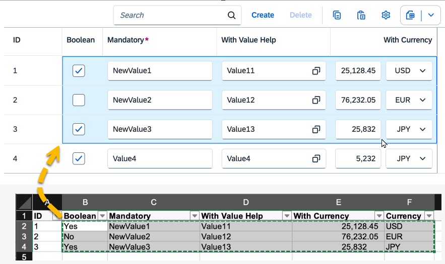
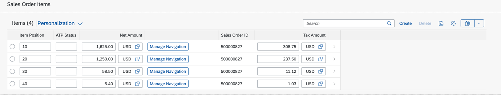
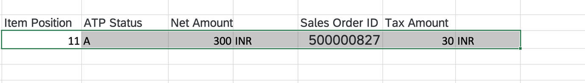

<!-- loio181c4e6e6eaa411eb0fa0cd371726238 -->

# Copying and Pasting from External Applications to Tables

Users can copy and paste from external applications to tables.

> ### Note:  
> For information about SAP Fiori elements for OData V4, see [Copying and Pasting from External Applications to Tables](copying-and-pasting-from-external-applications-to-tables-f6a8fd2.md).

Users can copy and paste data from external applications or other SAP Fiori elements apps to tables that are editable.

The *Copy* button is shown in the table toolbar by default. The *Paste* icon is shown only if the table supports the paste action.

For information about disabling the *Copy to Clipboard* and *Paste* buttons, see [Adapting the UI: List Report Page and Object Page](adapting-the-ui-list-report-page-and-object-page-0d2f1a9.md).

The paste action is available for the following scenarios:

-   Table-level paste

    Here, a new row is created to paste data copied from the clipboard. Once users have copied data to the clipboard from an external application such as a spreadsheet, they can focus anywhere on the table or select an empty row to paste data. They can trigger the browser paste \([CTRL\] + [V\]  for Microsoft Windows, [CMD\] + [V\]  for macOS\) or click the *Paste* icon in the table. New rows are created only for draft-enabled applications, and for tables with creation mode set to `inline` or `creationRows`.

-   Cell-level paste

    Here, users can either add a new value or update existing values within a cell or a group of cells. To paste the data, they must either select a single cell or a group of cells within the table. If the selected cell or cells contain active or draft rows, their values are replaced with data from the clipboard. New rows are created to paste additional data if an empty row is part of the selected cells.

    > ### Note:  
    > Only grid tables and responsive tables support the cell-level paste.

> ### Tip:  
> For preparation of data for pasting, SAP Fiori elements recommends using exported spreadsheet format that contains split cells with multiple values. This helps to avoid formatting issues during the paste action.

> ### Note:  
> -   Only the pasting of simple data fields is supported. Complex fields, such as links, images, connected fields, multi-input fields, and field groups, are not supported.
> 
> -   When pasting to cells containing both ID and text, the property itself is updated but its text description is updated only after saving.
> 
> -   If there are validation errors, an error message is shown in a dialog box so that the user can take action.
> 
> -   If new rows are created during the paste action, all these rows are included in a single `POST` batch call. The duration of the `POST` call increases with the number of rows pasted.
> 
> -   For new rows created during the paste action, the order of the data copied from a spreadsheet or external application might differ from the order in the table after the user has inserted it. SAP Fiori elements cannot control this.
> -   This feature is not supported in custom tables.
> 
> -   In the object page, the *Export to Spreadsheet* feature is available by default only if the copy/paste feature is available.

The paste function in a smart table is also available if the smart table contains an inline action.

Sample data:

Note that the columns containing inline actions are ignored by the paste operation. Therefore, they must be omitted from the source while copying, as shown in the screenshot.

Read-only columns are also ignored by the paste operation. However, these columns are exported along with the rest of the data when the data is exported to a spreadsheet. They are a part of the format for preparing data in spreadsheets.

