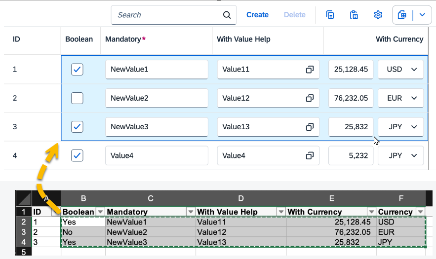

<!-- loiof6a8fd2812d9442a9bba2f6fb296c42e -->

# Copying and Pasting from External Applications to Tables

End users can copy and paste data from external applications or other SAP Fiori elements applications to tables that are editable.

The *Copy* button is shown in the table toolbar by default. The *Paste* icon is shown only if the table supports the paste action.

The paste action is available for the following scenarios:

-   Table-level paste

    Here, a new row is created to paste data copied from the clipboard. Once end users have copied data to the clipboard from an external application such as a spreadsheet, they can focus anywhere on the table or select an empty row to paste data. They can trigger the browser paste \([CTRL\] + [V\]  for Microsoft Windows, [CMD\] + [V\]  for macOS\) or click the *Paste* icon in the table. New rows are created only for draft-enabled applications, and for tables with creation mode set to `inline` or `creationRows`.

-   Cell-level paste

    Here, end users can either add a new value or update existing values within a cell or a group of cells. To paste the data, they must either select a single cell or a group of cells within the table. If the selected cell or cells contain active or draft rows, their values are replaced with data from the clipboard. New rows are created to paste additional data if an empty row is part of the selected cells.

    > ### Note:  
    > Only grid tables and responsive tables support the cell-level paste.


> ### Tip:  
> For preparation of data for pasting, SAP Fiori elements recommends using exported spreadsheet format that contains split cells with multiple values. This helps to avoid formatting issues during the paste action.



> ### Note:  
> -   Only the pasting of simple data fields is supported. Complex fields, such as links, images, connected fields, multi-input fields, and field groups, are not supported.
> 
> -   When pasting to cells containing both ID and text, the property itself is updated but its text description is updated only after saving.
> 
> -   If there are validation errors, an error message is shown in a dialog box so that the end user can take action.
> 
> -   If new rows are created during the paste action, all these rows are included in a single `POST` batch call. The duration of the `POST` call increases with the number of rows pasted.
> 
> -   For new rows created during the paste action, the order of the data copied from a spreadsheet or external application might differ from the order in the table after the end user has inserted it. SAP Fiori elements cannot control this.
> -   This feature is not supported for tables with custom columns or custom tables.
> 
> -   In the object page, the *Export to Spreadsheet* feature is available by default only if the copy/paste feature is available. For more information, see [Using the Export Feature](using-the-export-feature-4bab6f2.md).


<a name="loiof6a8fd2812d9442a9bba2f6fb296c42e__section_u4k_cnp_gnb"/>

## Additional Features in SAP Fiori Elements for OData V2

The paste function in a smart table is also available if the smart table contains an inline action.


Sample data:


Note that the columns containing inline actions are ignored by the paste operation. Therefore, they must be omitted from the source while copying, as shown in the screenshot.

Read-only columns are also ignored by the paste operation. However, these columns are exported along with the rest of the data when the data is exported to a spreadsheet. They are a part of the format for preparing data in spreadsheets.


<a name="loiof6a8fd2812d9442a9bba2f6fb296c42e__section_u35_d22_tnb"/>

## Additional Features in SAP Fiori Elements for OData V4

The paste function is enabled by default on the object page if the creation mode is set to inline or empty row. For more information, see [Enabling Inline Creation Mode or Empty Row Mode for Table Entries](enabling-inline-creation-mode-or-empty-row-mode-for-table-entries-cfb04f0.md).


To generate an example with the expected format for pasting your data, export the table with the split cell mode:


> ### Note:  
> -   The user has to maintain the placeholder for inline actions in the spreadsheet application. The column fields can also be empty.
> 
> -   Properties annotated with a text arrangement set to text only cannot be pasted.
> 
> -   When a user pastes data into a table, SAP Fiori elements for OData V4 verifies that the pasted content aligns with the designated data field type. However, additional checks such as field editability and validation of values against fixed value lists are not performed by the front end. Therefore, you must ensure strict validation by the back end.

The paste option can be disabled with the `enablePaste` parameter.

> ### Sample Code:  
> ```
>                 "SalesOrderManageObjectPageEnableExport": {
>                     "type": "Component",
>                     "id": "SalesOrderManageObjectPage",
>                     "name": "sap.fe.templates.ObjectPage",
>                     "options": {
>                         "settings": {
>                             "controlConfiguration": {
>                                 _Item/@com.sap.vocabularies.UI.v1.LineItem: {
>                                     "tableSettings": {
>                                         "type": "GridTable",
>                                         "enablePaste": false,
>                                         "condensedTableLayout": true,
>                                         "personalization": {
>                                             "column": true,
>                                             "sort": false
>                                         },
>                                         "creationMode": {
>                                             "name": "Inline"
>                                         }
>                                     }
>                                 }
>                             }
> 
> ```

Users can also copy multiple rows as well as ranges of rows and columns to the clipboard. For more information, see the [Copying Multiple Rows and Range Selections](tables-c0f6592.md#loioc0f6592a592e47f9bb6d09900de47412__section_pth_3mb_dzb) section in [Tables](tables-c0f6592.md).

> ### Restriction:  
> You can't paste content in a cell that contains a navigation property.

