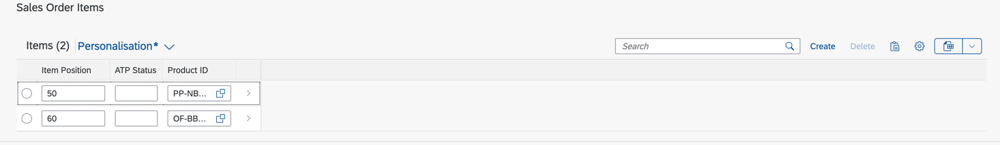
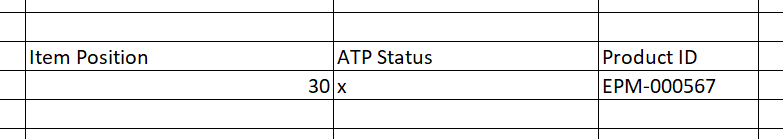
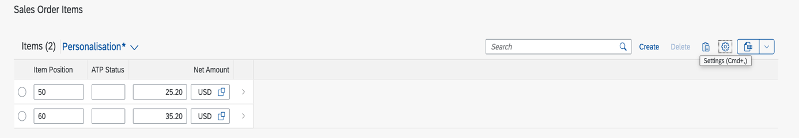
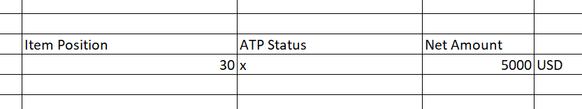
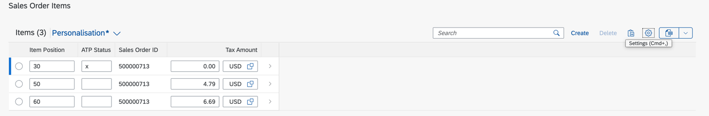
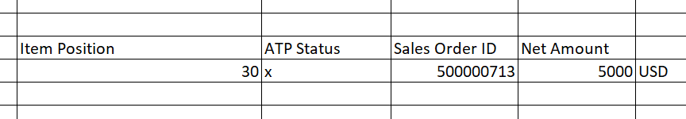
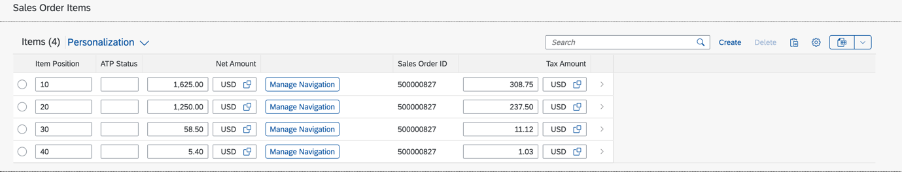
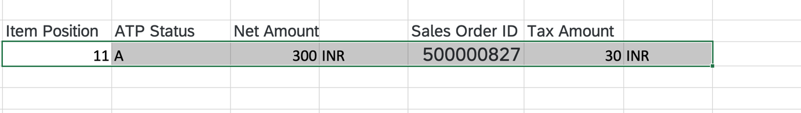
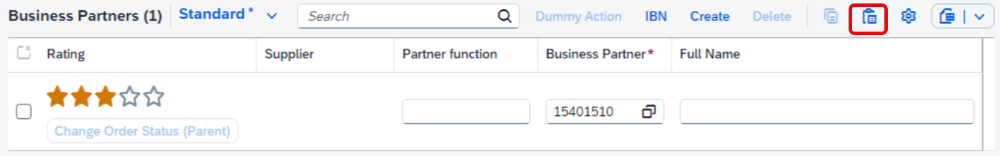
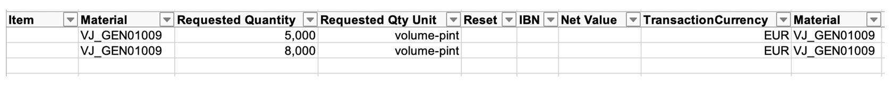

<!-- loiof6a8fd2812d9442a9bba2f6fb296c42e -->

# Copying and Pasting from Spreadsheet Applications to Tables

You can copy and paste data from spreadsheet applications to responsive tables and grid tables.

A *Paste* button is shown in the table toolbar. Once you have copied data from a spreadsheet application, the focus can be anywhere in the table except for the cells. You can trigger the browser paste \( [CTRL\] + [V\]  for Microsoft Windows,  [CMD\] + [V\]  for macOS\) or click *Paste* on the smart table. The paste function in a smart table is available for the following scenarios:

-   In edit mode, the smart table only has editable fields.

      

    Sample data:

      

-   In edit mode, the smart table only has editable fields. It also contains multiple editable fields in a single column, for example, value and unit of measure.

    

    Sample data:

      

-   The smart table has both editable and non-editable fields.

      

    Sample data:

      

    > ### Note:  
    > You have to maintain the placeholder for non-editable fields in spreadsheet applications. The fields can also be empty.


> ### Note:  
> -   Only the pasting of simple data fields is supported. Complex fields, such as smart links, images, connected fields, multi-input fields, and field groups, are not supported.
> 
> -   If there are validation errors, an error message is shown in a dialog box so that the user can take action.
> 
> -   All records that a user pastes are part of one POST batch call. The duration of the POST call increases with the number of records pasted.
> 
> -   The order of the data copied from a spreadsheet application might differ from the order in the table after you have pasted it. SAP Fiori elements cannot control this.
> 
> -   This feature is not supported for tables with custom columns and custom tables.
> 
> -   In the object page, the *Export to Spreadsheet* feature is available by default only if the copy/paste feature is available. For more information, see [Adapting the UI: List Report and Object Page](adapting-the-ui-list-report-and-object-page-0d2f1a9.md) for SAP Fiori elements for OData V2 [Using the Export Feature](using-the-export-feature-4bab6f2.md) for SAP Fiori elements for OData V4.


<a name="loiof6a8fd2812d9442a9bba2f6fb296c42e__section_u4k_cnp_gnb"/>

## Additional Features in SAP Fiori Elements for OData V2


### Prerequisites

In SAP Fiori elements for OData V2, you need to fulfill these prerequisites to use this feature:

-   The app is draft-enabled.

-   Inline creation is enabled for the object page table. For more information, see [Enabling Inline Creation Mode or Empty Rows Mode for Table Entries](enabling-inline-creation-mode-or-empty-rows-mode-for-table-entries-cfb04f0.md).

-   The create action is supported in the object page table.


The paste function in a smart table is also available if the smart table contains an inline action.

  

Sample data:

  

> ### Note:  
> Do not make entries for inline actions since the actions are not actual columns in the smart table.


<a name="loiof6a8fd2812d9442a9bba2f6fb296c42e__section_u35_d22_tnb"/>

## Additional Features in SAP Fiori Elements for OData V4

The paste function is enabled by default on the object page if the creation mode is set to inline or empty rows. For more information, see [Enabling Inline Creation Mode or Empty Rows Mode for Table Entries](enabling-inline-creation-mode-or-empty-rows-mode-for-table-entries-cfb04f0.md).

  

To generate an example with the expected format for pasting your data, export the table with the split cell mode:

  

> ### Note:  
> -   The user has to maintain the placeholder for inline actions in the spreadsheet application. The column fields can also be empty.
> 
> -   Properties annotated with a text arrangement set to text only cannot be pasted.

The paste option can be disabled with the `enablePaste` parameter.

> ### Sample Code:  
> ```
>                 "SalesOrderManageObjectPageEnableExport": {
>                     "type": "Component",
>                     "id": "SalesOrderManageObjectPage",
>                     "name": "sap.fe.templates.ObjectPage",
>                     "options": {
>                         "settings": {
>                             "controlConfiguration": {
>                                 _Item/@com.sap.vocabularies.UI.v1.LineItem: {
>                                     "tableSettings": {
>                                         "type": "GridTable",
>                                         "enablePaste": false,
>                                         "condensedTableLayout": true,
>                                         "personalization": {
>                                             "column": true,
>                                             "sort": false
>                                         },
>                                         "creationMode": {
>                                             "name": "Inline"
>                                         }
>                                     }
>                                 }
>                             }
> 
> ```

