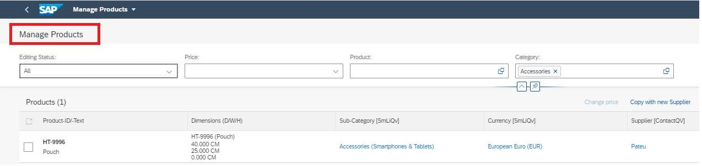
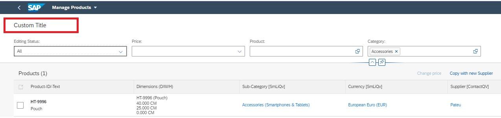

<!-- loio094fe8c8d8ac4f0eb4724b1a52d2ad61 -->

# Creating a List Report Page Without Variant Management

You can create a list report page app without variant management.


<a name="loio094fe8c8d8ac4f0eb4724b1a52d2ad61__context_fly_n3x_cnb"/>

## Context

> ### Note:  
> This topic describes how to use the building block within SAP Fiori elements floorplans. If the functionality isn't available when you use the building block in custom pages or custom sections, you can try achieving the functionality through other means, such as the following:
> 
> -   Properties or methods exposed by the building block
> 
> -   Custom code using extensions

Without variant management, and with no custom title added, your application appears as follows:

  
  
**App without Variant Management**



Without variant management and with a custom title added, your application appears as follows:

  
  
**App without Variant Management and with Custom Title**




For more information, see [Managing Variants](managing-variants-8ce658e.md).


<a name="loio094fe8c8d8ac4f0eb4724b1a52d2ad61__steps_p3k_ssc_mmb"/>

## Procedure

1.  Include the `variantManagement` property in the settings of the list report page target in the `manifest.json` file of your app.

    -   If you set the configuration to `None`, then the standard variant management is not available on the list report page. The app name is displayed instead.
    -   If you set the configuration to `Page` or `Control`, or if the configuration is not in the `manifest.json` file of the app, the standard variant management is available. For more information, see [Managing Variants](managing-variants-8ce658e.md).

    > ### Sample Code:  
    > List Report Page Without Variant Management
    > 
    > ```json
    > 
    > "sap.ui5": {
    >             "routing": {
    >                 "targets": {
    >                     "XXXXXX_List": {
    >                         "type": "Component",
    >                         "id": "XXXXXX_List",
    >                         "name": "sap.fe.templates.ListReport",
    >                         "options": {
    >                             "settings" : {
    >                                 "contextPath" : "/XXXXXX",
    >                                 "variantManagement": "None"
    >                                 }
    >                             }
    >                         }
    >                     },
    > 
    > ```

2.  If you want to use an app-specific title instead of the variant, include the `subTitle` property in the `i18n` file and enter a text value, as shown in the following sample code:

    > ### Sample Code:  
    > ```json
    > 
    > #XTIT, 40
    > appSubTitle = List Report Page Custom Title
    > ```

3.  Add a new property in the `manifest.json` file of your app as shown in the following sample code:

    > ### Sample Code:  
    > ```json
    > 
    > "sap.app": {
    >             "id": "XXXXXX",
    >             "type": "application",
    >             "i18n": "i18n/i18n.properties",
    >             "title": "{{title}}",
    >             "subTitle": "{{appSubTitle}}",
    >             "description": "{{description}}",
    > ```


**Related Information**  


[Enabling Variant Management on the Object Page](enabling-variant-management-on-the-object-page-f26d42b.md "You can enable and disable control-level variant management on the object page.")

<a name="concept_xqz_shb_c3c"/>

<!-- concept\_xqz\_shb\_c3c -->

## 

> ### Note:  
> For information about SAP Fiori elements for OData V2, see [Creating a List Report Page Without Variant Management](creating-a-list-report-page-without-variant-management-e3b12f4.md).

