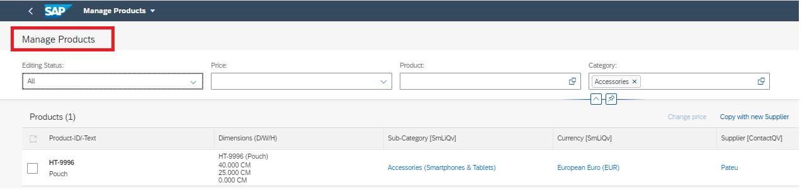
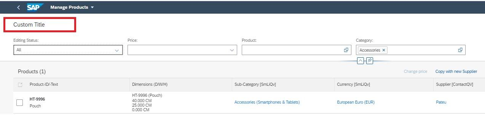

<!-- loio094fe8c8d8ac4f0eb4724b1a52d2ad61 -->

# Creating a List Report without Variant Management

The applications generated using the SAP Fiori elements includes the variant management option by default. However, you can also choose to create one without variant management.


<a name="loio094fe8c8d8ac4f0eb4724b1a52d2ad61__context_fly_n3x_cnb"/>

## Context

Without variant management, and with no custom title added, your application appears as follows:

  
  
**App without Variant Management**



Without variant management and with a custom title added, your application appears as follows:

  
  
**App without Variant Management and with Custom Title**




For more information, see [Managing Variants](managing-variants-8ce658e.md).

<a name="task_orp_fsc_mmb"/>

<!-- task\_orp\_fsc\_mmb -->

## **SAP Fiori Elements for OData V2**


<a name="task_orp_fsc_mmb__steps_zfh_msc_mmb"/>

## Procedure

1.  Include the `variantManagementHidden` flag in the settings of the list report component in the `manifest.json` file of your application.

    -   If you set the flag to `true`, then the standard variant management isn't available in the application. The application name is displayed instead.
    -   If you set the flag to `false`, or if the flag is not configured in the `manifest.json` file of your application, the standard variant management is available and can be either enabled or disabled.

    > ### Sample Code:  
    > List Report without Variant Management
    > 
    > ```
    > "sap.ui.generic.app": {
    >         "_version":"1.1.0",
    >         "pages": [
    >             {
    >                 "entitySet": "XXXXXX_Product",
    >                 "component": {
    >                     "name": "sap.suite.ui.generic.template.ListReport",
    >                     "list": true,
    >                     "settings" : {
    >                         "gridTable" : false,
    >                         "smartVariantManagement": true,
    >                         "variantManagementHidden": true // Hides Variant management
    >                     }
    >                 },
    > ```

2.  If you want to use an app-specific title instead of the variant, include the `subTitleIfVariantMgmtHidden` property in the `i18n` file and enter a text value, as shown in the following sample code:

    > ### Sample Code:  
    > ```json
    > 
    > #XTIT,40
    > subTitleIfVariantMgmtHidden = List Report Custom Title
    > ```

3.  Add a new property in the `manifest.json` file of the application, as shown in the following sample code:

    > ### Sample Code:  
    > ```
    > "sap.ui.generic.app": {
    >         "_version":"1.1.0",
    >         "pages": [
    >             {
    >                 "entitySet": "XXXXXX_Product",
    >                 "component": {
    >                     "name": "sap.suite.ui.generic.template.ListReport",
    >                     "list": true,
    >                     "settings" : {
    >                         "gridTable" : false,
    >                         "smartVariantManagement": true,
    >                         "variantManagementHidden": true,
    >                         "subTitleIfVariantMgmtHidden": "{{subTitleIfVariantMgmtHidden}}" // Adding Custom Title here
    >                     }
    >                 },
    > 
    > ```

    > ### Note:  
    > The `variantManagementHidden` property must be used in combination with `smartVariantManagement = true` to hide both the page variant and control variant. If used alone, it hides only the filter bar variant.


<a name="task_ozn_qsc_mmb"/>

<!-- task\_ozn\_qsc\_mmb -->

## **SAP Fiori Elements for OData V4**


<a name="task_ozn_qsc_mmb__steps_p3k_ssc_mmb"/>

## Procedure

1.  Include the `variantManagement` property in the settings of the list report target in the `manifest.json` file of your app.

    -   If you set the configuration to `None`, then the standard variant management is not available on the list report. The app name is displayed instead.
    -   If you set the configuration to `Page` or `Control`, or if the configuration is not in the `manifest.json` file of the app, the standard variant management is available. For more information, see [Managing Variants](managing-variants-8ce658e.md).

    > ### Sample Code:  
    > List Report without Variant Management
    > 
    > ```json
    > 
    > "sap.ui5": {
    >             "routing": {
    >                 "targets": {
    >                     "XXXXXX_List": {
    >                         "type": "Component",
    >                         "id": "XXXXXX_List",
    >                         "name": "sap.fe.templates.ListReport",
    >                         "options": {
    >                             "settings" : {
    >                                 "contextPath" : "/XXXXXX",
    >                                 "variantManagement": "None"
    >                                 }
    >                             }
    >                         }
    >                     },
    > 
    > ```

2.  If you want to use an app-specific title instead of the variant, include the `subTitle` property in the `i18n` file and enter a text value, as shown in the following sample code:

    > ### Sample Code:  
    > ```json
    > 
    > #XTIT, 40
    > appSubTitle = List Report Custom Title
    > ```

3.  Add a new property in the `manifest.json` file of your app as shown in the following sample code:

    > ### Sample Code:  
    > ```json
    > 
    > "sap.app": {
    >             "id": "XXXXXX",
    >             "type": "application",
    >             "i18n": "i18n/i18n.properties",
    >             "title": "{{title}}",
    >             "subTitle": "{{appSubTitle}}",
    >             "description": "{{description}}",
    > ```


**Related Information**  


[Enabling Variant Management on the Object Page](enabling-variant-management-on-the-object-page-f26d42b.md "You can enable and disable variant management on the object page.")

