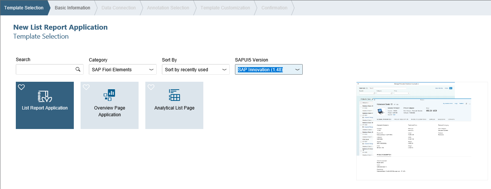

<!-- loiofe5bc65a220647f49ee575762d61d891 -->

# Creating a Project

In SAP Fiori elements for OData V2, you can also use SAP Web IDE to build UI applications when using SAP Fiori elements.

<a name="loiofe5bc65a220647f49ee575762d61d891__section_o2c_h1h_2nb"/>

## Using SAP Web IDE to Build UI Applications with SAP Fiori Elements for OData V2

As an app developer, you must define a configuration in SAP Web IDE. The main aspects are the destinations to the back-end metadata, navigation between pages, and page design \(as pages may contain several templates\).

> ### Caution:  
> SAP Web IDE is no longer available via SAP Business Technology Platform trial accounts. Any references to SAP Web IDE in this documentation are only relevant for you if you have access to SAP Web IDE through a productive SAP BTP account. Please consider SAP Business Application Studio as an alternative. See [App Development Using SAP Business Application Studio](../05_Developing_Apps/app-development-using-sap-business-application-studio-6bbad66.md).

For more information about SAP Web IDE, see the documentation for SAP Web IDE on the SAP Help Portal at [https://help.sap.com/viewer/p/SAP\_Web\_IDE](https://help.sap.com/viewer/p/SAP_Web_IDE).

The following figure shows the application in SAP Web IDE that starts the wizard for creating a new project:

  
  
**Template Selection Screen in SAP Web IDE**

  

### Prerequisites

-   You have created an OData service in your ABAP back-end system. For more information, see [Prerequisites for Using SAP Fiori Elements](prerequisites-for-using-sap-fiori-elements-f2344b5.md).

-   You have created annotation files, if required.

-   You have access to SAP Web IDE 1.17 or higher.

    > ### Caution:  
    > SAP Web IDE is no longer available via SAP Business Technology Platform trial accounts. Any references to SAP Web IDE in this documentation are only relevant for you if you have access to SAP Web IDE through a productive SAP BTP account. Please consider SAP Business Application Studio as an alternative. See [App Development Using SAP Business Application Studio](../05_Developing_Apps/app-development-using-sap-business-application-studio-6bbad66.md).

    For more information about SAP Web IDE, see the documentation for SAP Web IDE on the SAP Help Portal at [https://help.sap.com/viewer/p/SAP\_Web\_IDE](https://help.sap.com/viewer/p/SAP_Web_IDE).

-   You have an aggregate based entity sets for creating an analytical list page application.

### Procedure

1.  In SAP Web IDE, go to the *File* menu, then choose *New* \> *Project from Template*. The system starts the wizard for new projects.

2.  Follow the guided procedure:

    <table>
    <tr>
    <th valign="top">

    Step

    
    </th>
    <th valign="top">

    Action

    
    </th>
    </tr>
    <tr>
    <td valign="top">

    1. Template Selection

    
    </td>
    <td valign="top">

    Select one of the SAP Fiori element floorplans and choose *Next*.

    
    </td>
    </tr>
    <tr>
    <td valign="top">

    2. Basic Information

    
    </td>
    <td valign="top">

    Enter the data that is relevant for your floorplan.

    Choose *Next*.

    
    </td>
    </tr>
    <tr>
    <td valign="top">

    3. Data Connection

    
    </td>
    <td valign="top">

    1.  Choose *Service Catalog* and select the required data source from the list.

    2.  Choose a service and then choose *Next*.

    
    </td>
    </tr>
    <tr>
    <td valign="top">

    4. Annotation Selection

    
    </td>
    <td valign="top">

    Select the required annotation file, including the metadata, and then choose *Next*.

    
    </td>
    </tr>
    <tr>
    <td valign="top">

    5. Template Customization

    
    </td>
    <td valign="top">

    1.  Enter the data that is relevant for your floorplan.

    2.  Choose *Next* and then *Finish*.

    
    </td>
    </tr>
    </table>
    
3.  Open your project \(already selected in the project list\).
4.  Open the *webapp* folder.
5.  Select *Component.js* and choose *Run*.

### More Information

For more information about deploying new applications from SAP Web IDE to different servers, see [Deploying Applications](https://help.hana.ondemand.com/webide/frameset.htm?4478283a220b46d9a46bb28d6a9140e8.html).

