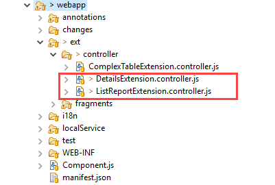

<!-- loio199a496c5fa544dfbe134b53eaba092e -->

# Creating an Extension to Modify Properties in the Navigation Context

Application developers can use this extension to modify \(add/remove/change\) the information available in the navigation context just before the external outbound navigation is triggered.


<a name="loio199a496c5fa544dfbe134b53eaba092e__context_xjp_k22_scb"/>

## Context

> ### Caution:  
> Use app extensions with caution and only if you cannot produce the required behavior by other means, such as manifest settings or annotations. To correctly integrate your app extension coding with SAP Fiori elements, use only the `extensionAPI` of SAP Fiori elements. For more information, see [Using the extensionAPI](using-the-extensionapi-bd2994b.md).
> 
> After you've created an app extension, its display \(for example, control placement and layout\) and system behavior \(for example, model and binding usage, busy handling\) lies within the application's responsibility. SAP Fiori elements provides support only for the official `extensionAPI` functions. Don't access or manipulate controls, properties, models, or other internal objects created by the SAP Fiori elements framework.

 <a name="task_u52_ds1_34b"/>

<!-- task\_u52\_ds1\_34b -->

## Additional Features in SAP Fiori Elements for OData V2


<a name="task_u52_ds1_34b__steps_m2p_gs1_34b"/>

## Procedure

1.  In the `manifest.json`, register your extension with the controller for the list report and the object page, as described below:

    ```
    "extends": {
       "extensions": {
          ... 
          "sap.ui.controllerExtensions": { 
             ...
             "sap.suite.ui.generic.template.ListReport.view.ListReport": { 
                ... 
                "controllerName": "MY_APP.ext.controller.ListReportExtension",
                ...
             },
             "sap.suite.ui.generic.template.ObjectPage.view.Details": {
                ...
                "controllerName": "MY_APP.ext.controller.DetailsExtension",
                ...
             }
          } 
          ...
    
    ```

2.  Create the controller extension files in your app, as shown below:

      

3.  Implement the `adaptNavigationParameterExtension` function in the controller extension files of the list report / object page or the analytical list page and check the *API Reference* for [`SelectionVariant`](https://ui5.sap.com/#/api/sap.ui.generic.app.navigation.service.SelectionVariant/overview).

    > ### Note:  
    > You cannot remove all properties for each navigation link. For example, the property of the semantic object is required for the semantic object link on the object page.

    ```
    adaptNavigationParameterExtension: function(oSelectionVariant, oObjectInfo) {
      // This is an example! Please create your own code!!
      // This is an example to remove the parameter 'Currency' from the parameters
      oSelectionVariant.removeParameter("Currency");
      // This is an example to remove the property 'Price' from the selection option
      oSelectionVariant.removeSelectOption("Price");
      // This is an example to remove all properties which starts with 'D'
      oSelectionVariant.getSelectOptionsPropertyNames().forEach(function(sSelectOptionName){
        if (sSelectOptionName.startsWith('D')) {
           oSelectionVariant.removeSelectOption(sSelectOptionName);
        }
      });
    },
    
    ```


 <a name="task_yb4_1s1_34b"/>

<!-- task\_yb4\_1s1\_34b -->

## Additional Features in SAP Fiori Elements for OData V4


<a name="task_yb4_1s1_34b__context_p3h_bs1_34b"/>

## Context

The modification \(add/remove/change\) is achieved via the `adaptNavigationContext` extension method, which is called if external outbound navigation is triggered \(for example for semantic links, related apps, or `DataFieldForIntentBasedNavigations`\).

`oSelectionVariant` consists of all the properties that have been passed to the target application ‒ this already excludes the sensitive information and considers any defined object mapping.

`oTargetInfo` consists of the `semanticObject` and action that has been configured.


<a name="task_yb4_1s1_34b__steps_p5r_32h_34b"/>

## Procedure

1.  Configure the extension with the controller for the object page in the `manifest.json` file:

    > ### Sample Code:  
    > ```
    > "sap.ui5": {
    >     "extends": {
    >         "extensions": {
    >             "sap.ui.controllerExtensions": {
    >                 "sap.fe.templates.ListReport.ListReportController": {
    >                     "controllerName": "SalesOrder.custom.LRExtend"
    >                 },
    >                 "sap.fe.templates.ObjectPage.ObjectPageController": {
    >                     "controllerName": "SalesOrder.custom.OPExtend"
    >                 }
    >             }
    >         }
    >     }
    > }
    > ```

2.  Use the `adaptNavigationContext` extension within the app controller:

    > ### Sample Code:  
    > ```
    > override: {
    >     intentBasedNavigation: {
    >         adaptNavigationContext: function(oSelectionVariant, oTargetInfo) {
    >             Log.info("adaptNavigationContext extension called with semantic object: " + oTargetInfo .semanticObject + " and action: " + oTargetInfo .action);
    >             oSelectionVariant.removeSelectOption("HasDraftEntity");
    >         }
    >     }
    > }
    > ```


 <a name="concept_br3_gdr_gwb"/>

<!-- concept\_br3\_gdr\_gwb -->

### 

> ### Restriction:  
> When you click a field that is displayed as a link, the call to the `adaptNavigationContext` extension method is invoked only once even if the link opens more than one navigation link. You cannot invoke this method by clicking the navigation links at the second level.

