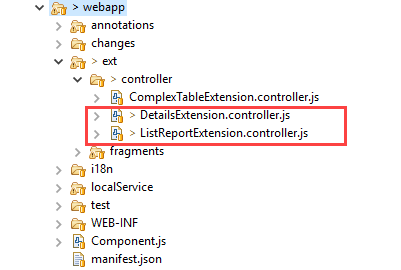

<!-- loiocd430a4074874cfaa5b2954a1118a479 -->

# Creating an Extension to Modify Properties in the Navigation Context

You can use this extension to add, remove, or change the information available in the navigation context just before the external outbound navigation is triggered.


> ### Note:  
> For information about SAP Fiori elements for OData V4, see [Creating an Extension to Modify Properties in the Navigation Context](creating-an-extension-to-modify-properties-in-the-navigation-context-199a496.md).


<a name="loiocd430a4074874cfaa5b2954a1118a479__section_cyj_p54_tgc"/>

## Context

> ### Caution:  
> Use app extensions with caution and only if you cannot produce the required behavior by other means, such as manifest settings or annotations. To correctly integrate your app extension coding with SAP Fiori elements, use only the `extensionAPI` of SAP Fiori elements. For more information, see [Using the extensionAPI](using-the-extensionapi-a5a4ec6.md).
> 
> After you've created an app extension, its display \(for example, control placement and layout\) and system behavior \(for example, model and binding usage, busy handling\) lies within the application's responsibility. SAP Fiori elements provides support only for the official `extensionAPI` functions. Don't access or manipulate controls, properties, models, or other internal objects created by the SAP Fiori elements framework.


<a name="loiocd430a4074874cfaa5b2954a1118a479__section_gys_2np_tgc"/>

## Procedure

1.  In the `manifest.json`, register your extension with the controller for the list report page and the object page, as described below:

    ```
    "extends": {
       "extensions": {
          ... 
          "sap.ui.controllerExtensions": { 
             ...
             "sap.suite.ui.generic.template.ListReport.view.ListReport": { 
                ... 
                "controllerName": "MY_APP.ext.controller.ListReportExtension",
                ...
             },
             "sap.suite.ui.generic.template.ObjectPage.view.Details": {
                ...
                "controllerName": "MY_APP.ext.controller.DetailsExtension",
                ...
             }
          } 
          ...
    
    ```

2.  Create the controller extension files in your app, as shown below:

    

3.  Implement the `adaptNavigationParameterExtension` function in the controller extension files of the list report page / object page or the analytical list page and check the *API Reference* for [`SelectionVariant`](https://ui5.sap.com/#/api/sap.ui.generic.app.navigation.service.SelectionVariant/overview).

    > ### Note:  
    > You cannot remove all properties for each navigation link. For example, the property of the semantic object is required for the semantic object link on the object page.

    ```
    adaptNavigationParameterExtension: function(oSelectionVariant, oObjectInfo) {
      // This is an example! Please create your own code!!
      // This is an example to remove the parameter 'Currency' from the parameters
      oSelectionVariant.removeParameter("Currency");
      // This is an example to remove the property 'Price' from the selection option
      oSelectionVariant.removeSelectOption("Price");
      // This is an example to remove all properties which starts with 'D'
      oSelectionVariant.getSelectOptionsPropertyNames().forEach(function(sSelectOptionName){
        if (sSelectOptionName.startsWith('D')) {
           oSelectionVariant.removeSelectOption(sSelectOptionName);
        }
      });
    },
    
    ```


> ### Restriction:  
> When you click a field that is displayed as a link, the call to the `adaptNavigationContext` extension method is invoked only once even if the link opens more than one navigation link. You cannot invoke this method by clicking the navigation links at the second level.

