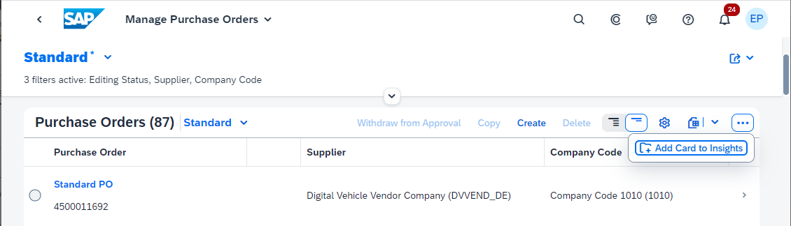
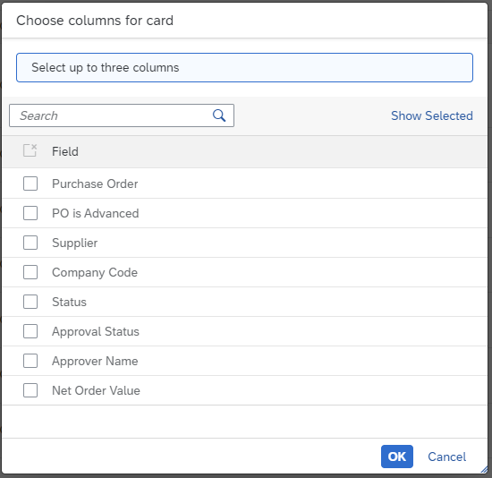

<!-- loio9b13559ef978405a99e8b624a87daf31 -->

# Creating Cards for the Insights Section of *My Home* in SAP S/4HANA Cloud

In the list report tables, you can create cards that can be added to the *Insights* section of the *My Home* in SAP S/4HANA Cloud.

> ### Note:  
> This topic is only applicable to SAP Fiori elements for OData V2.

**Prerequisites**

You must enable *My Home* in SAP S/4HANA Cloud to create and add cards. For more information, see [*My Home* in SAP S/4HANA Cloud](https://help.sap.com/docs/SAP_S4HANA_CLOUD/4fc8d03390c342da8a60f8ee387bca1a/8a60279e8d2041b5ad8d3455fab0f3ef.html) .

Once you have enabled *My Home* in SAP S/4HANA Cloud, the *Add Card to Insights* option automatically appears in the overflow of the table toolbar in list report applications.

  

Upon clicking *Add Card to Insights*, the card creation dialog box opens up as shown here.

  

> ### Note:  
> -   This feature is only supported for single view list report applications that have responsive tables.
> 
> -   The card creation dialog shows only those columns that are supported for a card.

Using the manifest, applications can choose to hide this feature by setting the `addCardtoInsightsHidden` property within `tableSetting` to `true`, as displayed here.

> ### Sample Code:  
> ```
> "sap.ui.generic.app": {
> "pages": [{
> "entitySet": "Zfarvd_Bs_Hd_Bo",
> "component": {
> "name": "sap.suite.ui.generic.template.ListReport",
> "list": true,
> "settings": {
> "tableSettings":
> 
> { "addCardtoInsightsHidden": "true" //default value false }
> }
> }
> ```

