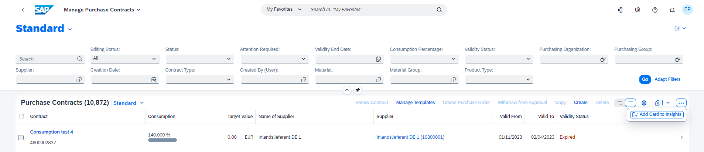
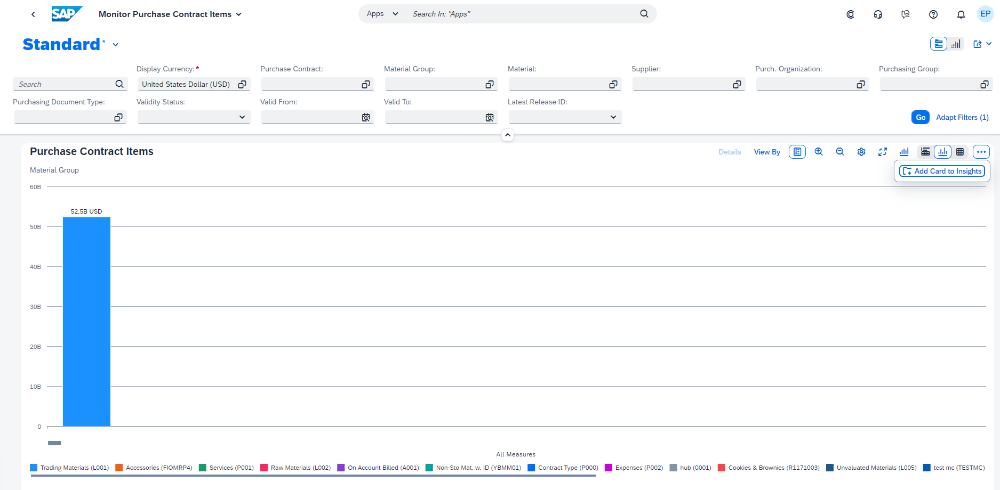

<!-- loio9b13559ef978405a99e8b624a87daf31 -->

# Creating Cards for the Insights Section of *My Home* in SAP S/4HANA Cloud

An option for tables in the list report or charts in the analytical list page allows users to create cards that can be added to the *Insights* section of *My Home* in SAP S/4HANA Cloud.

**Prerequisites**

You must enable *My Home* in SAP S/4HANA Cloud to create and add cards. For more information, see [*My Home* in SAP S/4HANA Cloud](https://help.sap.com/docs/SAP_S4HANA_CLOUD/4fc8d03390c342da8a60f8ee387bca1a/8a60279e8d2041b5ad8d3455fab0f3ef.html).

Once you have enabled *My Home* in SAP S/4HANA Cloud, the *Add Card to Insights* option automatically appears in the overflow toolbar of the table in list report applications and the overflow toolbar of the chart in analytical list page applications.

   
  
**Add Card to Insights Option in the Table Toolbar of List Report**

  

   
  
**Add Card to Insights Option in the Chart Toolbar of Analytical List Page**

  

> ### Note:  
> -   This feature supports only single view cases that have responsive tables in list report applications.
> 
> -   The card creation dialog shows only those columns that are supported for a card.

Application developers can switch off the option to add cards to *Insights* of *My Home* using the manifest setting.


<a name="loio9b13559ef978405a99e8b624a87daf31__section_kbf_fb2_jxb"/>

## Additional Features in SAP Fiori Elements for OData V2

Using the manifest, list report applications can choose to hide this feature by setting the `addCardtoInsightsHidden` property within `tableSettings` to `true`, as displayed in the following sample code:

> ### Sample Code:  
> ```
> "sap.ui.generic.app": {
>     "pages": [{
>         "entitySet": "Zfarvd_Bs_Hd_Bo",
>         "component": {
>             "name": "sap.suite.ui.generic.template.ListReport",
>             "list": true,
>             "settings": {
>                 "tableSettings": { 
>                     "addCardtoInsightsHidden": "true" //default value false
>                 }
>             }
>         }
>     }]
> }
> ```

Using the manifest, analytical list page applications can choose to hide this feature by setting the `addCardtoInsightsHidden` property within `chartSettings` to `true`, as displayed in the following sample code:

> ### Sample Code:  
> ```
> "sap.ui.generic.app": {
>     "pages": [{
>         "entitySet": "Zfarvd_Bs_Hd_Bo",
>         "component": {
>             "name": "sap.suite.ui.generic.template.AnalyticalListPage",
>             "list": true,
>             "settings": {
>                 "chartSettings": { 
>                     "addCardtoInsightsHidden": "true" //default value false
>                 }
>             }
>         }
>     }]
> }
> ```


<a name="loio9b13559ef978405a99e8b624a87daf31__section_zbk_2qx_3xb"/>

## Additional Features in SAP Fiori Elements for OData V4

To disable the *Add Card to Insights* option in the table toolbar, add the following settings to the manifest:

> ### Sample Code:  
> ```
> "controlConfiguration": {
>      "@com.sap.vocabularies.UI.v1.LineItem": {
>          "tableSettings": {
>              "type": "ResponsiveTable",
>              "enableAddCardToInsights": false
>          }
>      }
> }
> ```

> ### Note:  
> The *Add Card to Insights* option is not available if the list report application is configured as a flavor of the analytical list page.

To disable the *Add Card to Insights* option in the chart toolbar, add the following manifest settings:

> ### Sample Code:  
> ```
> "controlConfiguration": {
>     "@com.sap.vocabularies.UI.v1.Chart": {
>         enableAddCardToInsights: false
>     }
> }
> ```

> ### Restriction:  
> -   When creating an integration card from the list report table, the following changes will not be retained when navigating back from the card: position or visibility of the filter fields, position or visibility of the table columns, and width of the columns.
> 
> -   *Add Card to Insights* option is not available if the list report applications are configured against a parameterized entity.
> 
> -   Cards will not have the same formatting for date, datetime and unit of measure fields as seen in the list report table.

