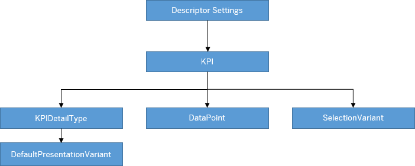

<!-- loiod80a360638ad4cf193cc55eee92bff2e -->

# Creating Key Performance Indicator Tags

The key performance indicator \(KPI\) tag is an abbreviated and clickable title with a KPI value.


Each KPI can have its own OData source, entity set, and annotation file. The KPI value changes if an action is executed on the transactional content. For example, releasing sales orders affects a related KPI and posting an accounting document affects certain financial KPIs.




### Descriptor Settings: KPI Configuration

**SAP Fiori elements for OData V2**

Property: `keyPerformanceIndicators`

Use the `UI.KPI` annotation to display KPIs in your analytical list page application \(in the title area or below the filter bar, depending on the value of the `filterable` setting\). Define the descriptor configuration file with a qualifier and map it to the UI.KPI annotation. If this annotation isn't configured, then the `UI.SelectionPresentationVariant` annotation with the same qualifier name takes effect.

We recommend using a single SAP-wide KPI gallery based on the KPIs generated by standard SAP KPI creation tools, such as the SAP Smart Business framework.

> ### Sample Code:  
> `manifest.json`
> 
> ```
> "sap.ui.generic.app":{  
>    "pages":[  
>       {  
>          "entitySet":"SEPMRA_C_ALP_SlsOrdItemCube",
>          "component":{  
>             "name":"sap.suite.ui.generic.template.AnalyticalListPage",
>             "list":true,
>             "settings":{  
>                "keyPerformanceIndicators":{  
>                   "KPIRevenue":{  
>                      "model":"kpi",
>                      "entitySet":"SEPMRA_C_ALP_TotalSalesKPI",
>                      "qualifier":"KPIQuantity",
>                      "detailNavigation":"EPMProduct"
>                   }
>             }
>       }
> },
> ```

**SAP Fiori elements for OData V4**

Property: `keyPerformanceIndicators`

Use the `UI.KPI` annotation to display KPIs in your analytical list page application for the title area. Define the descriptor configuration file with a qualifier and map it to the `UI.KPI` annotation. If this annotation isn't configured, then the `UI.SelectionPresentationVariant` annotation with the same qualifier name takes effect.

> ### Sample Code:  
> `manifest.json`
> 
> ```
> "sap.ui5": {
>     "routing": {
>         "targets": {
>             "BusinessPartnersALP": {
>                 "type": "Component",
>                 "id": "BusinessPartnersList",
>                 "name": "sap.fe.templates.ListReport",
>                 "options": {
>                     "settings": {
>                         "keyPerformanceIndicators": {
>                             "KPIRevenue": {
>                                 "entitySet": "BusinessPartners",
>                                 "qualifier": "KPIQuantity"
>                             },
>                             "KPIVolume": {
>                                 "entitySet": "BusinessPartners",
>                                 "qualifier": "Volume",
>                                 "detailNavigation": "PartnerSales"
>                             }
>                         }
>                     }
>                 }
>             }
>         }
>     }
> }
> 
> ```


### Annotation: `UI.KPI` annotation with the qualifier `KPIQuantity`

> ### Sample Code:  
> XML Annotation
> 
> ```
> <Annotation Term="UI.KPI" Qualifier="KPIQuantity">
>    <Record>
>       <PropertyValue Property="DataPoint" Path="@UI.DataPoint#DPForQuantity" />
>       <PropertyValue Property="SelectionVariant" Path="@UI.SelectionVariant#SVForQuantity" />
>       <PropertyValue Property="ID" String="ActualCostByGLAccountNameKPI" />
>       <PropertyValue Property="Detail">
>          <Record Type="UI.KPIDetailType">
>             <PropertyValue Property="SemanticObject" String="EPMProduct" />
>             <PropertyValue Property="Action" String="manage_stta" />
>             <PropertyValue Property="DefaultPresentationVariant" Path="@UI.PresentationVariant#PVForQuantity" />
>          </Record>
>       </PropertyValue>
>    </Record>
> </Annotation>
> ```

> ### Sample Code:  
> ABAP CDS Annotation
> 
> ```
> @UI.KPI: [
>   {
>     selectionVariantQualifier: 'SVForQuantity',
>     id: 'ActualCostByGLAccountNameKPI',
>     dataPoint.title: 'Define datapoint inline',
>     datapoint.minimumValue: 2,
>     detail: {
>       semanticObject: 'EPMProduct',
>       semanticObjectAction: 'manage_stta',
>       defaultPresentationVariantQualifier: 'PVForQuantity'
>     },
>     qualifier: 'KPIQuantity'
>   }
> ]
> DPForQuantity;
> ```

> ### Sample Code:  
> CAP CDS Annotation
> 
> ```
> UI.KPI #KPIQuantity : {
>     DataPoint : ![@UI.DataPoint#DPForQuantity],
>     SelectionVariant : ![@UI.SelectionVariant#SVForQuantity],
>     ID : 'ActualCostByGLAccountNameKPI',
>     Detail : {
>         $Type : 'UI.KPIDetailType',
>         SemanticObject : 'EPMProduct',
>         Action : 'manage_stta',
>         DefaultPresentationVariant : ![@UI.PresentationVariant#PVForQuantity]
>     }
> },
> ```

To enable navigation for a KPI card, you need to define the semantic object, action, and KPI ID in the `UI.KPI` annotation. The KPI ID is passed to the target application as an `EvaluationId` for launching the SAP Smart Business application.


### Annotation: KPIDetailType

```
<PropertyValue Property="Detail">
   <Record Type="UI.KPIDetailType">
      <PropertyValue Property="SemanticObject" String="EPMProduct" />
      <PropertyValue Property="Action" String="manage_stta" />
      <PropertyValue Property="DefaultPresentationVariant" Path="@UI.PresentationVariant#PVForQuantity" />
   </Record>
</PropertyValue>
```


### Annotation: DataPoint

> ### Sample Code:  
> `DataPoint` annotation with the qualifier `DPForQuantity`
> 
> ```
> <Annotation Term="com.sap.vocabularies.UI.v1.DataPoint" Qualifier="DPForQuantity">
>    <Record Type="com.sap.vocabularies.UI.v1.DataPointType">
>       <PropertyValue Property="Title" String="Quantity by Customer Company Name" />
>       <PropertyValue Property="Description" String="About NumberOfSalesOrders" />
>       <PropertyValue Property="Value" Path="Quantity" />
>       <PropertyValue Property="Criticality" EnumMember="com.sap.vocabularies.UI.v1.CriticalityType/Neutral" />
>    </Record>
> </Annotation>
> ```


### Annotation: `SelectionVariant` with the qualifier `SVForQuantity`

Description: Configure this annotation for filters and parameters to provide default values for the corresponding filter fields. This configuration overrides the default values from the `Common.FilterDefaultValue` annotation. You get the filters from the `SelectionVariant.SelectOptions` and the parameters from the `SelectionVariant.Parameters`.

> ### Sample Code:  
> XML Annotation
> 
> ```
> <Annotation Term="UI.SelectionVariant" Qualifier="SVForQuantity">
>    <Record>
>       <PropertyValue Property="Parameters">
>          <Collection>
>             <Record Type="UI.Parameter">
>                <PropertyValue Property="PropertyName" PropertyPath="CompanyCurrency" />
>                <PropertyValue Property="PropertyValue" String="EUR" />
>             </Record>
>          </Collection>
>       </PropertyValue>
>       <PropertyValue Property="SelectOptions">
>          <Collection>
>             <Record Type="UI.SelectOptionType">
>                <PropertyValue Property="PropertyName" PropertyPath="MainProductCategory" />
>                <PropertyValue Property="Ranges">
>                   <Collection>
>                      <Record Type="UI.SelectionRangeType">
>                         <PropertyValue EnumMember="UI.SelectionRangeSignType/I" Property="Sign" />
>                         <PropertyValue EnumMember="UI.SelectionRangeOptionType/EQ" Property="Option" />
>                         <PropertyValue Property="Low" String="Computer Systems" />
>                      </Record>
>                   </Collection>
>                </PropertyValue>
>             </Record>
>          </Collection>
>       </PropertyValue>
>    </Record>
> </Annotation>
> ```

> ### Sample Code:  
> ABAP CDS Annotation
> 
> ```
> @UI.selectionVariant: [
>   {
>     qualifier: 'SVForQuantity',
>     parameters: [{name: 'PropertyName', value: 'CompanyCurrency' },{ name: 'PropertyValue', value: 'EUR'}]
>   }
> ]
> 
> ```

> ### Sample Code:  
> CAP CDS Annotation
> 
> ```
> UI.SelectionVariant #SVForQuantity : {
>     Parameters : [
>         {
>             $Type : 'UI.Parameter',
>             PropertyName : CompanyCurrency,
>             PropertyValue : 'EUR'
>         },
>     ],
>     SelectOptions : [
>         {
>             $Type : 'UI.SelectOptionType',
>             PropertyName : MainProductCategory,
>             Ranges : [
>                 {
>                     $Type : 'UI.SelectionRangeType',
>                     Sign : #I,
>                     Option : #EQ,
>                     Low : 'Computer Systems'
>                 }
>             ]
>         }
>     ]
> }
> 
> ```


### Annotation: `PresentationVariant` annotation with the qualifier `PVForQuantity`

> ### Sample Code:  
> XML Annotation
> 
> ```
> <Annotation Term="com.sap.vocabularies.UI.v1.PresentationVariant" Qualifier="PVForQuantity">
>    <Record>
>       <PropertyValue Property="SortOrder">
>          <Collection>
>             <Record Type="Common.SortOrderType">
>                <PropertyValue Property="Property" PropertyPath="Quantity" />
>                <PropertyValue Property="Descending" Bool="true" />
>             </Record>
>          </Collection>
>       </PropertyValue>
>       <PropertyValue Property="Visualizations">
>          <Collection>
>             <AnnotationPath>@com.sap.vocabularies.UI.v1.Chart#QuantityChart</AnnotationPath>
>          </Collection>
>       </PropertyValue>
>    </Record>
> </Annotation>
> 
> ```

> ### Sample Code:  
> ABAP CDS Annotation
> 
> ```
> @UI.PresentationVariant: [
>   {
>     sortOrder: [
>       {
>         by: 'QUANTITY',
>         direction: #DESC
>       }
>     ],
>     visualizations: [
>       {
>         type: #AS_CHART,
>         qualifier: 'QuantityChart'
>       }
>     ],
>     qualifier: 'PVForQuantity'
>   }
> ]
> annotate view VIEWNAME with {
> 
> }
> 
> ```

> ### Sample Code:  
> CAP CDS Annotation
> 
> ```
> UI.PresentationVariant #PVForQuantity : {
>     SortOrder : [
>         {
>             $Type : 'Common.SortOrderType',
>             Property : Quantity,
>             Descending : true
>         },
>     ],
>     Visualizations : [
>         '@UI.Chart#QuantityChart'
>     ]
> }
> 
> ```

**Chart annotation with the qualifier `QuantityChart`**

> ### Sample Code:  
> XML Annotation
> 
> ```
> <Annotation Term="com.sap.vocabularies.UI.v1.Chart" Qualifier="QuantityChart">
>    <Record>
>       <PropertyValue Property="Title" String="NumberOfSalesOrders" />
>       <PropertyValue Property="MeasureAttributes">
>          <Collection>
>             <Record Type="com.sap.vocabularies.UI.v1.ChartMeasureAttributeType">
>                <PropertyValue Property="Measure" PropertyPath="Quantity" />
>                <PropertyValue Property="Role" EnumMember="com.sap.vocabularies.UI.v1.ChartMeasureRoleType/Axis1" />
>             </Record>
>          </Collection>
>       </PropertyValue>
>       <PropertyValue Property="DimensionAttributes">
>          <Collection>
>             <Record Type="com.sap.vocabularies.UI.v1.ChartDimensionAttributeType">
>                <PropertyValue Property="Dimension" PropertyPath="SoldToPartyCompanyName" />
>                <PropertyValue Property="Role" EnumMember="com.sap.vocabularies.UI.v1.ChartDimensionRoleType/Category" />
>             </Record>
>          </Collection>
>       </PropertyValue>
>       <PropertyValue Property="ChartType" EnumMember="UI.ChartType/Bar" />
>       <PropertyValue Property="Description" String="NumberOfSalesOrders by Customer Company Name" />
>    </Record>
> </Annotation>
> C
> ```

> ### Sample Code:  
> ABAP CDS Annotation
> 
> ```
> @UI.Chart: [
>   {
>     title: 'NumberOfSalesOrders',
>     measureAttributes: [
>       {
>         measure: 'Quantity',
>         role: #AXIS_1
>       }
>     ],
>     dimensionAttributes: [
>       {
>         dimension: 'SoldToPartyCompanyName',
>         role: #CATEGORY
>       }
>     ],
>     chartType: #BAR,
>     description: 'NumberOfSalesOrders by Customer Company Name',
>     qualifier: 'QuantityChart'
>   }
> ]
> annotate view VIEWNAME with {
> 
> }
> 
> ```

> ### Sample Code:  
> CAP CDS Annotation
> 
> ```
> UI.Chart #QuantityChart : {
>     Title : 'NumberOfSalesOrders',
>     MeasureAttributes : [
>         {
>             $Type : 'UI.ChartMeasureAttributeType',
>             Measure : Quantity,
>             Role : #Axis1
>         },
>     ],
>     DimensionAttributes : [
>         {
>             $Type : 'UI.ChartDimensionAttributeType',
>             Dimension : SoldToPartyCompanyName,
>             Role : #Category
>         },
>     ],
>     ChartType : #Bar,
>     Description : 'NumberOfSalesOrders by Customer Company Name'
> }
> 
> ```

> ### Restriction:  
> Note the following for SAP Fiori elements for OData V4:
> 
> -   Only the chart types line, column, bar, stacked bar, stacked column, vertical\_bullet, scatter, combination, donut, and bubble are supported.
> 
> -   Only the `SortOder` and `MaxItems` parameters from the `PresentationVariant` are considered.


<a name="loiod80a360638ad4cf193cc55eee92bff2e__KPITag"/>

## KPI Titles

The abbreviation of the KPI title is based on the following logic:


<table>
<tr>
<th valign="top">

If a KPI name is


</th>
<th valign="top">

Abbreviation is based on


</th>
<th valign="top">

Example


</th>
</tr>
<tr>
<td valign="top">

One word


</td>
<td valign="top">

First three letters


</td>
<td valign="top">

KPI Name: TargetMargin

KPI Title: *TAR*


</td>
</tr>
<tr>
<td valign="top">

Two words


</td>
<td valign="top">

First letter of each word


</td>
<td valign="top">

KPI Name: Actual Cost

KPI Title: *AC*


</td>
</tr>
<tr>
<td valign="top">

Three words or more


</td>
<td valign="top">

First letter of first three words


</td>
<td valign="top">

KPI Name: Actual Margin Relative

KPI Title: *AMR*


</td>
</tr>
</table>

> ### Note:  
> The KPI name is taken from the `Title` property of the `DataPoint` annotation.


## KPI Value and Color

Use the `UI.KPI` annotation to render KPI values and to determine the KPI's color. This annotation is associated with the `SelectionVariant` and `DefaultPresentationVariant`.

The first `DataPoint` visualization element in the `PresentationVariant` renders the KPI value and determines the KPI's color. If a KPI is percent-based, then the percent sign **%** appears along with the KPI value.

> ### Note:  
> Click the KPI title or value to view more details on a KPI card.

The color of the KPI value depends on the threshold values. To define the threshold values, use these properties in the `DataPoint` annotation:

-   `CriticalityCalculation`: Allows you to hard code values or to include the value from a property path
-   Criticality: Allows complex back-end logic to specify the criticality values

> ### Note:  
> If you use both properties in the annotation, then the criticality value overrides the `CriticalityCalculation` value.

The color logic depends on the measure type. You can choose a maximizing measure, minimizing measure, or range-based measure types based on the `"ImprovementDirection"` value of the measure.

-   Target Measure: Hover over each item to view the conditions.


-   Maximizing Measure: Hover over each item to view the conditions.


-   Minimizing Measure: Hover over each item to view the conditions.


If the threshold values are insufficient or incorrect, the ALP chooses the closest color match for a KPI value. For example, if a target KPI has the `DataPoint.Value` aggregate < `ThresholdValues.ToleranceRangeLowValue` and doesn't have a value for `ThresholdValues.DeviationRangeLowValue`, then the KPI value has the color for a critical condition.

> ### Note:  
> The criticality indicator line in a KPI tag also takes the same color as the KPI value.


## Scale, Decimal Precision, and Number Formatting

The SAPUI5 formatter returns the scale factor and decimal factor for a KPI value.

The `NumberOfFractionalDigits` information can be provided in the [com.sap.vocabularies.UI.v1.DataPoint](annotations-used-in-overview-pages-65731e6.md) term, using the `ValueFormat` property. The `NumberOfFractionalDigits` property is used to determine the number of fraction digits. The rules are as follows:

-   Decimals aren't shown by default.

-   You can specify 1 or 2 decimal places by using the `NumberOfFractionalDigits` property in annotations. If a value higher than 2 is provided, it is considered in addition to 2.


In the following example, the `"Price"` property for the `NumberOfFractionalDigits` provided in the OData metadata - 3 is overridden with the value 1, as provided in the [com.sap.vocabularies.UI.v1.DataPoint](annotations-used-in-overview-pages-65731e6.md) `ValueFormat` property:

> ### Sample Code:  
> XML Annotation
> 
> ```xml
> <Annotation Term="com.sap.vocabularies.UI.v1.DataPoint" Qualifier="Price">
>     <Record Type="com.sap.vocabularies.UI.v1.DataPointType">
>         <PropertyValue Property="Value" Path="Price"/>
>         <PropertyValue Property="ValueFormat">
>             <Record Type="com.sap.vocabularies.UI.v1.NumberFormat">
>                 <PropertyValue Property="NumberOfFractionalDigits" Int="1"/>
>             </Record>
>         </PropertyValue>
>     </Record>
> </Annotation>
> 
> ```

> ### Sample Code:  
> ABAP CDS Annotation
> 
> ```
> 
> @UI.dataPoint: { 
>    valueFormat.numberOfFractionalDigits: 1  
> }
> price;
> 
> ```

> ### Sample Code:  
> CAP CDS Annotation
> 
> ```
> 
> UI.DataPoint #Price : {
>     $Type : 'UI.DataPointType',
>     Value : Price,
>     ValueFormat : {
>         $Type : 'UI.NumberFormat',
>         NumberOfFractionalDigits : 1
>     }
> }
> ```


<a name="loiod80a360638ad4cf193cc55eee92bff2e__section_a41_3qh_kdb"/>

## Display KPI Tags with Units of Measure

The global and filterable KPIs in the ALP can now display KPI values with a **Unit of Measure**. For example, to add a **Unit of Measure**, define a path or string value directly.

> ### Sample Code:  
> XML Annotation
> 
> ```xml
> <Annotations Target="CZ_PROJECTKPIS_CDS.CZ_PROJECTKPISType/ActualCost">
>         <Annotation Term="Org.OData.Measures.V1.ISOCurrency" Path="CompanyCodeCurrency"/>
> </Annotations>
> <Annotations Target="CZ_PROJECTKPIS_CDS.CZ_PROJECTKPISType/TargetMargin">
>         <Annotation Term="Org.OData.Measures.V1.ISOCurrency" String="EUR"/> 
> </Annotations>
> <Annotations Target="CZ_PROJECTKPIS_CDS.CZ_PROJECTKPISType/ActualMarginRelative">
>         <Annotation Term="Org.OData.Measures.V1.Unit" String="%"/>
> </Annotations>
> <Annotations Target="CZ_PROJECTKPIS_CDS.CZ_PROJECTKPISType/NetWeight">
>         <Annotation Term="Org.OData.Measures.V1.Unit" Path="WeightUnit"/>
> </Annotations>
> ```

> ### Sample Code:  
> CAP CDS Annotation
> 
> ```
> 
> annotate CZ_PROJECTKPIS_CDS.CZ_PROJECTKPISType with {
>   @Measures.ISOCurrency : CompanyCodeCurrency
>   ActualCost
> };
> 
> ```

You can override a unit of measure that comes from the back end. For example, the following annotation configuration overrides the unit of measure from the back end and changes it to a percentage-based unit of measure.

```
<Annotations Target="CZ_PROJECTKPIS_CDS.CZ_PROJECTKPISType/ActualCost">
     <Annotation Term="Org.OData.Measures.V1.Unit" String="%"/>
</Annotations>

```


<a name="loiod80a360638ad4cf193cc55eee92bff2e__section_qzd_1m3_ndb"/>

## Filterable KPIs

The filterable KPIs react to filter bar changes when there's an exact match between the technical name, modified filter, and parameter field in the filter bar and in the KPI's entity set.

> ### Note:  
> -   Filterable KPIs are only available in SAP Fiori elements for OData V2.
> 
> -   If the default filter values specified in the `SelectionVariant` annotation are also part of the filter bar fields, then the filter bar values override the `SelectionVariant` annotation default values. Otherwise, they're applied in addition to the filter bar values.
> 
> -   The ALP ignores the `UI.Hidden` fields on filter selection for filterable KPIs, if the filter field coming from filter bar is marked as `UI.Hidden` in the KPI entity set.
> 
> -   If `showGoButtonOnFilterBar` is `True`, the filterable KPIs are hidden until the *Go* option is chosen. If *Apply Automatically* is checked, filterable KPIs are displayed on load of the application.

To ensure that KPIs show up as filterable, set `"filterable"=true` in the app's descriptor file.

> ### Sample Code:  
> `manifest.json`
> 
> ```
> "sap.ui.generic.app":{  
>    "pages":[  
>       {  
>          "entitySet":"SEPMRA_C_ALP_SlsOrdItemCube",
>          "component":{  
>             "name":"sap.suite.ui.generic.template.AnalyticalListPage",
>             "list":true,
>             "settings":{  
>                "keyPerformanceIndicators":{  
>                   "KPIRevenue":{  
>                      "model":"kpi",
>                      "entitySet":"SEPMRA_C_ALP_TotalSalesKPI",
>                      "qualifier":"KPIRevenue",
>                      "filterable":true,
>                      "detailNavigation":"OverviewPage"
>                   }
>             }
>       }
> },
> ```


### Semantic Coloring for Filterable KPIs

If `CriticalityCalculation` is defined in the annotations, filterable KPIs are updated based on a change to the filter or parameter. If the values come from a path, then criticality indicators change based on the KPI value.

> ### Note:  
> Only path-based is supported for filterable KPIs and semantic coloring depends on the changes to the filter bar.

**Related Information**  


[Configuring the Title Area](configuring-the-title-area-ebdb5da.md "The dynamic area of the analytical list page is the title area.")

[Managing Variants](managing-variants-8ce658e.md "Lets you manage variants with different structures in the filter and content areas.")

