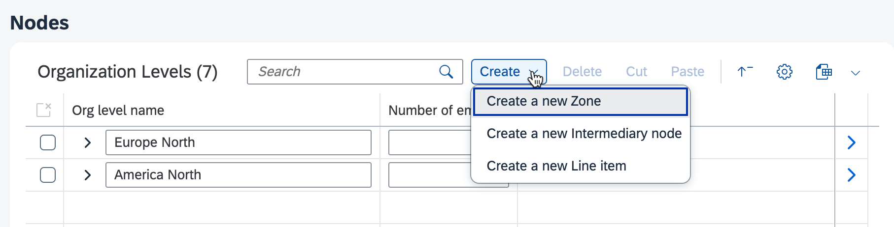

<!-- loio9d31f644bc20425385f630db1b38ade3 -->

# Creation Modes in Tree Tables

Tree tables in SAP Fiori elements for OData V4 support inline creation mode, create page, and create dialog for adding entries. Use these modes with customizable node type categorization to provide flexible data entry options.

The following creation modes are supported with a tree table:

-   `Inline`: inline creation mode

-   `NewPage`: create page

-   `CreationDialog`: create dialog


On the list report page, only the create page \(default\) and the create dialog are supported.

SAP Fiori elements for OData V4 supports the default create mode as well as a custom create mode. To use the custom create mode, add the following annotations to the `nodeType` section:

-   `propertyName`: Name of the property on the page entity set used to categorize the node type to be created within the hierarchy.

-   `values`: An object containing the values of the `propertyName` and the corresponding label to be used in the menu:

    -   `value`: A value of the property defined by the `propertyName` key.

    -   `label`: The menu item label that can be localized using an `i18n` key.

    -   `creationFields`: The properties to be displayed when using the `CreationDialog` mode. The `creationFields` parameter can point to a `FieldGroup` annotation or a comma-separated list of properties.


For both the standard create mode and the custom create mode, you can define an `isCreateEnabled` extension point to control whether the *Create* button or *Create Menu* buttons are enabled or disabled. For more information, see [Enabling or Disabling the Create Button or the Create Menu Button](enabling-or-disabling-the-create-button-or-the-create-menu-button-123e7ad.md).

The following sample code shows how to add custom create mode options in the tree table:

> ### Sample Code:  
> `manifest.json`
> 
> ```json
> "tableSettings": {
>     "type": "TreeTable",
>     "hierarchyQualifier": "NodesHierarchy",
>     "personalization": true,
>     "creationMode": {
>          "name": "Inline",
>          "nodeType": {
>             "propertyName": "nodeType",
>             "values": {
>                 "Zone": "Create a new Zone",
>                 "Intermediary": "Create a new Intermediary node",
>                 "Line": "Create a new Line item"
>              }
>          },
>          "isCreateEnabled": ".extension.hierarchy-edit.custom.OPExtend.enableCreate"
>      }
> }
> ```

  
  
**Custom Create Mode Options in the Tree Table**




## Custom Create Mode with a Create Dialog

Set up a create dialog as shown in the following example:

> ### Sample Code:  
> `manifest.json`
> 
> ```json
> "tableSettings": {
>     "type": "TreeTable",
>     "hierarchyQualifier": "NodesHierarchy",
>     "personalization": true,
>     "creationMode": {
>         "name": "CreationDialog",
>         "creationFields": "Title",
>         "nodeType": {
>             "propertyName": "nodeType",
>             "values": {
>                 "Zone": "Create a new Zone",
>                 "Intermediary": {
>                     "label": "Create a new Intermediary node",
>                     "creationFields": "Category",},
>                 "Line": "Create a new Line item"
>             }
>         },
>         "isCreateEnabled": ".extension.hierarchy-edit.custom.OPExtend.enableCreate"
>     }
> }
> ```

In this example, the create dialog is displayed with the property `Title` for the node types `Zone` and `Line`, and the property `Category` for the node type `Intermediary`. The availability of the create options is set up using an extension point. For more information, see [Enabling or Disabling the Create Button or the Create Menu Button](enabling-or-disabling-the-create-button-or-the-create-menu-button-123e7ad.md).

