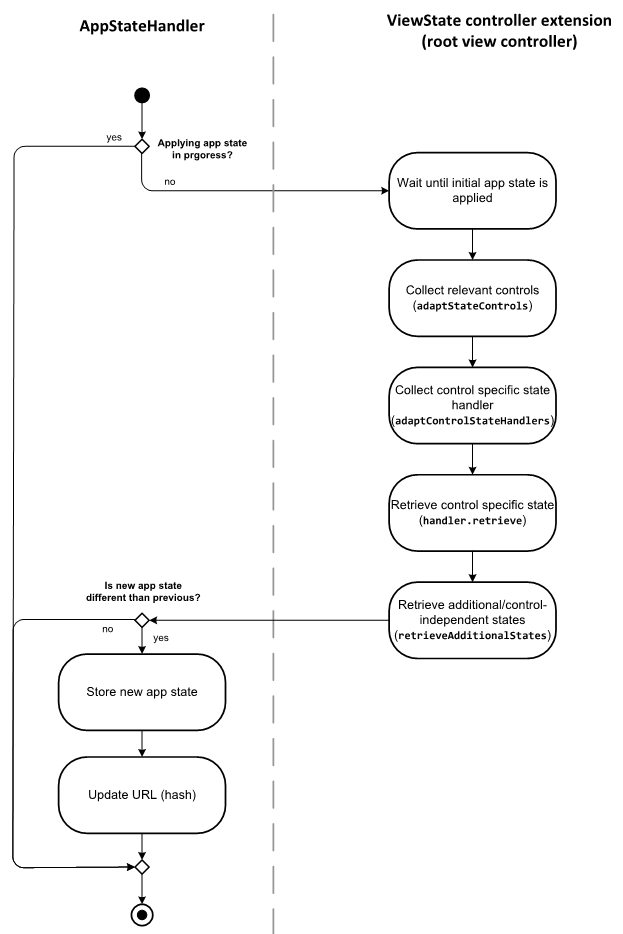
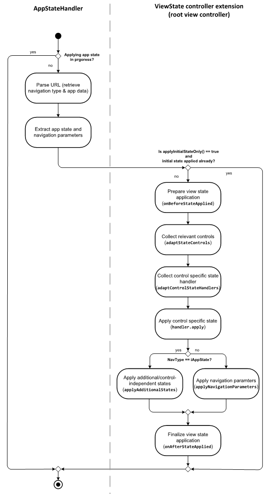

<!-- loio89fa878945294931b15a581a99043005 -->

# Custom State Handling for Extended Apps

You can perform inner app-state handling for custom UI elements.

An app state reflects the state of its views. Each view takes care of its own view-state handling - supported by the `ViewState` controller extension. To create an app state, the view state of the app components root view is requested.


## `ViewState` Controller Extension

The `ViewState` controller extension supports the retrieval and utilization of a view state. If a view is to be considered for app-state handling, its controller has to use this extension. You can override the following functions to customize the state of the implementing view \(its controller, respectively\):

-   `adaptControlStateHandler: function(oControl, aControlHandler):`

-   `adaptStateControls: function(aCollectedControls);`

-   `retrieveAdditionalStates: function(mAdditionalStates);`

-   `applyInitialStateOnly: function();`

-   `onBeforeStateApplied: function(aPromises);`

-   `onAfterStateApplied: function(aPromises);`

-   `applyAdditionalStates: function(oViewState, aPromises);`

-   `applyNavigationParameters: function(oNavParameter, aPromises)`


## Execution Plans

The following activity diagram shows the steps taken to retrieve and store an app state:



For applying an app state, the following steps are executed:




## Adapting the Controller Extension

When a controller makes use of this controller extension, you usually only need to override the `adaptStateControls` method to add the state-relevant controls. If a view contains other views that should benefit from the app state, you can also add those views to the list of collected controls, and the call is propagated to its controller's `ViewState` controller extension.

If required, control-independent view states can be handled with `retrieveAdditionalStates` and `applyAdditionalStates`. The key of a control's state is its local control ID, while keys for additional states can be freely chosen. Therefore, additional states are stored in a deeper level and have a special key \(transparent to the developer\) to prevent key clash with control IDs.

To prevent unwanted side effects during the phase when a new state is applied, you can use the `onBeforeStateApplied` and `onAfterStateApplied` functions, for example to suspend events. Both functions get a list of promises, meant to be extended for asynchronous handling. The controller extension resolves all promises in this list first before proceeding.

You can use the `ViewState` controller extension for custom views as well as custom controls. For supporting additional control states, you can override the `adaptControlStateHandler` to return control-specific retrieve and apply functions.

The control state handler functions must have the following signature:

`retrieve: function(oControl);`

`apply: function(oControl, oControlState, oNavParameters);`

> ### Note:  
> While the first parameter `oControl` is always available, the parameters `oControlState` and `oNavParameters` of the apply function can be null or undefined. Add an according check to the implementation.

The code sample below shows a control state handler object taking care of a `sap.uxap.ObjectPageLayout`:

> ### Sample Code:  
> ```
> {
>     retrieve: function(oOPLayout) {
>         return {
>             selectedSection: oOPLayout.getSelectedSection()
>         };
>     },
>     apply: function(oOPLayout, oControlState, oNavParameters) {
>         oControlState && oOPLayout.setSelectedSection(oControlState.selectedSection);
>     }
> }
> ```


## Overriding the Default `ViewState` Extension

To further extend the already defined `ViewState` controller extension, you must provide a separate controller extension which defines the corresponding overrides, as shown in the sample code below:

> ### Sample Code:  
> ```
> return ControllerExtension.extend("Custom.LRControllerExtension", {
>     override: {
>         viewState: {
>             adaptControlStateHandler: function(oControl, aControlHandlers) {
>                 if (oControl.isA("sap.f.DynamicPage")) {
>                     aControlHandlers.push({
>                         retrieve: function(oControl) {
>                             return {
>                                 headerExpanded: oControl.getHeaderExpanded()
>                             };
>                         },
>                         apply: function(oControl, mControlState) {
>                             if ("headerExpanded" in mControlState) {
>                                 oControl.setHeaderExpanded(mControlState.headerExpanded);
>                             }
>                         }
>                     });
>                 }
>             },
>             adaptStateControls: function(aControls) {
>                 aControls.push(this.getView().byId("My::DynamicePage::Control"));
>             },
>             retrieveAdditionalStates: function(mAdditionalStates) {
>                 mAdditionalStates.lastVisit = new Date().toString();
>             },
>             applyAdditionalStates: function(mAdditionalStates) {
>                 if (mAdditionalStates.lastVisit) {
>                     MessageToast.show("Applying view state from " + mAdditionalStates.lastVisit);
>                 }
>             }
>         }
>     }
> });
> ```

You must register the controller extension in the manifest as follows:

> ### Sample Code:  
> ```
> {
>     ...
>     "sap.ui5": {
>         "extends": {
>             "extensions": {
>                 "sap.ui.controllerExtensions": {
>                     "sap.fe.templates.ListReport.ListReportController": {
>                         "controllerName": "Custom.LRControllerExtension"
>                     }
>                 }
>             }
>         }
>     },
>     ...
> }
> ```


## Triggering an Update of the App State

If you have added custom view state handling, ensure that the overall app state is updated in case the state of the custom control changes. To do so, use the `ExtensionAPI`, which provides the function `updateAppState`.


> ### Note:  
> For information about SAP Fiori elements for OData V2, see [Custom State Handling for Extended Apps](custom-state-handling-for-extended-apps-aa853c3.md).

