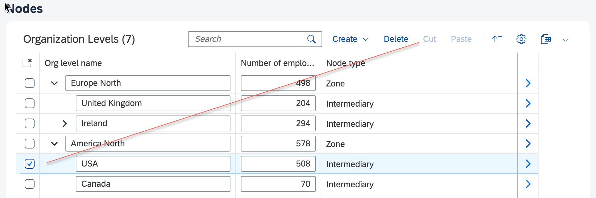

<!-- loio6ff118adb78549638a95fa8a46f76e63 -->

# Cut and Paste in Tree Tables

Tree tables support cut and paste operations for moving nodes within the hierarchy, using the same extension points as drag and drop functionality. Use this feature to enable users to reorganize tree structures through keyboard-based actions in SAP Fiori elements for OData V4.

Cut and paste actions are supported as of SAPUI5 1.124.

Both actions can be enabled or disabled by using the same extension points as for drag and drop:

-   `isNodeMovable`: Defines if a node can be cut.

-   `isMoveToPositionAllowed`: Defines if a node can be pasted under a specific parent node.

For more information about the drag and drop functionality, see [Drag and Drop in Tree Tables](drag-and-drop-in-tree-tables-d2823f3.md).

In the following example, the USA node can't be cut or dragged:

  
  
**Example of a Node with Disabled Cut Action**

> ### Note:  
> When pasting, the position of the pasted node under its parent is defined by the back-end logic, which should reflect the needs of your use case.

