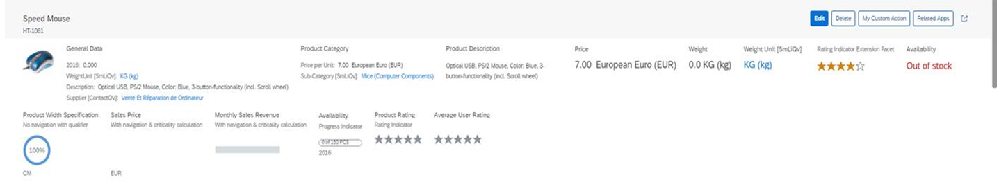

<!-- loioc2a389a11a704b00886440031a3d43f9 -->

# Data Points

A data point represents a single point of data. It is typically a number but can also be textual, for example, a status value.


The image below shows the data points *Price* and *Availability* in the object page header.

  
  
**Object Page: DataPoints**

  

This video shows the step-by-step procedure for adding a data point header to an object page:

 


## Code Samples


### `UI.Reference` Facet

If you add a `UI.ReferenceFacet` that points to `UI.DataPoint`, the title and value of the `UI.DataPoint` will be rendered.

> ### Sample Code:  
> XML Annotation
> 
> ```xml
> <Annotation Term="UI.HeaderFacets">
>     <Collection>
>         ...
>         <Record Type="UI.ReferenceFacet">
>             <PropertyValue Property="Target" AnnotationPath="@UI.DataPoint#Price" />
>         </Record>
>         ...
>         <Record Type="UI.ReferenceFacet">
>             <PropertyValue Property="Target" AnnotationPath="to_StockAvailability/@UI.DataPoint#StockAvailability" />
>         </Record>
>         ...
>     </Collection>
> </Annotation>
> 
> ```

> ### Sample Code:  
> ABAP CDS Annotation
> 
> ```
> 
> @UI.Facet: [
>   {
>     label: '{@i18n>@TechnicalData}',
>     targetQualifier: 'TechnicalData',
>     type: #FIELDGROUP_REFERENCE,
>     purpose: #HEADER
>   },
>   {
>     targetQualifier: 'Price',
>     type: #DATAPOINT_REFERENCE,
>     purpose: #HEADER
>   },
>   {
>     targetQualifier: 'ProductCategory',
>     type: #DATAPOINT_REFERENCE,
>     purpose: #HEADER
>   },
>   {
>     label: 'Employee',
>     targetElement: 'TO_SUPPLIER',
>     type: #CONTACT_REFERENCE,
>     purpose: #HEADER
>   }
> ]
> product;
> 
> ```

> ### Sample Code:  
> CAP CDS Annotation
> 
> ```
> 
> UI.HeaderFacets : [
>     {
>         $Type : 'UI.ReferenceFacet',
>         Label : '{@i18n>@TechnicalData}',
>         Target : '@UI.FieldGroup#TechnicalData'
>     },
>     {
>         $Type : 'UI.ReferenceFacet',
>         Target : '@UI.DataPoint#Price'
>     },
>     {
>         $Type : 'UI.ReferenceFacet',
>         Target : '@UI.DataPoint#ProductCategory'
>     },
>     {
>         $Type : 'UI.ReferenceFacet',
>         Label : 'Employee',
>         Target : 'to_Supplier/@Communication.Contact'
>     }
> ]
> 
> ```


### `UI.DataPoint`

Each `UI.DataPoint` annotation term must point to a qualifier, as shown below:

> ### Sample Code:  
> XML Annotation
> 
> ```xml
> <Annotation Term="UI.DataPoint" Qualifier="Price">
>     <Record>
>         <PropertyValue Property="Value" Path="Price" />
>         <PropertyValue Property="Title" String="Price" />
>     </Record>
> </Annotation>
> 
> <Annotations Target="STTA_PROD_MAN.STTA_C_MP_StockAvailabilityType">
>     <Annotation Term="UI.DataPoint" Qualifier="StockAvailability">
>         <Record>
>             <PropertyValue Property="Value" Path="StockAvailability" />
>             <PropertyValue Property="Title" String="Availability" />
>             <PropertyValue Property="Criticality" Path="StockAvailability" />
>         </Record>
>     </Annotation>
> </Annotations>
> 
> ```

> ### Sample Code:  
> ABAP CDS Annotation
> 
> ```
> 
> @UI.dataPoint: {
>   title: 'Price'
> }
> Price;
> 
> @UI.dataPoint: {
>   title: 'Category'
> }
> ProductCategory;
> 
> 
> ```

> ### Sample Code:  
> CAP CDS Annotation
> 
> ```
> 
> UI.DataPoint #Price : {
>     Value : Price,
>     Title : 'Price'
> },
> UI.DataPoint #ProductCategory : {
>     Value : ProductCategory,
>     Title : 'Category'
> }
> 
> ```


<a name="loioc2a389a11a704b00886440031a3d43f9__section_nxh_l5t_dnb"/>

## Numerical Data Points

For numerical data points, you can override the scale and precision defined in the metadata to display the decimal formatted value on the UI using the property `NumberOfFractionalDigits` of annotation `NumberFormat`.

**Numerical Data Points Values**


<table>
<tr>
<th valign="top">

Scale metadata


</th>
<th valign="top">

Precision metadata


</th>
<th valign="top">

Value of `NumberOfFractionalDigits` 


</th>
<th valign="top">

Decimal places displayed on the UI


</th>
</tr>
<tr>
<td valign="top">

3


</td>
<td valign="top">

15


</td>
<td valign="top">

undefined


</td>
<td valign="top">

3


</td>
</tr>
<tr>
<td valign="top">

3


</td>
<td valign="top">

15


</td>
<td valign="top">

5


</td>
<td valign="top">

5


</td>
</tr>
<tr>
<td valign="top">

3


</td>
<td valign="top">

15


</td>
<td valign="top">

1


</td>
<td valign="top">

1


</td>
</tr>
<tr>
<td valign="top">

3


</td>
<td valign="top">

15


</td>
<td valign="top">

20


</td>
<td valign="top">

14


</td>
</tr>
<tr>
<td valign="top">

3


</td>
<td valign="top">

15


</td>
<td valign="top">

0


</td>
<td valign="top">

3


</td>
</tr>
</table>

You can define the property `NumberOfFractionalDigits` of annotation `NumberFormat` to set the decimal places to be displayed on the UI.

> ### Sample Code:  
> XML Annotation
> 
> ```xml
> 
> <Annotation Term="UI.DataPoint" Qualifier="Weight">
>     <Record Type="com.sap.vocabularies.UI.v1.DataPointType">
>         <PropertyValue Property="Value" Path="Weight" />
>         <PropertyValue Property="Title" String="Weight" />
>         <PropertyValue Property="ValueFormat">
>             <Record Type="com.sap.vocabularies.UI.v1.NumberFormat">
>                 <PropertyValue Property="NumberOfFractionalDigits" Int="5"/>
>             </Record>
>         </PropertyValue>
>     </Record>
> </Annotation>
> ```

> ### Sample Code:  
> ABAP CDS Annotation
> 
> ```
> 
> @UI.dataPoint: {
>   title: 'Weight',
>   valueFormat: {
>     numberOfFractionalDigits: 5
>   }
> }
> Weight;
> 
> ```

> ### Sample Code:  
> CAP CDS Annotation
> 
> ```
> 
> UI.DataPoint #Weight : {
>     $Type : 'UI.DataPointType',
>     Value : Weight,
>     Title : 'Weight',
>     ValueFormat : {
>         $Type : 'UI.NumberFormat',
>         NumberOfFractionalDigits : 5
>     }
> }
> ```

