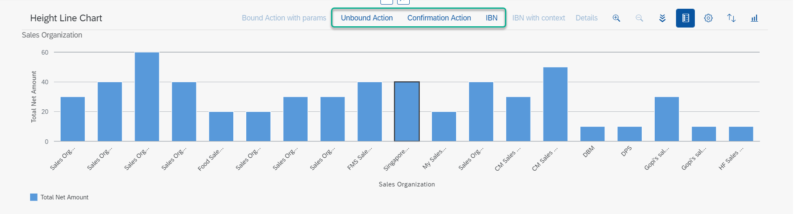
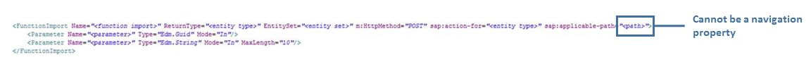

<!-- loio7d1fa8399f714cf6a657ac5467a70d4a -->

# Defining Actions in the Chart Toolbar

You can add action buttons to the chart toolbar by defining the `Actions` property in the annotation term `UI.Chart`.


The `Actions` property must be a collection of the types `UI.DataFieldForAction` and `UI.DataFieldForIntentBasedNavigation`.

> ### Note:  
> -   To make the button visible in the chart toolbar, the properties `Determining` and `Inline` for `UI.DataFieldForAction` and `UI.DataFieldForIntentBasedNavigation` must be set to `false` or must not be defined.
> 
> -   Chart actions coming from `UI.DataFieldForAction` do not support the passing of context.

The action buttons are displayed as shown below in the chart toolbar:

  
  
**Actions in Chart Toolbar**

  


### Code Samples

The code samples below show how to add actions to the chart toolbar.

 **UI.Chart** 

> ### Sample Code:  
> XML Annotation
> 
> ```xml
> <Annotation Term="UI.Chart">
>     <Record>
>         <PropertyValue Property="ChartType" EnumMember="UI.ChartType/Column"/>
>         <PropertyValue Property="Dimensions">
>             <Collection>
>                 <PropertyPath>product</PropertyPath>
>             </Collection>
>         </PropertyValue>
>         <PropertyValue Property="Measures">
>             <Collection>
>                 <PropertyPath>sales</PropertyPath>
>             </Collection>
>         </PropertyValue>
>         <PropertyValue Property="Actions">
>             <Collection>
>                 <Record Type="UI.DataFieldForAction">
>                     <PropertyValue Property="Label" String="provide_label"/>
>                     <PropertyValue Property="Action" String="provide_action_name"/>
>                     <PropertyValue Property="InvocationGrouping" EnumMember="UI.OperationGroupingType/Isolated"/>
>                 </Record>
>                 <Record Type="UI.DataFieldForIntentBasedNavigation">
>                     <PropertyValue Property="Label" String="provide_label"/>
>                     <PropertyValue Property="SemanticObject" String="provide_semantic_object"/>
>                     <PropertyValue Property="Action" String="provide_action_name"/>
>                 </Record>
>             </Collection>
>         </PropertyValue>
>     </Record>
> </Annotation>
> 
> ```

> ### Sample Code:  
> ABAP CDS Annotation
> 
> ```
> 
> @UI.Chart: [
>   {
>     chartType: #COLUMN,
>     dimensions: [
>       'PRODUCT'
>     ],
>     measures: [
>       'SALES'
>     ],
>     actions: [
>       {
>         label: 'provide_label',
>         dataAction: 'PUSHDOWN:provide_action_name',
>         invocationGrouping: #ISOLATED,
>         type: #FOR_ACTION
>       },
>       {
>         label: 'provide_label',
>         semanticObjectAction: 'provide_action_name',
>         type: #FOR_INTENT_BASED_NAVIGATION
>       }
>     ]
>   }
> ]
> annotate view STTA_C_MP_PRODUCTSALESDATA with {
> 
> }
> 
> ```

> ### Sample Code:  
> CAP CDS Annotation
> 
> ```
> 
> UI.Chart : {
>     ChartType : #Column,
>     Dimensions : [
>         product
>     ],
>     Measures : [
>         sales
>     ],
>     Actions : [
>         {
>             $Type : 'UI.DataFieldForAction',
>             Label : 'provide_label',
>             Action : 'provide_action_name',
>             InvocationGrouping : #Isolated
>         },
>         {
>             $Type : 'UI.DataFieldForIntentBasedNavigation',
>             Label : 'provide_label',
>             SemanticObject : 'provide_semantic_object',
>             Action : 'provide_action_name'
>         }
>     ]
> }
> ```


<a name="loio7d1fa8399f714cf6a657ac5467a70d4a__section_ury_h4s_hnb"/>

## Additional Features in SAP Fiori Elements for OData V2


### Enabling and Disabling Actions in Chart Toolbar

To control whether `UI.DataFieldForAction`-based actions are enabled or disabled in the chart toolbar, see [Using Action Control for Context-Dependent Actions](using-action-control-for-context-dependent-actions-5b0b686.md).

To control whether `UI.DataFieldForIntentBasedNavigation`-based actions are enabled or disabled in the chart toolbar, use the property `RequiresContext`. If this property is set to `true` \(default value\), the user has to select an item in the chart before the action can be performed. If this property is set to `false`, then the button will always be enabled.

> ### Note:  
> If you are using the path-based `applicable-path` setting to control the visibility of actions in the chart toolbar, the property specified must be based on the property from the parent entity set. The property cannot be from the chart entity set.

  


<a name="loio7d1fa8399f714cf6a657ac5467a70d4a__section_r23_njz_hnb"/>

## Additional Features in SAP Fiori Elements for OData V4


### Enabling and Disabling Actions in Chart Toolbar

Actions can be selectively enabled or disabled based on the context that is selected using the approach outlined in [Adding Actions to Tables](adding-actions-to-tables-b623e0b.md) in the section *Enablement of Operations* under *Additional Features in SAP Fiori Elements for OData V4*.

> ### Note:  
> If you are using the path-based `OperationAvailable` setting to control the visibility of actions in the chart toolbar, the property specified must be based on the property from the parent entity set. The property cannot be from the chart entity set.

