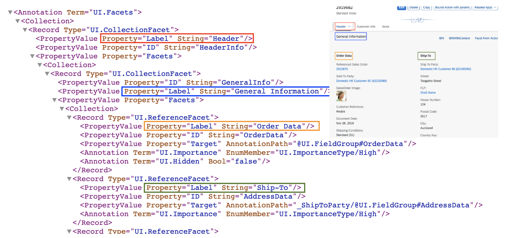
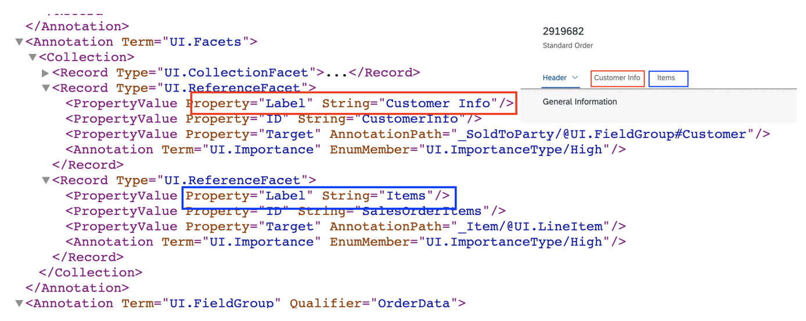
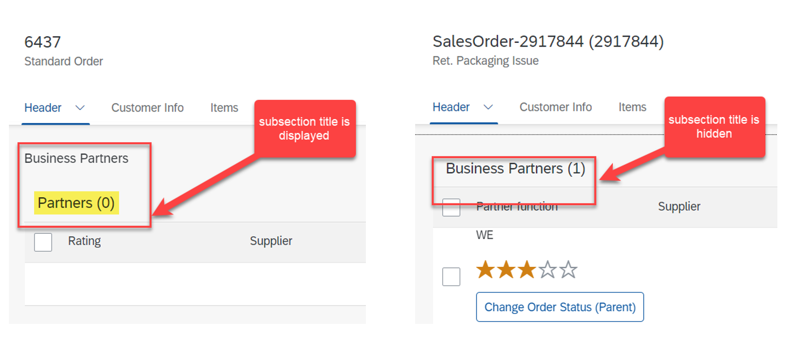
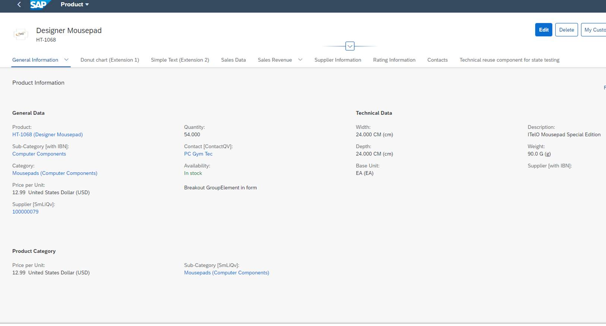
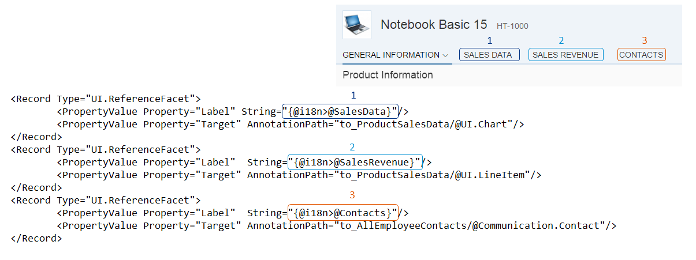

<!-- loiofacfea09018d4376acaceddb7e3f03b6 -->

# Defining and Adapting Sections

The object page content is arranged into sections and subsections that you can configure.

You use the `com.sap.vocabularies.UI.v1.Facets` annotations to build sections. Different facets have been defined to display important information in the content area sections.


A facet contains collection facets \(`UI.CollectionFacet`\) as well as reference facets \(`UI.ReferenceFacet`\). Collection facets are made up of a list of records, each of which represents a reference facet. Reference facets represent a reference, for example, to a `UI.LineItem` \(list on the object page\), `UI.Chart` \(Chart\), or `UI.Identification` annotation.

A collection or reference facet directly under the `UI.Facets` represents a section. A section can also have subsections under it. It is achieved by adding a collection facet under the `UI.Facet` and then adding reference or collection facets underneath this collection facet.

Note the following behavior:

-   In SAP Fiori elements for OData V2, all reference facets that are part of the second-level collection facet are arranged one beside the other \(the reference facets outside the collection facet are ignored in this case\). If there is no second-level collection facet, then all reference facets are considered.

-   In SAP Fiori elements for OData V4, all reference facets that are part of the second-level collection facet are arranged one beside the other. The reference facets outside the second-level collection facet are also considered and shown as separate subsections.


In the figure below, the collection facet for *General Information* combines two reference facets that both point to a field group.

  
  
**Object Page: CollectionFacet**

  

> ### Note:  
> `UI.CollectionFacets` at third level and beyond are not considered.

Furthermore, reference facets can refer to identification sections, the field group, contact, or line item annotations. For line items, a list is rendered.

  
  
**Object Page: ReferenceFacet**

  

> ### Sample Code:  
> XML Annotation
> 
> ```xml
> <Annotation Term="UI.Facets">
>     <Collection>
>         <Record Type="UI.ReferenceFacet">
>             <PropertyValue Property="Label" String="{@i18n>@GeneralInfoFacetLabel}"/>
>             <PropertyValue Property="Target" AnnotationPath="@UI.FieldGroup#GeneralInformation" />
>         </Record>
>         <Record Type="UI.CollectionFacet">
>             <PropertyValue Property="ID" String="FurtherData"/>
>             <PropertyValue Property="Label" String="{@i18n>@FurtherData}"/>
>             <PropertyValue Property="Facets">
>                 <Collection>
>                     <Record Type="UI.CollectionFacet">
>                     </Record>
>                 </Collection>
>             </PropertyValue>
>         </Record>
>     </Collection>
> </Annotation>
> ```

> ### Sample Code:  
> ABAP CDS Annotation
> 
> ```
> @UI.Facet: [
>   {
>     label: '{@i18n>@GeneralInfoFacetLabel}',
>     targetQualifier: 'GeneralInformation',
>     type: #FIELDGROUP_REFERENCE,
>     purpose: #STANDARD
>   },
>   {
>     id: 'FurtherData',
>     label: '{@i18n>@FurtherData}',
>     type: #COLLECTION,
>     purpose: #STANDARD
>   },
>   {
>     parentId: 'FurtherData',
>     purpose: #STANDARD
>   }
> ]
> product;
> 
> ```

> ### Sample Code:  
> CAP CDS Annotation
> 
> ```
> UI.Facets : [
>     {
>         $Type : 'UI.ReferenceFacet',
>         Label : '{@i18n>@GeneralInfoFacetLabel}',
>         Target : '@UI.FieldGroup#GeneralInformation',
>     },
>     {
>         $Type : 'UI.CollectionFacet',
>         ID : 'FurtherData',
>         Label : '{@i18n>@FurtherData}',
>         Facets : [
>             {
>                 $Type : 'UI.CollectionFacet'
>             }
>         ]
>     }
> ]
> ```

You can hide and display sections based on properties.

> ### Sample Code:  
> XML Annotation
> 
> ```xml
> <Record Type="UI.ReferenceFacet">
>    <Annotation Term="UI.Hidden" Path="IsActiveEntity"/>
>    <PropertyValue Property="Label" String="{@i18n>@SalesData}" />
>    <PropertyValue Property="Target" AnnotationPath="to_ProductSalesData/@UI.Chart" />
> </Record>
> 
> ```

> ### Sample Code:  
> ABAP CDS Annotation
> 
> ```
> @UI.facet: [
>  {
>   label: '{@i18n>@SalesData}',
>   type:         #DATAPOINT_REFERENCE,
>   targetElement: '_PRODUCTSALESDATA',
>   purpose: #STANDARD
>  }
> ]
> product;
> ```

> ### Sample Code:  
> CAP CDS Annotation
> 
> ```
> UI.Facets : {
>     $Type : 'UI.ReferenceFacet',
>     Label : '{@i18n>@SalesData}',
>     Target : 'to_ProductSalesData/@UI.Chart',
>     ![@UI.Hidden] : IsActiveEntity
> }
> ```

> ### Tip:  
> -   The section title is not displayed in the content area as the first section object page uses an anchor bar for sections. The title is not displayed in the content area for a section if the object page uses an icon tab bar for sections.
> 
> -   If a subsection contains only one type of content, such as a table or a chart, and the subsection title is the same as the control title, then only the control title is displayed in the subsection.
> 
> 
>   
> 
> -   In SAP Fiori elements for OData V2 if a section contains only one type of content, such as a table or a chart, and the section title is the same as the control title, then only the control title is displayed in the section.


<a name="loiofacfea09018d4376acaceddb7e3f03b6__section_utp_3gw_l4b"/>

## Adding a Field Group to a Section

This video shows the step-by-step procedure for adding a field group to a section on the object page: 

For more information, see [Grouping of Fields](grouping-of-fields-7d7a0c4.md).


<a name="loiofacfea09018d4376acaceddb7e3f03b6__section_r5n_cld_dmb"/>

## Rendering a Table in a Section

To render a table in a section, here's what you do:

1.  Include a list in the section, indicated by `com.sap.vocabularies.UI.v1.LineItem` or `com.sap.vocabularies.UI.v1.PresentationVariant`. If `PresentationVariant` is specified, then it must have `UI.LineItem` as the first property of the "Visualizations".

2.  To render a *Create* button, set `Org.OData.Capabilities.V1.InsertRestrictions/Insertable/Bool` to `true` for the entity set. For more information, see the section **Generic Actions** in [Adding Actions to Tables](adding-actions-to-tables-b623e0b.md).


See also [Enabling Inline Creation Mode or Empty Rows Mode for Table Entries](enabling-inline-creation-mode-or-empty-rows-mode-for-table-entries-cfb04f0.md).


<a name="loiofacfea09018d4376acaceddb7e3f03b6__section_scy_pxd_dmb"/>

## Increased Section and Table Height to Use Available Free Space on the Object Page

If the object page contains only one section with just one table or if the object page uses an icon tab bar for sections and any section has only one table, the following system behavior applies:

If the table is a `ui.table`, the section and table expand to use the full page height, showing more rows in the table.

If the table is a `sap.m.table`, the section and table expand to show 20 rows.


<a name="loiofacfea09018d4376acaceddb7e3f03b6__section_lmy_1yd_dmb"/>

## IDs for Collection Facets

To enable extensions, personalization, and automated testing, for example, you need to have stable IDs for views and controls. In most cases, they are derived automatically from existing annotations. For collection facets, you can use an annotation to set a stable ID. Ensure the ID is meaningful and unique within the entity type. Use only characters in camel case and without spaces.

If you define your facets in an annotation file in your project, you can add the ID there directly.

> ### Sample Code:  
> XML Annotation
> 
> ```xml
> <Annotation Term="UI.Facets">
>   <Collection>
>     <Record Type="UI.CollectionFacet">
>       <PropertyValue Property="ID" String="GeneralInformation"/>
>     </Record>
>   </Collection>
> </Annotation>
> ```

> ### Sample Code:  
> ABAP CDS Annotation
> 
> ```
> @UI.Facet: [
>   {
>     id: 'GeneralInformation',
>     type: #COLLECTION,
>     purpose: #STANDARD
>   }
> ]
> ```

> ### Sample Code:  
> CAP CDS Annotation
> 
> ```
> UI.Facets : [
>     {
>         $Type : 'UI.CollectionFacet',
>         ID : 'GeneralInformation'
>     }
> ]
> ```


It is mandatory to define an ID for collection facets but optional for reference facets. If you have defined an ID for the facet of your table, use this ID in the manifest instead of the generated one. If you have not defined an ID for the reference facet of your table, the ID is derived from the annotation path by replacing */@* with *::*, for example, `to_ProductText::com.sap.vocabularies.UI.v1.LineItem`. Don't add an ID in the annotation after delivering your app, as this ID is also used to build the stable IDs of all controls used in that section.

> ### Note:  
> All facets are displayed on the same page. The link from a facet leads you to the related section on the same page. The facet annotation label is used twice: Once for the facet in the header area and once for the section's title.


<a name="loiofacfea09018d4376acaceddb7e3f03b6__section_mp4_yhd_dmb"/>

## Additional Features in SAP Fiori Elements for OData V2

You can define a hierarchy level. Instead of a reference facet, you can add a collection facet that consists of several reference facets. The contents of these reference facets are arranged underneath.

In the figure below, the collection facet for *Product Information* combines three reference facets. Each reference facet refers to a field group or to an identification annotation.

  
  
**Object Page: CollectionFacet**

  

Further reference facets refer to identification sections, the field group, contact, or line item annotations. For line items, a list is rendered.

  
  
**Object Page: ReferenceFacets**

  

> ### Note:  
> When rendering a table in a section, `NavigationRestrictions` works only if `InlineCreate` is enabled for the related entity table. The creation from a new object page is not supported using the mentioned annotation.

When increasing the section and table height to use available free space on the object page, you can also optimize the table visualization by using the condensed mode. For more information, see [Using the Condensed Table Layout](using-the-condensed-table-layout-f3cc057.md).

If your table has many entries, see the information regarding the `MultiSelectionPlugin` at [Enabling Multiple Selection in Tables](enabling-multiple-selection-in-tables-116b5d8.md).

For information about the icon tab bar, see *Adapting the UI: Object Page* \> *Switch to tabs*in [Adapting the UI: List Report and Object Page](adapting-the-ui-list-report-and-object-page-0d2f1a9.md).


### Defining the SmartForm Column Layout

The column layout is used by default in the `SmartForm` on the object page. Do not include any layout or other container controls into the `GroupElement`. Views are also not supported. This could damage the visual layout, keyboard support, and screen-reader support.

The default of six columns in smart form of extra-large screens can be changed to four columns using the following manifest setting.

> ### Sample Code:  
> ```
> "sap.ui.generic.app": { 
>         "settings": { 
>             "objectPageColumns": { 
>                 "screenSizeXL": 4 
>             } 
>         },
> 
> ```

You can also use the `useColumnLayoutForSmartForm` switch in the manifest, at `sap.ui.generic.app\settings`, to change from the default layout for the `SmartForm` \(column layout\) to the responsive grid layout. To do so, set the switch to `false`.

> ### Sample Code:  
> ```
> "sap.ui.generic.app": {
>                               "_version": "1.3.0",
>                               "settings": {
>                                              "useColumnLayoutForSmartForm": false
>                               }
> 
> ```


<a name="loiofacfea09018d4376acaceddb7e3f03b6__section_wgv_fvx_4lb"/>

## Additional Features in SAP Fiori Elements for OData V4

> ### Remember:  
> If you use a chart or table for the `UI.ReferenceFacet`, ensure that this is the only content and does not have another peer `ReferenceFacet` to avoid rendering issues. Note that the order of defined `ReferenceFacets` inside a mixed `CollectionFacet` behaves as follows:
> 
> All charts or tables are pushed together and are either displayed at the beginning or at the end of the `CollectionFacet`, followed or preceded by a field group. The order depends on whether the first `ReferenceFacet` in the `CollectionFacet` is a chart or table, or a field group.


### Tab Representation vs. Anchor Representation

By default, `"Page"` mode is the section layout mode. In this mode, all the sections and subsections are added to the same page. End users can reach the section or subsection by either choosing the corresponding anchor below the header facet, or by simply scrolling down on the page.

Alternatively, application developers can configure the object page using `"Tabs"` mode as the section layout mode. In this mode, the sections are represented as tabs under the header facet. End users can reach the right section or subsection only by choosing the corresponding navigation placeholder \(either by choosing the tab directly, or by choosing a subsection via the navigation placeholder under the tab\).

 

> ### Note:  
> We recommend using the tab representation when your page uses the `UI.Table` \(grid table\).

To choose a tab visualization, you must use the `sectionLayout` property in the manifest file as shown below:

> ### Sample Code:  
> ```xml
> "SalesOrderManageObjectPage":{              
>     "type": "Component",                  
>     "id": "SalesOrderManageObjectPage",                  
>     "name": "sap.fe.templates.ObjectPage",                  
>     "options":{                      
>         "settings":{                          
>             "entitySet": "SalesOrderManage",                          
>             "navigation":{                              
>                 "_Item":{                                  
>                     "detail":{                                      
>                         "route": "SalesOrderItemObjectPage"                                  
>                     }                              
>                 },                              
>                 "SalesOrderManage":{                                  
>                     "detail":{                                      
>                         "route": "SalesOrderManageObjectPage",                                      
>                         "parameters":{                                          
>                             "key": "{_ReferencedSalesOrder/ID}"                                      
>                         }                                  
>                     }         
>                 }                          
>             }, // End of navigation                          
>             "sectionLayout": "Tabs"    // Default value: Page. Possible values: Page (all sections are shown on same page) and Tabs (each top-level section is shown in an own tab)
>         }
>     }
> }
> ```


### Responsive Column Layout

We're using the responsive column layout on the object page, which means that form data is spread across six columns by default when opened on extra large screens to improve content density. The number of columns adapts automatically, depending on the screen size.

