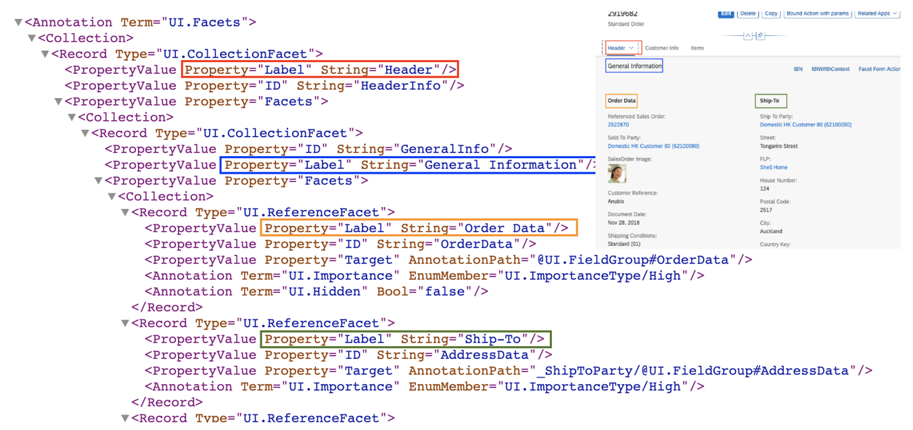
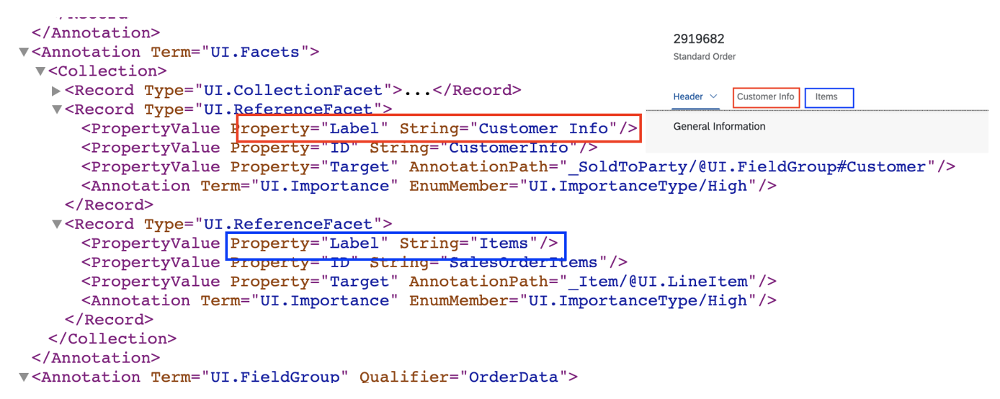
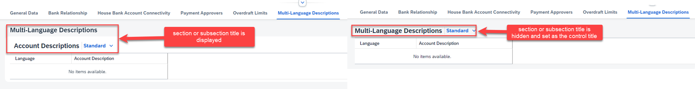

<!-- loiofacfea09018d4376acaceddb7e3f03b6 -->

# Defining and Configuring Sections

You can define sections and subsections of the object page with `com.sap.vocabularies.UI.v1.Facets` annotations.

Different facets have been defined to display important information in the content area sections.


A facet contains collection facets \(`UI.CollectionFacet`\) as well as reference facets \(`UI.ReferenceFacet`\). Collection facets are made up of a list of records, each representing a reference facet. Reference facets represent a reference, for example, to a `UI.LineItem` \(list on the object page\), `UI.Chart` \(Chart\), or `UI.Identification` annotation.

A collection or reference facet directly under the `UI.Facets` represents a section. A section can also have subsections under it. To create a subsection, add a collection facet under the `UI.Facet` and then add reference or collection facets underneath this collection facet.

All reference facets that are part of the second-level collection facet are arranged one beside the other.

The reference facets outside the second-level collection facet are considered and shown as separate subsections.

In the figure below, the collection facet for *General Information* combines two reference facets that both point to a field group.

  
  
**Object Page: CollectionFacet**



> ### Note:  
> -   `UI.CollectionFacets` at third level and beyond are not considered.
> 
> -   You must not use `UI.CollectionFacet` under `UI.Facets` at design time, if the collection facet has only one `UI.ReferenceFacet` within it, as there can be rendering issues. In such cases, you can directly use `UI.ReferenceFacet` under the `UI.Facets`.

Furthermore, reference facets can refer to identification sections, the field group, contact, or line item annotations. For line items, a list is rendered.

  
  
**Object Page: ReferenceFacet**



> ### Sample Code:  
> XML Annotation
> 
> ```xml
> <Annotation Term="UI.Facets">
>     <Collection>
>         <Record Type="UI.ReferenceFacet">
>             <PropertyValue Property="Label" String="{@i18n>@GeneralInfoFacetLabel}"/>
>             <PropertyValue Property="Target" AnnotationPath="@UI.FieldGroup#GeneralInformation" />
>         </Record>
>         <Record Type="UI.CollectionFacet">
>             <PropertyValue Property="ID" String="FurtherData"/>
>             <PropertyValue Property="Label" String="{@i18n>@FurtherData}"/>
>             <PropertyValue Property="Facets">
>                 <Collection>
>                     <Record Type="UI.CollectionFacet">
>                     </Record>
>                 </Collection>
>             </PropertyValue>
>         </Record>
>     </Collection>
> </Annotation>
> ```

> ### Sample Code:  
> ABAP CDS Annotation
> 
> ```
> @UI.Facet: [
>   {
>     label: '{@i18n>@GeneralInfoFacetLabel}',
>     targetQualifier: 'GeneralInformation',
>     type: #FIELDGROUP_REFERENCE,
>     purpose: #STANDARD
>   },
>   {
>     id: 'FurtherData',
>     label: '{@i18n>@FurtherData}',
>     type: #COLLECTION,
>     purpose: #STANDARD
>   },
>   {
>     parentId: 'FurtherData',
>     purpose: #STANDARD
>   }
> ]
> product;
> 
> ```

> ### Sample Code:  
> CAP CDS Annotation
> 
> ```
> UI.Facets : [
>     {
>         $Type : 'UI.ReferenceFacet',
>         Label : '{@i18n>@GeneralInfoFacetLabel}',
>         Target : '@UI.FieldGroup#GeneralInformation',
>     },
>     {
>         $Type : 'UI.CollectionFacet',
>         ID : 'FurtherData',
>         Label : '{@i18n>@FurtherData}',
>         Facets : [
>             {
>                 $Type : 'UI.CollectionFacet'
>             }
>         ]
>     }
> ]
> ```

You can hide and display sections based on properties.

> ### Sample Code:  
> XML Annotation
> 
> ```xml
> <Record Type="UI.ReferenceFacet">
>    <Annotation Term="UI.Hidden" Path="IsActiveEntity"/>
>    <PropertyValue Property="Label" String="{@i18n>@SalesData}" />
>    <PropertyValue Property="Target" AnnotationPath="to_ProductSalesData/@UI.Chart" />
> </Record>
> 
> ```

> ### Sample Code:  
> ABAP CDS Annotation
> 
> ```
> @UI.facet: [
>  {
>   label: '{@i18n>@SalesData}',
>   type:         #DATAPOINT_REFERENCE,
>   targetElement: '_PRODUCTSALESDATA',
>   purpose: #STANDARD
>  }
> ]
> product;
> ```

> ### Sample Code:  
> CAP CDS Annotation
> 
> ```
> UI.Facets : {
>     $Type : 'UI.ReferenceFacet',
>     Label : '{@i18n>@SalesData}',
>     Target : 'to_ProductSalesData/@UI.Chart',
>     ![@UI.Hidden] : IsActiveEntity
> }
> ```

> ### Tip:  
> -   You must not use a comma \(,\) in a section or subsection title, as commas serve as delimiters in SAP Fiori elements. A comma is used while grouping back-end messages for a field within the section or subsection.
> 
> -   If the object page uses an icon tab bar for sections, then the section title isn't displayed in the content area. If the object page uses an anchor bar for sections, then only the title of the first section is hidden in the content area.
> 
> -   For object pages configured with *Page* section layout mode, the following applies: if a section/subsection contains only a table or a chart as a control, the title of the section or subsection is hidden but the title of the control is replaced with the title from the section or subsection. In *Tabs* mode, this only applies to subsections but isn't applied to sections.
> 
> 
> 


<a name="loiofacfea09018d4376acaceddb7e3f03b6__section_utp_3gw_l4b"/>

## Adding a Field Group to a Section

This video shows the step-by-step procedure for adding a field group to a section on the object page: 

For more information, see [Grouping of Fields](grouping-of-fields-cb1748e.md).


<a name="loiofacfea09018d4376acaceddb7e3f03b6__section_r5n_cld_dmb"/>

## Rendering a Table in a Section

To render a table in a section, follow these steps:

1.  Include a list in the section, indicated by `com.sap.vocabularies.UI.v1.LineItem` or `com.sap.vocabularies.UI.v1.PresentationVariant`. `UI.v1.SelectionPresentationVariant` is also supported. If `PresentationVariant` is specified, then it must have `UI.LineItem` as the first property of the "Visualizations". If a`SelectionPresentationVariant` is specified, it must contain a valid `PresentationVariant` with `UI.LineItem` as the first property of the "Visualizations".

    > ### Sample Code:  
    > XML Annotation
    > 
    > ```
    >         <Annotation Term="UI.Facets">
    >           <Collection>
    >             <Record Type="UI.CollectionFacet">
    >               <PropertyValue Property="ID" String="FacetIdentifier1"/>
    >               <PropertyValue Property="Label" String="Section 1"/>
    >               <PropertyValue Property="Facets">
    >                 <Collection>
    >                   <Record Type="UI.ReferenceFacet">
    >                     <PropertyValue Property="ID" String="FacetIdentifier2"/>
    >                     <PropertyValue Property="Target" AnnotationPath=_Child/@UI.LineItem/>
    >                   </Record>
    >                 </Collection>
    >               </PropertyValue>
    >             </Record>
    > 
    >             <Record Type="UI.CollectionFacet">
    >               <PropertyValue Property="ID" String="FacetIdentifier2"/>
    >               <PropertyValue Property="Label" String="Section 2"/>
    >               <PropertyValue Property="Facets">
    >                 <Collection>
    >                   <Record Type="UI.ReferenceFacet">
    >                     <PropertyValue Property="ID" String="FacetIdentifier2"/>
    >                     <PropertyValue Property="Target" AnnotationPath=_Child/@UI.SelectionPresentationVariant#mySPV/>
    >                   </Record>
    >                 </Collection>
    >               </PropertyValue>
    >             </Record>
    >           </Collection>
    >         </Annotation>
    > ```

    > ### Sample Code:  
    > CAP CDS Annotation
    > 
    > ```
    >     Facets                              : [
    >       {
    >         $Type : 'UI.CollectionFacet',
    >         ID    : 'FacetIdentifier1',
    >         Label : 'Section 1',
    >         Facets: [{
    >           $Type : 'UI.ReferenceFacet',
    >           ID    : 'FacetIdentifier2',
    >           Target: '_Child/@UI.LineItem'
    >         }]
    >       },
    >       {
    >         $Type : 'UI.CollectionFacet',
    >         ID    : 'FacetIdentifier2',
    >         Label : 'Section 2',
    >         Facets: [{
    >           $Type : 'UI.ReferenceFacet',
    >           ID    : 'FacetIdentifier2',
    >           Target: '_Child/@UI.SelectionPresentationVariant#mySPV'
    >         }]
    >       }
    >     ]
    > ```

    For more information and live examples, see the SAP Fiori development portal at [Standard Floorplans - Extensions - Extensions for Object Pages - Custom Section](https://ui5.sap.com/test-resources/sap/fe/core/fpmExplorer/index.html#/topic/floorplanObjectPage/customSection).

2.  To render a *Create* button, set `Org.OData.Capabilities.V1.InsertRestrictions/Insertable/Bool` to `true` for the entity set. For more information, see the [Generic Actions](adding-actions-to-tables-b623e0b.md#loiob623e0bbbb2b4147b2d0516c463921a0__section_nx4_qpb_2nb) section in [Adding Actions to Tables](adding-actions-to-tables-b623e0b.md).


> ### Remember:  
> If you use a chart or table for the `UI.ReferenceFacet`, ensure that this is the only content and does not have another peer `ReferenceFacet` to avoid rendering issues.

For more information, see [Enabling Inline Creation Mode or Empty Row Mode for Table Entries](enabling-inline-creation-mode-or-empty-row-mode-for-table-entries-cfb04f0.md).


<a name="loiofacfea09018d4376acaceddb7e3f03b6__section_scy_pxd_dmb"/>

## Increased Section and Table Height to Use Available Free Space on the Object Page

If the object page contains only one section with just one table or if the object page uses an icon tab bar for sections and any section has only one table, the following system behavior applies:

If the table is a `ui.table`, the section and table expand to use the full page height, showing more rows in the table.

If the table is a `sap.m.table`, the section and table expand to show 20 rows.


<a name="loiofacfea09018d4376acaceddb7e3f03b6__section_lmy_1yd_dmb"/>

## IDs for Collection Facets

To enable extensions, personalization, and automated testing, for example, you need to have stable IDs for views and controls. In most cases, they are derived automatically from existing annotations. For collection facets, you can use an annotation to set a stable ID. Ensure the ID is meaningful and unique within the entity type. Use only characters in camel case and without spaces.

If you define your facets in an annotation file in your project, you can add the ID there directly.

> ### Sample Code:  
> XML Annotation
> 
> ```xml
> <Annotation Term="UI.Facets">
>   <Collection>
>     <Record Type="UI.CollectionFacet">
>       <PropertyValue Property="ID" String="GeneralInformation"/>
>     </Record>
>   </Collection>
> </Annotation>
> ```

> ### Sample Code:  
> ABAP CDS Annotation
> 
> ```
> @UI.Facet: [
>   {
>     id: 'GeneralInformation',
>     type: #COLLECTION,
>     purpose: #STANDARD
>   }
> ]
> ```

> ### Sample Code:  
> CAP CDS Annotation
> 
> ```
> UI.Facets : [
>     {
>         $Type : 'UI.CollectionFacet',
>         ID : 'GeneralInformation'
>     }
> ]
> ```


It is mandatory to define an ID for collection facets but optional for reference facets. If you have defined an ID for the facet of your table, use this ID in the manifest instead of the generated one. If you have not defined an ID for the reference facet of your table, the ID is derived from the annotation path by replacing `/@` with `::`, for example, `to_ProductText::com.sap.vocabularies.UI.v1.LineItem`. Don't add an ID in the annotation after delivering your app, as this ID is also used to build the stable IDs of all controls used in that section.

> ### Note:  
> All facets are displayed on the same page. The link from a facet leads you to the related section on the same page. The facet annotation label is used twice: Once for the facet in the header area and once for the section's title.


<a name="loiofacfea09018d4376acaceddb7e3f03b6__section_wgv_fvx_4lb"/>

## Tab Representation vs. Anchor Representation

By default, `"Page"` mode is the section layout mode. In this mode, all the sections and subsections are added to the same page. End users can reach the section or subsection by either choosing the corresponding anchor below the header facet, or by simply scrolling down on the page.

Alternatively, application developers can configure the object page using `"Tabs"` mode as the section layout mode. In this mode, the sections are represented as tabs under the header facet. End users can reach the right section or subsection only by choosing the corresponding navigation placeholder \(either by choosing the tab directly, or by choosing a subsection via the navigation placeholder under the tab\).

> ### Note:  
> We recommend using the tab representation when your page uses the `UI.Table` \(grid table\).

To choose a tab visualization, you must use the `sectionLayout` property in the manifest file as shown below:

> ### Sample Code:  
> `manifest.json`
> 
> ```json
> "SalesOrderManageObjectPage":{              
>     "type": "Component",                  
>     "id": "SalesOrderManageObjectPage",                  
>     "name": "sap.fe.templates.ObjectPage",                  
>     "options":{                      
>         "settings":{                          
>             "contextPath": "/SalesOrderManage",                          
>             "navigation":{                              
>                 "_Item":{                                  
>                     "detail":{                                      
>                         "route": "SalesOrderItemObjectPage"                                  
>                     }                              
>                 },                              
>                 "SalesOrderManage":{                                  
>                     "detail":{                                      
>                         "route": "SalesOrderManageObjectPage",                                      
>                         "parameters":{                                          
>                             "key": "{_ReferencedSalesOrder/ID}"                                      
>                         }                                  
>                     }         
>                 }                          
>             }, // End of navigation                          
>             "sectionLayout": "Tabs"    // Default value: Page. Possible values: Page (all sections are shown on same page) and Tabs (each top-level section is shown in an own tab)
>         }
>     }
> }
> ```


## Special Handling of Text Area Label as a Single Field in a Section or Subsection

If `UI.FieldGroup` has only one property based on `UI.MultiLineText` and no other controls, the label of the corresponding `TextArea` control is hidden, as the section or subsection title suffices as the label.

However, you must use a meaningful label for the `TextArea` control to ensure its compatibility with the screen reader programs.


## Responsive Column Layout

We're using the responsive column layout on the object page, which means that form data is spread across six columns by default when opened on extra large screens to improve content density. The number of columns adapts automatically, depending on the screen size.


> ### Note:  
> For information about SAP Fiori elements for OData V2, see [Defining and Adapting Sections](defining-and-adapting-sections-b72681d.md).

