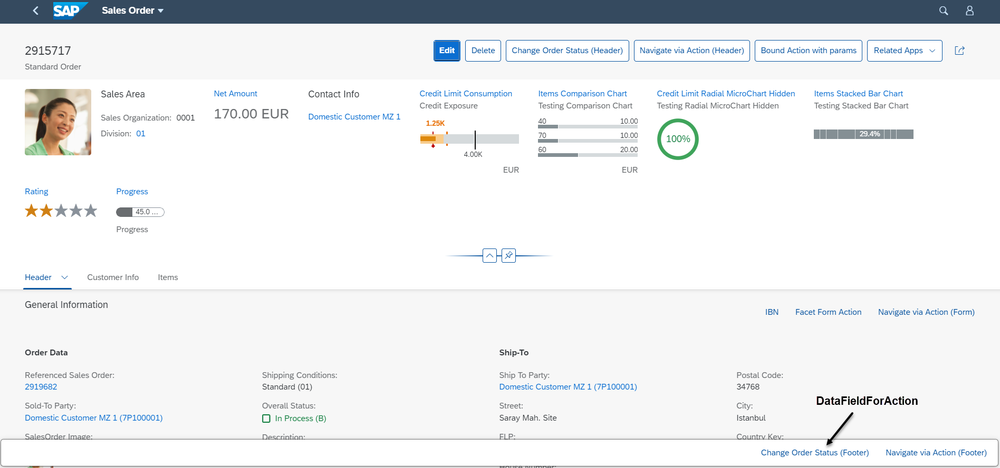

<!-- loio1743323829e5474eb3829d2e9ab022ae -->

# Defining Determining Actions

You can add a determining action button to the footer of the object page.

Determining actions are used to trigger actions directly using the context of the page in the object page.

`DataFieldForAction` can be configured as a determining action.

   
  
**Object Page: Determining Action in Footer**

  


<a name="loio1743323829e5474eb3829d2e9ab022ae__section_tgj_nnh_qmb"/>

## Code Samples


### Object Page

The following code sample shows how to create your annotations for the determining actions on the object page:

> ### Sample Code:  
> XML Annotation
> 
> ```xml
> <Annotation Term="UI.Identification">
>     <Collection>
>        <Record Type="UI.DataFieldForAction">
>           <PropertyValue Property="Label" String="CWP"/>
>           <PropertyValue Property="Action"
>              String="STTA_PROD_MAN.STTA_PROD_MAN_Entities/
>              STTA_C_MP_ProductCopywithparams"/>
>           <PropertyValue Property="InvocationGrouping"
>              EnumMember="UI.OperationGroupingType/Isolated"/>
>           <Annotation Term="UI.Importance" EnumMember="UI.ImportanceType/High"/>
>        </Record>
>        <Record Type="UI.DataFieldForAction">
>           <PropertyValue Property="Label" String="Copy"/>
>           <PropertyValue Property="Action"
>              String="STTA_PROD_MAN.STTA_PROD_MAN_Entities/STTA_C_MP_ProductCopy"/>
>           <PropertyValue Property="Determining" Bool="true"/>
>           <PropertyValue Property="InvocationGrouping"  
>              EnumMember="UI.OperationGroupingType/Isolated"/>
>           <Annotation Term="UI.Importance" EnumMember="UI.ImportanceType/High"/>
>        </Record>
>     </Collection>
> </Annotation>
> ```

> ### Sample Code:  
> ABAP CDS Annotation
> 
> No ABAP CDS annotation sample is available. Please use the local XML annotation.

> ### Sample Code:  
> CAP CDS Annotation
> 
> ```
> 
> UI.Identification : [
>     {
>         $Type : 'UI.DataFieldForAction',
>         Label : 'CWP',
>         Action : 'STTA_PROD_MAN.STTA_PROD_MAN_Entities/
>         STTA_C_MP_ProductCopywithparams',
>         InvocationGrouping : #Isolated,
>         ![@UI.Importance] : #High
>     },
>     {
>         $Type : 'UI.DataFieldForAction',
>         Label : 'Copy',
>         Action : 'STTA_PROD_MAN.STTA_PROD_MAN_Entities/STTA_C_MP_ProductCopy',
>         Determining : true,
>         InvocationGrouping : #Isolated,
>         ![@UI.Importance] : #High
>     }
> ]
> 
> ```

> ### Note:  
> The `UI.Identification` vocabulary term is used to define the actions on the object page.

In the CAP CDS example above, for the first record type the `DataFieldForAction` complex type does not contain the `Determining` property. That's why the action button will appear in the object page header.

With the last record type, the `DataFieldForAction` complex type is used and contains the `Determining` property, which is set to `true`. This means the action button will appear in the footer. Note that if the `Determining` property is either not present or is set to `false`, the action will not appear in the footer.

**Related Information**  


[Displaying Actions on the Object Page](displaying-actions-on-the-object-page-f65e8b1.md)

