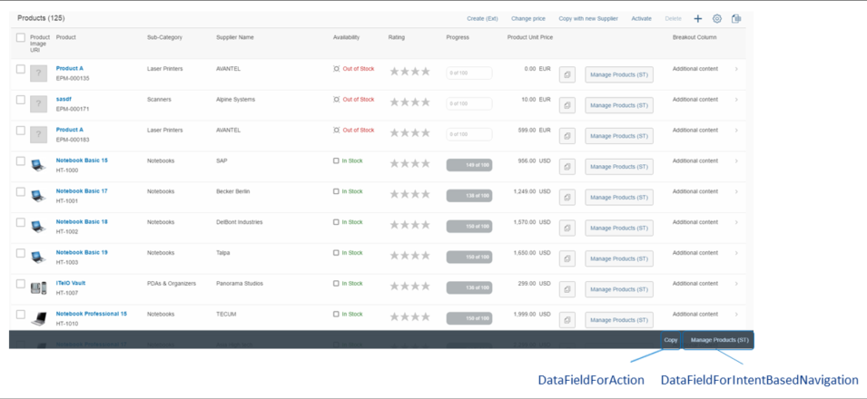

<!-- loiod71998265d714004a815e55b2dde5f5d -->

# Defining Determining Actions in List Reports

You can add a determining action button to the footer of the list report view.

> ### Note:  
> This topic is currently only applicable to SAP Fiori elements for OData V2.

> ### Recommendation:  
> Please note that this feature is deprecated. SAP Fiori elements supports this feature only for compatibility reasons. We recommend that you avoid using determining actions in list reports.

Determining actions are used to trigger actions directly using the context of the table in the list report.

There are two types of determining actions:

-   Actions that trigger a back-end call through the OData service \(`Function`, `FunctionImport`, `Action`, or `ActionImport`\), represented by the complex type `DataFieldForAction`

-   Actions that trigger intent-based navigation, represented by the complex type `DataFieldForIntentBasedNavigation`


To add a determining action to the footer of the list report, use the annotation term `UI.LineItem` and set the `Determining` property to `true` for the complex type. This is displayed as shown below:



The following code sample shows an example of how to create your annotations for the determining actions in the list report:

> ### Sample Code:  
> ```
> 
> <Annotation Term="UI.LineItem">
>    <Collection>
>       <Record Type="UI.DataFieldForAction">
>          <PropertyValue Property="Label" String="Copy with new Supplier"/>
>          <PropertyValue Property="Action"
>            String="STTA_PROD_MAN.STTA_PROD_MAN_Entities/
>             STTA_C_MP_ProductCopywithparams"/>
>          <PropertyValue Property="InvocationGrouping"   
>             EnumMember="UI.OperationGroupingType/Isolated"/>
>       </Record>
>       <Record Type="UI.DataFieldForAction">
>          <PropertyValue Property="Label" String="Copy"/>
>          <PropertyValue Property="Action"
>             String="STTA_PROD_MAN.STTA_PROD_MAN_Entities/STTA_C_MP_ProductCopy"/>
>          <PropertyValue Property="Determining" Bool="true"/>
>          <PropertyValue Property="InvocationGrouping"   
>             EnumMember="UI.OperationGroupingType/Isolated"/>
>       </Record>
>       <Record Type="UI.DataFieldForIntentBasedNavigation">
>          <PropertyValue Property="Label" String="Manage Products (ST)"/>
>          <PropertyValue Property="SemanticObject" String="EPMProduct"/>
>          <PropertyValue Property="Action" String="manage_st"/>
>          <PropertyValue Property="Determining" Bool="true"/>
>       </Record>
>    </Collection>
> </Annotation>
> ```

> ### Note:  
> The `UI.LineItem` vocabulary term is used to define the columns for the smart table.

In the example above for the first record type, the `DataFieldForAction` complex type does not contain the `Determining` property. Therefore, the action button will appear in the smart table toolbar.

With the last two record types, the `DataFieldForAction` and `DataFieldForIntentBasedNavigation`, complex types are used and contain the `Determining` property, which is set to `true`. This means the action buttons will appear in the footer.

