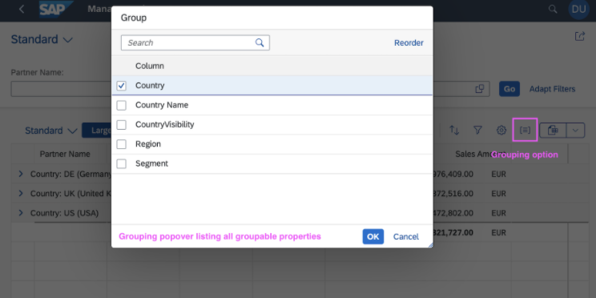

<!-- loio9062f11fb94f4781a61a7437a70e62fe -->

# Defining Groupable Properties

Groupable properties enable users to organize analytical table rows into groups based on specific data fields in SAP Fiori elements for OData V4. Define which properties can be used for grouping through annotations to allow flexible data organization and analysis.

Grouping data in analytical tables helps users organize and analyze large datasets more effectively. For example, in a customer management application, you can group customers by their market segment or geographical region to identify trends, compare performance across categories, or drill down into specific subsets of data. By defining groupable properties, you enable users to dynamically reorganize table data according to their analytical needs without requiring custom development.

To enable grouping rows based on groupable properties, you must define which properties are groupable. See the following sample code:

> ### Sample Code:  
> XML Annotation
> 
> ```xml
> <Annotations Target="sap.fe.managepartners.ManagePartnersService.Customers">
>     <Annotation Term="Aggregation.ApplySupported">
>         <PropertyValue Property="GroupableProperties">
>             <Collection>
>                 <PropertyPath>Segment</PropertyPath>
>                 <PropertyPath>Country</PropertyPath>
>             </Collection>
>         </PropertyValue>
>     </Annotation>
> </Annotations>
> 
> ```

> ### Sample Code:  
> ABAP CDS Annotation
> 
> No ABAP CDS annotation is required. When a property lacks the `@Aggregation.default` annotation \(meaning it can't be aggregated\), it automatically becomes a groupable property within an analytical service that has the `@OData.applySupportedForAggregation: #FULL` annotation.

> ### Sample Code:  
> CAP CDS Annotation
> 
> ```
> @Aggregation.ApplySupported : {
>     GroupableProperties: [Segment, Country]
> }
> ```

Users can then group rows of the table:



