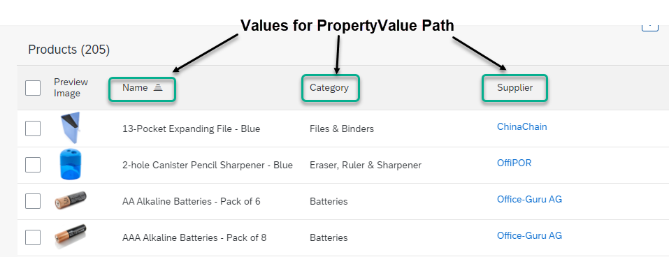

<!-- loiof0e1e1743bef4f519c34025ad4351f77 -->

# Defining Line Items

To define the line items of a table, use `com.sap.vocabularies.UI.v1.LineItem` as shown in the code samples below. The rendering result is as follows:

   
  
**List Report: LineItem of Root EntitySet**

  


<a name="loiof0e1e1743bef4f519c34025ad4351f77__section_vmv_cyw_l4b"/>

## Determining Column Names

> ### Sample Code:  
> XML Annotation
> 
> ```xml
> ...
> <Annotation Term="UI.LineItem">
>   <Collection>
>     <Record Type="UI.DataField">
>       <PropertyValue Property="Value" Path="Product"/>
>       <Annotation Term="UI.Importance" EnumMember="UI.ImportanceType/High"/>
>     </Record>
>     <Record Type="UI.DataField">
>       <PropertyValue Property="Value" Path="ProductCategory"/>
>       <Annotation Term="UI.Importance" EnumMember="UI.ImportanceType/High"/>
>     </Record>
>     <Record Type="UI.DataField">
>       <PropertyValue Property="Value" Path="Supplier"/>
>       <Annotation Term="UI.Importance" EnumMember="UI.ImportanceType/High"/>
>     </Record>
>   </Collection>
> </Annotation>
> ```

> ### Sample Code:  
> ABAP CDS Annotation
> 
> ```
> 
> @UI.lineItem: [
>   {
>     importance: #HIGH,
>     value: 'PRODUCT',
>     type: #STANDARD,
>     position: 1 
>   }
> ]
> PRODUCT;
> 
> @UI.lineItem: [
>   {
>     importance: #HIGH,
>     value: 'PRODUCTCATEGORY',
>     type: #STANDARD,
>     position: 2 
>   }
> ]
> PRODUCTCATEGORY;
> 
> @UI.lineItem: [
>   {
>     importance: #HIGH,
>     value: 'SUPPLIER',
>     type: #STANDARD,
>     position: 3 
>   }
> ]
> SUPPLIER;
> ```

> ### Sample Code:  
> CAP CDS Annotation
> 
> ```
> 
> UI.LineItem : [
>     {
>         $Type : 'UI.DataField',
>         Value : Product,
>         ![@UI.Importance] : #High
>     },
>     {
>         $Type : 'UI.DataField',
>         Value : ProductCategory,
>         ![@UI.Importance] : #High
>     },
>     {
>         $Type : 'UI.DataField',
>         Value : Supplier,
>         ![@UI.Importance] : #High
>     }
> ]
> 
> ```


## More Information

For information about adding actions for line items, see [Adding Actions to Tables](adding-actions-to-tables-b623e0b.md).

For information about responsiveness options in tables, see [Responsiveness Options: Example](responsiveness-options-example-69efbe7.md).

