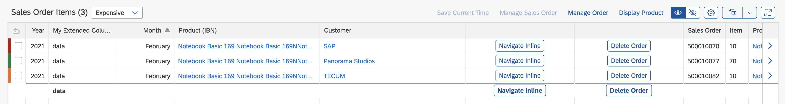
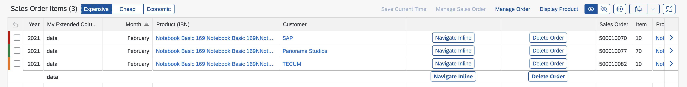
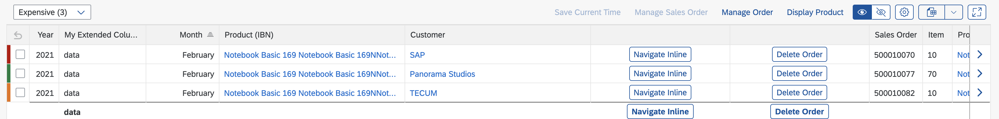
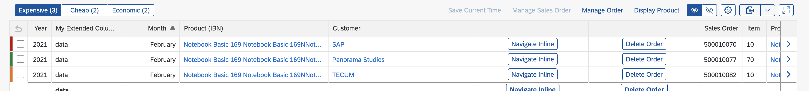

<!-- loio664a79a0b06c400583ef8405789b7916 -->

# Defining Multiple Views of a Table in an Analytical List Page

You can define multiple views of a table and display them in single table mode. Users can switch between views using a segmented button.


<a name="loio664a79a0b06c400583ef8405789b7916__section_p4n_k5m_dsb"/>

## Additional Features in SAP Fiori Elements for OData V2


### Defining Multiple Views

To define multiple views using single table mode, perform the following steps:

1.  Add `SelectionVariants` to your annotations file. Each view of the table will apply a different `SelectionVariant` annotation.

    > ### Sample Code:  
    > ```
    > <?xml version="1.0" encoding="UTF-8"?>
    > <Annotations xmlns="http://docs.oasis-open.org/odata/ns/edm" Target="SEPMRA_ALP_SO_ANA_SRV.SEPMRA_C_ALP_SlsOrdItemCubeALPResult">
    >    <Annotation Term="UI.SelectionVariant" Qualifier="Expensive">
    >       <Record>
    >          <PropertyValue Property="Text" String="Expensive" />
    >          <PropertyValue Property="SelectOptions">
    >             <Collection>
    >                <Record Type="UI.SelectOptionType">
    >                   <PropertyValue Property="PropertyName" PropertyPath="Product" />
    >                   <PropertyValue Property="Ranges">
    >                      <Collection>
    >                         <Record Type="UI.SelectionRangeType">
    >                            <PropertyValue Property="Sign" EnumMember="UI.SelectionRangeSignType/I" />
    >                            <PropertyValue Property="Option" EnumMember="UI.SelectionRangeOptionType/EQ" />
    >                            <PropertyValue Property="Low" String="HT-1000" />
    >                         </Record>
    >                      </Collection>
    >                   </PropertyValue>
    >                </Record>
    >             </Collection>
    >          </PropertyValue>
    >       </Record>
    >    </Annotation>
    >    <Annotation Term="UI.SelectionVariant" Qualifier="Cheap">
    >       <Record>
    >          <PropertyValue Property="Text" String="Cheap" />
    >          <PropertyValue Property="SelectOptions">
    >             <Collection>
    >                <Record Type="UI.SelectOptionType">
    >                   <PropertyValue Property="PropertyName" PropertyPath="Product" />
    >                   <PropertyValue Property="Ranges">
    >                      <Collection>
    >                         <Record Type="UI.SelectionRangeType">
    >                            <PropertyValue Property="Sign" EnumMember="UI.SelectionRangeSignType/I" />
    >                            <PropertyValue Property="Option" EnumMember="UI.SelectionRangeOptionType/EQ" />
    >                            <PropertyValue Property="Low" String="HT-1050" />
    >                         </Record>
    >                      </Collection>
    >                   </PropertyValue>
    >                </Record>
    >             </Collection>
    >          </PropertyValue>
    >       </Record>
    >    </Annotation>
    >    <Annotation Term="UI.SelectionVariant" Qualifier="Economic">
    >       <Record>
    >          <PropertyValue Property="Text" String="Economic" />
    >          <PropertyValue Property="SelectOptions">
    >             <Collection>
    >                <Record Type="UI.SelectOptionType">
    >                   <PropertyValue Property="PropertyName" PropertyPath="Product" />
    >                   <PropertyValue Property="Ranges">
    >                      <Collection>
    >                         <Record Type="UI.SelectionRangeType">
    >                            <PropertyValue Property="Sign" EnumMember="UI.SelectionRangeSignType/I" />
    >                            <PropertyValue Property="Option" EnumMember="UI.SelectionRangeOptionType/EQ" />
    >                            <PropertyValue Property="Low" String="HT-1002" />
    >                         </Record>
    >                      </Collection>
    >                   </PropertyValue>
    >                </Record>
    >             </Collection>
    >          </PropertyValue>
    >       </Record>
    >    </Annotation>
    >    <Annotation Term="UI.SelectionVariant" Qualifier="Budget">
    >       <Record>
    >          <PropertyValue Property="Text" String="Budget" />
    >          <PropertyValue Property="SelectOptions">
    >             <Collection>
    >                <Record Type="UI.SelectOptionType">
    >                   <PropertyValue Property="PropertyName" PropertyPath="Product" />
    >                   <PropertyValue Property="Ranges">
    >                      <Collection>
    >                         <Record Type="UI.SelectionRangeType">
    >                            <PropertyValue Property="Sign" EnumMember="UI.SelectionRangeSignType/I" />
    >                            <PropertyValue Property="Option" EnumMember="UI.SelectionRangeOptionType/EQ" />
    >                            <PropertyValue Property="Low" String="HT-1022" />
    >                         </Record>
    >                      </Collection>
    >                   </PropertyValue>
    >                </Record>
    >             </Collection>
    >          </PropertyValue>
    >       </Record>
    >    </Annotation>
    > </Annotations>
    > ```

2.  Extend the `manifest.json` to switch on the multiple view feature and link to the variants you have added to your annotations. You do this in the analytical list page settings section under `sap.ui.generic.app`. Use `quickVariantSelection` for single table mode.

    > ### Sample Code:  
    > ```
    > "quickVariantSelection":{
    >    "variants":{
    >       "0":{
    >          "key":"_tab1",
    >          "annotationPath":"com.sap.vocabularies.UI.v1.SelectionVariant#Expensive"
    >       },
    >       "1":{
    >          "key":"_tab2",
    >          "annotationPath":"com.sap.vocabularies.UI.v1.SelectionVariant#Cheap"
    >       },
    >       "2":{
    >          "key":"_tab3",
    >          "annotationPath":"com.sap.vocabularies.UI.v1.SelectionVariant#Economic"
    >       },
    >       "3":{
    >          "key":"_tab4",
    >          "annotationPath":"com.sap.vocabularies.UI.v1.SelectionVariant#Budget"
    >       }
    >    }
    > },
    > ```


The analytical list page table is now configured to be displayed with multiple views in the form of a drop-down. The drop-down values shows each `SelectionVariant`.

   
  
**Multiple view as drop-down**

  

If the number of tabs are less than or equal to three, the views are displayed in a segmented button.

   
  
**Multiple view as segmented button**

  


### Show Counts for Each View

You can show the counts of entries of each view by setting `showCounts` to `true`.

> ### Sample Code:  
> ```
> "quickVariantSelection":{
>    "showCounts": true,
>    "variants":{
>       "0":{
>          "key":"_tab1",
>          "annotationPath":"com.sap.vocabularies.UI.v1.SelectionVariant#Expensive"
>       },
>       "1":{
>          "key":"_tab2",
>          "annotationPath":"com.sap.vocabularies.UI.v1.SelectionVariant#Cheap"
>       },
>       "2":{
>          "key":"_tab3",
>          "annotationPath":"com.sap.vocabularies.UI.v1.SelectionVariant#Economic"
>       },
>       "3":{
>          "key":"_tab4",
>          "annotationPath":"com.sap.vocabularies.UI.v1.SelectionVariant#Budget"
>       }
>    }
> },
> ```

   
  
**Drop-down with count**

  

   
  
**Segmented button with count**

  


<a name="loio664a79a0b06c400583ef8405789b7916__section_j4q_l5m_dsb"/>

## Additional Features in SAP Fiori Elements for OData V4

For more information, see [Defining Multiple Views on a List Report Table - Single Table Mode](defining-multiple-views-on-a-list-report-table-single-table-mode-0d390fe.md).

