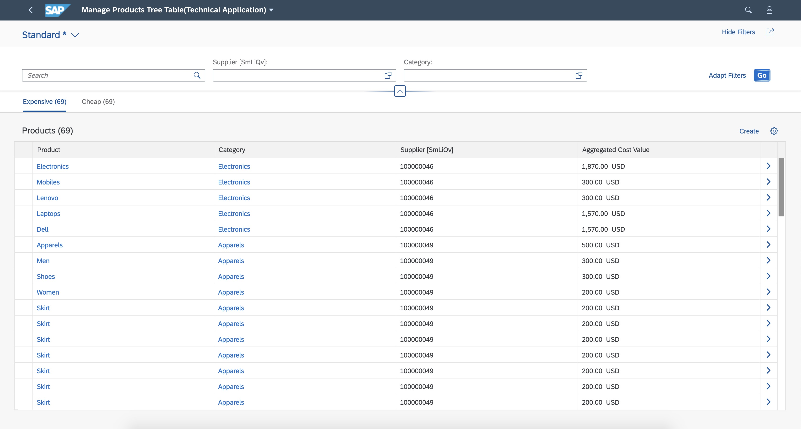
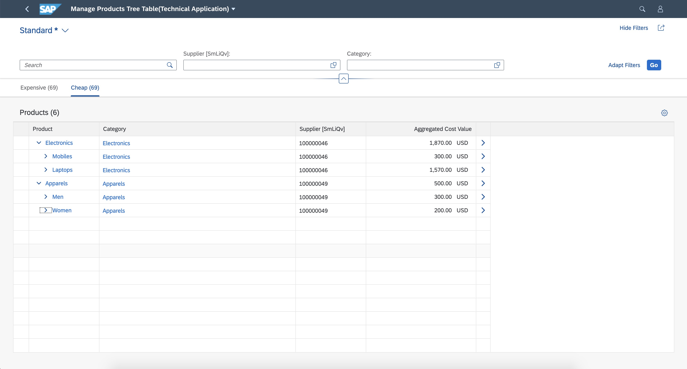

<!-- loio6698b80fc1a543ebb5c07e0781e9b93e -->

# Defining Multiple Views on a List Report Page with Different Entity Sets and Table Settings

You can configure your application to display data for different entity sets and table settings.

**Prerequisite**: You have completed the procedure [Defining Multiple Views on a List Report Table - Multiple Table Mode](defining-multiple-views-on-a-list-report-table-multiple-table-mode-97dfeea.md).

The configuration steps are the same as in [Defining Multiple Views on a List Report Table - Multiple Table Mode](defining-multiple-views-on-a-list-report-table-multiple-table-mode-97dfeea.md). In addition, the manifest property `entitySet` must be added to the definition of tables and charts that are based on an entity set different from the main entity set of the list report. Note that, in this case, the corresponding property `annotationPath` must specify an annotation for that entity set.

You can configure `SelectionPresentationVariant` that has a chart visualization to bring up a chart coming from a different entity set. For more information, see [Defining Multiple Views on a List Report Table - Multiple Table Mode](defining-multiple-views-on-a-list-report-table-multiple-table-mode-97dfeea.md).

To specify table settings on tab pages, you need to add `tableSettings` to the corresponding tab in the `manifest.json` file of your application.

> ### Note:  
> Implement this feature with caution, and, for example, take the following into account:
> 
> -   Even though this feature provides a combined view of different objects, it does not replace dedicated applications, each with their specific purpose.
> 
> -   Use this feature only to search for and work on similar business objects that have a subset of common fields. Do not use it for random business objects. Changing common fields in the smart filter bar always has an effect on the tab that is currently open, as well as on all other tabs. While you can implement any entity set from a technical perspective, you should take the business and usability perspective into account. Moreover, as this feature affects performance, you should also check any changes in performance when adding entity sets. Note that if you don't follow these recommendations, the application will be responsible for usability and performance.
> 
> -   Do not combine draft and non-draft entity sets in one list report.
> 
> -   You can specify different table types for each tab, but there should not be a mix of responsive and non-responsive \(grid, tree and analytical\) tables.
> 
> -   You can define custom actions using extension points only for main entity sets. Actions defined for other entity sets are not supported.
> 
> -   By default, in the case of multiple entity sets, the counts are always displayed in the icon tab bar to visualize the change in results when any filter is added or removed in the list report.
> 
> -   Ensure that the service/entity configured for the chart is **not** draft enabled or a read-only service/entity.

To include different entity sets and table settings in multiple views, specify an entity set for each tab in the `quickVariantSelectionX"` section as shown in the following sample code:

> ### Sample Code:  
> ```
> "sap.ui.generic.app": {
>          "pages": [{
>              "entitySet": "C_RequirementTrackingPurReq",
>              "component": {
>                  "name": "sap.suite.ui.generic.template.ListReport",
>                  "list": true,
>                  "settings": {
>                      "condensedTableLayout": true,
>                      "smartVariantManagement": false,
>                      "quickVariantSelectionX": {
>                         "variants": {
>                             "1": {
>                                 "key": "1",
>                                 "entitySet": "C_RequirementTrackingPurReq",
>                                 "annotationPath": "com.sap.vocabularies.UI.v1.SelectionVariant#VAR1",
>                                 "tableSettings": { 
>                                       "type": "GridTable",
>                         }
>                             },
>                             "2": {
>                                 "key": "2",
>                                 "entitySet": "C_RequirementTrackingPurOrd",
>                                 "annotationPath": "com.sap.vocabularies.UI.v1.SelectionVariant#VAR5",
>                                 "tableSettings": { 
>                                       "type": "GridTable",
>                         }
>                             },
>                             "3": {
>                                 "key": "3",
>                                 "entitySet": "C_RequirementTrackingPurReq",
>                                 "annotationPath": "com.sap.vocabularies.UI.v1.SelectionPresentationVariant#VAR6",
>                                 "showItemNavigationOnChart": true,
>                                        "tableSettings": { 
>                                             "type": "TreeTable",
>                                 }
>                             }
>                         }
>                     }
>                 }
>             }
>         }]    
> 	}
> ```

Under `"sap.ui.generic.app"/"pages"`, specify the leading entity set. This is used for the smart filter bar and footer. Each table or chart has its own `entitySet` which you can specify under `"quickVariantSelectionX"/"variants"`. If you do not specify an entity set under `"/"variants"`, then the leading entity set is used as default.


<a name="loio6698b80fc1a543ebb5c07e0781e9b93e__section_uqn_ytk_fhc"/>

## System Behavior for Different Table Type Settings

Table type settings can be set for each variant under `quickVariantSelectionX` in the `manifest.json` file. If table settings are not specified, the application picks the overall table setting and applies them for the variant. It is not possible to have a combination of responsive and non-responsive table types in same list report. The tables in a list report can either be all responsive or a mix of non-responsive, such as grid, tree, or analytical tables. This ensures a consistent scrolling behavior.

Different tabs in a list report can render different table types. For example, first tab can be a tree table while the second tab can be a grid table.

  
  
**Example of a List Report page with two tabs of different table types**






<a name="loio6698b80fc1a543ebb5c07e0781e9b93e__section_dys_msk_fhc"/>

## System Behavior for Filters and Count

By default, in case of multiple entity sets, counts are always displayed in the icon tab bar to visualize the change in results whenever a filter is added or removed in the list report.

The filters available in the filter bar are those from the main entity set. You cannot add filters that belong only to an additional entity set.

The filters are applied to every table if the corresponding properties exist in the entity type of the table. If not, they are ignored.

The counts of each table are also influenced by the filters from the `filterBar` only if the filters are relevant.

In the following screenshot, the *Requested* field exists in each entity set. It influences the number of items displayed on each tab:


If you add a second filter value, which is found only in the entity type of the first table, only the count of the first tab changes. The counts of the second tab remain unchanged, as this field isn't relevant for the second entity set. The system displays a message to inform users about this.

For example, if you add the filter *Property S3* to the first tab, which is not applicable to the entity set of the second tab, and then switch to the second tab, the application displays a message about this. If you close this message and add another filter that is also not applicable to the entity set of the *Purchase Orders* tab, the application displays an updated message informing that both filters are not relevant to this entity set.


**Related Information**  


[Example: Enable Internal Navigation to Different Detail Page](example-enable-internal-navigation-to-different-detail-page-a66f6a1.md "You can enable internal navigation to a different detail page (that is, using different entity sets) for a list report or an object page.")

