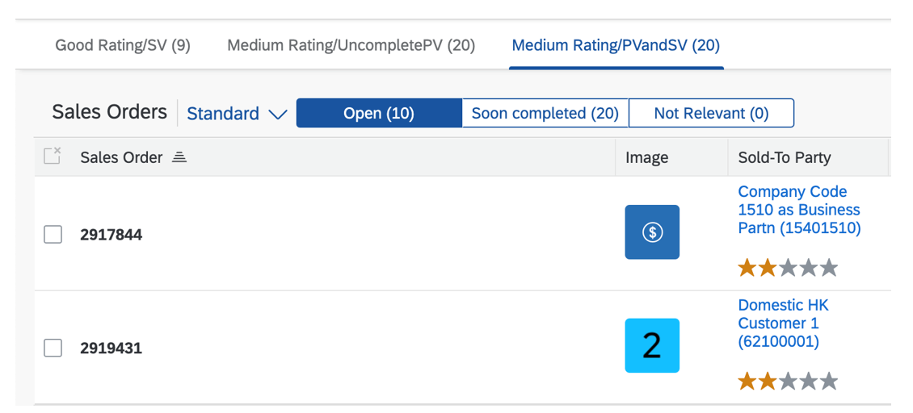

<!-- loio37aeed74e17a42caa2cba3123f0c15fc -->

# Defining Multiple Views on a List Report Table - Multiple Table Mode

You can define multiple views of a table and display them in multiple table mode. Users can switch between views using an icon tab bar.

 <a name="task_rbs_2lm_1rb"/>

<!-- task\_rbs\_2lm\_1rb -->

## Using Charts in Multiple Table Mode

You can also use charts in multiple table mode.


<a name="task_rbs_2lm_1rb__context_fg2_dmm_1rb"/>

## Context

To do so, you must have defined a `UI.Chart` annotation, including a qualifier, as shown in the following sample codes:

> ### Sample Code:  
> XML Annotation
> 
> ```xml
> <Annotation Term="UI.Chart" Qualifier="Chart1">
>     <Record Type="UI.ChartDefinitionType">
>         <PropertyValue Property="Title" String="Revenue by Customer"/>
>         <PropertyValue Property="Description" String="Net Revenue by Customer"/>
>         <PropertyValue Property="ChartType" EnumMember="UI.ChartType/Column"/>
>         <PropertyValue Property="Dimensions">
>             <Collection>
>                 <PropertyPath>ProductCategory</PropertyPath>             
>             </Collection>
>         </PropertyValue>
>         <PropertyValue Property="Measures">
>             <Collection>
>                 <PropertyPath>NetAmount</PropertyPath>
>             </Collection>
>         </PropertyValue>
>     </Record>
> </Annotation>
> 
> ```

> ### Sample Code:  
> ABAP CDS Annotation
> 
> ```
> 
> @UI.Chart: [
>   {
>     title: 'Revenue by Customer',
>     description: 'Net Revenue by Customer',
>     chartType: #COLUMN,
>     dimensions: [
>       'PRODUCTCATEGORY'
>     ],
>     measures: [
>       'NETAMOUNT'
>     ],
>     qualifier: 'Chart1'
>   }
> ]
> annotate view SALESORDERMANAGE with {
> 
> }
> ```

> ### Sample Code:  
> CAP CDS Annotation \(OData V4 only\)
> 
> ```
> 
> UI.Chart #Chart1 : {
>     $Type : 'UI.ChartDefinitionType',
>     Title : 'Revenue by Customer',
>     Description : 'Net Revenue by Customer',
>     ChartType : #Column,
>     Dimensions : [
>         ProductCategory
>     ],
>     Measures : [
>         NetAmount
>     ],
> }
> ```

Reference the `UI.Chart` annotation in your `SelectionPresentationVariant` or `PresentationVariant` for your view in the same manner as when adding a table to the view described in this topic below, as shown in the following sample codes:

> ### Sample Code:  
> XML Annotation
> 
> ```xml
> 
> <Annotation Term="UI.SelectionPresentationVariant" Qualifier="Chart1">
>     <Record>
>         <PropertyValue Property="Text" String="Chart1"/>
>             <PropertyValue Property="SelectionVariant">
>                 <Record>
>                     ....
>                 </Record>
>             </PropertyValue>
>         <PropertyValue Property="PresentationVariant">
>             <Record>
>                 <PropertyValue Property="Visualizations">
>                     <Collection>
>                         <AnnotationPath>@UI.Chart#Chart1</AnnotationPath>
>                     </Collection>
>                 </PropertyValue>
>             </Record>
>         </PropertyValue>
>     </Record>
> </Annotation>
> 
> ```

> ### Sample Code:  
> ABAP CDS Annotation
> 
> ```
> 
> @UI.selectionPresentationVariant: [{
>   text: 'Chart1',
>   selectionVariantQualifier: '',
>   presentationVariantQualifier: 'Default',
>   qualifier: 'Chart1'
> }]
> 
> @UI.presentationVariant: [
>   {
>     qualifier: 'Default',
>     sortOrder: [{by: 'GrossAmount', direction: #ASC }],
>     visualizations: [{type: #AS_CHART, qualifier: 'Chart1'}]
>   }
> ]
> annotate view SALESORDERMANAGE with {
> 
> }
> ```

> ### Sample Code:  
> CAP CDS Annotation \(OData V4 only\)
> 
> ```
> 
> UI.SelectionPresentationVariant #Chart1 : {
>     Text : 'Chart1',
>     SelectionVariant : {
>         ....
>     },
>     PresentationVariant : {
>         Visualizations : [
>             '@UI.Chart#Chart1'
>         ]
>     }
> },
> ```

 <a name="task_qgj_5mg_3mb"/>

<!-- task\_qgj\_5mg\_3mb -->

## Additional Features in SAP Fiori Elements for OData V2


<a name="task_qgj_5mg_3mb__context_xdx_kng_3mb"/>

## Context

To define multiple views using multiple table mode, perform the following steps:


<a name="task_qgj_5mg_3mb__steps_abs_wng_3mb"/>

## Procedure

1.  Add `SelectionVariants` or `SelectionPresentationVariants` to your annotations file. The annotation target of `SelectionPresentationVariants` must be the `EntityType`.

    > ### Note:  
    > You can reference different `UI.LineItem` annotations for different tabs. To do so, reference the annotation under `PresentationVariant/Visualizations`. If there is no `PresentationVariant/Visualizations` for a tab, a default `UI.LineItem` \(without a qualifier\) is taken into account.

    -   Multiple table mode with table

        `SelectionVariant` that filters for items that cost a certain amount, \(for example, at least 5,000 euros\).

        > ### Sample Code:  
        > XML Annotation
        > 
        > ```xml
        > 
        > <Annotations Target="STTA_SALES_ORDER_ITEM_AGGR_SRV.STTA_C_SO_ItemAggrType">
        > <Annotation Term="UI.SelectionVariant" Qualifier="Expensive">
        >     <Record>
        >         <PropertyValue Property="Text" String="Expensive">
        >         </PropertyValue>
        >         <PropertyValue Property="SelectOptions">
        >             <Collection>
        >                 <Record Type="UI.SelectOptionType">
        >                     <PropertyValue Property="PropertyName" PropertyPath="GrossAmount" />
        >                     <PropertyValue Property="Ranges">
        >                         <Collection>
        >                             <Record Type="UI.SelectionRangeType"> 
        >                                  <PropertyValue Property="Sign" EnumMember="UI.SelectionRangeSignType/E"/>
        >                                  <PropertyValue Property="Option" EnumMember="UI.SelectionRangeOptionType/LT"/> 
        >                                  <PropertyValue Property="Low" String="5000"/>
        >                             </Record>
        >                         </Collection>
        >                     </PropertyValue>
        >                 </Record>
        >             </Collection>
        >         </PropertyValue>
        >     </Record>
        > </Annotation>
        > ```

        > ### Sample Code:  
        > ABAP CDS Annotation
        > 
        > ```
        > 
        > @UI.SelectionVariant: [
        >   {
        >     text: 'Expensive',
        >     qualifier: 'Expensive'
        >   }
        > ]
        > annotate view SALESORDERMANAGE with {
        > 
        > }
        > 
        > ```

        `SelectionPresentationVariant` containing a `SelectionVariant` and a`PresentationVariant`. The `SelectionVariant` filters for items with a price less than a certain amount \(for example, 5,000 euros\), the `PresentationVariant` defines the ascending sort order:

        > ### Sample Code:  
        > XML Annotation
        > 
        > ```xml
        > <Annotations Target="STTA_SALES_ORDER_ITEM_AGGR_SRV.STTA_C_SO_ItemAggrType">
        > <Annotation Term="UI.SelectionPresentationVariant" Qualifier="Cheap">
        >     <Record>
        >         <PropertyValue Property="Text" String="Cheap">
        >         </PropertyValue>
        >         <PropertyValue Property="SelectionVariant">
        >             <Record>
        >                 <PropertyValue Property="Text" String="Cheap">
        >                 </PropertyValue>
        >                 <PropertyValue Property="SelectOptions">
        >                     <Collection>
        >                         <Record Type="UI.SelectOptionType">
        >                             <PropertyValue Property="PropertyName"
        >                                 PropertyPath="GrossAmount" />
        >                             <PropertyValue Property="Ranges">
        >                                 <Collection>
        >                                     <Record Type="UI.SelectionRangeType">
        >                                         <PropertyValue Property="Option"
        >                                             EnumMember="UI.SelectionRangeOptionType/LT" />
        >                                         <PropertyValue Property="Low" String="5000" />
        >                                     </Record>
        >                                 </Collection>
        >                             </PropertyValue>
        >                         </Record>
        >                     </Collection>
        >                 </PropertyValue>
        >             </Record>
        >         </PropertyValue>
        >         <PropertyValue Property="PresentationVariant">
        >             <Record>
        >                 <PropertyValue Property="SortOrder">
        >                     <Collection>
        >                         <Record>
        >                             <PropertyValue Property="Property"
        >                                 PropertyPath="GrossAmount" />
        >                             <PropertyValue Property="Descending" Bool="false" />
        >                         </Record>
        >                     </Collection>
        >                 </PropertyValue>
        >             </Record>
        >         </PropertyValue>
        >     </Record>
        > </Annotation>
        > </Annotations>
        > ```

        > ### Sample Code:  
        > ABAP CDS Annotation
        > 
        > ```
        > 
        > @UI.selectionPresentationVariant: [{
        >   id: '',
        >   text: 'Cheap',
        >   selectionVariantQualifier: 'Default',
        >   presentationVariantQualifier: 'Default',
        >   qualifier: 'Cheap'
        > }]
        > 
        > @UI.selectionVariant: [
        >   {
        >     text: 'Cheap',
        >     qualifier: 'Default'
        >   }
        > ]
        > 
        > @UI.presentationVariant: [
        >   {
        >     qualifier: 'Default',
        >     sortOrder: [{by: 'GrossAmount', direction: #ASC }]
        >   }
        > ]
        > annotate view SALESORDERMANAGE with {
        > 
        > }
        > 
        > ```


    > ### Note:  
    > For the `SelectionVariant`, the following applies:
    > 
    > -   The `FilterExpression` of the `SelectionVariantType` isn't supported.
    > 
    > -   The following `SelectionRangeOptionTypes` are supported without any wildcards, for example, \*, ?, …:
    > 
    >     -   EQ: Equal to
    > 
    >     -   BT: Between
    > 
    >     -   LE: Less than or equal to
    > 
    >     -   GE: Greater than or equal to
    > 
    >     -   NE: Not equal to
    > 
    >     -   GT: Greater than
    > 
    >     -   LT: Less than
    > 
    > 
    > 
    > For the `PresentationVariant`, `SortOrders` and visualizations are supported.

2.  Extend the `manifest.json` to switch on the multiple view feature and link to the variants you've added to your annotations. You do this in the list report settings section under `sap.ui.generic.app`. Use `quickVariantSelectionX` for multiple table mode or multiple table mode with charts.

    -   The `variants` section \(lines 11–20\) contains a set of entries that point to the variants defined in the annotations.

    -   For each entry under `variants` \(for example, lines 12–15\), define an `annotationPath` \(line 14\) of a specific variant.

    -   Provide a key entry \(line 13\) that is used for initializing the corresponding `IconTabBar` item. This entry is mandatory.


    > ### Sample Code:  
    > ```
    > 
    > 1 ...
    > 2 "sap.ui.generic.app": {
    > 3     "pages": [
    > 4         {
    > 5             "entitySet": "C_STTA_SalesOrder_WD_20",
    > 6             "component": {
    > 7                 "name": "sap.suite.ui.generic.template.ListReport",
    > 8                 "list": true,
    > 9                 "settings": {
    > 10                    "quickVariantSelectionX": {
    > 11                        "variants": {
    > 12                            "Expensive": {
    > 13                                "key": "Expensive",
    > 14                                "annotationPath": "com.sap.vocabularies.UI.v1.SelectionVariant#Expensive"
    > 15                            },
    > 16                            "Cheap": {
    > 17                                "key": "Cheap",
    > 18                                "annotationPath": "com.sap.vocabularies.UI.v1.SelectionPresentationVariant#Cheap"
    > 19                            }
    > 20                        }
    > 21                    }
    > 22                    ...
    > ```

    > ### Note:  
    > -   If you want to enable auto-binding, don't use key user adaptation for changing the smart table's `enableAutoBinding` properties. From a performance perspective, this leads to back-end requests for each table instance. To achieve the required behavior \(that is, only rebind the currently visible table\), you can add an entry `enableAutoBinding: true` under `quickVariantSelectionX`. This ensures the behavior on list report page level.
    > 
    > -   Stable IDs: As there are separate table instances for each tab, table-specific IDs \(such as IDs for tables, toolbar actions, draft indicators in table columns\) get a suffix "-<key\>", where <key\> is the variant key you have specified in the manifest \(line 13\). This avoids duplicate ID errors and allows you to adapt specific tables via runtime adaptation \(for example, hiding a toolbar action for a specific table\).

3.  If you use charts in multiple table mode, you can implement the following features:

    -   Actions in toolbars for charts

        For charts in multiple table mode, actions from the annotations \(UI.Chart/Actions only\) and custom actions that were added using extension points are supported. If custom action buttons are relevant to selection, they're disabled if no chart bar is selected. If not, they're enabled.

        > ### Sample Code:  
        > XML Annotation
        > 
        > ```xml
        > 
        > <Annotation Term="UI.Chart" Qualifier="Chart4">
        >     <Record Type="UI.ChartDefinitionType">
        >         <PropertyValue Property="ChartType" EnumMember="UI.ChartType/Column"/>
        >         <PropertyValue Property="Dimensions">
        >             <Collection>
        >                 <PropertyPath>CompanyCode</PropertyPath>
        >                 <PropertyPath>Customer</PropertyPath>
        >             </Collection>
        >         </PropertyValue>
        >         <PropertyValue Property="Measures">
        >             <Collection>
        >                 <PropertyPath>AmountInTransactionCurrency</PropertyPath>
        >             </Collection>
        >         </PropertyValue>
        >         <PropertyValue Property="Actions">
        >             <Collection>
        >                 <Record Type="UI.DataFieldForAction">
        >                     <PropertyValue Property="Action" String="ZFAR_CUSTOMER_LINE_ITEMS2_SRV.ZFAR_CUSTOMER_LINE_ITEMS2_SRV_Entities/Create"/>
        >                     <PropertyValue Property="Label" String="Action 1"/>
        >                 </Record>
        >                 <Record Type="UI.DataFieldForIntentBasedNavigation">
        >                     <PropertyValue Property="SemanticObject" String="Customer"/>
        >                     <PropertyValue Property="Action" String="postPayment2"/>
        >                     <PropertyValue Property="Label" String="SO Navigation (M)"/>
        >                     <Annotation Term="com.sap.vocabularies.UI.v1.Importance" EnumMember="com.sap.vocabularies.UI.v1.ImportanceType/Medium"/>
        >                 </Record>
        >             </Collection>
        >         </PropertyValue>
        >     </Record>
        > </Annotation>
        > 
        > ```

        > ### Sample Code:  
        > ABAP CDS Annotation
        > 
        > ```
        > 
        > @UI.Chart: [
        >   {
        >     chartType: #COLUMN,
        >     dimensions: [
        >       'COMPANYCODE',
        >       'CUSTOMER'
        >     ],
        >     measures: [
        >       'AMOUNTINTRANSACTIONCURRENCY'
        >     ],
        >     actions: [
        >       {
        >         dataAction: 'PUSHDOWN:Create',
        >         label: 'Action 1',
        >         type: #FOR_ACTION
        >       },
        >       {
        >         semanticObjectAction: 'postPayment2',
        >         label: 'SO Navigation (M)',
        >         type: #FOR_INTENT_BASED_NAVIGATION
        >       }
        >     ],
        >     qualifier: 'Chart4'
        >   }
        > ]
        > annotate view SALESORDERMANAGE with {
        > 
        > }
        > ```

    -   Navigation for charts

        To enable navigation for charts, you have to set the property "`showItemNavigationOnChart`" in the manifest to "true" and maintain an internal navigation target in the manifest.

        ```
        
        "quickVariantSelectionX": {
            "showCounts": true, 
            "variants": {
               "0": {
                    "key": "0",
                    "annotationPath": "com.sap.vocabularies.UI.v1.SelectionVariant#VAR1"
                    },
                "1": {
                    "key": "1",
                    "annotationPath": "com.sap.vocabularies.UI.v1.SelectionPresentationVariant#VAR4",
                    "showItemNavigationOnChart": true
                     }               
            }
        }
        
        ```

        For information about how to maintain an internal navigation target, see [Configuring Internal Navigation](configuring-internal-navigation-2c65f07.md).

        If navigation is enabled, the *Show details* button is displayed in the popup after you select a chart bar and choose the *Details* button.

        > ### Remember:  
        > Ensure that the service/entity configured for the chart is **not** draft enabled or a read-only service/entity. For more information, see [Configuring Charts](configuring-charts-653ed0f.md).


    On each tab, you can also display data for different entity sets with different table types and other settings, for example, a sales order or a supplier. To do so, add the entity set and/or table settings to the corresponding tab in the manifest. For more information, see [Defining Multiple Views on a List Report with Different Entity Sets and Table Settings](defining-multiple-views-on-a-list-report-with-different-entity-sets-and-table-settings-b6b59e4.md).


 <a name="concept_ecd_hgr_j4b"/>

<!-- concept\_ecd\_hgr\_j4b -->

### Additional Examples

**`SelectionVariant` without a Qualifier**

> ### Sample Code:  
> Annotation
> 
> ```xml
> <Annotation Term="UI.SelectionVariant">
>      <Record>
>           <PropertyValue Property="Text" String="Expensive">
>           </PropertyValue>
>           <PropertyValue Property="SelectOptions">
>                <Collection>
>                     <Record Type="UI.SelectOptionType">
>                          <PropertyValue Property="PropertyName"
>                                         PropertyPath="GrossAmount" />
>                          <PropertyValue Property="Ranges">
>                               <Collection>
>                                    <Record Type="UI.SelectionRangeType">
>                                         <PropertyValue Property="Option"
>                                                        EnumMember="UI.SelectionRangeOptionType/GE" />
>                                         <PropertyValue Property="Low" String="5000" />
>                                    </Record>
>                               </Collection>
>                          </PropertyValue>
>                     </Record>
>                </Collection>
>           </PropertyValue>
>      </Record>
> </Annotation>
> 
> ```

> ### Sample Code:  
> Manifest setting
> 
> ```
> "settings": {
>      "quickVariantSelectionX": {
>           "showCounts": true,
>           "variants": {
>                "0": {
>                     "key": "1",
>                     "annotationPath": "com.sap.vocabularies.UI.v1.SelectionVariant"
>                }
>           }
>      }
> },
> 
> ```

**`SelectionPresentationVariant` without a Qualifier**

> ### Sample Code:  
> Annotation
> 
> ```xml
> <Annotation Term="UI.SelectionPresentationVariant">
>      <Record>
>           <PropertyValue Property="Text" String="Cheap">
>           </PropertyValue>
>           <PropertyValue Property="SelectionVariant">
>                <Record>
>                     <PropertyValue Property="Text" String="Cheap">
>                     </PropertyValue>
>                     <PropertyValue Property="SelectOptions">
>                          <Collection>
>                               <Record Type="UI.SelectOptionType">
>                                    <PropertyValue Property="PropertyName"
>                                                   PropertyPath="GrossAmount" />
>                                    <PropertyValue Property="Ranges">
>                                         <Collection>
>                                              <Record Type="UI.SelectionRangeType">
>                                                   <PropertyValue Property="Option"
>                                                                  EnumMember="UI.SelectionRangeOptionType/LT" />
>                                                   <PropertyValue Property="Low" String="5000" />
>                                              </Record>
>                                         </Collection>
>                                    </PropertyValue>
>                               </Record>
>                          </Collection>
>                     </PropertyValue>
>                </Record>
>           </PropertyValue>
>           <PropertyValue Property="PresentationVariant">
>                <Record>
>                     <PropertyValue Property="Visualizations">
>                          <Collection>
>                               <AnnotationPath>@UI.LineItem#Reduced</AnnotationPath>
>                          </Collection>
>                     </PropertyValue>
>                     <PropertyValue Property="SortOrder">
>                          <Collection>
>                               <Record>
>                                    <PropertyValue Property="Property"
>                                                   PropertyPath="GrossAmount" />
>                                    <PropertyValue Property="Descending" Bool="false" />
>                               </Record>
>                          </Collection>
>                     </PropertyValue>
>                </Record>
>           </PropertyValue>
>      </Record>
> </Annotation>
> 
> ```

> ### Sample Code:  
> Manifest setting
> 
> ```
> "quickVariantSelectionX": {
>      "showCounts": true,
>      "variants": {
>           "0": {
>                "key": "1",
>                "annotationPath": "com.sap.vocabularies.UI.v1.SelectionVariant"
>           },
>           "1": {
>                "key": "2",
>                "annotationPath": "com.sap.vocabularies.UI.v1.SelectionPresentationVariant"
>           }
>      }
> }
> 
> ```

 <a name="task_om1_nyy_cnb"/>

<!-- task\_om1\_nyy\_cnb -->

## Additional Features in SAP Fiori Elements for OData V4


<a name="task_om1_nyy_cnb__context_ekf_14g_3mb"/>

## Context

To define multiple views using multiple table mode, perform the following steps:


<a name="task_om1_nyy_cnb__steps_mgg_b4g_3mb"/>

## Procedure

1.  Add `SelectionVariants` or `SelectionPresentationVariants` to your annotations file. The annotation target of `SelectionPresentationVariants` must be the `EntityType`.

    > ### Note:  
    > You can reference different `UI.LineItem` annotations for different tabs. To do so, reference the annotation under `PresentationVariant/Visualizations`. If there is no `PresentationVariant/Visualizations` for a tab, a default `UI.LineItem` \(without a qualifier\) is taken into account.

    -   Multiple table mode with table

        `SelectionVariant` that filters for items that are lower or greater than a value, between certain values, or equal to a specific value \(for example here: equal to 5\).

        > ### Sample Code:  
        > XML Annotation
        > 
        > ```xml
        > <Annotation Term="UI.SelectionVariant" Qualifier="Good">
        >      <Record Type="UI.SelectionVariantType">
        >           <PropertyValue Property="SelectOptions">
        >                <Collection>
        >                     <Record Type="UI.SelectOptionType">
        >                          <PropertyValue Property="PropertyName" PropertyPath="Rating" />
        >                          <PropertyValue Property="Ranges">
        >                               <Collection>
        >                                    <Record Type="UI.SelectionRangeType">
        >                                         <PropertyValue Property="Option" EnumMember="UI.SelectionRangeOptionType/EQ" />
        >                                         <PropertyValue Property="Low" String="5" />
        >                                    </Record>
        >                               </Collection>
        >                          </PropertyValue>
        >                     </Record>
        >                </Collection>
        >           </PropertyValue>
        >           <PropertyValue Property="Text" String="Good Rating/SV" />
        >      </Record>
        > </Annotation>
        > 
        > ```

        > ### Sample Code:  
        > ABAP CDS Annotation
        > 
        > ```
        > 
        > @UI.selectionVariant: [
        >   {
        >     text: 'Good',
        >     qualifier: 'Good'
        >   }
        > ]
        > 
        > annotate view SALESORDERMANAGE with {
        > 
        > }
        > 
        > ```

        > ### Sample Code:  
        > CAP CDS Annotation
        > 
        > ```
        > 
        > UI.SelectionVariant #Good : {
        >     $Type : 'UI.SelectionVariantType',
        >     SelectOptions : [
        >         {
        >             $Type : 'UI.SelectOptionType',
        >             PropertyName : Rating,
        >             Ranges : [
        >                 {
        >                     $Type : 'UI.SelectionRangeType',
        >                     Option : #EQ,
        >                     Low : '5'
        >                 }
        >             ]
        >         }
        >     ],
        >     Text : 'Good Rating/SV'
        > },
        > 
        > ```

        `SelectionPresentationVariant` containing a `SelectionVariant` and a `PresentationVariant`. The `SelectionVariant` filters for items with a rating lower than or between certain values \(for example, between 2 and 4\), the `PresentationVariant` defines the ascending sort order for the `ID` and the `SalesOrderType`, as well as the maximum number of items to show in the table. Note that a `PresentationVariant` must contain a `Visualization` to be valid. Without a `Visualization`, the `PresentationVariant` isn't applied and the default `LineItem` is applied instead.

        > ### Sample Code:  
        > XML Annotation
        > 
        > ```xml
        > <Annotation Term="UI.SelectionPresentationVariant" Qualifier="PV">
        >      <Record Type="UI.SelectionPresentationVariantType">
        >           <PropertyValue Property="Text" String="Medium Rating/PV">
        >           </PropertyValue>
        >           <PropertyValue Property="SelectionVariant">
        >                <Record Type="UI.SelectionVariantType">
        >                     <PropertyValue Property="SelectOptions">
        >                          <Collection>
        >                               <Record Type="UI.SelectOptionType">
        >                                    <PropertyValue Property="PropertyName" PropertyPath="Rating" />
        >                                         <PropertyValue Property="Ranges">
        >                                              <Collection>
        >                                                   <Record Type="UI.SelectionRangeType">
        >                                                        <PropertyValue Property="Option" EnumMember="UI.SelectionRangeOptionType/BT" />
        >                                                        <PropertyValue Property="Low" String="2" />
        >                                                        <PropertyValue Property="High" String="4" />
        >                                                   </Record>
        >                                              </Collection>
        >                                    </PropertyValue>
        >                               </Record>
        >                          </Collection>
        >                     </PropertyValue>
        >                     <PropertyValue Property="Text" String="Medium Rating" />
        >                </Record>
        >           </PropertyValue>
        >           <PropertyValue Property="PresentationVariant">
        >                <Record Type="UI.PresentationVariantType">>
        >                     <PropertyValue Property="Visualizations">
        >                          <Collection>
        >                               <AnnotationPath>@UI.LineItem#Reduced</AnnotationPath>
        >                          </Collection>
        >                     </PropertyValue>
        >                     <PropertyValue Property="MaxItems" Int="5" />
        >                     <PropertyValue Property="SortOrder">
        >                          <Collection>
        >                               <Record Type="Common.SortOrderType">
        >                                    <PropertyValue Property="Property" PropertyPath="ID" />
        >                                    <PropertyValue Property="Ascending" Bool="true" />
        >                               </Record>
        >                               <Record Type="Common.SortOrderType">
        >                                    <PropertyValue Property="Property" PropertyPath="SalesOrderType" />
        >                                    <PropertyValue Property="Descending" Bool="true" />
        >                               </Record>
        >                          </Collection>
        >                     </PropertyValue>
        >                </Record>
        >           </PropertyValue>
        >      </Record>
        > </Annotation>
        > ```

        > ### Sample Code:  
        > ABAP CDS Annotation
        > 
        > ```
        > 
        > @UI.selectionPresentationVariant: [{
        >   id: '',
        >   text: 'Medium Rating/PV',
        >   selectionVariantQualifier: 'Default',
        >   presentationVariantQualifier: 'Default',
        >   qualifier: 'PV'
        > }]
        > 
        > @UI.selectionVariant: [
        >   {
        >     text: 'Medium Rating',
        >     qualifier: 'Default'
        >   }
        > ]
        > 
        > @UI.presentationVariant: [
        >   {
        >     qualifier: 'Default',
        >     sortOrder: [
        >                 {by: 'ID', direction: #ASC }, 
        >                 {by: 'SalesOrderType', direction: #DESC }
        >               ],
        >     visualizations: [{
        >         type: #AS_LINEITEM,
        >         qualifier: 'Reduced'
        >     }
        >   }
        > ]
        > annotate view SALESORDERMANAGE with {
        > 
        > }
        > 
        > ```

        > ### Sample Code:  
        > CAP CDS Annotation
        > 
        > ```
        > 
        > UI.SelectionPresentationVariant #PV : {
        >     $Type : 'UI.SelectionPresentationVariantType',
        >     Text : 'Medium Rating/PV',
        >     SelectionVariant : {
        >         $Type : 'UI.SelectionVariantType',
        >         SelectOptions : [
        >             {
        >                 $Type : 'UI.SelectOptionType',
        >                 PropertyName : Rating,
        >                 Ranges : [
        >                     {
        >                         $Type : 'UI.SelectionRangeType',
        >                         Option : #BT,
        >                         Low : '2',
        >                         High : '4'
        >                     }
        >                 ]
        >             }
        >         ],
        >         Text : 'Medium Rating'
        >     },
        >     PresentationVariant : {
        >         $Type : 'UI.PresentationVariantType',
        >         MaxItems : 5,
        >         SortOrder : [
        >             {
        >                 $Type : 'Common.SortOrderType',
        >                 Property : ID,
        >                 Ascending : true
        >             },
        >             {
        >                 $Type : 'Common.SortOrderType',
        >                 Property : SalesOrderType,
        >                 Descending : true
        >             }
        >         ],
        >         Visualizations : ['@UI.LineItem#Reduced']
        >     }
        > }
        > 
        > 
        > ```

    -   Multiple table mode with different `LineItem`

        A `SelectionPresantationVariant` can be based on a different `LineItem`. To do so, create a `LineItem` with a qualifier and add this to the `SelectionPresentationVariant` visualization:

        > ### Sample Code:  
        > XML Annotation
        > 
        > ```xml
        > <Annotation Term="UI.LineItem" Qualifier="Simplified">
        >      <Collection>
        >           <Record Type="UI.DataField">
        >                <PropertyValue Property="Value" Path="ID" />
        >           </Record>
        >           <Record Type="UI.DataField">
        >                <PropertyValue Property="Value" Path="ImageUrl" />
        >           </Record>
        >           <Record Type="UI.DataFieldForAnnotation">
        >                <PropertyValue Property="Target" AnnotationPath="@UI.FieldGroup#multipleActionFields" />
        >                <PropertyValue Property="Label" String="Sold-To Party" />
        >           </Record>
        >      </Collection>
        > </Annotation>
        > 
        > <Annotation Term="UI.SelectionPresentationVariant" Qualifier="PVandSV">
        >      <Record Type="UI.SelectionPresentationVariantType">
        >           <PropertyValue Property="Text" String="Medium Rating/PVandSV">
        >           </PropertyValue>
        >           <PropertyValue Property="SelectionVariant">
        >                <Record Type="UI.SelectionVariantType">
        >                     <PropertyValue Property="SelectOptions">
        >                          <Collection>
        >                               <Record Type="UI.SelectOptionType">
        >                                    <PropertyValue Property="PropertyName" PropertyPath="Rating" />
        >                                    <PropertyValue Property="Ranges">
        >                                         <Collection>
        >                                              <Record Type="UI.SelectionRangeType">
        >                                                   <PropertyValue Property="Option" EnumMember="UI.SelectionRangeOptionType/BT" />
        >                                                   <PropertyValue Property="Low" String="2" />
        >                                                   <PropertyValue Property="High" String="4" />
        >                                              </Record>
        >                                         </Collection>
        >                                    </PropertyValue>
        >                               </Record>
        >                          </Collection>
        >                     </PropertyValue>
        >                     <PropertyValue Property="Text" String="Medium Rating" />
        >                </Record>
        >           </PropertyValue>
        >           <PropertyValue Property="PresentationVariant">
        >                <Record Type="UI.PresentationVariantType">>
        >                     <PropertyValue Property="MaxItems" Int="2" />
        >                     <PropertyValue Property="SortOrder">
        >                          <Collection>
        >                               <Record Type="Common.SortOrderType">
        >                                    <PropertyValue Property="Property" PropertyPath="ID" />
        >                                    <PropertyValue Property="Ascending" Bool="false" />
        >                               </Record>
        >                               <Record Type="Common.SortOrderType">
        >                                    <PropertyValue Property="Property" PropertyPath="SalesOrderType" />
        >                                    <PropertyValue Property="Descending" Bool="true" />
        >                               </Record>
        >                          </Collection>
        >                     </PropertyValue>
        >                     <PropertyValue Property="Visualizations">
        >                          <Collection>
        >                               <AnnotationPath>@UI.LineItem#Simplified</AnnotationPath>
        >                          </Collection>
        >                     </PropertyValue>
        >                </Record>
        >           </PropertyValue>
        >      </Record>
        > </Annotation>
        > ```

        > ### Sample Code:  
        > ABAP CDS Annotation
        > 
        > ```
        > 
        > @UI.lineItem: [
        >   {
        >     value: 'ID',
        >     type: #STANDARD,
        >     position: 1 ,
        >     qualifier: 'Simplified'
        >   }
        > ]
        > ID;
        > @UI.lineItem: [
        >   {
        >     value: 'IMAGEURL',
        >     type: #STANDARD,
        >     position: 2 ,
        >     qualifier: 'Simplified'
        >   }
        > ]
        > IMAGEURL;
        > 
        > @UI.lineItem: [
        >   {
        >     type: #AS_FIELDGROUP,
        >     position: 3 ,
        >     qualifier: 'Simplified',
        >     label: 'Sold-To Party',
        >     valueQualifier: 'multipleActionFields'
        >   }
        > ]
        > SOLDTOPARTY;
        > 
        > 
        > @UI.selectionPresentationVariant: [{
        >   id: '',
        >   text: 'Medium Rating/PVandSV',
        >   selectionVariantQualifier: 'Default',
        >   presentationVariantQualifier: 'Default',
        >   qualifier: 'PVandSV'
        > }]
        > 
        > @UI.selectionVariant: [
        >   {
        >     text: 'Medium Rating',
        >     qualifier: 'Default'
        >   }
        > ]
        > 
        > @UI.presentationVariant: [
        >   {
        >     qualifier: 'Default',
        >     maxItems: 2,
        >     sortOrder: [
        >                 {by: 'ID', direction: #DESC }, 
        >                 {by: 'SalesOrderType', direction: #DESC }
        >               ],
        >    visualizations: [{type: #AS_LINEITEM, qualifier: 'Simplified'}
        >   }
        > ]
        > 
        > ```

        > ### Sample Code:  
        > CAP CDS Annotation
        > 
        > ```
        > 
        > UI.LineItem #Simplified : [
        >     {
        >         $Type : 'UI.DataField',
        >         Value : ID
        >     },
        >     {
        >         $Type : 'UI.DataField',
        >         Value : ImageUrl
        >     },
        >     {
        >         $Type : 'UI.DataFieldForAnnotation',
        >         Target : '@UI.FieldGroup#multipleActionFields',
        >         Label : 'Sold-To Party'
        >     }
        > ],
        > UI.SelectionPresentationVariant #PVandSV : {
        >     $Type : 'UI.SelectionPresentationVariantType',
        >     Text : 'Medium Rating/PVandSV',
        >     SelectionVariant : {
        >         $Type : 'UI.SelectionVariantType',
        >         SelectOptions : [
        >             {
        >                 $Type : 'UI.SelectOptionType',
        >                 PropertyName : Rating,
        >                 Ranges : [
        >                     {
        >                         $Type : 'UI.SelectionRangeType',
        >                         Option : #BT,
        >                         Low : '2',
        >                         High : '4'
        >                     }
        >                 ]
        >             }
        >         ],
        >         Text : 'Medium Rating'
        >     },
        >     PresentationVariant : {
        >         $Type : 'UI.PresentationVariantType',
        >         MaxItems : 2,
        >         SortOrder : [
        >             {
        >                 $Type : 'Common.SortOrderType',
        >                 Property : ID,
        >                 Ascending : false
        >             },
        >             {
        >                 $Type : 'Common.SortOrderType',
        >                 Property : SalesOrderType,
        >                 Descending : true
        >             }
        >         ],
        >         Visualizations : [
        >             '@UI.LineItem#Simplified'
        >         ]
        >     }
        > }
        > 
        > 
        > ```


    > ### Note:  
    > For the `SelectionVariant`, the following applies:
    > 
    > -   The `FilterExpression` of the `SelectionVariantType` isn't supported.
    > 
    > -   The following `SelectionRangeOptionTypes` are supported without any wildcards, for example, \*, ?, …:
    > 
    >     -   EQ: Equal to
    > 
    >     -   BT: Between
    > 
    >     -   LE: Less than or equal to
    > 
    >     -   GE: Greater than or equal to
    > 
    >     -   NE: Not equal to
    > 
    >     -   GT: Greater than
    > 
    >     -   LT: Less than
    > 
    > 
    > 
    > For the `PresentationVariant`, `SortOrders` and visualizations are supported.

2.  Extend the `manifest.json` to switch on the multiple view feature and link to the variants you have added to your annotations. You do this in the list report settings section under the section *routing* \> *targets*. In the settings of your list report page, use the views configuration for multiple table mode.

    -   The `paths` section \(lines 9–22\) contains a set of entries that point to the variants defined in the annotations.

    -   For each entry under `paths` \(for example, lines 10–13\), define an `annotationPath` \(line 12\) of a specific variant.

    -   Provide a key entry \(line 11\) that is used for initializing the corresponding `IconTabBar` item. This entry is mandatory.


    > ### Sample Code:  
    > ```
    > 1- "SalesOrderManageList": {
    > 2-      "type": "Component",
    > 3-      "id": "SalesOrderManageList",
    > 4-	"name": "sap.fe.templates.ListReport",
    > 5-	"options": {
    > 6-	     "settings": {
    > 7-	          "entitySet": "SalesOrderManage",
    > 8-	          "views": {
    > 9-	               "paths": [
    > 10-	                    {
    > 11-	                         "key": "tab1",
    > 12-	                         "annotationPath": "com.sap.vocabularies.UI.v1.SelectionVariant#Good"
    > 13-	                    },
    > 14-	                    {
    > 15-	                         "key": "tab2",
    > 16-	                         "annotationPath": "com.sap.vocabularies.UI.v1.SelectionPresentationVariant#UncompletePV"
    > 17-	                    },
    > 18-	                    {
    > 19-	                         "key": "tab3",
    > 20-	                         "annotationPath": "com.sap.vocabularies.UI.v1.SelectionPresentationVariant#PVandSV"
    > 21-	                    }
    > 22-	               ],
    > 23-	               ShowCounts : false
    > 24-	          },
    > 25-	          "controlConfiguration": {
    > 26-	             ...
    > 27-               }
    > 28-	     },
    > 29-	     ...
    > 30-     }
    > 31-}
    > ```

    **Settings**


    <table>
    <tr>
    <th valign="top">

    Setting


    
    </th>
    <th valign="top">

    Description


    
    </th>
    <th valign="top">

    Status


    
    </th>
    </tr>
    <tr>
    <td valign="top">

    `ShowCounts`


    
    </td>
    <td valign="top">

    determines whether the count is displayed in the tabs


    
    </td>
    <td valign="top">

    optional \(default setting: false\)


    
    </td>
    </tr>
    <tr>
    <td valign="top">

    `key`


    
    </td>
    <td valign="top">

    Stable IDs: As there are separate table instances for each tab, table-specific IDs \(such as IDs for tables, toolbar actions, draft indicators in table columns\) get a suffix "-<key\>", where <key\> is the variant key you've specified in the manifest. This avoids duplicate ID errors and allows you to adapt specific tables via runtime adaptation \(for example, hiding a toolbar action for a specific table\).


    
    </td>
    <td valign="top">

    required


    
    </td>
    </tr>
    <tr>
    <td valign="top">

    `annotationPath`


    
    </td>
    <td valign="top">

    Each object in `paths` defines a view. The `annotationPath` points to a selection variant or a selection presentation variant.

    If it points to a selection variant, the default `LineItem` \(no qualifier\) is displayed in this view and the selection variant filters are applied.

    If it points to a selection presentation variant, the `SPV.Visualization` is used to render the view with the settings for the selection presentation variant.

    Any settings to be applied on a `LineItem` or a `Chart` have to be added in the `controlConfiguration` section.

    > ### Example:  
    > `SelectionPresentationVariant#PVandSVPaths` has `LinItem#withPrice` as the visualization.

    Application developers can configure the table in the `controlConfiguration` section as shown in the following sample code:

    > ### Sample Code:  
    > ```
    > "controlConfiguration": {
    >    "@com.sap.vocabularies.UI.v1.LineItem#withPrice ": {
    >       "tableSettings": {
    >          "type": "ResponsiveTable",
    >          "enableExport": false,  
    >           ...
    >       },
    >    }
    > }
    > ```


    
    </td>
    <td valign="top">

    required


    
    </td>
    </tr>
    <tr>
    <td valign="top">

    `keepPreviousPersonalization`


    
    </td>
    <td valign="top">

    If you switch from an app with only a single table to an app with multiple tables, you can keep the previously defined variant on one tab. To do so, add the `"keepPreviousPersonalization"` setting to your view definition at the `key` and `annotationPath` level. The corresponding tab keeps the default `LineItem` ID \(without the key\), so the variant is applied to it.

    Note that you can only add the personalization to one view because of the need of table-specific IDs.


    
    </td>
    <td valign="top">

    optional


    
    </td>
    </tr>
    </table>
    
    > ### Note:  
    > You can combine multiple views with quick filters \(single table mode\). You can configure each table in the`manifest.json` in the `controlConfiguration` and define the `quickvariantSelection` for a table.


  

> ### Note:  
> Refreshing the count available on a tab using a global side effect is only possible for a view that has been opened.

