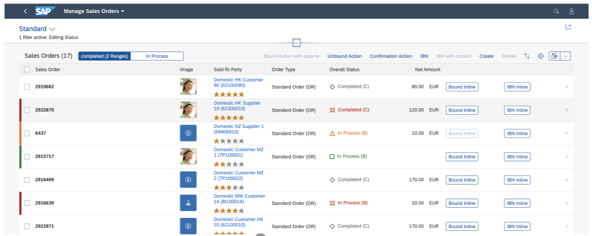

<!-- loio0d390fed360c4c58a0f0619338938de1 -->

# Defining Multiple Views on a List Report Table - Single Table Mode

You can define multiple views of a table and display them in single table mode. Users can switch between views using a segmented button.

 <a name="task_ibz_ywy_cnb"/>

<!-- task\_ibz\_ywy\_cnb -->

## Additional Features in SAP Fiori Elements for OData V2


<a name="task_ibz_ywy_cnb__context_jbz_ywy_cnb"/>

## Context

To define multiple views using single table mode, perform the following steps:


<a name="task_ibz_ywy_cnb__steps_kbz_ywy_cnb"/>

## Procedure

1.  Add `SelectionVariants` to your annotations file.

    Example for a `SelectionVariant` that filters for items that cost a certain amount \(for example, at least 5,000 euros\):

    > ### Sample Code:  
    > XML Annotation
    > 
    > ```xml
    > 
    > <Annotation Term="UI.SelectionVariant" Qualifier="Expensive">
    >     <Record>
    >         <PropertyValue Property="Text" String="Expensive">
    >         </PropertyValue>
    >         <PropertyValue Property="SelectOptions">
    >             <Collection>
    >                 <Record Type="UI.SelectOptionType">
    >                     <PropertyValue Property="PropertyName"
    >                         PropertyPath="GrossAmount" />
    >                     <PropertyValue Property="Ranges">
    >                         <Collection>
    >                             <Record Type="UI.SelectionRangeType">
    >                                 <PropertyValue Property="Option"
    >                                     EnumMember="UI.SelectionRangeOptionType/GE" />
    >                                 <PropertyValue Property="Low" String="5000" />
    >                             </Record>
    >                         </Collection>
    >                     </PropertyValue>
    >                 </Record>
    >             </Collection>
    >         </PropertyValue>
    >     </Record>
    > </Annotation>
    > ```

    > ### Sample Code:  
    > ABAP CDS Annotation
    > 
    > ```
    > 
    > @UI.SelectionVariant: [
    >   {
    >     text: 'Expensive',
    >     qualifier: 'Expensive'
    >   }
    > ]
    > annotate view STTA_C_MP_Product with {
    > 
    > }
    > ```

    > ### Note:  
    > For the `SelectionVariant`, the following applies:
    > 
    > -   The `FilterExpression` of the `SelectionVariantType` is not supported.
    > 
    > -   The following `SelectionRangeOptionTypes` are supported without any wildcards, for example, \*, ?, …:
    > 
    >     -   EQ: Equal to
    > 
    >     -   BT: Between
    > 
    >     -   LE: Less than or equal to
    > 
    >     -   GE: Greater than or equal to
    > 
    >     -   NE: Not equal to
    > 
    >     -   GT: Greater than
    > 
    >     -   LT: Less than
    > 
    > 
    > 
    > For the `PresentationVariant`, `SortOrders` is supported.

2.  Extend the `manifest.json` to switch on the multiple view feature and link to the variants you have added to your annotations. You do this in the list report settings section under `sap.ui.generic.app`. Use `quickVariantSelection` for single table mode.

    -   The `variants` section \(lines 11-20\) contains a set of entries that point to the variants defined in the annotations.

    -   For each entry under `variants` \(for example, lines 12-15\), define an `annotationPath` \(line 14\) for a specific variant.

    -   Provide a key entry \(line 13\) that is used for initializing the corresponding `SegmentedButton` item. This is a mandatory entry.


    ```
    
    1 ...
    2 "sap.ui.generic.app": {
    3     "pages": [
    4        {
    5            "entitySet": "C_STTA_SalesOrder_WD_20",
    6            "component": {
    7                "name": "sap.suite.ui.generic.template.ListReport",
    8                "list": true,
    9                "settings": {
    10                    "quickVariantSelection": {
    11                        "variants": {
    12                            "0": {
    13                                "key": "_tab1",
    14                                "annotationPath": "com.sap.vocabularies.UI.v1.SelectionVariant#Expensive"
    15                            },
    16                            "1": {
    17                                "key": "_tab2",
    18                                "annotationPath": "com.sap.vocabularies.UI.v1.SelectionPresentationVariant#Cheap"
    19                            }
    20                        }
    21                    }
    22                    ...
    ```

    > ### Note:  
    > The `PresenationVariant` part of the `SelectionPresentationVariant` \(as used in the above example\) is not considered. The `SelectionPresentationVariant` is only used to find the `SelectionVariant` and the filters defined within it.


 <a name="concept_ecd_hgr_j4b"/>

<!-- concept\_ecd\_hgr\_j4b -->

### Additional Examples

**`SelectionVariant` with a Qualifier**

> ### Sample Code:  
> Annotation
> 
> ```xml
> <Annotation Term="UI.SelectionVariant" Qualifier="Expensive">
>      <Record>
>           <PropertyValue Property="Text" String="{@i18n>@Expensive}">
>           </PropertyValue>
>           <PropertyValue Property="SelectOptions">
>                <Collection>
>                     <Record Type="UI.SelectOptionType">
>                          <PropertyValue Property="PropertyName" PropertyPath="GrossAmount" />
>                          <PropertyValue Property="Ranges">
>                               <Collection>
>                                    <Record Type="UI.SelectionRangeType">
>                                         <PropertyValue Property="Sign" EnumMember="UI.SelectionRangeSignType/E"/>
>                                         <PropertyValue Property="Option" EnumMember="UI.SelectionRangeOptionType/LT" />
>                                         <PropertyValue Property="Low" String="5000" />
>                                    </Record>
>                               </Collection>
>                          </PropertyValue>
>                     </Record>
>                </Collection>
>           </PropertyValue>
>      </Record>
> </Annotation>
> 
> ```

> ### Sample Code:  
> Manifest Settings
> 
> ```
> "settings": {
>           "smartVariantManagement": true,
>           "quickVariantSelection": {
>                "showCounts": true,
>                "variants": {
>                     "0": {
>                          "key": "_tab1",
>                          "annotationPath": "com.sap.vocabularies.UI.v1.SelectionVariant#Expensive"
>                     },
>                     "1": {
>                          "key": "_tab2",
>                          "annotationPath": "com.sap.vocabularies.UI.v1.SelectionPresentationVariant#Cheap"
>                     }
>                }
>           }
>      }
> 
> 
> ```

**`SelectionVariant` without a Qualifier**

> ### Sample Code:  
> Annotation
> 
> ```
> <Annotation Term="UI.SelectionVariant" >
>      <Record>
>           <PropertyValue Property="Text" String="{@i18n>@Expensive}">
>           </PropertyValue>
>           <PropertyValue Property="SelectOptions">
>                <Collection>
>                      <Record Type="UI.SelectOptionType">
>                           <PropertyValue Property="PropertyName" PropertyPath="GrossAmount" />
>                           <PropertyValue Property="Ranges">
>                                <Collection>
>                                     <Record Type="UI.SelectionRangeType">
>                                          <PropertyValue Property="Sign" EnumMember="UI.SelectionRangeSignType/E"/>
>                                          <PropertyValue Property="Option" EnumMember="UI.SelectionRangeOptionType/LT" />
>                                          <PropertyValue Property="Low" String="5000" />
>                                     </Record>
>                                </Collection>
>                           </PropertyValue>
>                      </Record>
>                 </Collection>
>            </PropertyValue>
>       </Record>
> </Annotation>
> 
> ```

> ### Sample Code:  
> Manifest Settings
> 
> ```
> "settings": {
>      "smartVariantManagement": true,
>      "quickVariantSelection": {
>           "showCounts": true,
>           "variants": {
>                "0": {
>                "key": "_tab1",
>                "annotationPath": "com.sap.vocabularies.UI.v1.SelectionVariant"
>                },
>                "1": {
>                     "key": "_tab2",
>                     "annotationPath": "com.sap.vocabularies.UI.v1.SelectionPresentationVariant#Cheap"
>                }
>           }
>      }
> }
> 
> 
> ```

**`SelectionPresentationVariant` with a Qualifier**

> ### Sample Code:  
> Annotation
> 
> ```xml
> <Annotation Term="UI.SelectionPresentationVariant"Qualifier="Cheap">
>      <Record>
>           <PropertyValue Property="Text" String="{@i18n>@Cheap}">
>           </PropertyValue>
>           <PropertyValue Property="SelectionVariant">
>                <Record>
>                     <PropertyValue Property="Text" String="Cheap">
>                     </PropertyValue>
>                     <PropertyValue Property="SelectOptions">
>                          <Collection>
>                               <Record Type="UI.SelectOptionType">
>                                    <PropertyValue Property="PropertyName"
>                                                   PropertyPath="GrossAmount" />
>                                    <PropertyValue Property="Ranges">
>                                         <Collection>
>                                              <Record Type="UI.SelectionRangeType">
>                                                   <PropertyValue Property="Option"
>                                                                  EnumMember="UI.SelectionRangeOptionType/LT" />
>                                                   <PropertyValue Property="Low" String="5000" />
>                                              </Record>
>                                         </Collection>
>                                    </PropertyValue>
>                               </Record>
>                          </Collection>
>                     </PropertyValue>
>                </Record>
>           </PropertyValue>
>           <PropertyValue Property="PresentationVariant">
>                <Record>
>                     <PropertyValue Property="Visualizations">
>                          <Collection>
>                               <AnnotationPath>@UI.LineItem#Reduced</AnnotationPath>
>                          </Collection>
>                     </PropertyValue>
>                     <PropertyValue Property="SortOrder">
>                          <Collection>
>                               <Record>
>                                    <PropertyValue Property="Property"
>                                                   PropertyPath="GrossAmount" />
>                                    <PropertyValue Property="Descending" Bool="false" />
>                               </Record>
>                          </Collection>
>                     </PropertyValue>
>                </Record>
>           </PropertyValue>
>      </Record>
> </Annotation>
> 
> ```

> ### Sample Code:  
> Manifest Settings
> 
> ```
> "settings": {
>      "smartVariantManagement": true,
>      "quickVariantSelection": {
>           "showCounts": true,
>           "variants": {
>                "0": {
>                     "key": "_tab1",
>                     "annotationPath": "com.sap.vocabularies.UI.v1.SelectionVariant#Expensive"
>                },
>                "1": {
>                     "key": "_tab2",
>                     "annotationPath": "com.sap.vocabularies.UI.v1.SelectionPresentationVariant#Cheap"
>                }
>           }
>      }
> }
> 
> 
> ```

**`SelectionPresentationVariant` without a Qualifier**

> ### Sample Code:  
> Annotation
> 
> ```
> <Annotation Term="UI.SelectionPresentationVariant">
>      <Record>
>           <PropertyValue Property="Text" String="{@i18n>@Cheap}">
>           </PropertyValue>
>           <PropertyValue Property="SelectionVariant">
>                <Record>
>                     <PropertyValue Property="Text" String="Cheap">
>                     </PropertyValue>
>                     <PropertyValue Property="SelectOptions">
>                          <Collection>
>                               <Record Type="UI.SelectOptionType">
>                                    <PropertyValue Property="PropertyName"
>                                                   PropertyPath="GrossAmount" />
>                                    <PropertyValue Property="Ranges">
>                                         <Collection>
>                                              <Record Type="UI.SelectionRangeType">
>                                                   <PropertyValue Property="Option"
>                                                                  EnumMember="UI.SelectionRangeOptionType/LT" />
>                                                   <PropertyValue Property="Low" String="5000" />
>                                              </Record>
>                                         </Collection>
>                                    </PropertyValue>
>                               </Record>
>                          </Collection>
>                     </PropertyValue>
>                </Record>
>           </PropertyValue>
>           <PropertyValue Property="PresentationVariant">
>                <Record>
>                     <PropertyValue Property="Visualizations">
>                          <Collection>
>                               <AnnotationPath>@UI.LineItem#Reduced</AnnotationPath>
>                          </Collection>
>                     </PropertyValue>
>                     <PropertyValue Property="SortOrder">
>                          <Collection>
>                               <Record>
>                                    <PropertyValue Property="Property"
>                                                   PropertyPath="GrossAmount" />
>                                    <PropertyValue Property="Descending" Bool="false" />
>                               </Record>
>                          </Collection>
>                     </PropertyValue>
>                </Record>
>           </PropertyValue>
>      </Record>
> </Annotation>
> 
> ```

> ### Sample Code:  
> Manifest Settings
> 
> ```
> "settings": {
>      "smartVariantManagement": true,
>      "quickVariantSelection": {
>           "showCounts": true,
>           "variants": {
>                "0": {
>                     "key": "_tab1",
>                     "annotationPath": "com.sap.vocabularies.UI.v1.SelectionVariant"
>                     },
>                "1": {
>                     "key": "_tab2",
>                     "annotationPath": "com.sap.vocabularies.UI.v1.SelectionPresentationVariant"
>                     }
>           }
>      }
> }
> 
> 
> ```

 <a name="task_dfp_z5x_cmb"/>

<!-- task\_dfp\_z5x\_cmb -->

## Additional Features in SAP Fiori Elements for OData V4


<a name="task_dfp_z5x_cmb__context_pg4_gvx_cmb"/>

## Context

To define multiple views using single table mode, perform the following steps:


<a name="task_dfp_z5x_cmb__steps_qg4_gvx_cmb"/>

## Procedure

1.  Add `SelectionVariants` to your annotations file.

    > ### Sample Code:  
    > XML Annotation
    > 
    > ```xml
    > <Annotations Target="com.c_salesordermanage_sd.SalesOrderManage">
    >      <Annotation Term="UI.SelectionVariant" Qualifier="Completed">
    >           <Record Type="UI.SelectionVariantType">
    >                <PropertyValue Property="SelectOptions">
    >                     <Collection>
    >                          <Record Type="UI.SelectOptionType">
    >                               <PropertyValue Property="PropertyName" PropertyPath="OverallSDProcessStatus" />
    >                               <PropertyValue Property="Ranges">
    >                                    <Collection>
    >                                         <Record Type="UI.SelectionRangeType">
    >                                              <PropertyValue Property="Option" EnumMember="UI.SelectionRangeOptionType/BT" />
    >                                              <PropertyValue Property="Low" String="A" />
    >                                              <PropertyValue Property="High" String="D" />
    >                                         </Record>
    >                                         <Record Type="UI.SelectionRangeType">
    >                                              <PropertyValue Property="Option" EnumMember="UI.SelectionRangeOptionType/BT" />
    >                                              <PropertyValue Property="Low" String="B" />
    >                                              <PropertyValue Property="High" String="C" />
    >                                         </Record>
    >                                    </Collection>
    >                               </PropertyValue>
    >                          </Record>
    >                     </Collection>
    >                </PropertyValue>
    >                <PropertyValue Property="Text" String="completed (2 Ranges)" />
    >           </Record>
    >      </Annotation>
    >      <Annotation Term="UI.SelectionVariant" Qualifier="InProcess">
    >           <Record Type="UI.SelectionVariantType">
    >                <PropertyValue Property="SelectOptions">
    >                     <Collection>
    >                          <Record Type="UI.SelectOptionType">
    >                               <PropertyValue Property="PropertyName" PropertyPath="OverallSDProcessStatus" />
    >                               <PropertyValue Property="Ranges">
    >                                    <Collection>
    >                                         <Record Type="UI.SelectionRangeType">
    >                                              <PropertyValue Property="Option" EnumMember="UI.SelectionRangeOptionType/EQ" />
    >                                              <PropertyValue Property="Low" String="B" />
    >                                         </Record>
    >                                    </Collection>
    >                               </PropertyValue>
    >                          </Record>
    >                     </Collection>
    >                </PropertyValue>
    >                <PropertyValue Property="Text" String="In Process" />
    >           </Record>
    >      </Annotation>
    > </Annotations>
    > ```

    > ### Sample Code:  
    > ABAP CDS Annotation
    > 
    > ```
    > 
    > @UI.SelectionVariant: [
    >   {
    >     text: 'completed (2 Ranges)',
    >     qualifier: 'Completed'
    >   },
    >   {
    >     text: 'In Process',
    >     qualifier: 'InProcess'
    >   }
    > ]
    > annotate view SALESORDERMANAGE with {
    > 
    > }
    > ```

    > ### Sample Code:  
    > CAP CDS Annotation
    > 
    > ```
    > annotate com.c_salesordermanage_sd.SalesOrderManage with @(
    >   UI.SelectionVariant #Completed : {
    >     $Type : 'UI.SelectionVariantType',
    >     SelectOptions : [
    >         {
    >             $Type : 'UI.SelectOptionType',
    >             PropertyName : OverallSDProcessStatus,
    >             Ranges : [
    >                 {
    >                     $Type : 'UI.SelectionRangeType',
    >                     Option : #BT,
    >                     Low : 'A',
    >                     High : 'D'
    >                 },
    >                 {
    >                     $Type : 'UI.SelectionRangeType',
    >                     Option : #BT,
    >                     Low : 'B',
    >                     High : 'C'
    >                 }
    >             ]
    >         }
    >     ],
    >     Text : 'completed (2 Ranges)'
    >   },
    >   UI.SelectionVariant #InProcess : {
    >     $Type : 'UI.SelectionVariantType',
    >     SelectOptions : [
    >         {
    >             $Type : 'UI.SelectOptionType',
    >             PropertyName : OverallSDProcessStatus,
    >             Ranges : [
    >                 {
    >                     $Type : 'UI.SelectionRangeType',
    >                     Option : #EQ,
    >                     Low : 'B'
    >                 }
    >             ]
    >         }
    >     ],
    >     Text : 'In Process'
    >   },
    > );
    > 
    > ```

    > ### Note:  
    > For the `SelectionVariant`, the following applies:
    > 
    > -   The `FilterExpression` of the `SelectionVariantType` is not supported.
    > 
    > -   The following `SelectionRangeOptionTypes` are supported without any wildcards, for example, \*, ?, …:
    > 
    >     -   EQ: Equal to
    > 
    >     -   BT: Between
    > 
    >     -   LE: Less than or equal to
    > 
    >     -   GE: Greater than or equal to
    > 
    >     -   NE: Not equal to
    > 
    >     -   GT: Greater than
    > 
    >     -   LT: Less than
    > 
    > 
    > 
    > For the `PresentationVariant`, `SortOrders` is supported.

2.  Extend the `manifest.json` to switch on the multiple view feature and link to the variants you have added to your annotations. You do this in the list report settings section under *routing* \> *targets*. In the `LineItem` control configuration, use `quickVariantSelection` for single table mode.

    -   The `paths` array contains a set of entries that point to the variants defined in the annotations.

    -   For each entry under `paths` \(for example, lines 15-24\), define an `annotationPath` for a specific variant.

    -   For performance reasons, by default, no counts are displayed in the `SegmentedButton` items. To enable counts, you have the option of adding an entry `showCounts: true` under `quickVariantSelection`. However, consider that additional `$count` requests can impact the performance.

    -   You can hide the title to show only the segmented buttons. To do so, use the `hideTableTitle` key. Enable this only if the title of your selection variants are explicit enough.


    > ### Sample Code:  
    > `manifest.json`
    > 
    > ```
    > 1"SalesOrderManageList": {
    > 2   "type": "Component",
    > 3   "id": "SalesOrderManageList",
    > 4   "name": "sap.fe.templates.ListReport",
    > 5   "options": {
    > 6      "settings": {
    > 7         "entitySet": "SalesOrderManage",
    > 8         "controlConfiguration": {
    > 9            "@com.sap.vocabularies.UI.v1.LineItem": {
    > 10               "tableSettings": {
    > 11                  "type": "ResponsiveTable",
    > 12                  "quickVariantSelection": {
    > 13                     "paths": [
    > 14                        {
    > 15                           "annotationPath": "com.sap.vocabularies.UI.v1.SelectionVariant#Open"
    > 16                        },
    > 17                        {
    > 18                           "annotationPath": "com.sap.vocabularies.UI.v1.SelectionVariant#Completed"
    > 19                        },
    > 20                        {
    > 21                           "annotationPath": "com.sap.vocabularies.UI.v1.SelectionVariant#NotRelevant"
    > 22                        },
    > 23                        {
    > 24                           "annotationPath": "com.sap.vocabularies.UI.v1.SelectionVariant#InProcess"
    > 25                        }
    > 26                     ],
    > 27                     "hideTableTitle": true,
    > 28                     "showCounts": true
    > 29                  }
    > 30               }
    > 31            }
    > 32         },
    > 33         ...
    > 34  }}}
    > ```

       
      
    **Multiple Views on a List Report Table - Single Table Mode**

      


**Related Information**  


[Adding Segmented Buttons to a Table Toolbar](adding-segmented-buttons-to-a-table-toolbar-5532c89.md "You can add segmented buttons to the toolbar, to enable switching between the table content using a selection variant annotation.")

