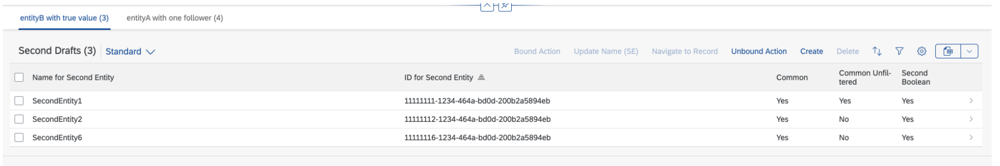
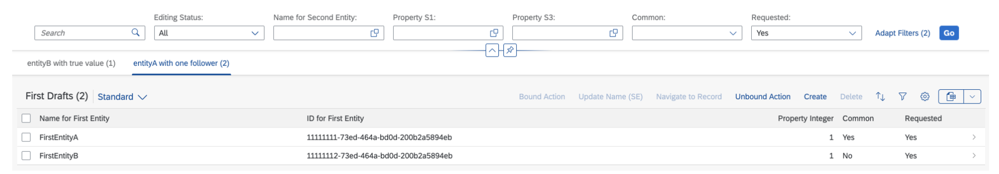
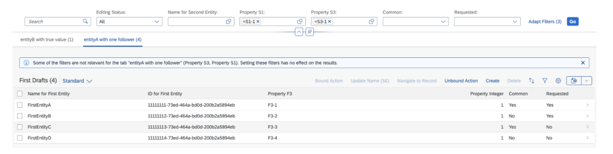

<!-- loiob6b59e4a4c3548cf83ff9c3b955d3ba3 -->

# Defining Multiple Views on a List Report with Different Entity Sets and Table Settings

You can configure your application to display data for different entity sets and table settings.

The configuration steps are the same as in [Defining Multiple Views in a List Report Page Table - Multiple Table Mode](defining-multiple-views-in-a-list-report-page-table-multiple-table-mode-37aeed7.md). In addition, the manifest property `entitySet` must be added to the definition of tables and charts that are based on an entity set different from the main entity set of the list report page. Note that, in this case, the corresponding property `annotationPath` must specify an annotation for that entity set.

> ### Note:  
> Implement this feature with caution, and, for example, take the following into account:
> 
> -   While this feature provides a combined view of different objects, it does not replace dedicated applications, each with their specific purpose.
> 
> -   Use this feature only to search for and work on similar business objects that have a subset of common fields. Do not use it for random business objects. Changing common fields in the filter bar always has an effect on the tab that is currently open, as well as on all other tabs. While you can implement any entity set from a technical perspective, you should take the business and usability perspective into account. Moreover, as this feature affects performance, you should also check any changes in performance when adding entity sets. Note that if you don't follow these recommendations, the application will be responsible for usability and performance.
> 
> -   Do not combine draft and non-draft entity sets on a single list report page.
> 
> -   Do not mix responsive and non-responsive \(grid\) tables.
> 
> -   By default, in the case of multiple entity sets, the counts are always displayed in the icon tab bar to visualize the change in results when any filter is added or removed on the list report page.

You can configure `SelectionPresentationVariant` that has a chart visualization to bring up a chart coming from a different entity set. For more information, see [Defining Multiple Views in a List Report Page Table - Multiple Table Mode](defining-multiple-views-in-a-list-report-page-table-multiple-table-mode-37aeed7.md).


## Rendering Several Entity Sets on a List Report Page

Each table displays the data of an `entitySet` and reads a `SelectionVariant` \(SV\) or `SelectionPresentationVariant` \(SPV\) which apply filters, sorters, and presentation settings.

To define a `SelectionVariant` for `entityA` and a `SelectionPresentationVariant` for `entityB` that you want to display on each tab, for the entities that you want to show, proceed as shown in the following sample code:

> ### Sample Code:  
> XML Annotation
> 
> ```
> <Annotations Target="myService.entityB">
>    <Annotation Term="UI.SelectionVariant" Qualifier="Good">
>    <Record Type="UI.SelectionVariantType">
>       <PropertyValue Property="SelectOptions">
>          <Collection>
>             <Record Type="UI.SelectOptionType">
>                <PropertyValue Property="PropertyName" PropertyPath="propertyInteger" />
>                <PropertyValue Property="Ranges">
>                   <Collection>
>                      <Record Type="UI.SelectionRangeType">
>                         <PropertyValue Property="Option" EnumMember="UI.SelectionRangeOptionType/EQ" />
>                         <PropertyValue Property="Low" String="1" />
>                      </Record>
>                   </Collection>
>                </PropertyValue>
>             </Record>
>          </Collection>
>       </PropertyValue>
>       <PropertyValue Property="Text" String="entityA with one follower" />
>    </Record>
>   </Annotation>
> </Annotations>
>  
> <Annotations Target="myService.entityA">
> <Annotation Term="UI.SelectionPresentationVariant" Qualifier="trueSPV">
>       <Record Type="UI.SelectionPresentationVariantType"
>            <PropertyValue Property="Text" String="entityB with true value"></PropertyValue>
>            <PropertyValue Property="SelectionVariant">
>               <Record Type="UI.SelectionVariantType">
>                  <PropertyValue Property="SelectOptions">
>                     <Collection>
>                        <Record Type="UI.SelectOptionType">
>                           <PropertyValue Property="PropertyName" PropertyPath="propertyBoolean" />
>                           <PropertyValue Property="Ranges">
>                              <Collection>
>                                 <Record Type="UI.SelectionRangeType">
>                                    <PropertyValue Property="Option" EnumMember="UI.SelectionRangeOptionType/EQ" />
>                                    <PropertyValue Property="Low" String="true" />                                </Record>
>                              </Collection>
>                           </PropertyValue>
>                        </Record>
>                     </Collection>
>                  </PropertyValue>
>                  <PropertyValue Property="Text" String="Medium Rating" />
>               </Record>
>             </PropertyValue>
>             <PropertyValue Property="PresentationVariant">
>                   <Record Type="UI.PresentationVariantType">>
>                       <PropertyValue Property="MaxItems" Int="3" />
>                       <PropertyValue Property="SortOrder">
>                            <Collection>
>                               <Record Type="Common.SortOrderType">
>                                   <PropertyValue Property="Property" PropertyPath="propertyInteger" />
>                               </Record>
>                           </Collection>
>                       </PropertyValue>
>                    </Record>
>               </PropertyValue>
>           </Record>
>       </Annotation>
> ```

> ### Sample Code:  
> CAP CDS Annotation
> 
> ```
> annotate entityB with @(
> UI.SelectionVariant#One :
> {
>     Text: 'entityA with one follower',
>     SelectOptions:
>     [
>         {
>             $Type : 'UI.SelectOptionType',
>             PropertyName : propertyInteger,
>              Ranges:
>              [
>                  {
>                      $Type: 'UI.SelectionRangeType',
>                      Option: #EQ,
>                      Low: '1'
>                 }
>             ]
>         }
>     ]
> }
>  
> ...
> annotate entityA with @(
>  
> UI.SelectionPresentationVariant#trueSPV :
> {
>     Text: 'entityB with true value',
>     SelectionVariant: {
>           SelectOptions:
>           [
>               {
>                   $Type : 'UI.SelectOptionType',
>                   PropertyName : propertyBoolean,
>                    Ranges:
>                    [
>                        {
>                            $Type: 'UI.SelectionRangeType',
>                            Option: #EQ,
>                            Low: 'true'
>                       }
>                   ]
>               }
>           ]
>       },
>     PresentationVariant: {
>             MaxItems       : 3,
>             SortOrder      : [{Property : 'ID'}]
>     }
> },
> ```

Once the SV and SPV are defined for the two `entitySets`, you must configure the manifest to read the annotation for the views. This is the same configuration in the `manifest.json` file as for the multiple views feature. In addition, you need to specify the `entitySet` when it differs from the main `entitySet` as follows:

> ### Sample Code:  
> `manifest.json`
> 
> ```
> "targets": {   
>     "DraftList": {
>         "type": "Component",
>             "id": "DraftList",
>             "name": "sap.fe.templates.ListReport",
>             "options": {
>                 "settings": {
>                     "contextPath": "/entityA",
>                     "views": {
>                         "paths": [
>                             {
>                                 "key": "tab1",
>                                 "annotationPath": "com.sap.vocabularies.UI.v1.SelectionPresentationVariant#trueSPV"
>                             },
>                             {
>                                 "key": "tab2",
>                                 "entitySet": "entityB",
>                                 "annotationPath": "com.sap.vocabularies.UI.v1.SelectionVariant#One"
>                             }
>                         ]
>                     }
>                 }
>             }
>         },
> ...
> }
> ```

As a result, the application displays two tabs as shown in the following screenshot:




### Defining Different Table Configurations Using `controlConfiguration`

You can define different table configurations for each entity set. To do so, prefix the annotation key with the name of the entity set in the `controlConfiguration` of the `manifest.json` file.

The following sample code shows different personalization settings per table \(with no personalization for `EntityA` and a column personalization and a filter personalization for `EntityB`\):

> ### Sample Code:  
> `manifest.json`
> 
> ```
> "targets": {
>     "DraftList": {
>         "type": "Component",
>         "id": "DraftList",
>         "name": "sap.fe.templates.ListReport",
>         "options": {
>             "settings": {
>                 "contextPath": "/EntityA",
>                 "views": {
>                     "paths": [
>                         {
>                             "key": "tab1",
>                             "annotationPath": "com.sap.vocabularies.UI.v1.SelectionVariant"
>                         },
>                         {
>                             "key": "tab2",
>                             "entitySet": "EntityB",
>                             "annotationPath": "com.sap.vocabularies.UI.v1.SelectionVariant"
>                         }
>                     ]
>                 },
>                 "controlConfiguration": {
>                     "@com.sap.vocabularies.UI.v1.LineItem": {
>                         "tableSettings": {
>                             "personalization": false
>                         }
>                     },
>                     "/EntityB/@com.sap.vocabularies.UI.v1.LineItem": {
>                         "tableSettings": {
>                             "personalization": {
>                                 "column": true,
>                                 "sort": false,
>                                 "filter": true,
>                                 "group": false
>                             }
>                         }
>                     }
>                 }
>             }
>         }
>     },
>     ...
> }
> ```


## System Behavior for Filters and Count

By default, in case of multiple entity sets, counts are always displayed in the icon tab bar to visualize the change in results whenever a filter is added or removed on the list report page.

The filters available in the filter bar are those from the main entity set. You cannot add filters that belong only to an additional entity set.

The filters are applied to every table if the corresponding properties exist in the entity type of the table. Otherwise, they are ignored. This behavior also applies for filters coming from a navigation property. If the navigation and target properties also exist for the non-main entity, the filter is applied.

The counts of each table are also influenced by the filters from the `filterBar` only if the filters are relevant.

In the following screenshot, the *Requested* field exists in each entity set. It influences the number of items displayed on each tab:



If you add a second filter value, which is found only in the entity type of the first table, only the count of the first tab changes. The counts of the second tab remain unchanged, as this field isn't relevant for the second entity set. The system displays a message to inform users about this.

For example, if you add the filter *Property S3* to the first tab, which is not applicable to the entity set of the second tab, and then switch to the second tab, the application displays a message about this. If you close this message and add another filter that is also not applicable to the entity set of the *Purchase Orders* tab, the application displays an updated message informing that both filters are not relevant to this entity set.




> ### Note:  
> For information about SAP Fiori elements for OData V2, see [Defining Multiple Views on a List Report Page with Different Entity Sets and Table Settings](defining-multiple-views-on-a-list-report-page-with-different-entity-sets-and-table-settin-6698b80.md).

**Related Information**  


[Example: Enable Internal Navigation to Different Detail Page](example-enable-internal-navigation-to-different-detail-page-75002b3.md "You can enable internal navigation to a different detail page (that is, using different entity sets) for a list report or an object page.")

